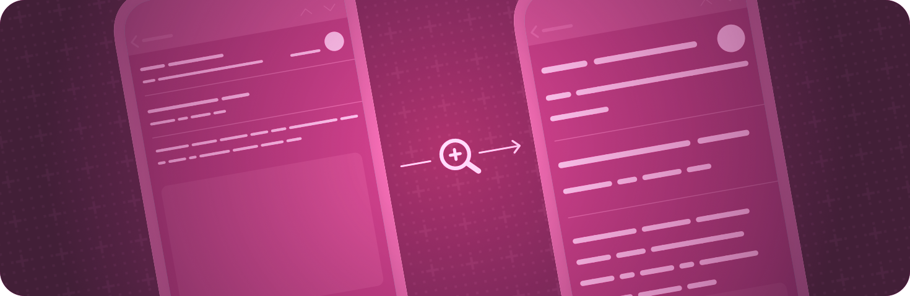

+++
title = "2 无障碍外观"
date = 2026-09-12T12:47:47+08:00
weight = 2
type = "docs"
description = ""
isCJKLanguage = true
draft = false
+++

> 原文链接: [https://developer.apple.com/documentation/swiftui/accessible-appearance](https://developer.apple.com/documentation/swiftui/accessible-appearance)

# 2 无障碍外观

提升应用界面中内容的易读性。

## 概述 {#Overview}

通过把内容放大、提高对比度或减少令人分心的动态效果，让人们更容易看清内容。

关于设计指导，请参阅 Human Interface Guidelines 辅助功能部分中的 [辅助功能](https://developer.apple.com/design/human-interface-guidelines/accessibility)。

## 管理颜色 {#Managing-color}

- [accessibilityIgnoresInvertColors(_:)](https://developer.apple.com/documentation/swiftui/view/accessibilityignoresinvertcolors(_:)) — 设置该视图是否应忽略系统的“智能反转”设置。
- [accessibilityInvertColors](https://developer.apple.com/documentation/swiftui/environmentvalues/accessibilityinvertcolors) — 系统的“反转颜色”偏好是否已启用。
- [accessibilityDifferentiateWithoutColor](https://developer.apple.com/documentation/swiftui/environmentvalues/accessibilitydifferentiatewithoutcolor) — 系统的“不以颜色区分”偏好是否已启用。

## 放大内容 {#Enlarging-content}

- [accessibilityShowsLargeContentViewer()](https://developer.apple.com/documentation/swiftui/view/accessibilityshowslargecontentviewer()) — 添加一个由大内容查看器显示的默认大内容视图。
- [accessibilityShowsLargeContentViewer(_:)](https://developer.apple.com/documentation/swiftui/view/accessibilityshowslargecontentviewer(_:)) — 添加一个由大内容查看器显示的自定义大内容视图。
- [accessibilityLargeContentViewerEnabled](https://developer.apple.com/documentation/swiftui/environmentvalues/accessibilitylargecontentviewerenabled) — 大内容查看器是否已启用。

## 提升可读性 {#Improving-legibility}

- [accessibilityShowButtonShapes](https://developer.apple.com/documentation/swiftui/environmentvalues/accessibilityshowbuttonshapes) — 系统的“显示按钮形状”偏好是否已启用。
- [accessibilityReduceTransparency](https://developer.apple.com/documentation/swiftui/environmentvalues/accessibilityreducetransparency) — 系统的“降低透明度”偏好是否已启用。
- [legibilityWeight](https://developer.apple.com/documentation/swiftui/environmentvalues/legibilityweight) — 要应用于文本的字体粗细。
- [LegibilityWeight](https://developer.apple.com/documentation/swiftui/legibilityweight) — 辅助功能中的“粗体文本”用户设置选项。

## 尽量减少动态效果 {#Minimizing-motion}

- [accessibilityDimFlashingLights](https://developer.apple.com/documentation/swiftui/environmentvalues/accessibilitydimflashinglights) — 用于减弱视频内容中闪烁或频闪灯光的设置是否已打开。这个设置也可以用来判断是否应显示播放控件中的界面，以提示即将出现包含闪烁或频闪光的内容。
- [accessibilityPlayAnimatedImages](https://developer.apple.com/documentation/swiftui/environmentvalues/accessibilityplayanimatedimages) — 是否允许播放动态图像中的动画设置是否已打开。当该值为 false 时，任何包含动画的图像都不应自动播放。
- [accessibilityReduceMotion](https://developer.apple.com/documentation/swiftui/environmentvalues/accessibilityreducemotion) — 系统的“减弱动态效果”偏好是否已启用。

## 使用辅助访问 {#Using-assistive-access}

- [accessibilityAssistiveAccessEnabled](https://developer.apple.com/documentation/swiftui/environmentvalues/accessibilityassistiveaccessenabled) — 一个布尔值，指示当前是否正在使用辅助访问。
- [AssistiveAccess](https://developer.apple.com/documentation/swiftui/assistiveaccess) — 一种在 iOS 和 iPadOS 上呈现适合辅助访问的界面的场景。在其他平台上，该场景不会被使用。
- [assistiveAccessNavigationIcon(_:)](https://developer.apple.com/documentation/swiftui/view/assistiveaccessnavigationicon(_:)) — 为导航目的配置该视图的图标。
- [assistiveAccessNavigationIcon(systemImage:)](https://developer.apple.com/documentation/swiftui/view/assistiveaccessnavigationicon(systemimage:)) — 为导航目的配置该视图的图标。
