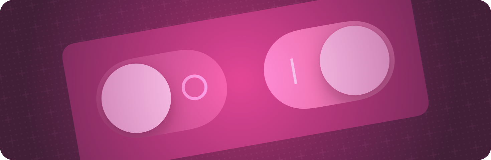

+++
title = "3 无障碍控件"
date = 2026-09-12T12:47:47+08:00
weight = 3
type = "docs"
description = ""
isCJKLanguage = true
draft = false
+++

> 原文链接: [https://developer.apple.com/documentation/swiftui/accessible-controls](https://developer.apple.com/documentation/swiftui/accessible-controls)

# 3 无障碍控件

让应用可以执行的各种操作更易于访问。

## 概述 {#Overview}

帮助使用辅助技术的用户访问应用中的控件。

关于设计指导，请参阅 Human Interface Guidelines 辅助功能部分中的 [辅助功能](https://developer.apple.com/design/human-interface-guidelines/accessibility)。

## 为视图添加动作 {#Adding-actions-to-views}

- [accessibilityAction(_:_:)](https://developer.apple.com/documentation/swiftui/view/accessibilityaction(_:_:)) — 为视图添加一个辅助功能动作。动作让 VoiceOver 等辅助技术可以通过调用该动作来与视图交互。
- [accessibilityActions(_:)](https://developer.apple.com/documentation/swiftui/view/accessibilityactions(_:)) — 为视图添加多个辅助功能动作。
- [accessibilityAction(named:_:)](https://developer.apple.com/documentation/swiftui/view/accessibilityaction(named:_:)) — 为视图添加一个辅助功能动作。动作让 VoiceOver 等辅助技术可以通过调用该动作来与视图交互。
- [accessibilityAction(action:label:)](https://developer.apple.com/documentation/swiftui/view/accessibilityaction(action:label:)) — 为视图添加一个辅助功能动作。动作让 VoiceOver 等辅助技术可以通过调用该动作来与视图交互。
- [accessibilityAction(intent:label:)](https://developer.apple.com/documentation/swiftui/view/accessibilityaction(intent:label:)) — 为视图添加一个由 `label` 内容标记的辅助功能动作。动作让 VoiceOver 等辅助技术可以通过调用该动作来与视图交互。当该动作执行时，会调用 `intent`。
- [accessibilityAction(_:intent:)](https://developer.apple.com/documentation/swiftui/view/accessibilityaction(_:intent:)) — 为视图添加一个表示 `actionKind` 的辅助功能动作。动作让 VoiceOver 等辅助技术可以通过调用该动作来与视图交互。当该动作执行时，会调用 `intent`。
- [accessibilityAction(named:intent:)](https://developer.apple.com/documentation/swiftui/view/accessibilityaction(named:intent:)) — 为视图添加一个标记为 `name` 的辅助功能动作。动作让 VoiceOver 等辅助技术可以通过调用该动作来与视图交互。当该动作执行时，会调用 `intent`。
- [accessibilityAdjustableAction(_:)](https://developer.apple.com/documentation/swiftui/view/accessibilityadjustableaction(_:)) — 为视图添加一个可调节的辅助功能动作。动作让 VoiceOver 等辅助技术可以通过调用该动作来与视图交互。
- [accessibilityScrollAction(_:)](https://developer.apple.com/documentation/swiftui/view/accessibilityscrollaction(_:)) — 为视图添加一个辅助功能滚动动作。动作让 VoiceOver 等辅助技术可以通过调用该动作来与视图交互。
- [accessibilityActions(category:_:)](https://developer.apple.com/documentation/swiftui/view/accessibilityactions(category:_:)) — 为视图添加多个属于特定类别的辅助功能动作。动作让 VoiceOver 等辅助技术可以通过调用该动作来与视图交互，并按类别分组。当多个类别相同的动作修饰符应用于同一视图时，这些动作会合并在一起。
- [AccessibilityActionKind](https://developer.apple.com/documentation/swiftui/accessibilityactionkind) — 定义可用辅助功能动作种类的结构体。
- [AccessibilityAdjustmentDirection](https://developer.apple.com/documentation/swiftui/accessibilityadjustmentdirection) — 进行辅助功能调整时使用的方向指示。
- [AccessibilityActionCategory](https://developer.apple.com/documentation/swiftui/accessibilityactioncategory) — 指定由系统提供并命名的辅助功能动作类别。

## 向大家提供快速操作 {#Offering-Quick-Actions-to-people}

- [accessibilityQuickAction(style:content:)](https://developer.apple.com/documentation/swiftui/view/accessibilityquickaction(style:content:)) — 添加一个在激活时由系统显示的快速操作。
- [accessibilityQuickAction(style:isActive:content:)](https://developer.apple.com/documentation/swiftui/view/accessibilityquickaction(style:isactive:content:)) — 添加一个在激活时由系统显示的快速操作。
- [AccessibilityQuickActionStyle](https://developer.apple.com/documentation/swiftui/accessibilityquickactionstyle) — 描述辅助功能快速操作呈现样式的类型。

## 让手势可访问 {#Making-gestures-accessible}

- [accessibilityActivationPoint(_:)](https://developer.apple.com/documentation/swiftui/view/accessibilityactivationpoint(_:)) — 元素的激活点是辅助技术用来发起手势的位置。
- [accessibilityActivationPoint(_:isEnabled:)](https://developer.apple.com/documentation/swiftui/view/accessibilityactivationpoint(_:isenabled:)) — 元素的激活点是辅助技术用来发起手势的位置。
- [accessibilityDragPoint(_:description:)](https://developer.apple.com/documentation/swiftui/view/accessibilitydragpoint(_:description:)) — 辅助技术应使用哪个点来开始拖拽交互。
- [accessibilityDragPoint(_:description:isEnabled:)](https://developer.apple.com/documentation/swiftui/view/accessibilitydragpoint(_:description:isenabled:)) — 辅助技术应使用哪个点来开始拖拽交互。
- [accessibilityDropPoint(_:description:)](https://developer.apple.com/documentation/swiftui/view/accessibilitydroppoint(_:description:)) — 辅助技术应使用哪个点来结束拖拽交互。
- [accessibilityDropPoint(_:description:isEnabled:)](https://developer.apple.com/documentation/swiftui/view/accessibilitydroppoint(_:description:isenabled:)) — 辅助技术应使用哪个点来结束拖拽交互。
- [accessibilityDirectTouch(_:options:)](https://developer.apple.com/documentation/swiftui/view/accessibilitydirecttouch(_:options:)) — 显式设置该辅助功能元素是否为直接触摸区域。直接触摸区域会把触摸事件直接传递给应用，而不是通过 VoiceOver 等辅助技术来处理。该修饰符接受一个可选的 `AccessibilityDirectTouchOptions` 选项集合，用来定制直接触摸区域的功能。
- [accessibilityZoomAction(_:)](https://developer.apple.com/documentation/swiftui/view/accessibilityzoomaction(_:)) — 为视图添加一个辅助功能缩放动作。动作让 VoiceOver 等辅助技术可以通过调用该动作来与视图交互。
- [AccessibilityDirectTouchOptions](https://developer.apple.com/documentation/swiftui/accessibilitydirecttouchoptions) — 一个选项集合，定义视图直接触摸区域的功能。
- [AccessibilityZoomGestureAction](https://developer.apple.com/documentation/swiftui/accessibilityzoomgestureaction) — 用户借助 VoiceOver 等辅助技术执行缩放手势时的位置和方向信息。

## 控制焦点 {#Controlling-focus}

- [accessibilityFocused(_:)](https://developer.apple.com/documentation/swiftui/view/accessibilityfocused(_:)) — 把该视图辅助功能元素的焦点状态绑定到给定的布尔状态值，从而修改这个视图。
- [accessibilityFocused(_:equals:)](https://developer.apple.com/documentation/swiftui/view/accessibilityfocused(_:equals:)) — 把该视图辅助功能元素的焦点状态绑定到给定的状态值，从而修改这个视图。
- [AccessibilityFocusState](https://developer.apple.com/documentation/swiftui/accessibilityfocusstate) — 一种属性包装器类型，可以读写一个由 SwiftUI 在 VoiceOver 等任何活跃辅助技术的焦点变化时更新的值。

## 管理交互性 {#Managing-interactivity}

- [accessibilityRespondsToUserInteraction(_:)](https://developer.apple.com/documentation/swiftui/view/accessibilityrespondstouserinteraction(_:)) — 显式设置该辅助功能元素是否响应用户交互，从而会被切换控制、语音控制或全键盘控制等技术与之交互。
- [accessibilityRespondsToUserInteraction(_:isEnabled:)](https://developer.apple.com/documentation/swiftui/view/accessibilityrespondstouserinteraction(_:isenabled:)) — 显式设置该辅助功能元素是否响应用户交互，从而会被切换控制、语音控制或全键盘控制等技术与之交互。
