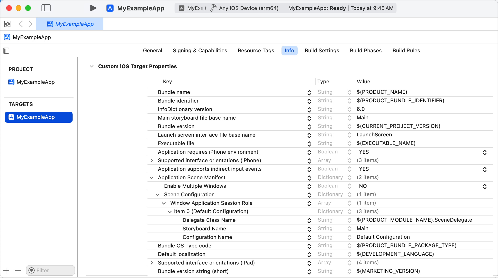

+++
title = "1.3 迁移到 SwiftUI 生命周期"
date = 2026-09-12T12:47:47+08:00
weight = 3
type = "docs"
description = ""
isCJKLanguage = true
draft = false
+++


> 原文链接: [https://developer.apple.com/documentation/swiftui/migrating-to-the-swiftui-life-cycle](https://developer.apple.com/documentation/swiftui/migrating-to-the-swiftui-life-cycle)

# 1.3 迁移到 SwiftUI 生命周期

在保留现有代码库的同时，在 SwiftUI 中使用基于场景的生命周期。

## 概述 {#Overview}

把应用迁移到 SwiftUI 生命周期，就能利用 SwiftUI 的声明式语法以及它与空间计算框架的兼容性。

迁移到 SwiftUI 生命周期需要若干步骤，包括修改应用的入口点、配置应用的启动方式，以及用 SwiftUI 提供的方法监控生命周期变化。

### 修改应用的入口点 {#Change-your-apps-entry-point}

[UIKit](https://developer.apple.com/documentation/uikit) 框架把 `AppDelegate` 文件定义为应用的入口点，并用 `@main` 标注。关于 `@main` 的更多信息，参见 The Swift Programming Language 中的[属性](https://docs.swift.org/swift-book/documentation/the-swift-programming-language/attributes/#main)一节。要指明 SwiftUI 应用的入口，你需要新建一个定义应用结构的文件。

1. 在 Xcode 中打开你的项目。
1. 选择 File > New > File > Swift file。
1. 把文件命名为 `<YourAppName>App.swift`。
1. 在文件顶部添加 `import SwiftUI`。
1. 用 `@main` 属性标注应用结构，以指明 SwiftUI 应用的入口点，如下面的代码片段所示。

> 重要：请删除应用委托中的 `@main` 或 `@UIApplicationMain` 属性。

用下面的代码创建 SwiftUI 应用结构。要了解更多关于这个结构的内容，参见 [App](https://developer.apple.com/documentation/swiftui/app)。

```swift
import SwiftUI

@main
struct MyExampleApp: App {
    var body: some Scene {
        WindowGroup {
            ContentView()
        }
    }
}
```

### 支持应用委托中的方法 {#Support-app-delegate-methods}

要继续使用应用委托中的方法，请使用 [UIApplicationDelegateAdaptor](https://developer.apple.com/documentation/swiftui/uiapplicationdelegateadaptor) 属性包装器。要把一个遵循 [UIApplicationDelegate](https://developer.apple.com/documentation/uikit/uiapplicationdelegate) 协议的委托告知 SwiftUI，请把这个属性包装器放进你的 [App](https://developer.apple.com/documentation/swiftui/app) 声明中：

```swift
@main
struct MyExampleApp: App {
    @UIApplicationDelegateAdaptor private var appDelegate: MyAppDelegate
    var body: some Scene { ... }
}
```

这个例子把名为 `MyAppDelegate` 的自定义应用委托标记为委托适配器。请务必在该类型中实现所有必要的委托方法。

> 注意：如需 AppKit 支持，请使用 [NSApplicationDelegateAdaptor](https://developer.apple.com/documentation/swiftui/nsapplicationdelegateadaptor)。如需 WatchKit 支持，请使用 [WKApplicationDelegateAdaptor](https://developer.apple.com/documentation/swiftui/wkapplicationdelegateadaptor)。

### 配置应用的启动 {#Configure-the-launch-of-your-app}

如果你迁移的应用包含故事板，请确保在不再需要时把它们删除。

1. 在 Xcode 中打开你的项目。
1. 从项目导航器中移除 `Main.storyboard`。
1. 选择应用的目标。
1. 打开 `Info.plist` 文件。
1. 移除 [UIMainStoryboardFile](https://developer.apple.com/documentation/bundleresources/information-property-list/uimainstoryboardfile) 键。
1. 移除 [UIApplicationSceneManifest](https://developer.apple.com/documentation/bundleresources/information-property-list/uiapplicationscenemanifest) > [UISceneConfigurations](https://developer.apple.com/documentation/bundleresources/information-property-list/uiapplicationscenemanifest/uisceneconfigurations) > [UIWindowSceneSessionRoleApplication](https://developer.apple.com/documentation/bundleresources/information-property-list/uiapplicationscenemanifest/uisceneconfigurations/uiwindowscenesessionroleapplication) > `Item 0 (Default Configuration)` 字典中的 [UISceneStoryboardFile](https://developer.apple.com/documentation/bundleresources/information-property-list/uiapplicationscenemanifest/uisceneconfigurations/uiwindowscenesessionroleapplication/uiscenestoryboardfile) 键。

下图展示了移除这些键之前 `Info.plist` 文件的结构。



从 `Info.plist` 文件移除这些键之后，场景委托仍会被调用，因此你依然可以在这个文件中处理其他基于场景的生命周期变化。如果你此前在场景委托中启动应用，请从场景委托中移除 [scene(_:willConnectTo:options:)](https://developer.apple.com/documentation/uikit/uiscenedelegate/scene(_:willconnectto:options:)) 方法。

如果你此前并不支持场景，而是依赖应用委托来响应应用的启动，请确保不再于 [application(_:didFinishLaunchingWithOptions:)](https://developer.apple.com/documentation/uikit/uiapplicationdelegate/application(_:didfinishlaunchingwithoptions:)) 中设置根视图控制器，而是返回 `true`。

### 监控生命周期变化 {#Monitor-life-cycle-changes}

由于 SwiftUI 是基于场景的（参见 [Scene](https://developer.apple.com/documentation/swiftui/scene)），你不再能在应用委托中监控生命周期变化。建议在 [ScenePhase](https://developer.apple.com/documentation/swiftui/scenephase) 中处理这些变化，这是 SwiftUI 提供的、用来监控场景各阶段的生命周期枚举。观察 [Environment](https://developer.apple.com/documentation/swiftui/environment) 值，以便在阶段变化时触发动作。

```swift
@Environment(\.scenePhase) private var scenePhase
```

根据你读取它的位置不同，这个值的含义也不同。如果你在 [View](https://developer.apple.com/documentation/swiftui/view) 实例内部读取阶段，该值反映包含这个视图的场景的阶段。如果你在 `App` 实例中读取阶段，该值反映应用中所有场景阶段的聚合结果。

要用场景委托处理基于场景的事件，请在应用委托中把你的场景委托提供给 SwiftUI 应用。更多信息参见 [UIApplicationDelegateAdaptor](https://developer.apple.com/documentation/swiftui/uiapplicationdelegateadaptor) 的「场景委托」一节。

关于处理基于场景的生命周期事件的更多信息，参见[管理应用的生命周期](https://developer.apple.com/documentation/uikit/managing-your-app-s-life-cycle)。
