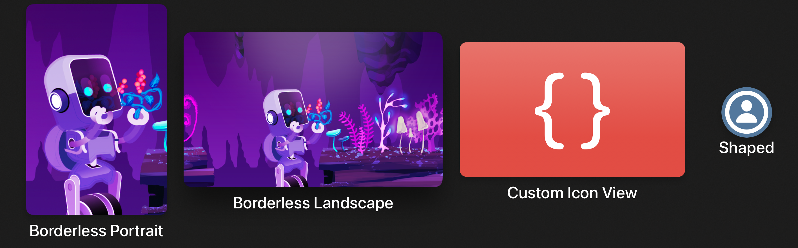
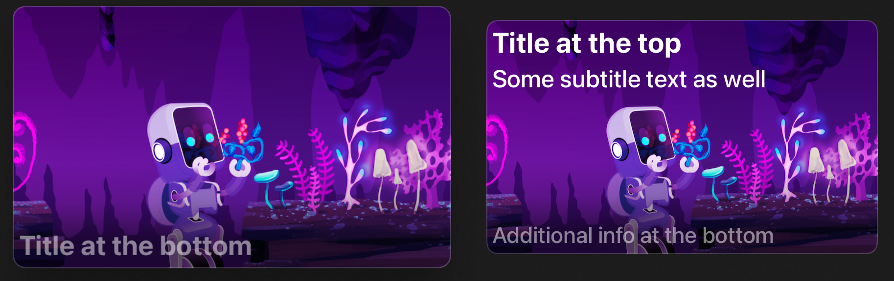
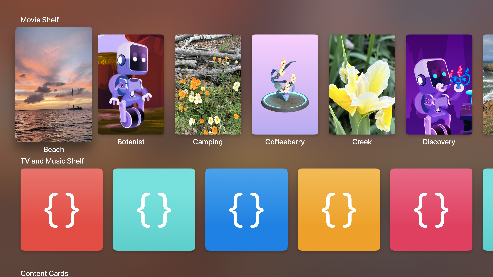
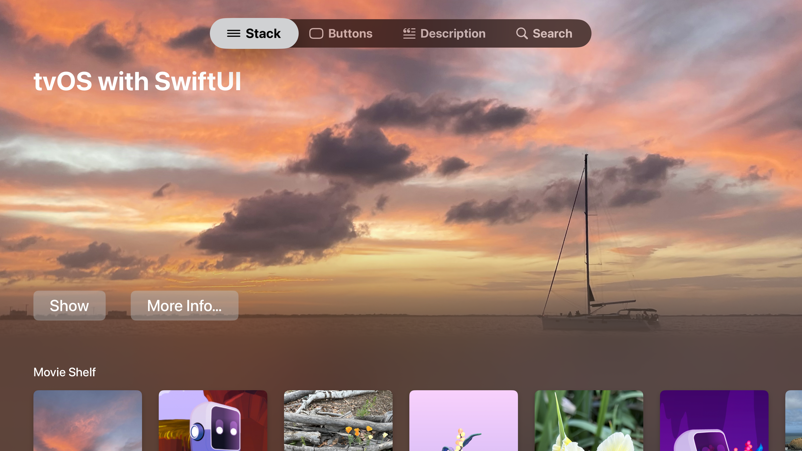
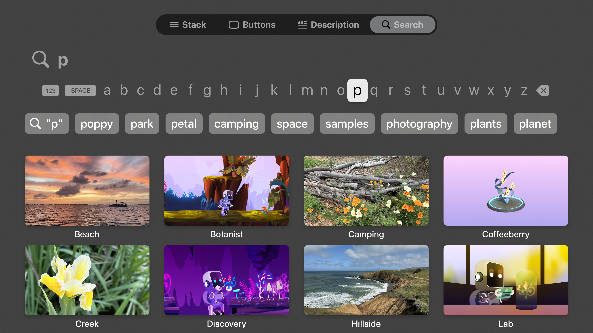

+++
title = "1.4 用 SwiftUI 创建 tvOS 媒体目录应用"
date = 2026-09-12T12:47:47+08:00
weight = 4
type = "docs"
description = ""
isCJKLanguage = true
draft = false
+++


> 原文链接: [https://developer.apple.com/documentation/swiftui/creating-a-tvos-media-catalog-app-in-swiftui](https://developer.apple.com/documentation/swiftui/creating-a-tvos-media-catalog-app-in-swiftui)

# 1.4 用 SwiftUI 创建 tvOS 媒体目录应用

为你的 tvOS 应用构建标准的内容卡片和内容货架行。

## 概述 {#Overview}

这个示例代码项目展示如何为 tvOS 创建标准的内容卡片，并给出构建内容货架行的最佳实践。它还包含产品页、搜索视图和标签页视图的示例，包括在 tvOS 中提供侧边栏的、新的自适应侧边栏标签页视图样式。

> 注意：这个示例代码项目与 WWDC24 的 10207 号场次[把 TVML 应用迁移到 SwiftUI](https://developer.apple.com/wwdc24/10207/)相关。

示例项目包含下列示例：

- `StackView` 实现了内容目录应用的示例落地页，定义了若干货架，并在它们上方放置了一个展示区或主视觉页眉。它还演示了首屏内外的切换动画。
- `ButtonsView` 展示了 tvOS 中各种可用的按钮样式。
- `DescriptionView` 演示如何构建类似 Apple TV 应用中产品页的页面，并带自定义的材质模糊效果。
- `SearchView` 演示一个简单的搜索页面，使用 [searchable(text:placement:prompt:)](https://developer.apple.com/documentation/swiftui/view/searchable(text:placement:prompt:)-18a8f) 和 [searchSuggestions(_:)](https://developer.apple.com/documentation/swiftui/view/searchsuggestions(_:)) 修饰符。
- `SidebarContentView` 展示如何用 tvOS 18 中新的标签栏 API 制作带分区的侧边栏。
- `HeroHeaderView` 演示如何创建材质渐变，把某个区域中的内容模糊并渐变为未模糊的内容。

### 创建内容卡片 {#Create-content-lockups}

[borderless](https://developer.apple.com/documentation/swiftui/primitivebuttonstyle/borderless) 按钮样式提供了 tvOS 中使用的主要卡片样式，包含所有聚焦交互与悬停效果。当按钮的图片在聚焦时放大，按钮的标题以及附近的分区标题会自动让开。



请在按钮的标签闭包中分别提供 [Image](https://developer.apple.com/documentation/swiftui/image) 和 [Text](https://developer.apple.com/documentation/swiftui/text) 视图，以确保纵向外观正确。使用 [Label](https://developer.apple.com/documentation/swiftui/label) 通常会导致横向布局，并且依据当前的标签样式，可能得不到你期望的外观。

```swift
Button { /* 动作 */ } label: {
    Image("discovery_portrait")
        .resizable()
        .frame(width: 250, height: 375)
    Text("Borderless Portrait")
}
```

默认情况下，该按钮样式会找到按钮标签中的第一个 `Image`，并给它附加 [highlight](https://developer.apple.com/documentation/swiftui/hovereffect/highlight) 悬停效果，提供抬升、高光以及陀螺仪式的运动效果。

为确保悬停效果恰好应用到正确的视图上，你可以用 [hoverEffect(_:)](https://developer.apple.com/documentation/swiftui/view/hovereffect(_:)) 修饰符把它手动附加到按钮标签中的某个特定子视图。例如，要让一个 SF Symbols 图像连同它的背景一起产生悬停效果，可以这样做：

```swift
Button { /* 动作 */ } label: {
    Image(systemName: "person.circle")
        .font(.title)
        .background(Color.blue.grayscale(0.7))
        .hoverEffect(.highlight)
    Text("Shaped")
}
.buttonBorderShape(.circle)
```

你也可以把悬停效果附加到自定义视图上。

```swift
Button { /* 动作 */ } label: {
    CodeSampleArtwork(size: .appIconSize)
        .frame(width: 400, height: 240)
        .hoverEffect(.highlight)
    Text("Custom Icon View")
}
```

### 显示信息密集的卡片 {#Show-information-dense-lockups}

对于信息更密集的卡片，可以考虑使用 [card](https://developer.apple.com/documentation/swiftui/primitivebuttonstyle/card) 按钮样式，它提供一个底板，并带有更含蓄的聚焦运动效果。把带内边距的容器作为按钮标签，可以得到类似 Apple TV 应用中搜索结果卡片的效果。



```swift
Button { /* 动作 */ } label: {
    HStack(alignment: .top, spacing: 10) {
        Image( . . . )
            .resizable()
            .aspectRatio(contentMode: .fit)
            .clipShape(RoundedRectangle(cornerRadius: 12))

        VStack(alignment: .leading) {
            Text(asset.title)
                .font(.body)
            Text("Subtitle text goes here, limited to two lines.")
                .font(.caption2)
                .foregroundStyle(.secondary)
                .lineLimit(2)
            Spacer(minLength: 0)
            HStack(spacing: 4) {
                ForEach(1..<4) { _ in
                    Image(systemName: "ellipsis.rectangle.fill")
                }
            }
            .foregroundStyle(.secondary)
        }
    }
    .padding(12)
}
```

你也可以用自定义的 [LabelStyle](https://developer.apple.com/documentation/swiftui/labelstyle) 做出标准的卡片式外观，同时让使用处的按钮声明保持整洁。

```swift
struct CardOverlayLabelStyle: LabelStyle {
    func makeBody(configuration: Configuration) -> some View {
        ZStack(alignment: .bottomLeading) {
            configuration.icon
                .resizable()
                .aspectRatio(400/240, contentMode: .fit)
                .overlay {
                    LinearGradient(
                        stops: [
                            .init(color: .black.opacity(0.6), location: 0.1),
                            .init(color: .black.opacity(0.2), location: 0.25),
                            .init(color: .black.opacity(0), location: 0.4)
                        ],
                        startPoint: .bottom, endPoint: .top
                    )
                }
                .overlay {
                    RoundedRectangle(cornerRadius: 12)
                        .stroke(lineWidth: 2)
                        .foregroundStyle(.quaternary)
                }

            configuration.title
                .font(.caption.bold())
                .foregroundStyle(.secondary)
                .padding(6)
        }
        .frame(maxWidth: 400)
    }
}

Button { /* 动作 */ } label: {
    Label("Title at the bottom", image: "discovery_landscape")
}
```

### 显示内容货架 {#Display-content-shelves}

内容货架通常是滚动视图中的水平栈。



必须禁用滚动裁剪，才能让聚焦效果放大并抬起每个卡片。货架通常只包含一种卡片样式，因此请把按钮样式设置在货架容器的外层。

```swift
ScrollView(.horizontal) {
    LazyHStack(spacing: 40) {
        ForEach(Asset.allCases) { asset in
            // . . .
        }
    }
}
.scrollClipDisabled()
.buttonStyle(.borderless)
```

为把卡片排布得整齐美观，请使用 [containerRelativeFrame(_:count:span:spacing:alignment:)](https://developer.apple.com/documentation/swiftui/view/containerrelativeframe(_:count:span:spacing:alignment:)) 修饰符，让 SwiftUI 为每个卡片确定最合适的大小。你可以指定希望在一屏中放多少个卡片，以及栈视图提供的间距大小。随后 SwiftUI 会安排内容，使首尾两个卡片的边缘与其容器的前缘、后缘安全区域内边距对齐。

对于无边框按钮，你可以把该修饰符附加到按钮标签闭包中的 `Image` 实例上，让这张图片成为尺寸计算与对齐的依据。

```swift
asset.portraitImage
    .resizable()
    .aspectRatio(250 / 375, contentMode: .fit)
    .containerRelativeFrame(.horizontal, count: 6, spacing: 40)
Text(asset.title)
```

### 显示首屏之上与首屏之下的内容 {#Show-content-above-and-below-the-fold}

对于落地页，你可以结合 [ScrollTargetBehavior](https://developer.apple.com/documentation/swiftui/scrolltargetbehavior) 与带渐变遮罩的背景视图，实现首屏之上和首屏之下的两种外观。



把你的展示区或页眉区定义为一个栈，并加上相对于容器的尺寸，让它在可用空间中占据特定比例。同时给这个栈附加 [focusSection()](https://developer.apple.com/documentation/swiftui/view/focussection()) 修饰符，这样它的整幅宽度都能作为焦点移动的目标，并进而把焦点转交给其中的内容。否则，从下方货架右侧向上移动焦点可能会失败，或者会直接跳到标签栏，因为焦点引擎会沿着当前聚焦项所在直线寻找最近的可聚焦视图。

```swift
VStack(alignment: .leading) {
    // 页眉内容。
}
.frame(maxWidth: .infinity, alignment: .leading)
.focusSection()
.containerRelativeFrame(.vertical, alignment: .topLeading) {
    length, _ in length * 0.8
}
```

上面的代码是首屏之上的部分。要检测焦点何时移动到首屏之下，请使用 [onScrollVisibilityChange(threshold:_:)](https://developer.apple.com/documentation/swiftui/view/onscrollvisibilitychange(threshold:_:)) 来检测页眉视图何时有一半以上移出屏幕。

```swift
.onScrollVisibilityChange { visible in
    // 当页眉滚动超过 50% 移出屏幕时，
    // 切换到首屏之下的状态。
    withAnimation {
        belowFold = !visible
    }
}
```

你可以用一张全屏图片加叠加层中的材质来定义落地页的背景。然后可以把它用 [LinearGradient](https://developer.apple.com/documentation/swiftui/lineargradient) 遮罩，从而把材质变成渐变；并根据视图处于首屏之上还是之下，调整该渐变各色标的透明度。

```swift
Image("beach_landscape")
    .resizable()
    .aspectRatio(contentMode: .fill)
    .overlay {
        // 通过用材质填充一块区域，再用线性渐变遮罩该区域，
        // 构造渐变材质。
        Rectangle()
            .fill(.regularMaterial)
            .mask {
                LinearGradient(
                    stops: [
                        .init(color: .black, location: 0.25),
                        .init(color: .black.opacity(belowFold ? 1 : 0.3), location: 0.375),
                        .init(color: .black.opacity(belowFold ? 1 : 0), location: 0.5)
                    ],
                    startPoint: .bottom, endPoint: .top
                )
            }
    }
    .ignoresSafeArea()
```

通过调整渐变各色标的透明度、而不是替换遮罩视图，你可以在两种外观之间获得平滑动画：首屏之上时，材质在某个高度之上逐渐淡出、露出后面的图片；首屏之下时，整张图片都变模糊。

### 在折点处吸附 {#Snap-at-the-fold-point}

你可以实现一个自定义的 [ScrollTargetBehavior](https://developer.apple.com/documentation/swiftui/scrolltargetbehavior) 来做出折点吸附效果。然后加入判断，确定滚动事件的目标是否越过了折线阈值，并把该目标更新为页面顶部（向上移动时）或你的第一个内容货架顶部（向下移动时）。由于视图已经跟踪首屏之上/之下的状态，它可以把这个信息传给该行为，以指明要检查哪种操作。

```swift
ScrollView {
    // . . .
}
.scrollTargetBehavior(
    FoldSnappingScrollTargetBehavior(
        aboveFold: !belowFold, showcaseHeight: showcaseHeight))

struct FoldSnappingScrollTargetBehavior: ScrollTargetBehavior {
    var aboveFold: Bool
    var showcaseHeight: CGFloat

    func updateTarget(_ target: inout ScrollTarget, context: TargetContext) {
        // 视图在首屏之上，且向下移动的距离不够，因此不做改动。
        if aboveFold && target.rect.minY < showcaseHeight * 0.3 {
            return
        }

        // 视图在首屏之下，且页眉尚未进入屏幕，因此不做改动。
        if !aboveFold && target.rect.minY > showcaseHeight {
            return
        }

        // 向上移动：要求露出页眉超过 30%，否则不允许向上滚动。
        let showcaseRevealThreshold = showcaseHeight * 0.7
        let snapToHideRange = showcaseRevealThreshold...showcaseHeight

        if aboveFold || snapToHideRange.contains(target.rect.origin.y) {
            // 吸附对齐，让第一个内容货架位于屏幕顶部。
            target.rect.origin.y = showcaseHeight
        }
        else {
            // 向上吸附，露出页眉。
            target.rect.origin.y = 0
        }
    }
}
```

### 提供产品高亮页 {#Provide-product-highlight-pages}

产品页常常使用材质渐变外观，并配合首屏之上/之下的吸附。你很可能需要稍微调整渐变的参数，以适配屏幕底部更高的一栏内容；但通常你会希望保留下内容的主视觉图片（加上适当的模糊），在向下滚动时作为视图的背景。


这会让每个产品的页面都独一无二，用其标志性画面为内容染色。Apple TV 主屏幕也使用同样的效果——系统会模糊最近显示过的顶架图片，并把它用作 tvOS 主屏幕的背景。

在你的描述视图中，你可能想显示一叠带边框的按钮，并让每个按钮都拉伸到相同宽度。SwiftUI 实现带边框按钮的方式是给它们的标签附加背景，因此仅仅增大按钮视图的尺寸并不一定会让背景底板变大。相反，你需要指明*标签内容*可以扩展，这样它的背景也会随之扩展。给按钮的标签内容附加 [frame(minWidth:idealWidth:maxWidth:minHeight:idealHeight:maxHeight:alignment:)](https://developer.apple.com/documentation/swiftui/view/frame(minwidth:idealwidth:maxwidth:minheight:idealheight:maxheight:alignment:)) 修饰符就能做到这一点。

```swift
VStack(spacing: 12) {
    Button { /* 动作 */ } label: {
        Text("Sign Up")
            .font(.body.bold())
            .frame(maxWidth: .infinity)
    }

    Button { /* 动作 */ } label: {
        Text("Buy or Rent")
            .font(.body.bold())
            .frame(maxWidth: .infinity)
    }

    Button { /* 动作 */ } label: {
        Label("Add to Up Next", systemImage: "plus")
            .font(.body.bold())
            .frame(maxWidth: .infinity)
    }
}
```

显示内容描述时，可以让它在页面上截断，并把它放进使用 `.plain` 样式的 [Button](https://developer.apple.com/documentation/swiftui/button) 中。这样人们就能选中它，而你可以用 [fullScreenCover(isPresented:onDismiss:content:)](https://developer.apple.com/documentation/swiftui/view/fullscreencover(ispresented:ondismiss:content:)) 修饰符附加的叠加视图来呈现完整描述。

```swift
.fullScreenCover(isPresented: $showDescription) {
    VStack(alignment: .center) {
        Text(loremIpsum)
            .frame(maxWidth: 600)
    }
}
```

### 搜索内容 {#Search-for-content}

对于搜索页面，建议使用 [LazyVGrid](https://developer.apple.com/documentation/swiftui/lazyvgrid) 容纳搜索结果，并让卡片本身采用横向布局。这样一屏能显示更多内容，可以有三到五行、每行三到五个条目。较高的内容容器区域让你更容易看出搜索词变化带来的效果。



搜索的实现由一些简单的视图修饰符组成，它们在每个 Apple 平台上行为一致。[searchable(text:placement:prompt:)](https://developer.apple.com/documentation/swiftui/view/searchable(text:placement:prompt:)-18a8f) 修饰符为你提供整套搜索界面，并把搜索框绑定到所提供的文本上。通过附加 [searchSuggestions(_:)](https://developer.apple.com/documentation/swiftui/view/searchsuggestions(_:)) 修饰符，你可以呈现一列可能的搜索关键字补全。它们通常是 `Text` 实例，但 `Button` 和 [Label](https://developer.apple.com/documentation/swiftui/label) 也可以。

请务必对搜索结果排序，让网格中的内容稳定且可预测。

```swift
ScrollView(.vertical) {
    LazyVGrid(
        columns: Array(repeating: .init(.flexible(), spacing: 40), count: 4), 
        spacing: 40
    ) {
        ForEach(/* 匹配的素材，已排序 */) { asset in
            Button { /* 动作 */ } label: {
                asset.landscapeImage
                    .resizable()
                    .aspectRatio(16 / 9, contentMode: .fit)
                Text(asset.title)
            }
        }
    }
    .buttonStyle(.borderless)
}
.scrollClipDisabled()
.searchable(text: $searchTerm)
.searchSuggestions {
    ForEach(/* 与搜索词匹配的关键字 */, id: \.self) { suggestion in
        Text(suggestion)
    }
}
```
