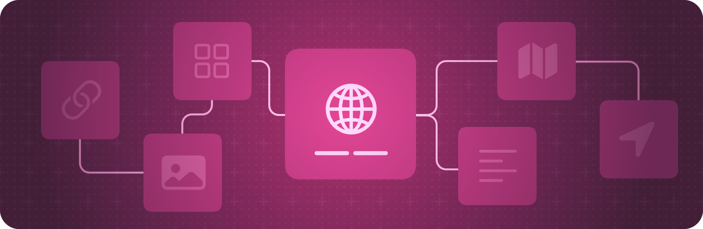

+++
title = "1 应用组织"
date = 2026-09-12T12:47:47+08:00
weight = 1
type = "docs"
description = ""
isCJKLanguage = true
draft = false
+++

> 原文链接: [https://developer.apple.com/documentation/swiftui/app-organization](https://developer.apple.com/documentation/swiftui/app-organization)

# 1 应用组织

定义应用的入口点和顶层结构。

## 概述 {#Overview}

用声明式的方式描述应用的结构，就像你声明视图的外观一样。创建一个遵循 [App](https://developer.apple.com/documentation/swiftui/app) 协议的类型，并用它来列举代表应用界面各个部分的[场景](../2-Scenes/)。

SwiftUI 让你能编写在 Apple 所有平台上都能工作的代码。不过，它也让你能够针对各个平台特有的能力来定制应用。例如，如果你需要响应系统传统上发给 UIKit、AppKit 或 WatchKit 应用委托的回调，可以定义委托对象，并用合适的委托适配器属性包装器（例如 [UIApplicationDelegateAdaptor](https://developer.apple.com/documentation/swiftui/uiapplicationdelegateadaptor)）在应用结构中实例化它。

关于平台特定的设计指导，参见 Human Interface Guidelines 中的[快速上手](https://developer.apple.com/design/human-interface-guidelines/getting-started)。

## 创建应用 {#Creating-an-app}

- [Destination Video](https://developer.apple.com/documentation/visionos/destination-video) —— 借助 SwiftUI 在多平台应用中打造沉浸式的媒体体验。
- [Hello World](https://developer.apple.com/documentation/visionos/world) —— 用窗口、立体空间和沉浸式空间向人们介绍地球。
- [Backyard Birds：用 SwiftData 和小组件构建应用](1.1-BackyardBirdsSample/) —— 创建一个带持久化数据、可交互小组件和全新应用内购买体验的应用。
- [Food Truck：构建 SwiftUI 多平台应用](1.2-FoodTruckBuildingASwiftuiMultiplatformApp/) —— 为 Mac、iPad 和 iPhone 创建单一代码库和单一应用目标。
- [Fruta：用 SwiftUI 构建功能丰富的应用](https://developer.apple.com/documentation/appclip/fruta-building-a-feature-rich-app-with-swiftui) —— 用共享代码库构建一个既提供小组件又提供 App Clip 的多平台应用。
- [迁移到 SwiftUI 生命周期](1.3-MigratingToTheSwiftuiLifeCycle/) —— 在保留现有代码库的同时，在 SwiftUI 中使用基于场景的生命周期。
- [App](https://developer.apple.com/documentation/swiftui/app) —— 表示应用结构与行为的类型。

## 面向 iOS 和 iPadOS {#Targeting-iOS-and-iPadOS}

- [UILaunchScreen](https://developer.apple.com/documentation/bundleresources/information-property-list/uilaunchscreen) —— 应用启动期间显示的用户界面。
- [UILaunchScreens](https://developer.apple.com/documentation/bundleresources/information-property-list/uilaunchscreens) —— 应用为响应不同 URL 方案而启动时显示的用户界面。
- [UIApplicationDelegateAdaptor](https://developer.apple.com/documentation/swiftui/uiapplicationdelegateadaptor) —— 用来创建 UIKit 应用委托的属性包装器类型。

## 面向 macOS {#Targeting-macOS}

- [NSApplicationDelegateAdaptor](https://developer.apple.com/documentation/swiftui/nsapplicationdelegateadaptor) —— 用来创建 AppKit 应用委托的属性包装器类型。

## 面向 watchOS {#Targeting-watchOS}

- [WKApplicationDelegateAdaptor](https://developer.apple.com/documentation/swiftui/wkapplicationdelegateadaptor) —— 在 `App` 中使用、用来提供 WatchKit 委托的属性包装器。
- [WKExtensionDelegateAdaptor](https://developer.apple.com/documentation/swiftui/wkextensiondelegateadaptor) —— 用来创建 WatchKit 扩展委托的属性包装器类型。

## 面向 tvOS {#Targeting-tvOS}

- [在 SwiftUI 中创建 tvOS 媒体目录应用](1.4-CreatingATvosMediaCatalogAppInSwiftui/) —— 为你的 tvOS 应用构建标准的内容卡片和内容货架行。

## 处理系统重置方向事件 {#Handling-system-recenter-events}

- [WorldRecenterPhase](https://developer.apple.com/documentation/swiftui/worldrecenterphase) —— 表示与系统重置方向事件某个阶段相关联的信息的类型。该类型的值会传给 `View.onWorldRecenter(action:)` 中指定的闭包。
