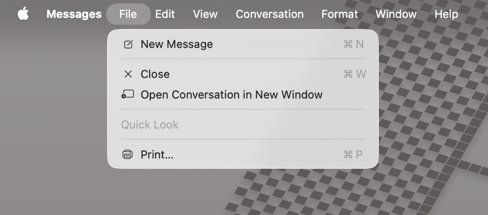
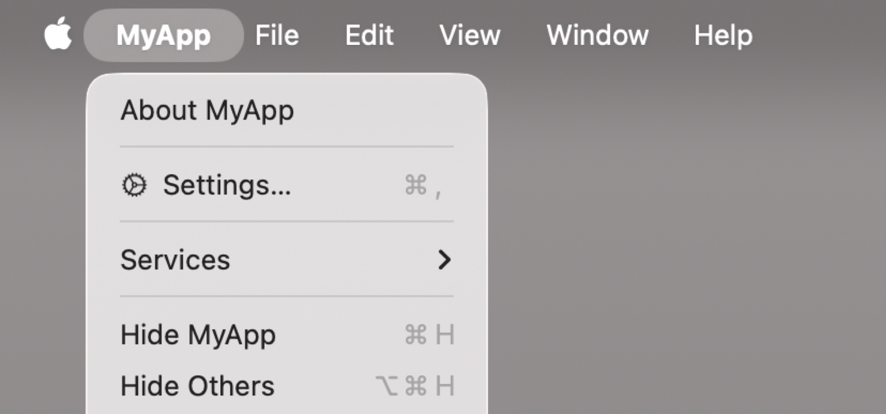
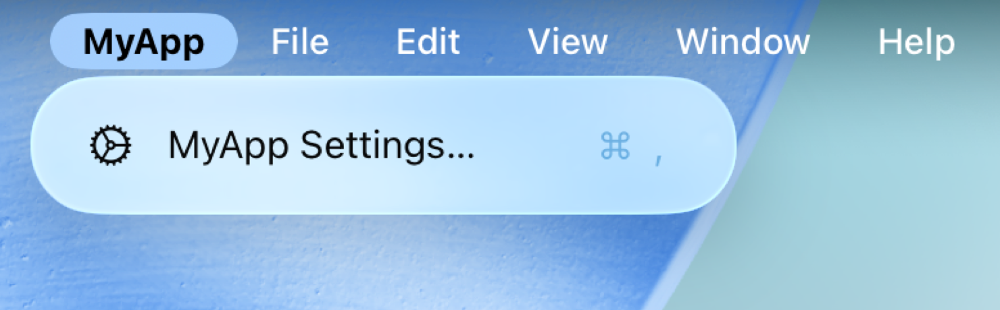
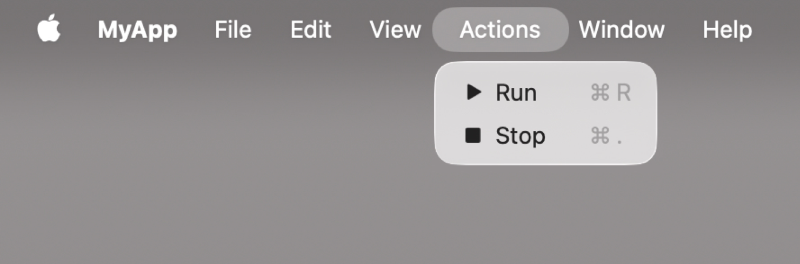
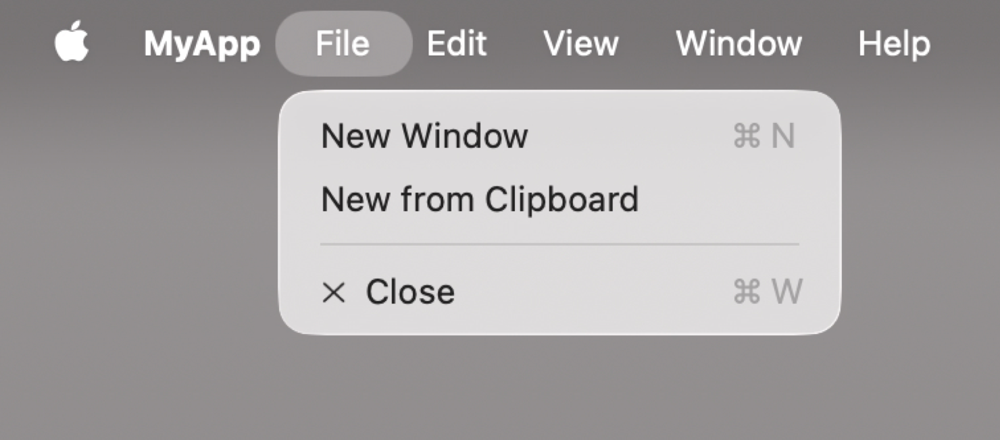

+++
title = "2.1 用 SwiftUI 构建并自定义菜单栏"
date = 2026-09-12T12:47:47+08:00
weight = 1
type = "docs"
description = ""
isCJKLanguage = true
draft = false
+++


> 原文链接: [https://developer.apple.com/documentation/swiftui/building-and-customizing-the-menu-bar-with-swiftui](https://developer.apple.com/documentation/swiftui/building-and-customizing-the-menu-bar-with-swiftui)

# 2.1 用 SwiftUI 构建并自定义菜单栏

为 iPadOS 和 macOS 构建原生菜单栏，提供无缝的跨平台体验。

## 概述 {#Overview}

在 iPadOS 和 macOS 上，菜单栏提供对系统关键操作的访问，例如剪切、拷贝、粘贴和窗口管理。系统通过菜单栏把这些操作按功能归入菜单和子菜单。应用可以添加与上下文相关的操作（例如显示和隐藏侧边栏），也可以创建自定义菜单和菜单项，让人们从菜单栏执行应用特有的操作。你还可以把菜单栏绑定到键盘快捷键，让应用更快捷、更易用。

**macOS**



**iPadOS**


应用包含若干 [Scene](https://developer.apple.com/documentation/swiftui/scene) 实例，它们显示应用的主要视图。每个场景在菜单栏中提供不同的默认菜单集合和操作。与上下文相关的菜单和操作、乃至自定义菜单和操作，都通过 [commands(content:)](https://developer.apple.com/documentation/swiftui/scene/commands(content:)) 修饰符指定。

系统提供的菜单和菜单项顺序在所有应用中是一致的，但某些菜单和菜单项会依据上下文添加。例如，基于文稿的应用会在 File 菜单中提供创建和打开文稿的选项。类似地，并非所有应用都有文本格式化能力，但在场景的 commands 中包含 [TextFormattingCommands](https://developer.apple.com/documentation/swiftui/textformattingcommands) 的应用会获得一个 Format 菜单，其中包含选择字体、为文本设置样式等选项。系统随后会添加人们在此上下文中期望的相应菜单组和菜单项。

请思考人们如何使用你的应用、哪些操作适合放进菜单栏以及放在哪里。关于设计指导，参见 Human Interface Guidelines 中的[菜单栏](https://developer.apple.com/design/human-interface-guidelines/the-menu-bar)。

## 填充菜单栏 {#Populate-the-menu-bar}

应用启动时，菜单栏会依据已实现的场景和命令填充菜单与菜单项。条件型或依赖上下文的命令对应的菜单项，会依据当前活跃场景及其处于焦点的视图层级中的信息，被动态地设为可用或不可用。

每个场景都包含一组默认菜单和菜单项，你可以用 [commands(content:)](https://developer.apple.com/documentation/swiftui/scene/commands(content:)) 修饰符按应用自身的需要加以补充。

场景的默认菜单和菜单项取决于该场景类型所支持的功能。例如，[WindowGroup](https://developer.apple.com/documentation/swiftui/windowgroup) 包含退出和隐藏应用的命令，以及拷贝粘贴支持和窗口管理。

```swift
@main
struct MyApp: App {
    var body: some Scene {
        WindowGroup {
            ContentView()
        }
    }
}
```

**macOS**


**iPadOS**


在 macOS 上，[Settings](https://developer.apple.com/documentation/swiftui/settings) 场景包含与 `Window` 相同的操作，但额外增加了一个呈现应用设置窗口的操作，也就是人们选择 App 菜单 > Settings 时得到的那个。在 iPadOS 上，这个菜单栏项不需要额外的场景，执行它会切换到「设置」应用中该应用的设置页面。

```swift
@main
struct MyApp: App {
    var body: some Scene {
        WindowGroup {
            ContentView()
        }

        #if os(macOS)
        Settings {
            SettingsView()
        }
        #endif
    }
}
```

**macOS**



**iPadOS**



[DocumentGroup](https://developer.apple.com/documentation/swiftui/documentgroup) 场景包含 `WindowGroup` 所包含的操作，以及一批支持文稿管理能力的操作，例如存储和复制。

把多个场景一起使用，就能得到一个菜单栏，其菜单项涵盖了「创建并编辑文稿、管理多个窗口、公开用户可配置设置」这类应用的全部核心功能。

```swift
@main
struct MyApp: App {
    var body: some Scene {
        DocumentGroup(newDocument: MyAppDocument()) { file in
            // ...
        }

        #if os(macOS)
        Settings {
            // ...
        }
        #endif
    }
}
```

## 添加与上下文相关的系统菜单项 {#Add-contextual-system-provided-menu-items}

有些常见菜单项是可选的，但如果应用具备相应能力，它们会很有帮助。例如，并非每个场景都有导航侧边栏，但对于有侧边栏的场景，人们期望能找到一个控制侧边栏可见性的菜单项。如果你的场景包含导航侧边栏，请用 [commands(content:)](https://developer.apple.com/documentation/swiftui/scene/commands(content:)) 修饰符并实现 [SidebarCommands](https://developer.apple.com/documentation/swiftui/sidebarcommands)，把这个菜单项加进来：

```swift
@main
struct MyApp: App {
    var body: some Scene {
        DocumentGroup(newDocument: MyAppDocument()) { file in
            ContentView(document: file.$document)
        }
        .commands {
            SidebarCommands()
        }
    }
}
```

关于系统提供的命令组（例如文本格式化、工具栏和检查器）的更多信息，参见 [Commands](https://developer.apple.com/documentation/swiftui/commands)。

## 创建自定义菜单和菜单项 {#Create-custom-menus-and-menu-items}

用 [CommandMenu](https://developer.apple.com/documentation/swiftui/commandmenu) 把应用的自定义菜单项组织并归入自定义菜单。系统会把自定义菜单插入到菜单栏中 View 菜单之后。

自定义菜单项用标准 SwiftUI 视图创建，例如 [Button](https://developer.apple.com/documentation/swiftui/button) 和 [Toggle](https://developer.apple.com/documentation/swiftui/toggle)。[Menu](https://developer.apple.com/documentation/swiftui/menu) 用于创建子菜单。关于创建菜单项的更多信息，参见[用自适应控件填充 SwiftUI 菜单](../../../views/8-MenusAndCommands/8.1-PopulatingSwiftuiMenusWithAdaptiveControls/)。

菜单栏还会在菜单项旁显示键盘快捷键信息，以及人们不用菜单栏时可以按哪些键来执行操作。[keyboardShortcut(_:)](https://developer.apple.com/documentation/swiftui/scene/keyboardshortcut(_:)) 修饰符让你定义由哪个组合键执行该操作。请注意，系统提供了许多应用无法覆盖的键盘快捷键。关于设计指导，参见 Human Interface Guidelines 中的[键盘](https://developer.apple.com/design/human-interface-guidelines/keyboards)。

```swift
WindowGroup {
    ContentView()
}
.commands {
    CommandMenu("Actions") {
        Button("Run", systemImage: "play.fill") { ... }
            .keyboardShortcut("R")

        Button("Stop", systemImage: "stop.fill") { ... }
            .keyboardShortcut(".")
    }
}
```

**macOS**



**iPadOS**


## 修改标准菜单 {#Modify-standard-menus}

用 [CommandGroup](https://developer.apple.com/documentation/swiftui/commandgroup) 修改系统提供的菜单。这些分组要么用额外的菜单项扩展菜单，要么替换指定命令组中已有的菜单项。以这种方式添加菜单项时，你可以依据系统提供的菜单项来指定该菜单项的位置。

```swift
WindowGroup {
    ContentView()
}
.commands {
    CommandGroup(before: .systemServices) {
        Button("Check for Updates") { ... }
    }
    
    CommandGroup(after: .newItem) {
        Button("New from Clipboard") { ... }
    }
    
    CommandGroup(replacing: .help) {
        Button("User Manual") { ... }
    }
}

```

**macOS**



**iPadOS**


## 动态更新菜单和菜单项 {#Update-menus-and-menu-items-dynamically}

许多菜单项会依据场景是否活跃、场景是否有焦点或当前选中了什么，来更新自己的外观或操作。例如，当应用的最后一个窗口关闭时，系统会把 File 菜单中的 Close Window 命令置灰。类似地，只有在当前窗口中选中了可拷贝的数据时，Cut 和 Copy 菜单项才可用。这种行为同样适用于你提供的自定义菜单和菜单项。

用 [FocusedValue](https://developer.apple.com/documentation/swiftui/focusedvalue) 为菜单和菜单项建立与上下文相关的依赖。例如，当焦点位于一张照片或一个相册上时，菜单项的标题可以随之变化。焦点值是要求有一个活跃场景、且其视图层级处于焦点时的状态数据。请使用动态属性来响应场景中各视图的变化。

在下面的例子中，带有 `WindowGroup` 场景的应用为每个窗口准备了一个 [Observable()](https://developer.apple.com/documentation/observation/observable()) 数据模型，用于提供该窗口的内容。通过窗口视图层级中的 [focusedSceneValue(_:)](https://developer.apple.com/documentation/swiftui/view/focusedscenevalue(_:)) 修饰符，活跃窗口的数据模型可以作为焦点值使用。

```swift
@Observable
final class DataModel {
    var messages: [Message]
    ...
}

struct ContentView: View {
    @State private var model = DataModel()

    var body: some View {
        VStack {
            ForEach(model.messages) { ... }
        }
        .focusedSceneValue(model)
    }
}
```

用 [FocusedValue](https://developer.apple.com/documentation/swiftui/focusedvalue) 属性包装器在菜单栏中表示活跃场景的数据模型。该数据模型决定 “New Message” 按钮可用还是不可用：

```swift
struct MessageCommands: Commands {
    @FocusedValue(DataModel.self) private var dataModel: DataModel?

    var body: some Commands {
        CommandGroup(after: .newItem) {
            Button("New Message") {
                dataModel?.messages.append(...)
            }
            .disabled(dataModel == nil)
        }
    }
}

@main struct MessagesApp: App {
    var body: some Scene {
        WindowGroup {
            ContentView()
        }
        .commands {
            MessageCommands()
        }
    }
}
```

与 [Environment](https://developer.apple.com/documentation/swiftui/environment) 动态属性类似，`FocusedValue` 用你提供的键来查找当前值。当焦点值是 `Observable` 对象时，这个键可以直接使用该对象的类型。

要共享值类型的值，请用 [Entry()](https://developer.apple.com/documentation/swiftui/entry()) 宏为 `FocusedValues` 扩展一个自定义条目，并在声明 `FocusedValue` 属性时传入得到的键路径。自定义条目的值必须始终是可选类型。

```swift
struct ContentView: View {
    @State private var items: [Item] = ...
    @State private var selection: UUID?
    
    var body: some View {
        List(items, selection: $selection) { item in
            ...
        }
        // 当场景活跃时，同一场景中的视图或菜单栏中的视图
        // 可以读取选中条目的 ID。
        .focusedSceneValue(\.selectedItemID, selection)
    }
}

struct ItemCommands: Commands {
    @FocusedValue(\.selectedItemID) var selectedItemID: UUID?
    
    var body: some Commands {
        ...
    }
}

extension FocusedValues {
    @Entry var selectedItemID: UUID?
}
```

当菜单项依赖活跃场景视图层级中焦点的当前位置时，请使用 [focusedValue(_:)](https://developer.apple.com/documentation/swiftui/view/focusedvalue(_:))。这会创建一个焦点值，只有当焦点位于被修改的视图或其某个子视图上时，其他视图才能看到它。当焦点在别处时，对应的 `FocusedValue` 属性值为 `nil`。

```swift
struct ContentView: View {
    @State private var items: [Item] = ...
    @State private var selection: UUID?

    var body: some View {
        NavigationSplitView {
            SidebarContent()
        } detail: {
            List(items, selection: $selection) { item in
                ...
            }

            // 当焦点位于导航详情列表上时，选中条目的 ID 可见。
            // 如果焦点在侧边栏上，`@FocusedValue(\.selectedItemID)`
            // 的值就是 `nil`。
            .focusedValue(\.selectedItemID, selection)
        }
    }
}
```
