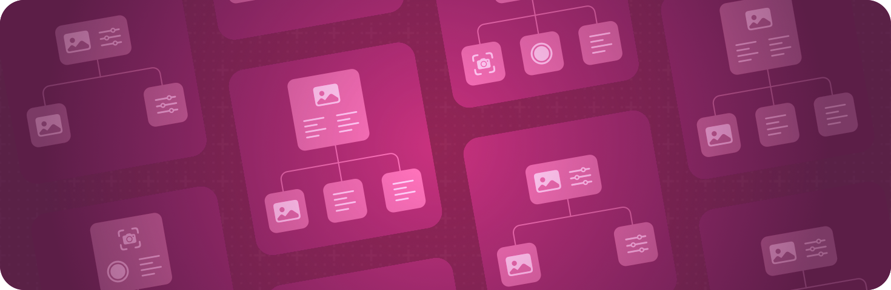

+++
title = "2 场景"
date = 2026-09-12T12:47:47+08:00
weight = 2
type = "docs"
description = ""
isCJKLanguage = true
draft = false
+++

> 原文链接: [https://developer.apple.com/documentation/swiftui/scenes](https://developer.apple.com/documentation/swiftui/scenes)

# 2 场景

声明构成应用各个部分的界面分组。

## 概述 {#Overview}

场景代表应用界面中的一部分，它拥有由系统管理的生命周期。一个 [App](https://developer.apple.com/documentation/swiftui/app) 实例呈现它所包含的各个场景，而每个 [Scene](https://developer.apple.com/documentation/swiftui/scene) 则充当一个 [View](https://developer.apple.com/documentation/swiftui/view) 层级的根元素。

系统会依据场景的类型、平台和上下文，以不同方式呈现场景。场景可能填满整个显示区域、占据显示区域的一部分、成为一个窗口、成为窗口中的一个标签页，或者呈现为其他形式。在某些情况下，应用还可能同时显示同一个场景的多个实例，例如用户基于应用中同一个 [WindowGroup](https://developer.apple.com/documentation/swiftui/windowgroup) 声明同时打开多个窗口。关于主要内置场景类型的更多信息，参见[窗口](../3-Windows/)和[文稿](../5-Documents/)。

你使用修饰符来配置场景，就像配置视图一样。例如，当场景恰好出现在窗口中时，你可以用 [windowStyle(_:)](https://developer.apple.com/documentation/swiftui/scene/windowstyle(_:)) 修饰符调整容纳该场景的窗口的外观。类似地，你可以用 [commands(content:)](https://developer.apple.com/documentation/swiftui/scene/commands(content:)) 修饰符添加菜单命令，让它们在场景于某些平台上处于前台时可用。

## 创建场景 {#Creating-scenes}

- [Scene](https://developer.apple.com/documentation/swiftui/scene) —— 应用界面中由系统管理其生命周期的一部分。
- [SceneBuilder](https://developer.apple.com/documentation/swiftui/scenebuilder) —— 用于把一组场景组合成单个复合场景的结果构建器。

## 监控场景生命周期 {#Monitoring-scene-life-cycle}

- [scenePhase](https://developer.apple.com/documentation/swiftui/environmentvalues/scenephase) —— 场景当前的阶段。
- [ScenePhase](https://developer.apple.com/documentation/swiftui/scenephase) —— 对场景运行状态的指示。

## 管理设置窗口 {#Managing-a-settings-window}

- [Settings](https://developer.apple.com/documentation/swiftui/settings) —— 呈现用于查看和修改应用设置界面的场景。
- [SettingsLink](https://developer.apple.com/documentation/swiftui/settingslink) —— 打开应用所定义 Settings 场景的视图。
- [OpenSettingsAction](https://developer.apple.com/documentation/swiftui/opensettingsaction) —— 呈现应用设置场景的动作。
- [openSettings](https://developer.apple.com/documentation/swiftui/environmentvalues/opensettings) —— 存储在视图环境中的 Settings 呈现动作。

## 构建菜单栏 {#Building-a-menu-bar}

- [用 SwiftUI 构建并自定义菜单栏](2.1-BuildingAndCustomizingTheMenuBarWithSwiftui/) —— 为 iPadOS 和 macOS 构建原生菜单栏，提供无缝的跨平台体验。

## 创建菜单栏附加项 {#Creating-a-menu-bar-extra}

- [MenuBarExtra](https://developer.apple.com/documentation/swiftui/menubarextra) —— 把自身渲染为系统菜单栏中常驻控件的场景。
- [menuBarExtraStyle(_:)](https://developer.apple.com/documentation/swiftui/scene/menubarextrastyle(_:)) —— 设置由该场景创建的菜单栏附加项的样式。
- [MenuBarExtraStyle](https://developer.apple.com/documentation/swiftui/menubarextrastyle) —— 对菜单栏附加项场景外观与行为的规范说明。

## 创建手表通知 {#Creating-watch-notifications}

- [WKNotificationScene](https://developer.apple.com/documentation/swiftui/wknotificationscene) —— 在收到指定类别的远程或本地通知时出现的场景。

## 在外部显示器上呈现内容 {#Presenting-content-on-an-external-display}

- [sceneAccessory(content:)](https://developer.apple.com/documentation/swiftui/view/sceneaccessory(content:)) —— 定义与 `self` 关联的任何场景配件。
- [SceneAccessoryContent](https://developer.apple.com/documentation/swiftui/sceneaccessorycontent) —— 遵循该协议的类型表示那些为场景配件定义内容的条目。
- [ExternalNonInteractiveAccessory](https://developer.apple.com/documentation/swiftui/externalnoninteractiveaccessory) —— 在外部显示器上呈现非交互内容的场景配件。
