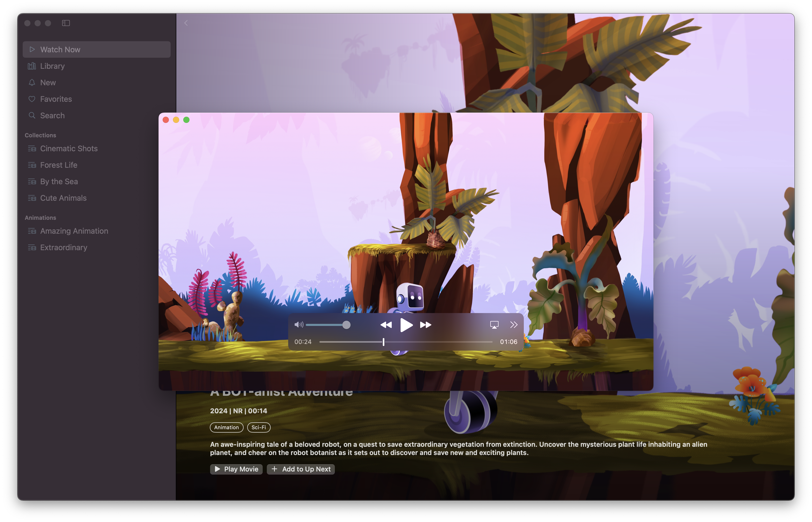
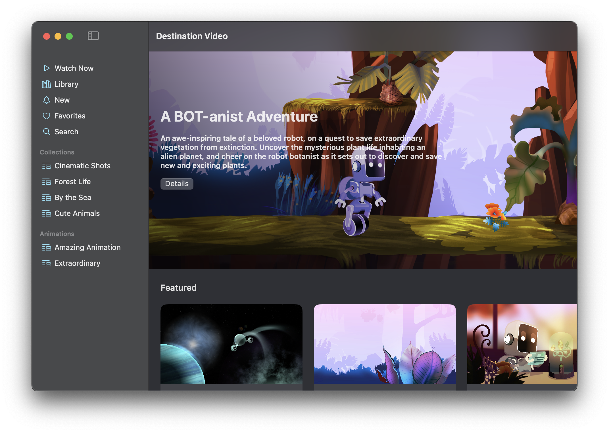
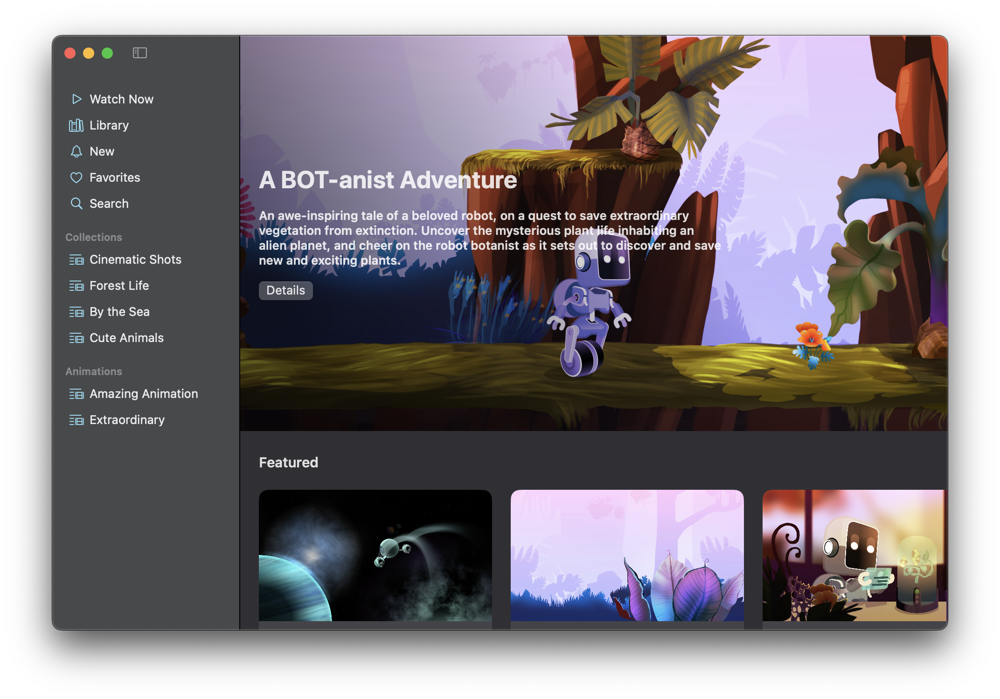
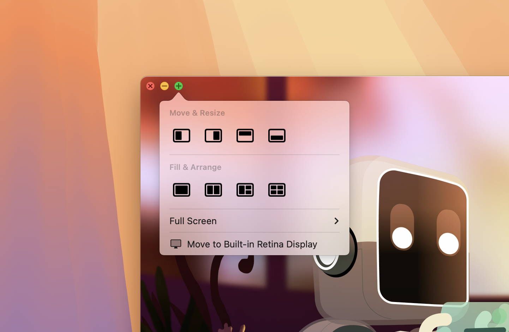

+++
title = "3.1 在 macOS 中自定义窗口样式与状态恢复行为"
date = 2026-09-12T12:47:47+08:00
weight = 1
type = "docs"
description = ""
isCJKLanguage = true
draft = false
+++


> 原文链接: [https://developer.apple.com/documentation/swiftui/customizing-window-styles-and-state-restoration-behavior-in-macos](https://developer.apple.com/documentation/swiftui/customizing-window-styles-and-state-restoration-behavior-in-macos)

# 3.1 在 macOS 中自定义窗口样式与状态恢复行为

配置应用窗口在 macOS 中的外观与行为，提供更有吸引力、更连贯的体验。

## 概述 {#overview}

[Destination Video](https://developer.apple.com/documentation/visionos/destination-video) 的 macOS 版本演示了如何利用窗口与场景自定义 API（macOS 15 及更高版本提供）来定制应用在 macOS 中的体验。这包括改变工具栏的外观与可见性、扩大窗口的拖动区域、参与窗口的缩放操作，以及修改窗口的状态恢复行为。



## 移除窗口工具栏的标题和背景 {#Remove-the-title-and-background-from-the-windows-toolbar}

Destination Video 使用标签页视图作为主要的界面组件，在 macOS 上它看起来类似于两栏的导航分栏视图。在这种配置下，每个标签页都作为侧边栏中的一个条目出现，并参与应用的导航。由于侧边栏已经用视觉方式表明你处于导航层级的什么位置，而且应用内容并不需要额外的工具栏项，所以工具栏并不是必需的。移除工具栏可以让底层内容一直延伸到窗口边缘，从而凸显内容本身。

为移除工具栏背景，`ContentView` 调用 [toolbarBackgroundVisibility(_:for:)](https://developer.apple.com/documentation/swiftui/view/toolbarbackgroundvisibility(_:for:)) 视图方法：

```swift
.toolbarBackgroundVisibility(.hidden, for: .windowToolbar)
```

随后移除工具栏的标题：

```swift
.toolbar(removing: .title)
```

在这个例子中，应用仍然需要窗口控制按钮来关闭、最小化窗口或进入全屏模式，因此它使用单独的视图方法只移除标题和工具栏背景。若要完全移除工具栏，请改用 [toolbarVisibility(_:for:)](https://developer.apple.com/documentation/swiftui/view/toolbarvisibility(_:for:)) 视图方法。

**之前**



**之后**



需要注意，这些只是视觉上的改变。系统仍会把窗口标题提供给屏幕朗读器等无障碍工具，应用的「窗口」菜单在窗口打开期间也仍会显示标题。

## 扩大窗口的拖动区域 {#Extend-the-windows-drag-region}

在 macOS 中移动窗口时，通常的做法是拖动窗口的工具栏。不过，如果你选择移除工具栏背景，或者完全隐藏工具栏，就要用 [WindowDragGesture](https://developer.apple.com/documentation/swiftui/windowdraggesture) 来扩大该窗口的拖动区域，确保窗口仍然可以拖动。

Destination Video 的 `PlayerView` 把这个手势添加到一层透明的叠加层上，并把该叠加层插在视频内容和播放控件之间。这样你就能安全地拖动窗口，又不会干扰 AVKit 提供的系统播放界面。

```swift
.gesture(WindowDragGesture())
```

播放器还使用 [allowsWindowActivationEvents(_:)](https://developer.apple.com/documentation/swiftui/view/allowswindowactivationevents(_:)) 视图方法，让已安装的窗口拖动手势能够接收激活窗口的事件——例如窗口在后台时，你点击它并立即拖动。

```swift
.allowsWindowActivationEvents(true)
```

## 自定义窗口的缩放行为 {#Customize-the-windows-zoom-behavior}

默认情况下，窗口工具栏提供用于关闭窗口、最小化窗口和进入全屏模式的按钮。如果你按住 Option 键并点击绿色按钮，窗口会缩放，而不是进入全屏。



通常，窗口会缩放到它定义的最大尺寸，或者缩放到显示器允许的尽可能大。不过，你可以使用 [windowIdealPlacement(_:)](https://developer.apple.com/documentation/swiftui/scene/windowidealplacement(_:)) 场景方法来覆盖这一行为，提供更适合窗口内容的大小与位置。应用用这个方法为视频播放器提供一个能保持视频宽高比的最大尺寸，避免上下出现黑边。

```swift
.windowIdealPlacement { proxy, context in
    let displayBounds = context.defaultDisplay.visibleRect
    let idealSize = proxy.sizeThatFits(.unspecified)
    
    // 计算内容的宽高比。
    let aspectRatio = aspectRatio(of: idealSize)
    // 确定显示器尺寸与内容尺寸之间的差值。
    let deltas = deltas(of: displayBounds.size, idealSize)
    
    // 在保持内容宽高比的前提下，
    // 计算窗口缩放后的大小。
    let size = calculateZoomedSize(
        of: idealSize,
        inBounds: displayBounds,
        withAspectRatio: aspectRatio,
        andDeltas: deltas
    )
    
    // 把窗口放置在显示器中央，并返回
    // 对应的窗口放置位置。
    let position = position(of: size, centeredIn: displayBounds)
    return WindowPlacement(position, size: size)
}
```

这个实现还确保缩放后的窗口出现在显示器中央。

## 修改窗口参与状态恢复的方式 {#Modify-how-the-window-participates-in-state-restoration}

在 macOS 中，状态恢复是可选的，人们可以在「系统设置」中全局启用（或禁用）它。默认情况下，你的 SwiftUI 应用会遵循这个设置，但你也可以选择覆盖它，为应用的每个窗口指定偏好的恢复行为。例如，对于代表临时活动的窗口，或者很难或代价很高地恢复上一次会话状态的窗口，你可能希望不参与状态恢复。

在 macOS 上运行时，Destination Video 使用 [SceneRestorationBehavior](https://developer.apple.com/documentation/swiftui/scenerestorationbehavior) 视图修饰符为视频播放器视图禁用状态恢复。

```swift
.restorationBehavior(.disabled)
```

由于应用中的视频都很短，人与它们的交互也转瞬即逝，在下次启动时恢复视频播放器并没有意义。

## 另见 {#See-Also}

#### 相关示例 {#Related-samples}

- [Destination Video](https://developer.apple.com/documentation/visionos/destination-video)

#### 相关视频 {#Related-videos}

- [用 SwiftUI 定制 macOS 窗口](https://developer.apple.com/videos/play/wwdc2024/10148)
