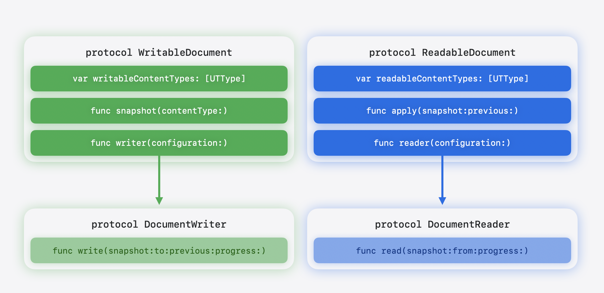

+++
title = "5.1 创建基于文稿的应用"
date = 2026-09-12T12:47:47+08:00
weight = 1
type = "docs"
description = ""
isCJKLanguage = true
draft = false
+++


> 原文链接: [https://developer.apple.com/documentation/swiftui/creating-a-document-based-app](https://developer.apple.com/documentation/swiftui/creating-a-document-based-app)

# 5.1 创建基于文稿的应用

构建让人们能够用协调式文件访问来打开、编辑和存储文件的应用。

## 概述 {#overview}

借助基于文稿的应用，人们可以创建和管理自己的文件，例如文本文稿、绘图和电子表格。iOS 27、macOS 27 和 visionOS 27 中提供的 [Document](https://developer.apple.com/documentation/swiftui/document) 协议让你可以直接访问文稿的文件 URL，因此你可以：

- 读写文件
- 把 URL 传给 Core Graphics、AVFoundation 或 PDFKit 等其他框架，以便在长时间操作期间报告进度
- 用 [makeFileCoordinator()](https://developer.apple.com/documentation/swiftui/urldocumentconfiguration/makefilecoordinator()) 提供的 `FileCoordinator` 安全地访问文件

[Document](https://developer.apple.com/documentation/swiftui/document) 这个组合协议本身没有要求，但它遵循 [ReadableDocument](https://developer.apple.com/documentation/swiftui/readabledocument) 和 [WritableDocument](https://developer.apple.com/documentation/swiftui/writabledocument)。借助它，你可以很方便地声明类型的遵循性，如下所示：

```swift
 @Observable
 final class TextDocument: Document { }
```

由于 [Document](https://developer.apple.com/documentation/swiftui/document) 是引用类型，SwiftUI 不必在每次变更时重建文稿，而且你可以用 [@Observable](https://developer.apple.com/documentation/observation/observable) 宏观察单个属性的变化。

下图展示文稿协议与读取器、写入器协议之间的关系：



## 搭建基于文稿的应用 {#Set-up-a-document-based-app}

要启用文稿基础设施——自动存储、文件协调、文件对话框、键盘快捷键、冲突解决等等——请把 [DocumentGroup](https://developer.apple.com/documentation/swiftui/documentgroup) 或 [DocumentGroupLaunchScene](https://developer.apple.com/documentation/swiftui/documentgrouplaunchscene) 用作应用的第一个场景。在 iOS 上，把信息属性列表中的 [UISupportsDocumentBrowser](https://developer.apple.com/documentation/bundleresources/information-property-list/uisupportsdocumentbrowser) 设为 `YES`，即可呈现文稿浏览器。

一个最小的基于文稿的应用是这样：

```swift
@main
struct NotesApp: App {
    var body: some Scene {
        DocumentGroup { document in
            TextEditorView(document: document)
        } makeDocument: { configuration, context in
            TextDocument(configuration: configuration, context)
        }
    }
}
```

[DocumentGroup](https://developer.apple.com/documentation/swiftui/documentgroup) 的各个构造器接收两个闭包：一个 `editor` 或 `viewer` 闭包参数，用于为已打开的文稿构建用户界面；一个 `makeDocument` 或 `makeReadableDocument` 闭包，返回文稿实例。

SwiftUI 传给文稿构造器的 [URLDocumentConfiguration](https://developer.apple.com/documentation/swiftui/urldocumentconfiguration) 类公开了文件 URL、[lastContentModificationDate](https://developer.apple.com/documentation/swiftui/urldocumentconfiguration/lastcontentmodificationdate)，以及 [makeFileCoordinator()](https://developer.apple.com/documentation/swiftui/urldocumentconfiguration/makefilecoordinator())——后者会创建一个文件协调器，用于在读写之外访问文稿的 URL。此外，它遵循 [@Observable](https://developer.apple.com/documentation/observation/observable)，因此你的代码可以响应变化。

在 iOS 上，用 [DocumentGroupLaunchScene](https://developer.apple.com/documentation/swiftui/documentgrouplaunchscene) 可以用自定义背景和多个创建按钮来定制文稿浏览器启动屏幕，如下例所示：

```swift
@main
struct NotesApp: App {
    var body: some Scene {
        DocumentGroupLaunchScene("My Notes and Lists") {
            NewDocumentButton("New Note", source: .note)
            NewDocumentButton("New List", source: .list)
        } background: {
            LinearGradient(
                colors: [.brandColorGradientStart, .brandColorGradientEnd],
                startPoint: .top,
                endPoint: .bottom
            )
        }

        DocumentGroup { document in
            TextEditorView(document: document)
        } makeDocument: { configuration, context in
            TextDocument(configuration: configuration, context)
        }
    }
}

extension DocumentCreationSource {
    static let note = DocumentCreationSource(id: "note")
    static let list = DocumentCreationSource(id: "list")
}
```

在你的 `TextDocument` 构造器中，检查 [creationSource](https://developer.apple.com/documentation/swiftui/documentcreationcontext/creationsource)，就能知道人们点击的是哪个按钮，并把文稿设置成列表或笔记。

## 在呈现文稿之前显示自定义界面 {#Display-a-custom-UI-before-presenting-a-document}

由于 `makeDocument` 和 `makeReadableDocument` 闭包是异步的，你也可以在文稿出现之前挂起文稿创建，显示自定义的用户界面——例如模板选择器、配置向导或导入预览。关于用 [CheckedContinuation](https://developer.apple.com/documentation/swift/checkedcontinuation) 结构在文稿打开之前呈现模板选择器或其他设置界面的端到端示例，参见 [NewDocumentButton](https://developer.apple.com/documentation/swiftui/newdocumentbutton)。

## 创建简单文稿 {#Create-a-simple-document}

要让你的模型遵循 [Document](https://developer.apple.com/documentation/swiftui/document)，需要提供遵循 [DocumentReader](https://developer.apple.com/documentation/swiftui/documentreader) 和 [DocumentWriter](https://developer.apple.com/documentation/swiftui/documentwriter) 协议的值。大多数情况下，使用 SwiftUI 提供的 [FileWrapperDocumentReader](https://developer.apple.com/documentation/swiftui/filewrapperdocumentreader) 和 [FileWrapperDocumentWriter](https://developer.apple.com/documentation/swiftui/filewrapperdocumentwriter) 便捷类型来替你处理读写即可。

声明 [readableContentTypes](https://developer.apple.com/documentation/swiftui/readabledocument/readablecontenttypes) 列出文稿可以打开的格式，声明 [writableContentTypes](https://developer.apple.com/documentation/swiftui/writabledocument/writablecontenttypes) 列出它可以存储的格式。文稿浏览器会参考 [readableContentTypes](https://developer.apple.com/documentation/swiftui/readabledocument/readablecontenttypes) 来允许打开受支持类型的文件；存储面板则用 [writableContentTypes](https://developer.apple.com/documentation/swiftui/writabledocument/writablecontenttypes) 来决定格式选项。

[DocumentReader](https://developer.apple.com/documentation/swiftui/documentreader) 和 [DocumentWriter](https://developer.apple.com/documentation/swiftui/documentwriter) 是两个相互独立的协议。存储时，SwiftUI 调用 [snapshot(contentType:)](https://developer.apple.com/documentation/swiftui/writabledocument/snapshot(contenttype:)) 捕获当前状态，然后在后台把结果传给 [DocumentWriter](https://developer.apple.com/documentation/swiftui/documentwriter)。读取时，[DocumentReader](https://developer.apple.com/documentation/swiftui/documentreader) 在后台运行并返回快照，SwiftUI 再通过 [apply(snapshot:previous:)](https://developer.apple.com/documentation/swiftui/readabledocument/apply(snapshot:previous:)) 把它交给你的文稿。

快照代表文稿在某一时刻的状态。一个文稿类型可以为读取和写入使用不同的快照类型。快照可以是任何东西，包括文稿类型自身。SwiftUI 会自动协调读写的文件访问。

定义一个遵循 `Document` 的 [Observable](https://developer.apple.com/documentation/observation/observable) 类，如下所示：

```swift
import SwiftUI
import UniformTypeIdentifiers

@Observable
final class TextDocument: Document {
    static let readableContentTypes = [UTType.plainText]

    var text: String
    var configuration: URLDocumentConfiguration

    init(configuration: URLDocumentConfiguration) {
        self.text = ""
        self.configuration = configuration
    }

    // 返回一个把 `FileWrapper` 转换成快照的读取器。

    func reader(
        configuration: sending ReadConfiguration
    ) -> sending FileWrapperDocumentReader<String> {
        FileWrapperDocumentReader(configuration) { fileWrapper in
            if let data = fileWrapper.regularFileContents,
               let text = String(data: data, encoding: .utf8) {
                return text
            }
            return ""
        }
    }

    @MainActor
    func apply(snapshot: String, previous: String?) async throws {
        self.text = snapshot
    }

    // 返回一个把快照转换成 `FileWrapper` 的写入器。

    func writer(
        configuration: sending WriteConfiguration
    ) -> sending FileWrapperDocumentWriter<String> {
        FileWrapperDocumentWriter(configuration) { snapshot, previous in
            let data = Data(snapshot.utf8)
            return FileWrapper(regularFileWithContents: data)
        }
    }

    @MainActor
    func snapshot(contentType: UTType) async throws -> sending String {
        text
    }
}
```

有了这个文稿模型，再加上上一节的 [DocumentGroup](https://developer.apple.com/documentation/swiftui/documentgroup) 配置，你就得到了一个完整的、支持打开与存储的基于文稿的应用。

当 SwiftUI 自动存储文稿，或者有人按下 Command-S 时，它会在主 actor 上调用 [snapshot(contentType:)](https://developer.apple.com/documentation/swiftui/writabledocument/snapshot(contenttype:)) 捕获当前状态，然后调用 `writer(configuration:)` 取得 [DocumentWriter](https://developer.apple.com/documentation/swiftui/documentwriter)。随后 SwiftUI 在后台带着协调式文件访问，把快照和目标 URL 传给 `write(snapshot:to:previous:progress:)`。

读取的流程相同：SwiftUI 调用 `reader(configuration:)`，在后台把文件 URL 传给 `read(from:progress:)`，然后通过 [apply(snapshot:previous:)](https://developer.apple.com/documentation/swiftui/readabledocument/apply(snapshot:previous:)) 把快照交给你的文稿。

## 支持只读文稿 {#Support-read-only-documents}

要让应用显示只读文稿，请遵循 [ReadableDocument](https://developer.apple.com/documentation/swiftui/readabledocument)，并使用会产生遵循 `ReadableDocument` 值的构造器：

```swift
DocumentGroup { document in
    PDFViewer(document: document)
} makeReadableDocument: { configuration, context in
    PDFDocument(configuration: configuration, context: context)
}
@Observable
final class PDFDocument: ReadableDocument { /* ... */}
```

在信息属性列表中把 [CFBundleTypeRole](https://developer.apple.com/documentation/bundleresources/information-property-list/cfbundleurltypes/cfbundletyperole) 设为 `Viewer`，表明你的应用不编辑这种文件类型。对于可以编辑文稿的应用，请把角色设为 `Editor`。

## 注册撤销操作 {#Register-undo-actions}

SwiftUI 通过撤销操作跟踪未存储的改动，因此每个基于文稿的应用都需要注册它们。从环境中读取当前生效的 [UndoManager](https://developer.apple.com/documentation/foundation/undomanager)，并通过会注册撤销操作的方法更新文稿。在撤销闭包中再次调用同一个方法，也会自动注册重做操作，如下所示：

```swift
struct TextEditorView: View {
    @Bindable var document: TextDocument
    @Environment(\.undoManager) private var undoManager

    var body: some View {
        TextEditor(text: $document.text)
              .onChange(of: document.text) { oldValue, _ in
                  undoManager?.registerUndo(withTarget: document) { document in
                      document.text = oldValue
                  }
            }
    }
}
```

## 处理包文稿 {#Work-with-package-documents}

包是系统以单个条目呈现的目录。人们在「访达」、文件 app 和文稿浏览器中看到的是一个图标，可以拖动、共享、备份和同步。在内部，你的包可以存放任何需要的文件，包括元数据、页面、图层或内嵌媒体。

先从 [FileWrapperDocumentReader](https://developer.apple.com/documentation/swiftui/filewrapperdocumentreader) 和 [FileWrapperDocumentWriter](https://developer.apple.com/documentation/swiftui/filewrapperdocumentwriter) 开始。只有当你需要流式传输数据、直接访问 URL，或者想优化磁盘操作时，才改用自定义的 [DocumentReader](https://developer.apple.com/documentation/swiftui/documentreader) 和 [DocumentWriter](https://developer.apple.com/documentation/swiftui/documentwriter)。

下面的例子展示一个最小的笔记本文稿。它在磁盘上的布局如下：

```swift
MyNotebook.notebook/
├── metadata.json        ← title + ordered page IDs
└── pages/
    ├── <uuid>.txt       ← each page is plain text
    └── …
```

```swift
import UniformTypeIdentifiers

@Observable
final class NotebookDocument: Document {
    static let readableContentTypes: [UTType] = [.notebook]   // 记得在 Info.plist 中声明

    var metadata: NotebookMetadata
    var pages: [UUID: String]

    init() {
        let initialPageID = UUID()
        self.metadata = NotebookMetadata(
            title: "Untitled", pageOrder: [initialPageID]
        )
        self.pages = [initialPageID: ""]
    }

    func reader(
        configuration: sending ReadConfiguration
    ) -> sending FileWrapperDocumentReader<NotebookSnapshot> {
        FileWrapperDocumentReader(configuration) { directory in
            let children = directory.fileWrappers ?? [:]

            guard let metadataData = children["metadata.json"]?.regularFileContents else {
                throw CocoaError(.fileReadCorruptFile)
            }
            let metadata = try JSONDecoder().decode(NotebookMetadata.self, from: metadataData)

            guard let pagesDirectory = children["pages"]?.fileWrappers else {
                throw CocoaError(.fileReadCorruptFile)
            }

            var pages: [UUID: String] = [:]
            for (filename, wrapper) in pagesDirectory {
                guard let data = wrapper.regularFileContents
                else { continue }
                let withoutExtension = filename.replacingOccurrences(
                    of: ".txt", with: ""
                )
                if let id = UUID(uuidString: withoutExtension) {
                    pages[id] = String(decoding: data, as: UTF8.self)
                }
            }

            return NotebookSnapshot(metadata: metadata, pages: pages)
        }
    }

    func writer(
        configuration: sending WriteConfiguration
    ) -> sending FileWrapperDocumentWriter<NotebookSnapshot> {
        FileWrapperDocumentWriter(configuration) { snapshot, _ in
            let metadata = try JSONEncoder().encode(snapshot.metadata)
            let metadataWrapper = FileWrapper(regularFileWithContents: metadata)

            var pageNamesToFileWrappers: [String: FileWrapper] = [:]
            for (pageID, content) in snapshot.pages {
                pageNamesToFileWrappers["\(pageID.uuidString).txt"] =
                    FileWrapper(regularFileWithContents: Data(content.utf8))
            }
            let pagesDirectory = FileWrapper(directoryWithFileWrappers: pageNamesToFileWrappers)

            let root = FileWrapper(directoryWithFileWrappers: [
                "metadata.json": metadataWrapper,
                "pages": pagesDirectory,
            ])
            return root
        }
    }

    @MainActor
    func snapshot(contentType: UTType) async throws -> sending NotebookSnapshot {
        NotebookSnapshot(metadata: metadata, pages: pages)
    }

    @MainActor
    func apply(
        snapshot: sending NotebookSnapshot,
        previous: sending NotebookSnapshot?
    ) async throws {
        metadata = snapshot.metadata
        pages = snapshot.pages
    }
}

struct NotebookMetadata: Codable, Sendable {
    var title: String
    var pageOrder: [UUID]
}

struct NotebookSnapshot: Sendable {
    var metadata: NotebookMetadata
    var pages: [UUID: String]
}

extension UTType {
    static let notebook = UTType(exportedAs: "com.example.notebook")
}
```

[FileWrapper](https://developer.apple.com/documentation/foundation/filewrapper) 类按需加载文件内容。当你打开一个包时，[FileWrapper](https://developer.apple.com/documentation/foundation/filewrapper) 会读取目录结构，但不加载任何文件内容。只有当你访问某个文件的 [regularFileContents](https://developer.apple.com/documentation/foundation/filewrapper/regularfilecontents) 时，它才会被加载，这使 [FileWrapper](https://developer.apple.com/documentation/foundation/filewrapper) 非常适合只需要包中一部分内容的情况。如果你只需要一个元数据文件、一张缩略图或前几页，可以遍历 [fileWrappers](https://developer.apple.com/documentation/foundation/filewrapper/filewrappers) 找到所需内容，并只对这些文件调用 [regularFileContents](https://developer.apple.com/documentation/foundation/filewrapper/regularfilecontents)。

> 重要：如果应用决定惰性读取文稿——例如只读取某人当下可见的那部分包内容——那么应用需要做好心理准备：后续从文件包装器读取的尝试可能失败，因为文件可能已被删除或移动。从 `FileWrapper` 读取时请始终处理错误。

## 实现自定义读取器和写入器 {#Implement-custom-readers-and-writers}

[FileWrapperDocumentReader](https://developer.apple.com/documentation/swiftui/filewrapperdocumentreader) 和 [FileWrapperDocumentWriter](https://developer.apple.com/documentation/swiftui/filewrapperdocumentwriter) 都把读写委托给 [FileWrapper](https://developer.apple.com/documentation/foundation/filewrapper)。对于需要更多控制的文稿，例如流式读取、自定义写入逻辑，或者直接向 Core Graphics、AVFoundation、PDFKit 这类框架提供 URL 访问，请实现自己的、遵循 [DocumentReader](https://developer.apple.com/documentation/swiftui/documentreader) 和 [DocumentWriter](https://developer.apple.com/documentation/swiftui/documentwriter) 的类型。

下面的例子展示一个图像文稿，它用 Core Graphics 加载和存储 JPEG 文件，并可调整压缩质量：

```swift
import SwiftUI
import CoreGraphics
import UniformTypeIdentifiers

struct ImageSnapshot {
    var image: CGImage?
    var compressionQuality: Double
}

@Observable
final class ImageDocument: Document {
    static let readableContentTypes: [UTType] = [.jpeg]

    var displayImage: CGImage?
    var compressionQuality: Double = 0.9

    init() { }
}
```

`ImageDocument.Reader` 通过实现 `read(from:progress:)` 遵循 [DocumentReader](https://developer.apple.com/documentation/swiftui/documentreader)，它把源 URL 传给 `CGImageSourceCreateWithURL(_:_:)`，从而让 Core Graphics 负责格式检测和解码，如下所示：

```swift
extension ImageDocument {
    struct Reader: DocumentReader {
        @concurrent 
        func read(from source: URL, progress: consuming Subprogress) async throws -> sending ImageSnapshot {
            guard let imageSource = CGImageSourceCreateWithURL(source as CFURL, nil),
                  let image = CGImageSourceCreateImageAtIndex(imageSource, 0, nil) else {
                throw CocoaError(.fileReadCorruptFile)
            }
            return ImageSnapshot(image: image, compressionQuality: 0.9)
        }
    }

    func reader(configuration: sending ReadConfiguration) -> sending Reader {
        Reader()
    }

    @MainActor
    func apply(snapshot: sending ImageSnapshot, previous: sending ImageSnapshot?) async throws {
        self.compressionQuality = snapshot.compressionQuality
        self.displayImage = snapshot.image
    }
}
```

SwiftUI 每次需要读取或重新读取文稿时都会调用 `reader(configuration:)`，例如文稿打开时，或者另一个进程修改了它时。[DocumentReadConfiguration](https://developer.apple.com/documentation/swiftui/documentreadconfiguration) 提供内容类型，而文件 URL 会作为 `source` 参数传给 `read(from:progress:)`。

接下来的代码示例展示如何用 `CGImageDestination` 把图像编码为 JPEG，并应用快照中的压缩质量。`ImageDocument.Writer` 通过实现 `write(snapshot:to:previous:progress:)` 遵循 [DocumentWriter](https://developer.apple.com/documentation/swiftui/documentwriter)，它把目标 URL 传给 `CGImageDestinationCreateWithURL(_:_:_:_:)`，让 Core Graphics 负责 JPEG 编码与压缩。

```swift
extension ImageDocument {
    struct Writer: DocumentWriter {
        @concurrent
        func write(
            content snapshot: sending ImageSnapshot, to destination: URL,
            previous: sending ImageSnapshot?, progress: consuming Subprogress
        ) async throws {
            guard let image = snapshot.image else { return }

            guard let imageDestination = CGImageDestinationCreateWithURL(
                destination as CFURL, UTType.jpeg.identifier as CFString, 1, nil
            ) else {
                throw CocoaError(.fileWriteUnknown)
            }

            let options: [CFString: Any] = [
                kCGImageDestinationLossyCompressionQuality: snapshot.compressionQuality
            ]
            CGImageDestinationAddImage(imageDestination, image, options as CFDictionary)

            guard CGImageDestinationFinalize(imageDestination) else {
                throw CocoaError(.fileWriteUnknown)
            }
        }
    }

    func writer(configuration: sending WriteConfiguration) -> sending Writer {
        Writer()
    }

    @MainActor
    func snapshot(contentType: UTType) async throws -> sending ImageSnapshot {
        ImageSnapshot(image: displayImage, compressionQuality: compressionQuality)
    }
}
```

`previous` 参数包含上一次成功写入的快照。对于 JPEG、文本文件或 PDF 这类单文件文稿，你可以忽略 `previous`，因为通常可以整体重写文件。对于包文稿，你可以把 `previous` 与当前快照比较，只写入发生变化的文件。

> 重要：[snapshot(contentType:)](https://developer.apple.com/documentation/swiftui/writabledocument/snapshot(contenttype:)) 方法在主线程上运行。请让它尽可能轻量，而把序列化放到 [DocumentWriter](https://developer.apple.com/documentation/swiftui/documentwriter) 中做，因为写入在后台运行。快照捕获的是*要存储什么*，写入器负责*怎么存储*。

同样的做法适用于任何通过 URL 读写文件的框架，包括 AVFoundation 的 [AVAssetExportSession](https://developer.apple.com/documentation/avfoundation/avassetexportsession)、PDFKit 的 [PDFDocument(url:)](https://developer.apple.com/documentation/pdfkit/pdfdocument/init(url:)-98jte)，或者任何接受文件路径的 C 库。

## 导出文稿 {#Export-documents}

要把文稿导出到新位置或新格式，请使用 [fileExporter(isPresented:document:contentType:defaultFilename:onCompletion:onCancellation:)](https://developer.apple.com/documentation/swiftui/view/fileexporter(ispresented:document:contenttype:defaultfilename:oncompletion:oncancellation:)) 视图修饰符，如下所示：

```swift
final class TextDocument: WritableDocument { /* ... */ }

struct TextEditorView: View {
    @Bindable var document: TextDocument
    @State private var isExporting = false

    var body: some View {
        TextEditor(text: $document.text)
            .toolbar {
                Button("Export…") { isExporting = true }
            }
            .fileExporter(
                isPresented: $isExporting, document: document,
                contentType: .utf8PlainText, defaultFilename: "Text"
            ) { result in
                switch result {
                case .success(let url):
                    // 生产环境中请使用 os 框架的 Logger，而不是 print。
                    print("Exported to \(url)")
                case .failure(let error):
                    print("Export failed: \(error)")
                }
            }
    }
}
```

关于声明自定义文件格式、在读写生命周期方法之外访问文件，以及为长时间操作报告进度的信息，参见[处理高级文稿场景](../5.2-HandlingAdvancedDocumentScenarios/)。
