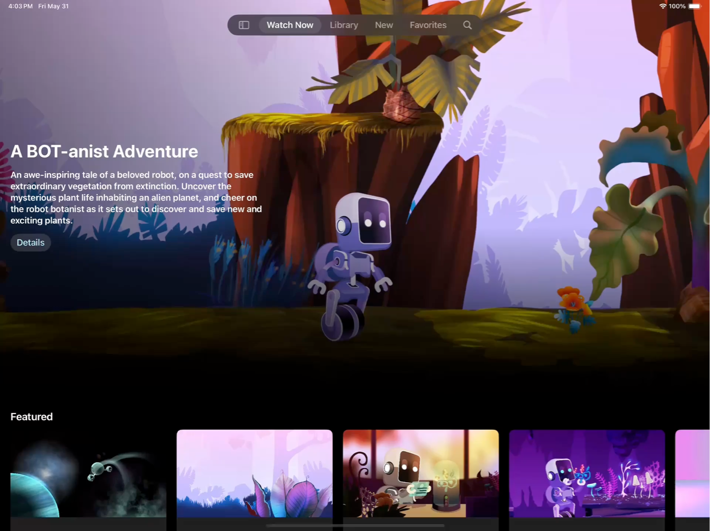
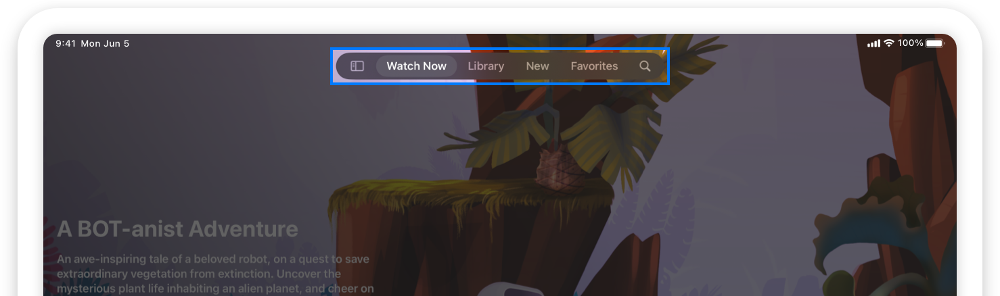
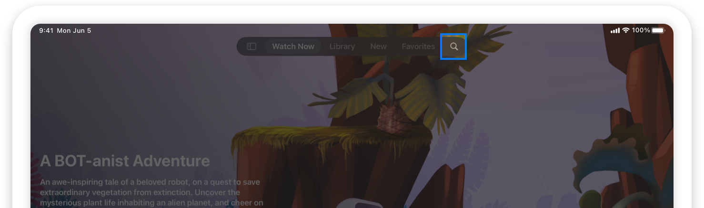
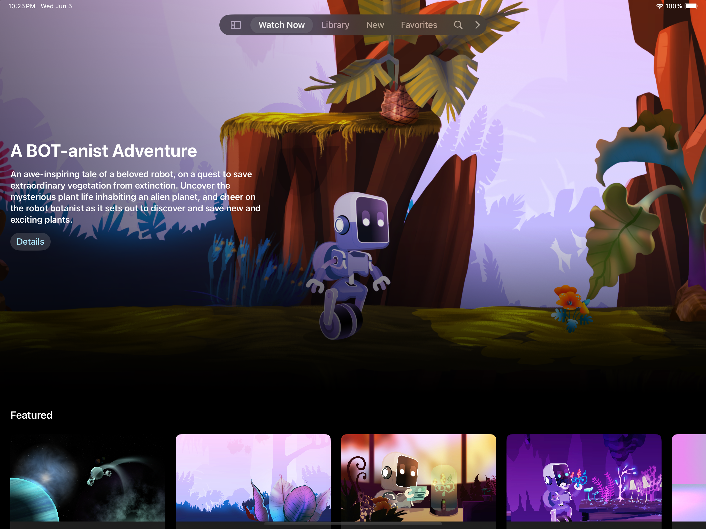
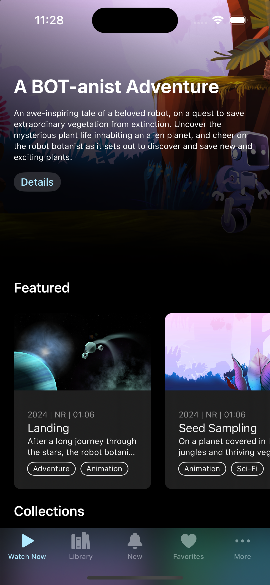
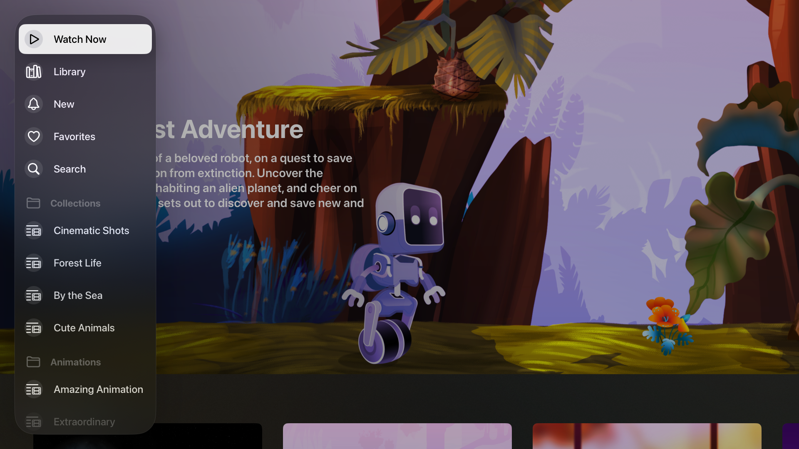
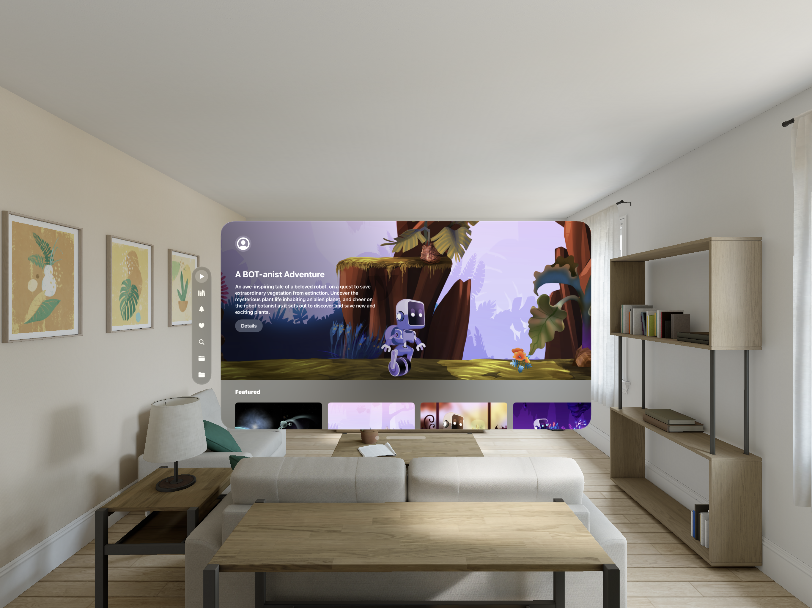
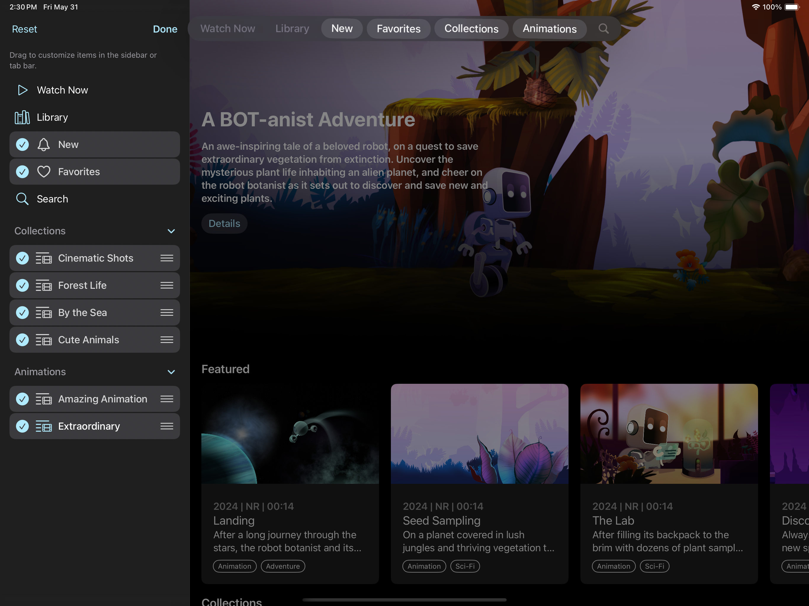
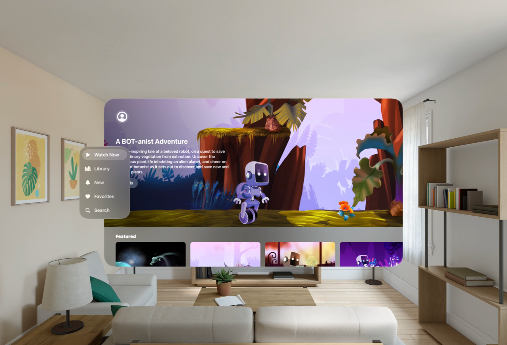

+++
title = "6.5 用标签页导航增强应用内容"
date = 2026-09-12T12:47:47+08:00
weight = 5
type = "docs"
description = ""
isCJKLanguage = true
draft = false
+++


> 原文链接: [https://developer.apple.com/documentation/swiftui/enhancing-your-app-content-with-tab-navigation](https://developer.apple.com/documentation/swiftui/enhancing-your-app-content-with-tab-navigation)

# 6.5 用标签页导航增强应用内容

用标签栏提供快捷导航的同时，让应用内容始终处于醒目位置。

## 概述 {#Overview}

[Destination Video](https://developer.apple.com/documentation/visionos/destination-video) 采用了 [sidebarAdaptable](https://developer.apple.com/documentation/swiftui/tabviewstyle/sidebaradaptable) 标签页视图样式，它为每个平台优化了内容浏览体验。

从 iPadOS 18 开始，标签栏会浮在内容上方显示在屏幕顶部，而不是显示在屏幕底部。这种呈现方式带来沉浸式的全屏浏览体验。标签栏让人们可以访问应用中的顶层导航。不过，标签页太多会让人难以定位内容。实现一个侧边栏，可以让详细的信息层级更容易导航。



视频：[iPad 上 Destination Video 的屏幕录制，显示标签栏变为侧边栏，然后变得可编辑](https://developer.apple.com/tutorials/videos/com.apple.SwiftUI/Enhancing-your-app-content-with-tab-navigation-hero-video.mp4)

### 创建标签栏 {#Create-a-tab-bar}

你可以用 [init(selection:content:)](https://developer.apple.com/documentation/swiftui/tabview/init(selection:content:)) 构造器创建一个带显式选择绑定的 [TabView](https://developer.apple.com/documentation/swiftui/tabview)。要在 `TabView` 中添加标签页，请初始化一个 [Tab](https://developer.apple.com/documentation/swiftui/tab)。Destination Video 用 [init(_:systemImage:value:content:)](https://developer.apple.com/documentation/swiftui/tab/init(_:systemimage:value:content:)) 构造器创建每个标签页：

```swift
@State private var selectedTab: Tabs = .watchNow

var body: some View {
    TabView(selection: $selectedTab) {
        Tab("Watch Now", systemImage: "play", value: .watchNow) {
            WatchNowView()
        }
        // 更多标签页……
    }
}
```

`TabView` 的选择值类型与它所包含标签页的值类型一致。在这个例子中，每个 `Tab` 的值都是 `Tabs` 类型，示例中把这个枚举定义如下：

```swift
enum Tabs: Equatable, Hashable, Identifiable {
    case watchNow
    case library
    case new
    case favorites
    case search
}
```

> 注意：为标签页使用符号图像时，请使用轮廓变体。当它出现在标签栏中时，系统会自动选用填充变体。



此外，这个示例还使用 [search](https://developer.apple.com/documentation/swiftui/tabrole/search) 角色与 [init(value:role:content:)](https://developer.apple.com/documentation/swiftui/tab/init(value:role:content:)) 构造器。把标签页角色设为 `search` 会让系统对该 `Tab` 应用几项默认定制。搜索标签页会得到：

- 搜索的默认标题 “search”
- 搜索的默认系统符号，即放大镜
- 搜索的默认固定行为，即系统自动把它固定在标签栏中

```swift
Tab(value: .search, role: .search) {
    // ...
}
```

固定标签页会依据应用的偏好语言出现在标签栏的后缘。当语言是从左到右书写时，它们出现在右侧；当语言是从右到左书写时，它们出现在左侧。



### 在标签页视图中构建层级 {#Build-hierarchy-in-tab-view}

你可以用 [TabSection](https://developer.apple.com/documentation/swiftui/tabsection) 在 `TabView` 中声明二级标签页层级。例如，Destination Video 用 [init(content:header:)](https://developer.apple.com/documentation/swiftui/tabsection/init(content:header:)) 构造器创建标签分区。

```swift
TabView(selection: $selectedTab) {
    Tab("Watch Now", systemImage: "play", value: .watchNow) {
        WatchNowView()
    }

    // 更多标签页……
    
    TabSection {
        Tab("Cinematic Shots", systemImage: "list.and.film", value: .collections(.cinematic)) {
            // ...
        }
    } header: {
        Label("Collections", systemImage: "folder")
    }
}
```

随后它扩展 `Tabs` 枚举以容纳二级标签页：

```swift
enum Tabs: Equatable, Hashable, Identifiable {
    case watchNow
    // ..
    case search
    case collections(Category)
    case animations(Category)
}

enum Category: Equatable, Hashable, Identifiable, CaseIterable {
    case cinematic
    case forest
    case sea
    // ...
}
```

这个示例使用 [ForEach](https://developer.apple.com/documentation/swiftui/foreach) 循环遍历并为每个标签页值初始化一个新的 `Tab`。

```swift
TabSection {
    ForEach(Category.collectionsList) { collection in
        Tab(collection.name, systemImage: collection.icon, value: Tabs.collections(collection)) {
            // ..
        }
    }
} header: {
    Label("Collections", systemImage: "folder")
}
```

### 让标签栏可自适应 {#Make-the-tab-bar-adaptable}

采用 [sidebarAdaptable](https://developer.apple.com/documentation/swiftui/tabviewstyle/sidebaradaptable) 样式的标签栏让人们可以在侧边栏和标签栏之间切换。这样你的应用既能利用紧凑标签栏快速导航到顶层目的地的便利，又能在侧边栏中提供丰富的导航层级与目的地选项。

为创建可自适应的标签栏，Destination Video 给它的 `TabView` 添加 [tabViewStyle(_:)](https://developer.apple.com/documentation/swiftui/view/tabviewstyle(_:)) 修饰符，并传入 [sidebarAdaptable](https://developer.apple.com/documentation/swiftui/tabviewstyle/sidebaradaptable) 值。

```swift
TabView(selection: $selectedTab) {
    // 标签页
    // ..
}
.tabViewStyle(.sidebarAdaptable)

```

采用 `sidebarAdaptable` 样式的 `TabView` 会因平台不同而呈现不同外观，如下图所示。

**iPadOS**



视频：[一段视频，展示 iPad 上标签栏形变为侧边栏](https://developer.apple.com/tutorials/videos/com.apple.SwiftUI/Enhancing-your-app-content-with-tab-navigation-section-video.mp4)

**iOS**



视频：[iOS 上标签页视图的截图。](https://developer.apple.com/tutorials/videos/com.apple.SwiftUI/Enhancing-your-app-content-with-tab-navigation-iOS-section-video.mp4)

**macOS**


**tvOS**



视频：[一段展示 tvOS 上标签页视图的视频。](https://developer.apple.com/tutorials/videos/com.apple.SwiftUI/Enhancing-your-app-content-with-tab-navigation-tvOS-video.mp4)

**visionOS**



视频：[展示 visionOS 上标签页视图的图像。](https://developer.apple.com/tutorials/videos/com.apple.SwiftUI/Enhancing-your-app-content-with-tab-navigation-visionOS-section-video.mp4)

> 注意：在 iPadOS 上使用 `sidebarAdaptable` 标签页视图样式时，`ScrollView(.horizontal)` 中的内容默认会滚动到侧边栏之下。你可以给 `ScrollView` 添加 [clipped(antialiased:)](https://developer.apple.com/documentation/swiftui/view/clipped(antialiased:)) 或 [clipShape(_:style:)](https://developer.apple.com/documentation/swiftui/view/clipshape(_:style:)) 修饰符，阻止内容滚动到侧边栏之下。

### 启用自定义 {#Enable-customization}

标签页视图自定义让人们可以进入编辑模式，个性化标签栏。Destination Video 中的自定义允许人们：

- 拖放标签页，从标签栏中移除或向其中添加标签页
- 隐藏非必要的标签页
- 重新排列侧边栏中标签分区内的标签页
- 重新排列标签栏中的标签页

为启用自定义，这个示例定义了一个 [TabViewCustomization](https://developer.apple.com/documentation/swiftui/tabviewcustomization)，并用 [tabViewCustomization(_:)](https://developer.apple.com/documentation/swiftui/view/tabviewcustomization(_:)) 修饰符把它附加到 `TabView` 上。为了持久保存自定义结果，这个示例添加了带标识符的 [AppStorage](https://developer.apple.com/documentation/swiftui/appstorage)，用于一个 `TabViewCustomization` 变量。最后，它给每个标签页添加 [customizationID(_:)](https://developer.apple.com/documentation/swiftui/tabcontent/customizationid(_:)) 修饰符。

```swift
@AppStorage("sidebarCustomizations") var tabViewCustomization: TabViewCustomization
@State private var selectedTab: Tabs = .watchNow

var body: some View {
    TabView(selection: $selectedTab) {
        Tab("Watch Now", systemImage: "play", value: .watchNow) {
            WatchNowView()
        }
        .customizationID(Tabs.watchNow.customizationID)

        // 更多标签页……

    }
    .tabViewCustomization($tabViewCustomization)
}
```

为让最重要的标签页保持可见并处于固定位置，用 [customizationBehavior(_:for:)](https://developer.apple.com/documentation/swiftui/tabcontent/customizationbehavior(_:for:)) 修饰符关闭这些标签页的自定义行为。

```swift
Tab("Watch Now", systemImage: "play", value: .watchNow) {
    WatchNowView()
}
.customizationBehavior(.disabled, for: .sidebar, .tabBar)
```



### 设置标签页的默认可见性 {#Set-the-default-visibility-for-tabs}

在 iPadOS 上，如果标签页太多而无法在屏幕中全部容纳，系统会折叠放不下的标签页并启用滚动。然而，标签页太多会让人更难找到想要的标签页、也更难浏览你的应用。请考虑限制标签页数量，让它们都能容纳在标签栏中。[defaultVisibility(_:for:)](https://developer.apple.com/documentation/swiftui/tabcontent/defaultvisibility(_:for:)) 修饰符用于设置 `Tab` 或 `TabSection` 的默认可见性。

Destination Video 包含五个标签页和两个标签分区，每个标签分区又包含多个二级标签页，但标签栏中只出现七个标签页。为把标签栏限制在最重要的标签页上，`TabSection` 中的所有标签页默认都从标签栏中隐藏。

```swift
TabSection {
    // 标签页
} header {
    // 分区页眉
}
.defaultVisibility(.hidden, for: .tabBar)
```

**iPadOS**


视频：[一段视频，展示 iPad 上标签栏形变为侧边栏。](https://developer.apple.com/tutorials/videos/com.apple.SwiftUI/Enhancing-your-app-content-with-tab-navigation-iPadOS-video.mp4)

**iOS**


**macOS**


**tvOS**


视频：[一段展示 tvOS 上标签页视图的视频。](https://developer.apple.com/tutorials/videos/com.apple.SwiftUI/Enhancing-your-app-content-with-tab-navigation-tvOS-video.mp4)

**visionOS**



如果你启用了自定义，[defaultVisibility(_:for:)](https://developer.apple.com/documentation/swiftui/tabcontent/defaultvisibility(_:for:)) 修饰符仍然允许人们把标签页从侧边栏拖入标签栏。如果你想把标签页限制为只出现在侧边栏中，请改用 [sidebarOnly](https://developer.apple.com/documentation/swiftui/tabplacement/sidebaronly)，而不要设置默认可见性。

关于设计指导，参见 Human Interface Guidelines 中的[标签栏](https://developer.apple.com/design/human-interface-guidelines/tab-bars)。

## 另见 {#See-Also}

#### 相关示例 {#Related-samples}

- [Destination Video](https://developer.apple.com/documentation/visionos/destination-video)

#### 相关文章 {#Related-articles}

- [用标签栏和侧边栏提升你的 iPad 应用](https://developer.apple.com/documentation/uikit/elevating-your-ipad-app-with-a-tab-bar-and-sidebar)

#### 相关视频 {#Related-videos}

- [在 iPadOS 中提升你的标签页与侧边栏体验](https://developer.apple.com/videos/play/wwdc2024/10147)
