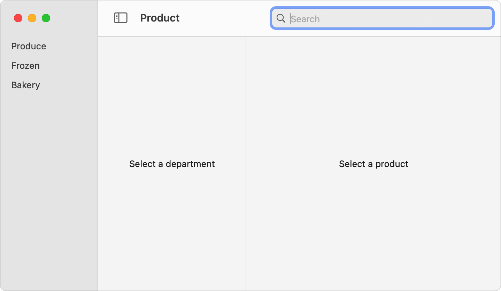
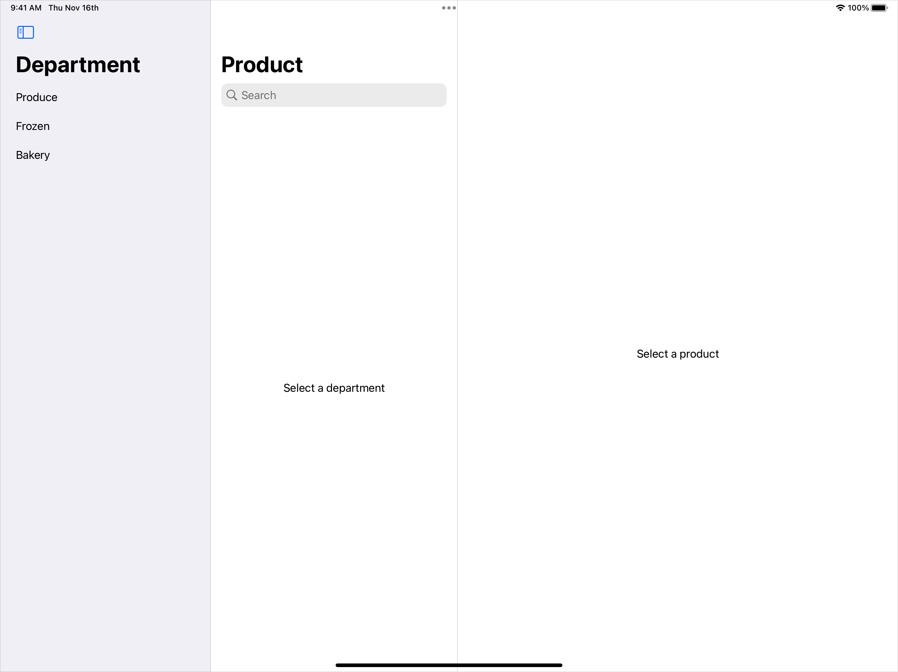
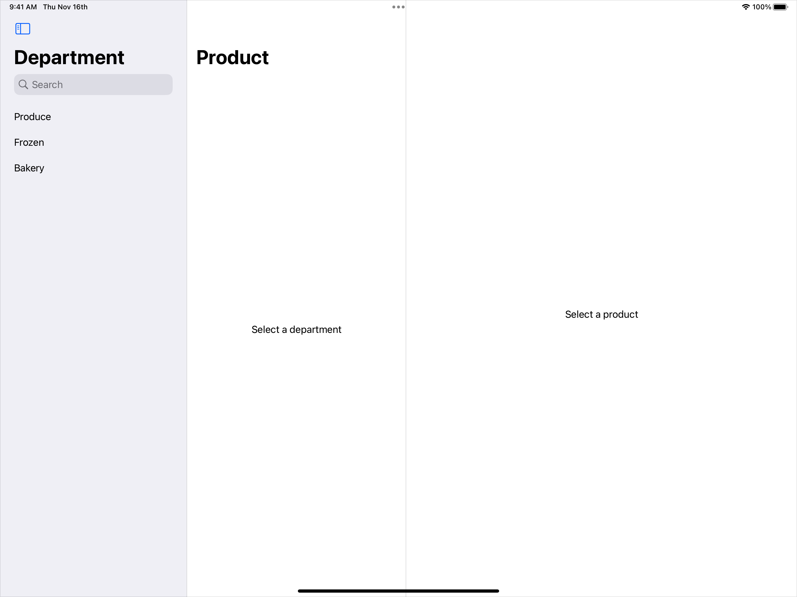
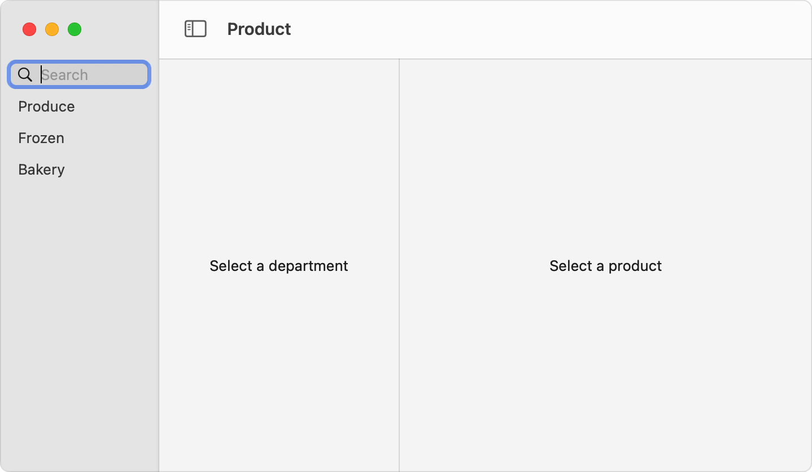
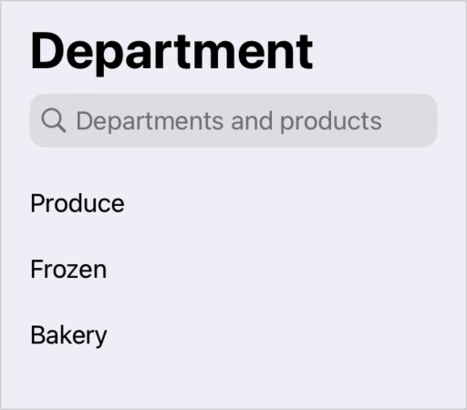

+++
title = "9.1 为应用添加搜索界面"
date = 2026-09-12T12:47:47+08:00
weight = 1
type = "docs"
description = ""
isCJKLanguage = true
draft = false
+++


> 原文链接: [https://developer.apple.com/documentation/swiftui/adding-a-search-interface-to-your-app](https://developer.apple.com/documentation/swiftui/adding-a-search-interface-to-your-app)

# 9.1 为应用添加搜索界面

提供一个界面，让人们可以在应用中搜索内容。

## 概述 {#Overview}

通过把某个 searchable 视图修饰符（例如 [searchable(text:placement:prompt:)](https://developer.apple.com/documentation/swiftui/view/searchable(text:placement:prompt:))）应用到 [NavigationSplitView](https://developer.apple.com/documentation/swiftui/navigationsplitview) 或 [NavigationStack](https://developer.apple.com/documentation/swiftui/navigationstack)，或者应用到它们内部的某个视图，就能为应用添加搜索界面。随后工具栏中会出现一个搜索框。搜索框的确切位置与外观取决于平台、你在代码中放置该修饰符的位置以及它的配置。


创建搜索框的 searchable 修饰符接收一个指向字符串的 [Binding](https://developer.apple.com/documentation/swiftui/binding)，该字符串代表搜索框中的文本。你负责提供这个字符串的存储，以及（可选的）离散搜索令牌数组的存储，并用它们执行搜索。要了解如何管理搜索框的数据，参见[执行搜索操作](../9.2-PerformingASearchOperation/)。

### 自动放置搜索框 {#Place-the-search-field-automatically}

把 [searchable(text:placement:prompt:)](https://developer.apple.com/documentation/swiftui/view/searchable(text:placement:prompt:)) 修饰符添加到导航分栏视图这类导航元素上，就可以自动放置搜索框：

```swift
struct ContentView: View {
    @State private var departmentId: Department.ID?
    @State private var productId: Product.ID?
    @State private var searchText: String = ""

    var body: some View {
        NavigationSplitView {
            DepartmentList(departmentId: $departmentId)
        } content: {
            ProductList(departmentId: departmentId, productId: $productId)
        } detail: {
            ProductDetails(productId: productId)
        }
        .searchable(text: $searchText) // 添加一个搜索框。
    }
}
```

采用这种配置时，在 macOS 上搜索框会出现在工具栏的后缘。在 iOS 和 iPadOS 上，双栏导航视图中搜索框显示在第一栏，三栏导航视图中显示在第二栏。上面这个三栏示例在 iPad 上会把搜索框放在中间栏的顶部。

**macOS**



**iOS**



### 按结构控制放置位置 {#Control-the-placement-structurally}

要在 iOS 和 iPadOS 上把搜索框添加到某一特定栏，请把 searchable 修饰符添加到该栏中的某个视图上。例如，如果要表明搜索覆盖上一个例子中的各个部门，你可以把该修饰符添加到第一栏的 `DepartmentList` 视图上，而不是添加到导航分栏视图上，从而把搜索框放在第一栏：

```swift
NavigationSplitView {
    DepartmentList(departmentId: $departmentId)
        .searchable(text: $searchText)
} content: {
    ProductList(departmentId: departmentId, productId: $productId)
} detail: {
    ProductDetails(productId: productId)
}
```



### 以编程方式控制放置位置 {#Control-the-placement-programmatically}

你也可以使用 `placement` 输入参数，为搜索界面建议一个 [SearchFieldPlacement](https://developer.apple.com/documentation/swiftui/searchfieldplacement) 值。例如，在 macOS 上使用 [sidebar](https://developer.apple.com/documentation/swiftui/searchfieldplacement/sidebar) 放置方式，就能得到与上一个例子相同的效果：

```swift
NavigationSplitView {
    DepartmentList(departmentId: $departmentId)
} content: {
    ProductList(departmentId: departmentId, productId: $productId)
} detail: {
    ProductDetails(productId: productId)
}
.searchable(text: $searchText, placement: .sidebar)
```



如果 SwiftUI 无法满足所请求的放置位置——例如你在并未应用于导航分栏视图的 searchable 修饰符上请求 sidebar 放置——SwiftUI 会退回到它的自动放置规则。

### 为搜索框设置提示文本 {#Set-a-prompt-for-the-search-field}

默认情况下，搜索框中以 Search 作为占位文本，提示人们如何使用这个输入框。你可以为 searchable 修饰符的 `prompt` 输入参数设置字符串、[Text](https://developer.apple.com/documentation/swiftui/text) 视图或 [LocalizedStringKey](https://developer.apple.com/documentation/swiftui/localizedstringkey) 来定制提示文本。例如，你可以借此说明 Department 这一栏的搜索框同时搜索部门以及每个部门中的商品：

```swift
DepartmentList(departmentId: $departmentId)
    .searchable(text: $searchText, prompt: "Departments and products")
```


