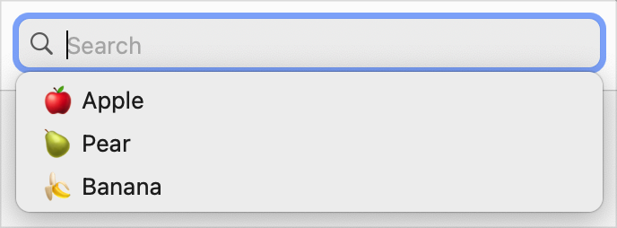
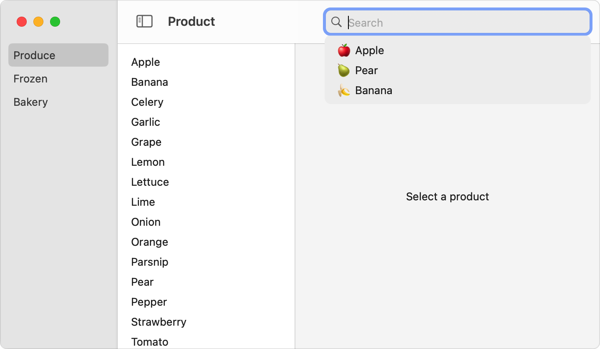

+++
title = "9.3 提供搜索词建议"
date = 2026-09-12T12:47:47+08:00
weight = 3
type = "docs"
description = ""
isCJKLanguage = true
draft = false
+++


> 原文链接: [https://developer.apple.com/documentation/swiftui/suggesting-search-terms](https://developer.apple.com/documentation/swiftui/suggesting-search-terms)

# 9.3 提供搜索词建议

向在应用中搜索内容的人提供建议。

## 概述 {#overview}

你可以通过提供一组搜索建议视图，在搜索过程中建议查询文本。由于建议视图并不限于纯文本，你还必须提供每个建议视图所代表的搜索字符串。如果你的搜索界面包含令牌，你也可以为令牌提供建议。SwiftUI 会把建议显示在搜索框下方的列表中。



对文本和令牌来说，建议列表都由你自己管理，因此你可以完全自由地决定建议什么。例如，你可以：

- 提供一份静态的建议列表。
- 记住先前的搜索，提供最近的或最常用的建议。
- 根据当前搜索文本实时更新建议列表。
- 组合使用上述策略和其他策略，并可能随时间调整。

### 建议搜索文本 {#Suggest-search-text}

通过向 [searchSuggestions(_:)](https://developer.apple.com/documentation/swiftui/view/searchsuggestions(_:)) 视图修饰符提供一组视图，来建议搜索文本。这个修饰符作用于出现在它之前的 [searchable(text:placement:prompt:)](https://developer.apple.com/documentation/swiftui/view/searchable(text:placement:prompt:)) 修饰符。

当有人激活搜索界面时，它会把建议视图作为查询字符串下方的一组选项呈现出来。在搜索建议闭包内，给视图添加 [searchCompletion(_:)](https://developer.apple.com/documentation/swiftui/view/searchcompletion(_:)) 修饰符，就能把字符串与每个建议视图关联起来。例如，你可以在建议搜索的水果商品类型中加入 emoji，并为每种情况提供对应的搜索字符串作为搜索补全：

```swift
ProductList(departmentId: departmentId, productId: $productId)
    .searchable(text: $model.searchText)
    .searchSuggestions {
        Text("🍎 Apple").searchCompletion("apple")
        Text("🍐 Pear").searchCompletion("pear")
        Text("🍌 Banana").searchCompletion("banana")
    }
```

当有人选择某个建议时，SwiftUI 会用搜索补全字符串替换搜索框中的文本。在上面的例子中，选择 “🍐 Pear” 会把文本 “pear” 放入搜索查询。



如果你省略了某个建议视图的搜索补全修饰符，SwiftUI 仍会显示该视图，但它不会响应轻点或点击。不过，你可以用带页眉的 [Section](https://developer.apple.com/documentation/swiftui/section) 容器把视图分组，从而区分不同种类的建议，例如最近的搜索和常用搜索词。

> 重要：在 tvOS 中，searchable 修饰符只支持 [Text](https://developer.apple.com/documentation/swiftui/text) 类型的建议视图，如上面的例子所示。其他平台可以使用任意视图作为建议，包括自定义视图。

某些事件或操作（例如有人移动 macOS 窗口）可能会关闭建议列表。

### 建议令牌 {#Suggest-tokens}

你也可以为搜索框建议令牌。这种情况下，使用接收令牌作为输入的 [searchCompletion(_:)](https://developer.apple.com/documentation/swiftui/view/searchcompletion(_:)) 修饰符版本，把建议视图与令牌关联起来：

```swift
ProductList(departmentId: departmentId, productId: $productId)
    .searchable(text: $model.searchText, tokens: $model.tokens) { token in
        switch token {
        case .apple: Text("Apple")
        case .pear: Text("Pear")
        case .banana: Text("Banana")
        }
    }
    .searchSuggestions {
        Text("Apple").searchCompletion(FruitToken.apple)
        Text("Pear").searchCompletion(FruitToken.pear)
        Text("Banana").searchCompletion(FruitToken.banana)
    }
```

你可以使用任何遵循 [Identifiable](https://developer.apple.com/documentation/swift/identifiable) 协议的类型作为令牌。关于在搜索查询中使用令牌的更多信息，参见[执行搜索操作](../9.2-PerformingASearchOperation/)。

### 简化令牌建议 {#Simplify-token-suggestions}

当你的建议集合与令牌列表完全一致时，为了简化操作，你可以创建一个可建议的候选令牌集合。例如，你可以在模型中添加一个已发布的 `suggestions` 属性，包含所有可能的令牌：

```swift
@Published var suggestions: [FruitToken] = FruitToken.allCases
```

然后把这个数组提供给接收 `suggestedTokens` 输入参数的某个 searchable 修饰符，例如 [searchable(text:tokens:suggestedTokens:placement:prompt:token:)](https://developer.apple.com/documentation/swiftui/view/searchable(text:tokens:suggestedtokens:placement:prompt:token:))。SwiftUI 会用它自动生成建议：

```swift
ProductList(departmentId: departmentId, productId: $productId)
    .searchable(
        text: $model.searchText,
        tokens: $model.tokens,
        suggestedTokens: $model.suggestions
    ) { token in
        switch token {
        case .apple: Text("Apple")
        case .pear: Text("Pear")
        case .banana: Text("Banana")
        }
    }
```

在这个版本的 searchable 修饰符中，SwiftUI 用同一个内容构建器来描述令牌在搜索框和建议容器中的外观。

### 动态更新建议 {#Update-suggestions-dynamically}

你可以随着条件变化更新所提供的建议。例如，你可以指定一个存储在应用模型中的 `suggestedSearches` 数组：

```swift
ProductList(departmentId: departmentId, productId: $productId)
    .searchable(text: $model.searchText)
    .searchSuggestions {
        ForEach(model.suggestedSearches) { suggestion in
            Label(suggestion.title,  image: suggestion.image)
                .searchCompletion(suggestion.text)
        }
    }
```

如果 `suggestedSearches` 一开始是空数组，界面最初不会显示任何建议。随后你可以随着条件变化更新这个数组，例如在其中加入先前的搜索记录。
