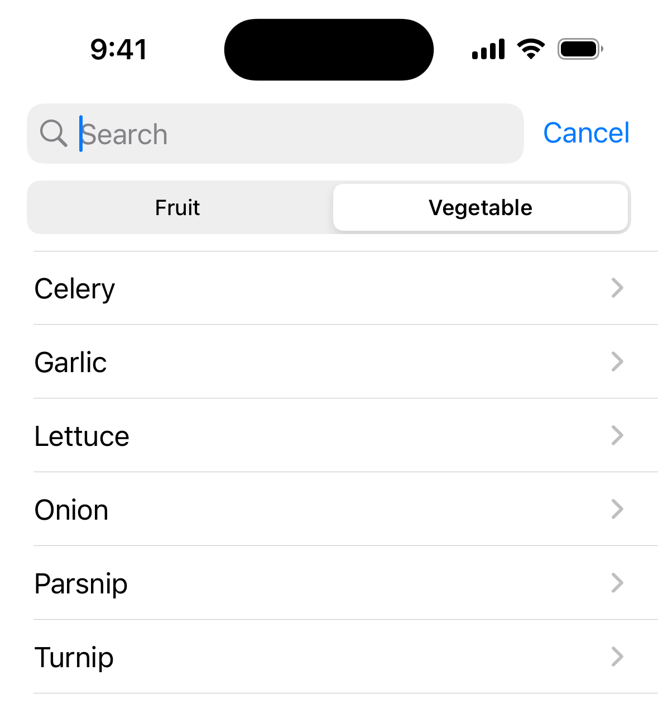

+++
title = "9.4 限定搜索操作的范围"
date = 2026-09-12T12:47:47+08:00
weight = 4
type = "docs"
description = ""
isCJKLanguage = true
draft = false
+++


> 原文链接: [https://developer.apple.com/documentation/swiftui/scoping-a-search-operation](https://developer.apple.com/documentation/swiftui/scoping-a-search-operation)

# 9.4 限定搜索操作的范围

把搜索空间划分为几个宽泛的类别。

## 概述 {#overview}

如果你要搜索的数据可以分为几个类别，就可以定义不同的作用域，帮助人们缩小搜索范围。定义作用域之后，SwiftUI 会呈现一个选择器，让人们从中选择一个。随后你把这个当前选中的作用域，作为搜索操作的输入之一。

### 定义可选的作用域 {#Define-the-possible-scopes}

首先创建一个遵循 [Hashable](https://developer.apple.com/documentation/swift/hashable) 协议的类型来表示可选的作用域。例如，你可以用枚举把商品搜索限定为只搜水果或只搜蔬菜：

```swift
enum ProductScope {
    case fruit
    case vegetable
}
```

然后创建属性来存储当前作用域，既可以作为视图中的状态变量，也可以作为模型中的已发布属性：

```swift
@Published var scope: ProductScope = .fruit
```

### 应用作用域 {#Apply-the-scope}

要使用作用域信息，请把当前作用域绑定到 [searchScopes(_:scopes:)](https://developer.apple.com/documentation/swiftui/view/searchscopes(_:scopes:)) 修饰符。你还要提供一组与不同作用域对应的视图。与 [searchSuggestions(_:)](https://developer.apple.com/documentation/swiftui/view/searchsuggestions(_:)) 修饰符一样，作用域修饰符作用于更靠近被修改视图的那个 searchable 修饰符，因此它需要跟在 searchable 修饰符之后：

```swift
ProductList(departmentId: departmentId, productId: $productId)
    .searchable(text: $model.searchText, tokens: $model.tokens) { token in
        switch token {
        case .apple: Text("Apple")
        case .pear: Text("Pear")
        case .banana: Text("Banana")
        }
    }
    .searchScopes($model.scope) {
        Text("Fruit").tag(ProductScope.fruit)
        Text("Vegetable").tag(ProductScope.vegetable)
    }
```

SwiftUI 会用这个绑定和这些视图，向搜索框添加一个 [Picker](https://developer.apple.com/documentation/swiftui/picker)。默认情况下，在 macOS 上搜索处于激活状态时、或者在 iOS 上有人开始在搜索框中输入文本时，选择器会出现在搜索框下方：

**macOS**


**iOS**



你也可以改用 [searchScopes(_:activation:_:)](https://developer.apple.com/documentation/swiftui/view/searchscopes(_:activation:_:)) 修饰符，并提供 [SearchScopeActivation](https://developer.apple.com/documentation/swiftui/searchscopeactivation) 的某个取值（例如 [onTextEntry](https://developer.apple.com/documentation/swiftui/searchscopeactivation/ontextentry) 或 [onSearchPresentation](https://developer.apple.com/documentation/swiftui/searchscopeactivation/onsearchpresentation)），来改变选择器出现的时机。

为确保选择器正常工作，请让作用域绑定的类型与每个视图标签的类型保持一致。在上面的例子中，`scope` 输入和每个视图的标签都是 `ProductScope` 类型。

### 在搜索中使用作用域 {#Use-the-scope-in-your-search}

如果你提供了作用域，请修改搜索逻辑，让它在查询的文本和令牌之外，也考虑 `scope` 属性的当前值。例如，你可以把作用域作为为 Core Data 获取请求定义的条件之一。关于执行搜索的更多信息，参见[执行搜索操作](../9.2-PerformingASearchOperation/)。
