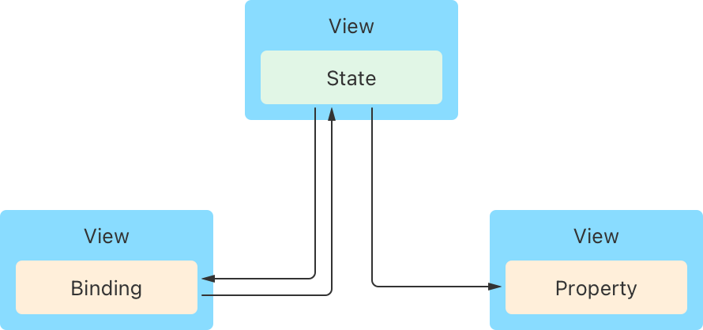

+++
title = "1.1 管理用户界面状态"
date = 2026-09-12T12:47:47+08:00
weight = 1
type = "docs"
description = ""
isCJKLanguage = true
draft = false
+++


> 原文链接: [https://developer.apple.com/documentation/swiftui/managing-user-interface-state](https://developer.apple.com/documentation/swiftui/managing-user-interface-state)

# 1.1 管理用户界面状态

把视图特有的数据封装在应用的视图层级内，让你的视图可复用。

## 概述 {#Overview}

把数据作为状态存储在需要该数据的各个视图的最近公共祖先中，从而建立一个在各视图之间共享的单一*数据源*。你可以通过 Swift 属性以只读方式提供数据，也可以用绑定与状态建立双向连接。SwiftUI 会监视数据的变化，并按需更新任何受影响的视图。



不要用状态属性做持久化存储，因为状态变量的生命周期与视图生命周期一致。相反，请用它们管理只影响用户界面的临时状态，例如按钮的高亮状态、筛选设置或当前选中的列表条目。在对应用的数据模型动手之前做原型时，这类存储也可能对你有用。

### 把可变值作为状态管理 {#Manage-mutable-values-as-state}

如果某个视图需要存储它可以修改的数据，请用 [State()](https://developer.apple.com/documentation/swiftui/state()) 声明变量。例如，你可以在播客播放器视图内创建一个 `isPlaying` 布尔值，用来跟踪播客是否正在播放：

```swift
struct PlayerView: View {
    @State private var isPlaying: Bool = false
    
    var body: some View {
        // ...
    }
}
```

把属性标记为状态会告诉框架去管理底层存储。你的视图通过属性名读写数据。当你改变该值时，SwiftUI 会更新视图中受影响的部分。例如，你可以给 `PlayerView` 添加一个按钮，轻点它时切换所存储的值，并根据该值显示不同的图像：

```swift
Button(action: {
    self.isPlaying.toggle()
}) {
    Image(systemName: isPlaying ? "pause.circle" : "play.circle")
}
```

把状态变量声明为 private 可以限制其作用范围。这能确保变量被封装在声明它的视图层级内，并避免在构造器中设置变量的初始值——那可能会干扰 SwiftUI 对该变量的管理。

### 用 Swift 属性存储不可变值 {#Declare-Swift-properties-to-store-immutable-values}

要为视图提供它不会修改的数据，请声明一个标准的 Swift 属性。例如，你可以扩展播客播放器，让它接收一个包含剧集标题和节目名称字符串的输入结构体：

```swift
struct PlayerView: View {
    let episode: Episode // 排队的剧集。
    @State private var isPlaying: Bool = false
    
    var body: some View {
        VStack {
            // 显示该剧集的信息。
            Text(episode.title)
            Text(episode.showTitle)

            Button(action: {
                self.isPlaying.toggle()
            }) {
                Image(systemName: isPlaying ? "pause.circle" : "play.circle")
            }
        }
    }
}
```

虽然对 `PlayerView` 来说 episode 属性的值是常量，但在它的父视图中不一定是常量。当用户在父视图中选择另一个剧集时，SwiftUI 会检测到状态变化，并用新的输入重新创建 `PlayerView`。

### 用绑定共享对状态的访问 {#Share-access-to-state-with-bindings}

如果某个视图需要与子视图共享对状态的控制权，请在子视图中用 [Binding](https://developer.apple.com/documentation/swiftui/binding) 属性包装器声明属性。绑定表示对已有存储的引用，从而为底层数据保持单一数据源。例如，如果你把播客播放器视图的按钮重构成名为 `PlayButton` 的子视图，就可以给它一个指向 `isPlaying` 属性的绑定：

```swift
struct PlayButton: View {
    @Binding var isPlaying: Bool
    
    var body: some View {
        Button(action: {
            self.isPlaying.toggle()
        }) {
            Image(systemName: isPlaying ? "pause.circle" : "play.circle")
        }
    }
}
```

如上所示，你可以像使用状态那样直接引用属性来读写绑定的被包装值。但与状态属性不同，绑定没有自己的存储。它引用的状态属性存储在别处，并提供指向那份存储的双向连接。

实例化 `PlayButton` 时，请给它一个指向父视图中相应状态变量的绑定，方法是在该变量前加上美元符号（`$`）：

```swift
struct PlayerView: View {
    var episode: Episode
    @State private var isPlaying: Bool = false
    
    var body: some View {
        VStack {
            Text(episode.title)
            Text(episode.showTitle)
            PlayButton(isPlaying: $isPlaying) // 传入一个绑定。
        }
    }
}
```

`$` 前缀会向属性索取它的 `projectedValue`，对状态而言就是指向底层存储的绑定。类似地，你也可以用 `$` 前缀从绑定得到绑定，从而把绑定穿过任意层级的视图层级传递下去。

你还可以取得指向状态变量中某个局部作用域值的绑定。例如，如果你在播放器的父视图中把 `episode` 声明为状态变量，而该剧集结构体还包含一个你想用开关控制的 `isFavorite` 布尔值，那么你可以用 `$episode.isFavorite` 取得指向该剧集收藏状态的绑定：

```swift
struct Podcaster: View {
    @State private var episode = Episode(title: "Some Episode",
                                         showTitle: "Great Show",
                                         isFavorite: false)
    var body: some View {
        VStack {
            Toggle("Favorite", isOn: $episode.isFavorite) // 绑定到该布尔值。
            PlayerView(episode: episode)
        }
    }
}
```

### 为状态变化添加动画 {#Animate-state-transitions}

当视图状态变化时，SwiftUI 会立即更新受影响的视图。如果你想让视觉过渡更平滑，可以把触发变化的状态改动包在对 [withAnimation(_:_:)](https://developer.apple.com/documentation/swiftui/withanimation(_:_:)) 函数的调用中，告诉 SwiftUI 为它们添加动画。例如，你可以为受 `isPlaying` 布尔值控制的改动添加动画：

```swift
withAnimation(.easeInOut(duration: 1)) {
    self.isPlaying.toggle()
}
```

在动画函数的尾随闭包中改变 `isPlaying`，就等于告诉 SwiftUI 为任何依赖该被包装值的内容添加动画，例如按钮图片的缩放效果：

```swift
Image(systemName: isPlaying ? "pause.circle" : "play.circle")
    .scaleEffect(isPlaying ? 1 : 1.5)
```

SwiftUI 会使用你指定的曲线和时长，在你提供的 `1` 和 `1.5` 两个值之间随时间过渡缩放效果的输入；如果你没有提供，则使用合理的默认值。另一方面，图像内容不受动画影响，尽管是同一个布尔值决定了显示哪个系统图像。这是因为 SwiftUI 无法在 `pause.circle` 和 `play.circle` 这两个字符串之间做有意义的增量过渡。

你可以为状态属性添加动画，也可以像上面的例子那样为绑定添加动画。无论哪种方式，只要底层存储的值发生变化，SwiftUI 都会为由此产生的任何视图变化添加动画。例如，如果你给 `PlayerView` 添加一个背景色——其所在视图层级高于动画块的位置——SwiftUI 也会为它添加动画：

```swift
VStack {
    Text(episode.title)
    Text(episode.showTitle)
    PlayButton(isPlaying: $isPlaying)
}
.background(isPlaying ? Color.green : Color.red) // 随动画一起过渡。
```

当你只想为特定视图添加动画，而不是为状态变化触发的所有视图添加动画时，请改用 [animation(_:value:)](https://developer.apple.com/documentation/swiftui/view/animation(_:value:)) 视图修饰符。
