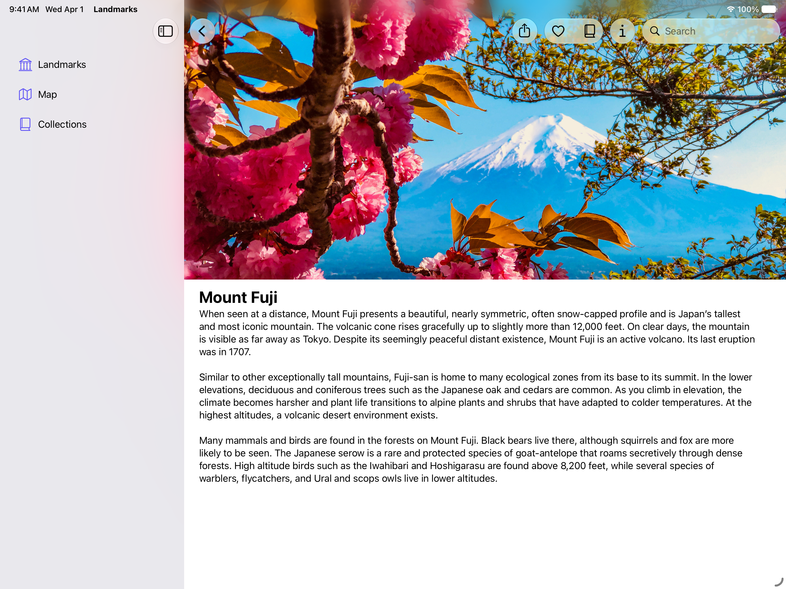

+++
title = "1.1 Landmarks：应用背景扩展效果"
date = 2026-09-12T12:47:47+08:00
weight = 1
type = "docs"
description = ""
isCJKLanguage = true
draft = false
+++


> 原文链接: [https://developer.apple.com/documentation/swiftui/landmarks-applying-a-background-extension-effect](https://developer.apple.com/documentation/swiftui/landmarks-applying-a-background-extension-effect)

# 1.1 Landmarks：应用背景扩展效果

配置图像，让它在侧边栏或检查器面板下模糊延伸。

## 概述 {#Overview}

Landmarks 应用让人们探索世界各地有趣的景点。无论是家附近的国家公园，还是另一个大陆上遥远的地点，这个应用都提供了一种方式来整理和标记自己的探险，并沿途获得自定义的活动徽章。

这个示例演示如何应用背景扩展效果。在 Landmarks 的顶层视图中，示例对 `LandmarksView` 中的精选图像、以及 `LandmarkDetailView` 中的主图应用了背景扩展效果。当侧边栏或检查器面板打开时，背景扩展效果会模糊图像并让它延伸到面板之下。下面两张图展示 `LandmarkDetailView` 中的主图在应用和不应用背景扩展效果时的样子。

**应用之后**


**未应用**



为应用背景扩展效果，示例做了这些事：

1. 把视图对齐到容器视图的前缘和后缘。
1. 对视图应用 [backgroundExtensionEffect()](https://developer.apple.com/documentation/swiftui/view/backgroundextensioneffect()) 修饰符。
1. 只让图像参与背景扩展，避免把该效果应用到叠加层中的标题和按钮上。

### 把视图对齐到前缘和后缘 {#Align-the-view-to-the-leading-and-trailing-edges}

要对视图应用 [backgroundExtensionEffect()](https://developer.apple.com/documentation/swiftui/view/backgroundextensioneffect())，需要让视图的前缘紧贴侧边栏，并让视图的后缘对齐容器视图的后缘。

在 `LandmarksView` 中，`LandmarkFeaturedItemView` 以及容纳它的 [LazyVStack](https://developer.apple.com/documentation/swiftui/lazyvstack) 和 [ScrollView](https://developer.apple.com/documentation/swiftui/scrollview) 都没有内边距。这样 `LandmarkFeaturedItemView` 就能紧贴侧边栏旁的前缘。

```swift
ScrollView(showsIndicators: false) {
    LazyVStack(alignment: .leading, spacing: Constants.standardPadding) {
        LandmarkFeaturedItemView(landmark: modelData.featuredLandmark!)
            .flexibleHeaderContent()
        //...
    }
}
```

在 `LandmarkDetailView` 中，容纳主图的 [ScrollView](https://developer.apple.com/documentation/swiftui/scrollview) 和 [VStack](https://developer.apple.com/documentation/swiftui/vstack) 同样没有任何内边距，这样主图就能紧贴容器视图的前缘。

### 对图像应用背景扩展效果 {#Apply-the-background-extension-effect-to-the-image}

在 `LandmarkDetailView` 中，示例通过添加 [backgroundExtensionEffect()](https://developer.apple.com/documentation/swiftui/view/backgroundextensioneffect()) 修饰符，把背景扩展效果应用到主图上：

```swift
Image(landmark.backgroundImageName)
    //...
    .backgroundExtensionEffect()
```

当侧边栏打开时，系统按下列方式把图像向前缘方向延伸：

- 系统取图像前部一段宽度与侧边栏宽度相匹配的区域。
- 系统把这段图像水平翻转朝向前缘，并对翻转后的这一段应用模糊。
- 系统把修改后的这段图像放到侧边栏之下、紧挨图像前缘的位置。

当检查器打开时，系统按下列方式把图像向后缘方向延伸：

- 系统取图像后部一段宽度与侧边栏宽度相匹配的区域。
- 系统把这段图像水平翻转朝向后缘，并对翻转后的这一段应用模糊。
- 系统把修改后的这段图像放到检查器之下、紧挨图像后缘的位置。

### 只配置图像 {#Configure-only-the-image}

在 `LandmarksView` 中，`LandmarkFeaturedItemView` 含有一张精选景点的图像，还包括景点标题和一个可以点击或轻点以了解该地点更多信息的按钮。

为避免景点标题和按钮在 macOS 上出现在侧边栏之下，示例在添加包含标题和按钮的叠加层之前，先对图像应用 [backgroundExtensionEffect()](https://developer.apple.com/documentation/swiftui/view/backgroundextensioneffect()) 修饰符：

```swift
Image(decorative: landmark.backgroundImageName)
    //...
    .backgroundExtensionEffect()
    .overlay(alignment: .bottom) {
        VStack {
            Text("Featured Landmark", comment: "Big headline in the main image of featured landmarks.")
                //...
            Text(landmark.name)
                //...
            Button("Learn More") {
                modelData.path.append(landmark)
            }
            //...
        }
        .padding([.bottom], Constants.learnMoreBottomPadding)
    }

```
