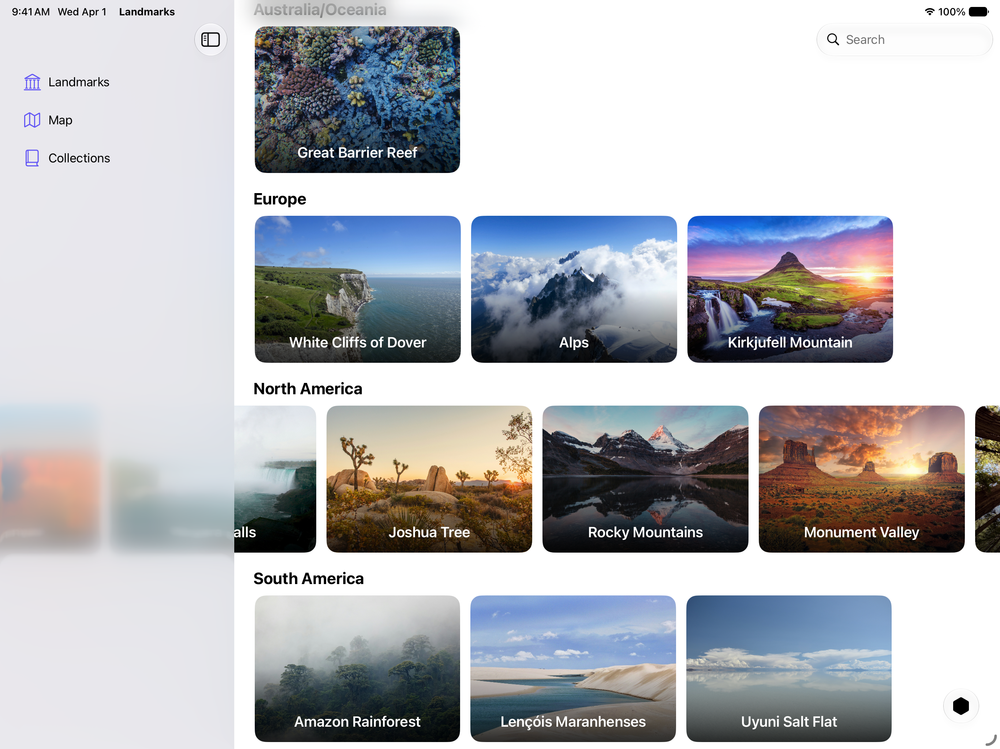

+++
title = "1.2 Landmarks：让横向滚动延伸到侧边栏或检查器之下"
date = 2026-09-12T12:47:47+08:00
weight = 2
type = "docs"
description = ""
isCJKLanguage = true
draft = false
+++


> 原文链接: [https://developer.apple.com/documentation/swiftui/landmarks-extending-horizontal-scrolling-under-a-sidebar-or-inspector](https://developer.apple.com/documentation/swiftui/landmarks-extending-horizontal-scrolling-under-a-sidebar-or-inspector)

# 1.2 Landmarks：让横向滚动延伸到侧边栏或检查器之下

让横向滚动条延伸到侧边栏或检查器之下，改善它的外观。

## 概述 {#Overview}

Landmarks 应用让人们探索世界各地有趣的景点。无论是家附近的国家公园，还是另一个大陆上遥远的地点，这个应用都提供了一种方式来整理和标记自己的探险，并沿途获得自定义的活动徽章。

这个示例演示如何让横向滚动延伸到侧边栏或检查器之下。在 `LandmarksView` 的每个大洲分区中，`LandmarkHorizontalListView` 的一个实例会显示可横向滚动的景点视图列表。当侧边栏打开时，这些景点视图可以滚动到侧边栏或检查器之下。



## 配置滚动视图 {#Configure-the-scroll-view}

为实现这种效果，示例把 `LandmarkHorizontalListView` 配置成紧贴前缘和后缘。当滚动视图紧贴侧边栏或检查器时，系统会自动调整它，使其滚动到侧边栏或检查器之下，再移出屏幕边缘。

示例在 [ScrollView](https://developer.apple.com/documentation/swiftui/scrollview) 的开头添加了一个 [Spacer](https://developer.apple.com/documentation/swiftui/spacer)，为内容留出内边距，使其与标题的内边距对齐：

```swift
ScrollView(.horizontal, showsIndicators: false) {
    LazyHStack(spacing: Constants.standardPadding) {
        Spacer()
            .frame(width: Constants.standardPadding)
        ForEach(landmarkList) { landmark in
            //...
        }
    }
}
```
