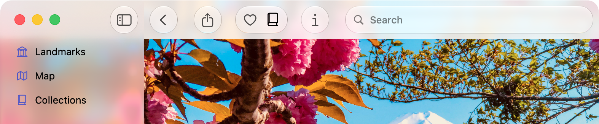

+++
title = "1.3 Landmarks：优化工具栏中系统提供的 Liquid Glass 效果"
date = 2026-09-12T12:47:47+08:00
weight = 3
type = "docs"
description = ""
isCJKLanguage = true
draft = false
+++


> 原文链接: [https://developer.apple.com/documentation/swiftui/landmarks-refining-the-system-provided-glass-effect-in-toolbars](https://developer.apple.com/documentation/swiftui/landmarks-refining-the-system-provided-glass-effect-in-toolbars)

# 1.3 Landmarks：优化工具栏中系统提供的 Liquid Glass 效果

把工具栏组织成相关的分组，改善它们的外观与实用性。

## 概述 {#Overview}

Landmarks 应用让人们探索世界各地有趣的景点。无论是家附近的国家公园，还是另一个大陆上遥远的地点，这个应用都提供了一种方式来整理和标记自己的探险，并沿途获得自定义的活动徽章。

这个示例演示如何优化工具栏中系统提供的玻璃效果。在 `LandmarkDetailView` 中，示例添加了用于下列操作的工具栏项：

- 分享某个景点
- 在「收藏」列表中添加或移除某个景点
- 在「合集」中添加或移除某个景点
- 显示或隐藏检查器

系统会自动把 Liquid Glass 应用到工具栏项上。



## 把工具栏项组织成合理的分组 {#Organize-the-toolbar-items-into-logical-groupings}

为把工具栏项组织成合理的分组，示例添加了 [ToolbarSpacer](https://developer.apple.com/documentation/swiftui/toolbarspacer) 项，并把 [fixed](https://developer.apple.com/documentation/swiftui/spacersizing/fixed) 作为 `sizing` 参数传入，从而把工具栏划分为若干区段：

```swift
.toolbar {
    ToolbarSpacer(.flexible)

    ToolbarItem {
        ShareLink(item: landmark, preview: landmark.sharePreview)
    }

    ToolbarSpacer(.fixed)
    
    ToolbarItemGroup {
        LandmarkFavoriteButton(landmark: landmark)
        LandmarkCollectionsMenu(landmark: landmark)
    }
    
    ToolbarSpacer(.fixed)

    ToolbarItem {
        Button("Info", systemImage: "info") {
            modelData.selectedLandmark = landmark
            modelData.isLandmarkInspectorPresented.toggle()
        }
    }
}
```
