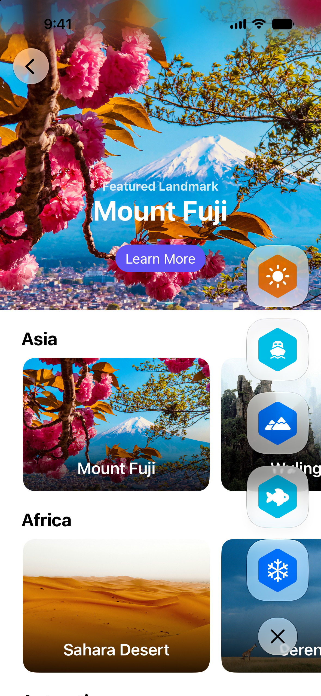

+++
title = "1.4 Landmarks：显示自定义活动徽章"
date = 2026-09-12T12:47:47+08:00
weight = 4
type = "docs"
description = ""
isCJKLanguage = true
draft = false
+++


> 原文链接: [https://developer.apple.com/documentation/swiftui/landmarks-displaying-custom-activity-badges](https://developer.apple.com/documentation/swiftui/landmarks-displaying-custom-activity-badges)

# 1.4 Landmarks：显示自定义活动徽章

通过显示带动画的自定义活动徽章，给人们提供标记自己探险的方式。

## 概述 {#Overview}

Landmarks 应用让人们探索世界各地的景点时记录自己的探险。无论是家附近的国家公园，还是另一个大陆上遥远的地点，这个应用都提供了一种方式来标记自己的探险，并沿途获得自定义的活动徽章。



这个示例把徽章显示在一个纵向视图中，该视图包含一个用于显示或隐藏徽章的切换按钮。Landmarks 应用包含一个自定义修饰符，让其他视图更容易采用徽章视图。通过把徽章配置为使用 Liquid Glass，你在显示或隐藏徽章时就能享受到形变动画的好处。

## 添加修饰符以便在其他视图中显示徽章 {#Add-a-modifier-to-show-badges-in-other-views}

为了让徽章能在 `CollectionsView` 等其他视图中使用，示例使用了一个自定义修饰符 `ShowBadgesViewModifier`，作为 [ViewModifier](https://developer.apple.com/documentation/swiftui/viewmodifier)。示例用 [ZStack](https://developer.apple.com/documentation/swiftui/zstack) 把徽章叠加在另一个视图之上，并把徽章视图定位到下方的后侧角落：

```swift
private struct ShowsBadgesViewModifier: ViewModifier {
    func body(content: Content) -> some View {
        ZStack {
            content
            HStack {
                Spacer()
                VStack {
                    Spacer()
                    BadgesView()
                        .padding()
                }
            }
        }
    }
}
```

示例通过添加 `showBadges` 修饰符来扩展 [View](https://developer.apple.com/documentation/swiftui/view)：

```swift
extension View {
    func showsBadges() -> some View {
        modifier(ShowsBadgesViewModifier())
    }
}
```

## 对切换按钮应用 Liquid Glass {#Apply-Liquid-Glass-to-the-toggle-button}

为创建切换按钮，示例用 `ToggleBadgesLabel` 配置了一个 [Button](https://developer.apple.com/documentation/swiftui/button)，它针对「显示」和「隐藏」两种切换状态使用不同的系统图像。要应用 Liquid Glass，就用 [glass](https://developer.apple.com/documentation/swiftui/primitivebuttonstyle/glass) 修饰符给按钮设置样式：

```swift
Button {
    //...
} label: {
    //...
}
.buttonStyle(.glass)

```

## 给徽章添加 Liquid Glass {#Add-Liquid-Glass-to-the-badges}

为了给每个徽章添加 Liquid Glass，示例使用了 [glassEffect(_:in:)](https://developer.apple.com/documentation/swiftui/view/glasseffect(_:in:)) 修饰符。为做出自定义的玻璃外观，示例指定了带圆角半径的矩形选项：

```swift
BadgeLabel(badge: $0)
    .glassEffect(.regular, in: .rect(cornerRadius: Constants.badgeCornerRadius))
```

## 用形变效果给徽章添加动画 {#Animate-the-badges-using-the-morph-effect}

形变效果是 Liquid Glass 视图的一种动画。在这个动画过程中，切换按钮和每个徽章一开始是一个合并的视图。随后，按钮和徽章在分离并从一处移动到另一处时，像液体一样改变形状。反过来，切换按钮和各个徽章会改变形状并重新合并成一个视图。

为实现 Liquid Glass 形变效果，应用做了这些事：

- 把各个徽章和切换按钮组织进一个 [GlassEffectContainer](https://developer.apple.com/documentation/swiftui/glasseffectcontainer)
- 为每个徽章添加 [glassEffectID(_:in:)](https://developer.apple.com/documentation/swiftui/view/glasseffectid(_:in:))
- 为切换按钮添加 [glassEffectID(_:in:)](https://developer.apple.com/documentation/swiftui/view/glasseffectid(_:in:))
- 把切换 `isExpanded` 属性的命令包在 [withAnimation(_:_:)](https://developer.apple.com/documentation/swiftui/withanimation(_:_:)) 中

```swift
// 把各个徽章和切换按钮组织起来，让它们一起播放动画。
GlassEffectContainer(spacing: Constants.badgeGlassSpacing) {
    VStack(alignment: .center, spacing: Constants.badgeButtonTopSpacing) {
        if isExpanded {
            VStack(spacing: Constants.badgeSpacing) {
                ForEach(modelData.earnedBadges) {
                    BadgeLabel(badge: $0)
                        // 给徽章添加 Liquid Glass。
                        .glassEffect(.regular, in: .rect(cornerRadius: Constants.badgeCornerRadius))
                        // 给徽章添加一个用于动画的标识符。
                        .glassEffectID($0.id, in: namespace)
                }
            }
        }

        Button {
            // 当 `isExpanded` 的值变化时，让这个按钮和徽章播放动画。
            withAnimation {
                isExpanded.toggle()
            }
        } label: {
            ToggleBadgesLabel(isExpanded: isExpanded)
                .frame(width: Constants.badgeShowHideButtonWidth,
                       height: Constants.badgeShowHideButtonHeight)
        }
        // 给按钮添加 Liquid Glass。
        .buttonStyle(.glass)
        #if os(macOS)
        .tint(.clear)
        #endif
        // 给按钮添加一个用于动画的标识符。
        .glassEffectID("togglebutton", in: namespace)
    }
    .frame(width: Constants.badgeFrameWidth)
}
```
