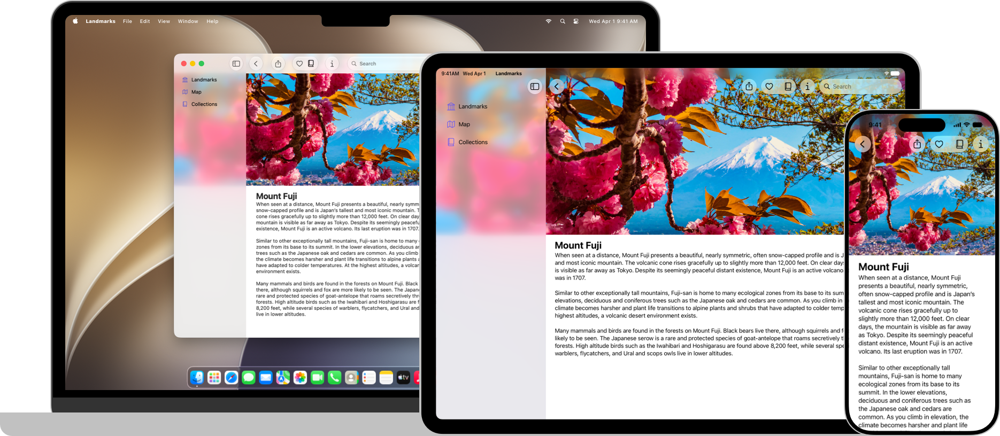

+++
title = "1.1 Landmarks：用 Liquid Glass 构建应用"
date = 2026-09-12T12:47:47+08:00
weight = 1
type = "docs"
description = ""
isCJKLanguage = true
draft = false
+++

> 原文链接: [https://developer.apple.com/documentation/swiftui/landmarks-building-an-app-with-liquid-glass](https://developer.apple.com/documentation/swiftui/landmarks-building-an-app-with-liquid-glass)

# 1.1 Landmarks：用 Liquid Glass 构建应用

用系统提供的和自定义的 Liquid Glass 增强你的应用体验。

## 概述 {#Overview}

Landmarks 是一个 SwiftUI 应用，用来演示如何使用新的、富有表现力的动态设计特性 Liquid Glass。Landmarks 应用让人们探索世界各地有趣的景点。无论是家附近的国家公园，还是另一个大陆上遥远的地点，这个应用都提供了一种方式来整理和标记自己的探险，并沿途获得自定义的活动徽章。Landmarks 可在 iPad、iPhone 和 Mac 上运行。

Landmarks 使用 [NavigationSplitView](https://developer.apple.com/documentation/swiftui/navigationsplitview) 来组织并导航到应用中的内容，并演示了若干优化 Liquid Glass 使用的关键概念：

- 用背景扩展效果让内容延伸到侧边栏和检查器（inspector）之下。
- 让横向滚动视图延伸到侧边栏或检查器之下。
- 充分利用工具栏中系统提供的玻璃效果。
- 把 Liquid Glass 效果应用到自定义界面元素和动画上。
- 用 Icon Composer 构建新的应用图标。

这个示例还演示了在改变窗口大小时可以使用的若干技巧，以及如何添加全局搜索。

## 应用背景扩展效果 {#Apply-a-background-extension-effect}

示例对顶层视图中精选景点的页眉、以及景点详情视图中的主图应用了背景扩展效果。当侧边栏和检查器打开时，这种效果会延伸并模糊其下方的图像，营造出完整的通栏体验。

为实现这种效果，示例创建并配置了一个延伸到容器视图前缘和后缘的 [Image](https://developer.apple.com/documentation/swiftui/image)，并对该图像应用 [backgroundExtensionEffect()](https://developer.apple.com/documentation/swiftui/view/backgroundextensioneffect()) 修饰符。对于精选图像，示例在该修饰符之后添加了一个包含标题和按钮的叠加层，这样只有图像本身会延伸到侧边栏和检查器之下。

> 注意：示例还让图像延伸到顶部安全区域之外，并添加了在你向下滚动超出视图边界时交互式延伸图像的逻辑。这改善了图像在应用中的体验，但并非实现背景扩展效果所必需。

更多信息参见 [Landmarks：应用背景扩展效果](1.1-LandmarksApplyingABackgroundExtensionEffect/)。

## 让横向滚动延伸到侧边栏之下 {#Extend-horizontal-scrolling-under-the-sidebar}

在 `LandmarksView` 的每个大洲分区中，`LandmarkHorizontalListView` 的一个实例会显示可横向滚动的景点视图列表。当侧边栏打开时，这些景点视图可以滚动到侧边栏或检查器之下。

为实现这种效果，应用让滚动视图紧贴容器视图的前缘和后缘。

更多信息参见 [Landmarks：让横向滚动延伸到侧边栏或检查器之下](1.2-LandmarksExtendingHorizontalScrollingUnderASidebarOrInspector/)。

## 优化工具栏中的 Liquid Glass {#Refine-the-Liquid-Glass-in-the-toolbar}

在 `LandmarkDetailView` 中，示例添加了用于下列操作的工具栏项：

- 分享某个景点
- 在「收藏」列表中添加或移除某个景点
- 在「合集」中添加或移除某个景点
- 显示或隐藏检查器

系统会自动把 Liquid Glass 应用到工具栏项上：

示例还把工具栏组织成若干相关的分组，而不是把所有按钮放在一个组里。更多信息参见 [Landmarks：优化工具栏中系统提供的 Liquid Glass 效果](1.3-LandmarksRefiningTheSystemProvidedGlassEffectInToolbars/)。

## 用 Liquid Glass 显示徽章 {#Display-badges-with-Liquid-Glass}

徽章为人们提供了一种视觉指示，显示他们在 Landmarks 应用中记录的活动。当一个人完成某个景点的全部四项活动时，就会获得该景点的徽章。示例使用了带徽章的自定义 Liquid Glass 元素，并展示了如何让动画与 Liquid Glass 协同。

为创建自定义的 Liquid Glass 徽章，Landmarks 使用了一个带有 `Image` 的视图来显示该徽章的系统符号图像。徽章有一个用自定义颜色填充的六边形背景 `Image`。徽章视图使用 [glassEffect(_:in:)](https://developer.apple.com/documentation/swiftui/view/glasseffect(_:in:)) 修饰符把 Liquid Glass 应用到徽章上。

为演示系统在 Liquid Glass 动画中提供的形变效果，示例把各个徽章和切换按钮组织进一个 [GlassEffectContainer](https://developer.apple.com/documentation/swiftui/glasseffectcontainer)，并为每个徽章指定唯一的 [glassEffectID(_:in:)](https://developer.apple.com/documentation/swiftui/view/glasseffectid(_:in:))。

更多信息参见 [Landmarks：显示自定义活动徽章](1.4-LandmarksDisplayingCustomActivityBadges/)。关于用 Liquid Glass 构建自定义视图的信息，参见[把 Liquid Glass 应用到自定义视图](../../views/3-ViewStyles/3.1-ApplyingLiquidGlassToCustomViews/)。

## 用 Icon Composer 创建应用图标 {#Create-the-app-icon-with-Icon-Composer}

Landmarks 包含一个用 Icon Composer 合成的、富有表现力的动态应用图标。你构建的应用图标由四层组成，系统用它们在人移动设备时产生高光效果，让图标看起来仿佛有光从玻璃上反射。用户还可以在「设置」应用中选择应用图标的浅色、深色、透明或色调变体，对图标进行个性化设置。

关于创建新应用图标的更多信息，参见[用 Icon Composer 创建应用图标](https://developer.apple.com/documentation/xcode/creating-your-app-icon-using-icon-composer)。

关于设计指导，参见 Human Interface Guidelines 中的 [App 图标](https://developer.apple.com/design/human-interface-guidelines/app-icons)。

## 应用功能 {#App-features}

- [Landmarks：应用背景扩展效果](1.1-LandmarksApplyingABackgroundExtensionEffect/) —— 配置图像，让它在侧边栏或检查器面板下模糊延伸。
- [Landmarks：让横向滚动延伸到侧边栏或检查器之下](1.2-LandmarksExtendingHorizontalScrollingUnderASidebarOrInspector/) —— 让横向滚动条延伸到侧边栏或检查器之下，改善它的外观。
- [Landmarks：优化工具栏中系统提供的 Liquid Glass 效果](1.3-LandmarksRefiningTheSystemProvidedGlassEffectInToolbars/) —— 把工具栏组织成相关的分组，改善外观与实用性。
- [Landmarks：显示自定义活动徽章](1.4-LandmarksDisplayingCustomActivityBadges/) —— 通过显示带动画的自定义活动徽章，给人们提供标记自己探险的方式。
