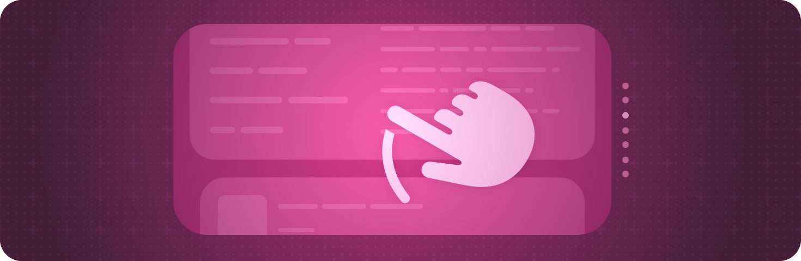

+++
title = "1 手势"
date = 2026-09-12T12:47:47+08:00
weight = 1
type = "docs"
description = ""
isCJKLanguage = true
draft = false
+++

> 原文链接: [https://developer.apple.com/documentation/swiftui/gestures](https://developer.apple.com/documentation/swiftui/gestures)

# 1 手势

定义从点按、点击和轻扫到更精细手势的各种交互。

## 概述 {#Overview}

通过为视图添加手势修饰符来响应手势。你可以监听点按、拖拽、捏合以及其他标准手势。

你还可以用 [simultaneously(with:)](https://developer.apple.com/documentation/swiftui/gesture/simultaneously(with:))、[sequenced(before:)](https://developer.apple.com/documentation/swiftui/gesture/sequenced(before:)) 或 [exclusively(before:)](https://developer.apple.com/documentation/swiftui/gesture/exclusively(before:)) 修饰符把各个手势组合成自定义手势，也可以用 [modifiers(_:)](https://developer.apple.com/documentation/swiftui/gesture/modifiers(_:)) 修饰符把手势与键盘修饰键结合起来。

> 重要：当你需要一个按钮时，请使用 [Button](https://developer.apple.com/documentation/swiftui/button) 实例，而不是点按手势。你可以把任何视图用作按钮的标签，而按钮类型会自动提供用户期望按钮具备的许多标准行为，例如辅助功能标签和提示。

关于设计指导，请参阅 Human Interface Guidelines 中的 [手势](https://developer.apple.com/design/human-interface-guidelines/gestures)。

## 基础 {#Essentials}

- [用手势添加交互性](1.1-AddingInteractivityWithGestures/) — 使用手势修饰符为应用添加交互性。

## 识别点按手势 {#Recognizing-tap-gestures}

- [onTapGesture(count:perform:)](https://developer.apple.com/documentation/swiftui/view/ontapgesture(count:perform:)) — 添加一个动作，当该视图识别到点按手势时执行。
- [onTapGesture(count:coordinateSpace:perform:)](https://developer.apple.com/documentation/swiftui/view/ontapgesture(count:coordinatespace:perform:)) — 添加一个动作，当该视图识别到点按手势时执行，并把交互位置提供给该动作。
- [onTapGesture(count:coordinateSpace:inputKinds:perform:)](https://developer.apple.com/documentation/swiftui/view/ontapgesture(count:coordinatespace:inputkinds:perform:)) — 添加一个动作，当该视图识别到点按手势时执行，并把交互位置提供给该动作。
- [TapGesture](https://developer.apple.com/documentation/swiftui/tapgesture) — 一种识别一次或多次点按的手势。
- [SpatialTapGesture](https://developer.apple.com/documentation/swiftui/spatialtapgesture) — 一种识别一次或多次点按并报告其位置的手势。

## 识别长按手势 {#Recognizing-long-press-gestures}

- [onLongPressGesture(minimumDuration:maximumDistance:perform:onPressingChanged:)](https://developer.apple.com/documentation/swiftui/view/onlongpressgesture(minimumduration:maximumdistance:perform:onpressingchanged:)) — 添加一个动作，当该视图识别到长按手势时执行。
- [onLongPressGesture(minimumDuration:maximumDistance:inputKinds:perform:onPressingChanged:)](https://developer.apple.com/documentation/swiftui/view/onlongpressgesture(minimumduration:maximumdistance:inputkinds:perform:onpressingchanged:)) — 添加一个动作，当该视图识别到长按手势时执行。
- [onLongPressGesture(minimumDuration:perform:onPressingChanged:)](https://developer.apple.com/documentation/swiftui/view/onlongpressgesture(minimumduration:perform:onpressingchanged:)) — 添加一个动作，当该视图识别到长按手势时执行。
- [onLongTouchGesture(minimumDuration:perform:onTouchingChanged:)](https://developer.apple.com/documentation/swiftui/view/onlongtouchgesture(minimumduration:perform:ontouchingchanged:)) — 添加一个动作，当该视图识别到遥控器长触摸手势时执行。长触摸手势是指手指放在遥控器触摸表面上却没有真正按下的情况。
- [LongPressGesture](https://developer.apple.com/documentation/swiftui/longpressgesture) — 一种在用户执行长按时成功的手势。

## 识别空间事件 {#Recognizing-spatial-events}

- [SpatialEventGesture](https://developer.apple.com/documentation/swiftui/spatialeventgesture) — 一种提供关于点击、触摸等持续中的空间事件信息的手势。
- [SpatialEventCollection](https://developer.apple.com/documentation/swiftui/spatialeventcollection) — 以某个特定视图为目标的空间输入事件集合。
- [Chirality](https://developer.apple.com/documentation/swiftui/chirality) — 某个姿态的手性，也就是左右手习惯。

## 识别随时间变化的手势 {#Recognizing-gestures-that-change-over-time}

- [gesture(_:)](https://developer.apple.com/documentation/swiftui/view/gesture(_:)) — 把一个 [NSGestureRecognizerRepresentable](https://developer.apple.com/documentation/swiftui/nsgesturerecognizerrepresentable) 附加到该视图上。
- [gesture(_:isEnabled:)](https://developer.apple.com/documentation/swiftui/view/gesture(_:isenabled:)) — 以比该视图自身定义的手势更低的优先级，把手势附加到该视图上。
- [gesture(_:name:isEnabled:)](https://developer.apple.com/documentation/swiftui/view/gesture(_:name:isenabled:)) — 以比该视图自身定义的手势更低的优先级，把手势附加到该视图上。
- [gesture(_:including:)](https://developer.apple.com/documentation/swiftui/view/gesture(_:including:)) — 以比该视图自身定义的手势更低的优先级，把手势附加到该视图上。
- [DragGesture](https://developer.apple.com/documentation/swiftui/draggesture) — 一种拖拽动作，会随着拖拽事件序列的变化调用动作。
- [WindowDragGesture](https://developer.apple.com/documentation/swiftui/windowdraggesture) — 一种识别并处理窗口拖拽动作的手势。
- [MagnifyGesture](https://developer.apple.com/documentation/swiftui/magnifygesture) — 一种识别放大动作并跟踪放大倍数的手势。
- [RotateGesture](https://developer.apple.com/documentation/swiftui/rotategesture) — 一种识别旋转动作并跟踪旋转角度的手势。
- [RotateGesture3D](https://developer.apple.com/documentation/swiftui/rotategesture3d) — 一种识别三维旋转动作并跟踪旋转角度和轴的手势。
- [GestureMask](https://developer.apple.com/documentation/swiftui/gesturemask) — 一些选项，控制把一个手势添加到视图上会如何影响该视图及其子视图识别到的其他手势。

## 识别 Apple Pencil 手势 {#Recognizing-Apple-Pencil-gestures}

- [onPencilDoubleTap(perform:)](https://developer.apple.com/documentation/swiftui/view/onpencildoubletap(perform:)) — 添加一个动作，在用户双击 Apple Pencil 之后执行。
- [onPencilSqueeze(perform:)](https://developer.apple.com/documentation/swiftui/view/onpencilsqueeze(perform:)) — 添加一个动作，在用户捏压 Apple Pencil 时执行。
- [preferredPencilDoubleTapAction](https://developer.apple.com/documentation/swiftui/environmentvalues/preferredpencildoubletapaction) — 用户在“设置”应用中选择的、希望双击 Apple Pencil 之后执行的动作。
- [preferredPencilSqueezeAction](https://developer.apple.com/documentation/swiftui/environmentvalues/preferredpencilsqueezeaction) — 用户在“设置”应用中选择的、希望捏压 Apple Pencil 时执行的动作。
- [PencilPreferredAction](https://developer.apple.com/documentation/swiftui/pencilpreferredaction) — 用户希望双击 Apple Pencil 之后执行的动作。
- [PencilDoubleTapGestureValue](https://developer.apple.com/documentation/swiftui/pencildoubletapgesturevalue) — 描述 Apple Pencil 双击手势的值。
- [PencilSqueezeGestureValue](https://developer.apple.com/documentation/swiftui/pencilsqueezegesturevalue) — 描述 Apple Pencil 捏压手势的值。
- [PencilSqueezeGesturePhase](https://developer.apple.com/documentation/swiftui/pencilsqueezegesturephase) — 描述 Apple Pencil 捏压手势的阶段和值。
- [PencilHoverPose](https://developer.apple.com/documentation/swiftui/pencilhoverpose) — 描述 Apple Pencil 悬停在视图边界上方区域时的位置和距离的值。

## 组合手势 {#Combining-gestures}

- [组合 SwiftUI 手势](1.2-ComposingSwiftuiGestures/) — 组合手势以创建复杂的交互。
- [simultaneousGesture(_:including:)](https://developer.apple.com/documentation/swiftui/view/simultaneousgesture(_:including:)) — 把手势附加到该视图上，与视图自身定义的手势同时处理。
- [simultaneousGesture(_:isEnabled:)](https://developer.apple.com/documentation/swiftui/view/simultaneousgesture(_:isenabled:)) — 把手势附加到该视图上，与视图自身定义的手势同时处理。
- [simultaneousGesture(_:name:isEnabled:)](https://developer.apple.com/documentation/swiftui/view/simultaneousgesture(_:name:isenabled:)) — 把手势附加到该视图上，与视图自身定义的手势同时处理。
- [SequenceGesture](https://developer.apple.com/documentation/swiftui/sequencegesture) — 由两个手势依次组成的手势。
- [SimultaneousGesture](https://developer.apple.com/documentation/swiftui/simultaneousgesture) — 一种包含两个手势的手势，二者可以同时发生，没有先后之分。
- [ExclusiveGesture](https://developer.apple.com/documentation/swiftui/exclusivegesture) — 一种由两个手势组成、但只有其中一个能成功的手势。

## 自定义手势 {#Customizing-gestures}

- [GestureInputKinds](https://developer.apple.com/documentation/swiftui/gestureinputkinds) — 一个选项集合，用于指定手势应识别哪些输入类型。

## 定义自定义手势 {#Defining-custom-gestures}

- [highPriorityGesture(_:including:)](https://developer.apple.com/documentation/swiftui/view/highprioritygesture(_:including:)) — 以比该视图自身定义的手势更高的优先级，把手势附加到该视图上。
- [highPriorityGesture(_:isEnabled:)](https://developer.apple.com/documentation/swiftui/view/highprioritygesture(_:isenabled:)) — 以比该视图自身定义的手势更高的优先级，把手势附加到该视图上。
- [highPriorityGesture(_:name:isEnabled:)](https://developer.apple.com/documentation/swiftui/view/highprioritygesture(_:name:isenabled:)) — 以比该视图自身定义的手势更高的优先级，把手势附加到该视图上。
- [handGestureShortcut(_:isEnabled:)](https://developer.apple.com/documentation/swiftui/view/handgestureshortcut(_:isenabled:)) — 为被修改的控件指定一个手势快捷方式。
- [defersSystemGestures(on:)](https://developer.apple.com/documentation/swiftui/view/deferssystemgestures(on:)) — 设置你希望自己的手势优先于系统手势的屏幕边缘。
- [Gesture](https://developer.apple.com/documentation/swiftui/gesture) — 一种把事件序列与手势相匹配，并针对其各个状态返回一串值的实例。
- [AnyGesture](https://developer.apple.com/documentation/swiftui/anygesture) — 类型被抹除的手势。
- [HandActivationBehavior](https://developer.apple.com/documentation/swiftui/handactivationbehavior) — 一种专用于手部输入驱动的激活行为。
- [HandGestureShortcut](https://developer.apple.com/documentation/swiftui/handgestureshortcut) — 手势快捷方式描述用户为了激活按钮或开关可以执行的手指与手腕动作。

## 管理手势状态 {#Managing-gesture-state}

- [GestureState](https://developer.apple.com/documentation/swiftui/gesturestate) — 一种属性包装器类型，在用户执行手势期间更新某个属性，并在手势结束时把该属性重置回初始状态。
- [GestureStateGesture](https://developer.apple.com/documentation/swiftui/gesturestategesture) — 一种会更新手势 updating 回调所提供状态的手势。

## 处理激活事件 {#Handling-activation-events}

- [allowsWindowActivationEvents(_:)](https://developer.apple.com/documentation/swiftui/view/allowswindowactivationevents(_:)) — 配置该视图层级中的手势是否可以处理激活所属窗口的事件。

## 已弃用的手势 {#Deprecated-gestures}

- [MagnificationGesture](https://developer.apple.com/documentation/swiftui/magnificationgesture) — 一种识别放大动作并跟踪放大倍数的手势。
- [RotationGesture](https://developer.apple.com/documentation/swiftui/rotationgesture) — 一种识别旋转动作并跟踪旋转角度的手势。
