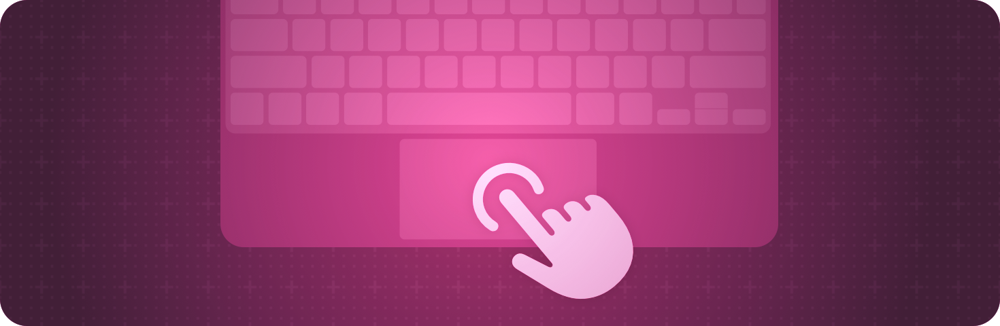

+++
title = "2 输入事件"
date = 2026-09-12T12:47:47+08:00
weight = 2
type = "docs"
description = ""
isCJKLanguage = true
draft = false
+++

> 原文链接: [https://developer.apple.com/documentation/swiftui/input-events](https://developer.apple.com/documentation/swiftui/input-events)

# 2 输入事件

响应来自键盘、Touch Bar 等硬件设备的输入。

## 概述 {#Overview}

SwiftUI 提供了一些视图修饰符，让你的应用可以监听并响应各种用户输入。例如，你可以创建键盘快捷方式、响应表单提交，或者获取来自 Apple Watch 数码表冠的输入。

关于设计指导，请参阅 Human Interface Guidelines 中的 [输入](https://developer.apple.com/design/human-interface-guidelines/inputs)。

## 响应键盘输入 {#Responding-to-keyboard-input}

- [onKeyPress(_:action:)](https://developer.apple.com/documentation/swiftui/view/onkeypress(_:action:)) — 当视图拥有焦点时，如果用户按下硬件键盘上的某个按键，则执行一个动作。
- [onKeyPress(phases:action:)](https://developer.apple.com/documentation/swiftui/view/onkeypress(phases:action:)) — 当视图拥有焦点时，如果用户按下硬件键盘上的任意按键，则执行一个动作。
- [onKeyPress(_:phases:action:)](https://developer.apple.com/documentation/swiftui/view/onkeypress(_:phases:action:)) — 当视图拥有焦点时，如果用户按下硬件键盘上的某个按键，则执行一个动作。
- [onKeyPress(characters:phases:action:)](https://developer.apple.com/documentation/swiftui/view/onkeypress(characters:phases:action:)) — 当视图拥有焦点时，如果用户按下硬件键盘上的一个或多个按键，则执行一个动作。
- [onKeyPress(keys:phases:action:)](https://developer.apple.com/documentation/swiftui/view/onkeypress(keys:phases:action:)) — 当视图拥有焦点时，如果用户按下硬件键盘上的一个或多个按键，则执行一个动作。
- [KeyPress](https://developer.apple.com/documentation/swiftui/keypress)

## 创建键盘快捷方式 {#Creating-keyboard-shortcuts}

- [keyboardShortcut(_:)](https://developer.apple.com/documentation/swiftui/view/keyboardshortcut(_:)) — 为被修改的控件指定一个键盘快捷方式。
- [keyboardShortcut(_:modifiers:)](https://developer.apple.com/documentation/swiftui/view/keyboardshortcut(_:modifiers:)) — 定义一个键盘快捷方式并把它指定给被修改的控件。
- [keyboardShortcut(_:modifiers:localization:)](https://developer.apple.com/documentation/swiftui/view/keyboardshortcut(_:modifiers:localization:)) — 定义一个键盘快捷方式并把它指定给被修改的控件。
- [keyboardShortcut](https://developer.apple.com/documentation/swiftui/environmentvalues/keyboardshortcut) — 该环境中按钮触发时使用的键盘快捷方式。
- [KeyboardShortcut](https://developer.apple.com/documentation/swiftui/keyboardshortcut) — 键盘快捷方式描述用户为了激活按钮或开关可以在键盘上按下的按键组合。
- [KeyEquivalent](https://developer.apple.com/documentation/swiftui/keyequivalent) — 按键等价项由字母、标点或功能键组成，可以与一组可选的修饰键组合来指定键盘快捷方式。
- [EventModifiers](https://developer.apple.com/documentation/swiftui/eventmodifiers) — 一组可以添加到手势上的按键修饰符。

## 响应修饰键 {#Responding-to-modifier-keys}

- [onModifierKeysChanged(mask:initial:_:)](https://developer.apple.com/documentation/swiftui/view/onmodifierkeyschanged(mask:initial:_:)) — 每当用户按下或松开硬件修饰键时执行一个动作。
- [modifierKeyAlternate(_:_:)](https://developer.apple.com/documentation/swiftui/view/modifierkeyalternate(_:_:)) — 构建一个视图，当用户按下给定集合所指示的修饰键时，用它替代被修改的视图。

## 响应悬停事件 {#Responding-to-hover-events}

- [onHover(perform:)](https://developer.apple.com/documentation/swiftui/view/onhover(perform:)) — 添加一个动作，当用户把指针移入或移出视图框架时执行。
- [onContinuousHover(coordinateSpace:perform:)](https://developer.apple.com/documentation/swiftui/view/oncontinuoushover(coordinatespace:perform:)) — 添加一个动作，当指针进入、在视图边界内移动以及离开视图边界时执行。
- [hoverEffect(_:isEnabled:)](https://developer.apple.com/documentation/swiftui/view/hovereffect(_:isenabled:)) — 为该视图应用悬停效果。
- [hoverEffectDisabled(_:)](https://developer.apple.com/documentation/swiftui/view/hovereffectdisabled(_:)) — 添加一个条件，控制该视图是否可以显示悬停效果。
- [defaultHoverEffect(_:)](https://developer.apple.com/documentation/swiftui/view/defaulthovereffect(_:)) — 设置该视图内各视图使用的默认悬停效果。
- [isHoverEffectEnabled](https://developer.apple.com/documentation/swiftui/environmentvalues/ishovereffectenabled) — 一个布尔值，指示与该环境关联的视图是否允许显示悬停效果。
- [HoverPhase](https://developer.apple.com/documentation/swiftui/hoverphase) — 指针当前的悬停状态和值。
- [HoverEffectPhaseOverride](https://developer.apple.com/documentation/swiftui/hovereffectphaseoverride) — 用于覆盖悬停效果当前阶段的选项。
- [OrnamentHoverContentEffect](https://developer.apple.com/documentation/swiftui/ornamenthovercontenteffect) — 悬停时使用自定义效果呈现一个装饰物。
- [OrnamentHoverEffect](https://developer.apple.com/documentation/swiftui/ornamenthovereffect) — 悬停时呈现一个装饰物。

## 修改指针外观 {#Modifying-pointer-appearance}

- [pointerStyle(_:)](https://developer.apple.com/documentation/swiftui/view/pointerstyle(_:)) — 设置指针位于视图上方时要显示的指针样式。
- [PointerStyle](https://developer.apple.com/documentation/swiftui/pointerstyle) — 一种样式，描述指针（也称光标）悬停在视图上方时的外观。
- [pointerVisibility(_:)](https://developer.apple.com/documentation/swiftui/view/pointervisibility(_:)) — 设置指针位于视图上方时的可见性。

## 为悬停事件更改视图外观 {#Changing-view-appearance-for-hover-events}

- [hoverEffect(_:)](https://developer.apple.com/documentation/swiftui/view/hovereffect(_:)) — 为该视图应用悬停效果。
- [HoverEffect](https://developer.apple.com/documentation/swiftui/hovereffect) — 指针悬停在视图上方时应用的效果。
- [hoverEffect(_:in:isEnabled:)](https://developer.apple.com/documentation/swiftui/view/hovereffect(_:in:isenabled:)) — 为该视图应用悬停效果，并可选地把它加入一个 [HoverEffectGroup](https://developer.apple.com/documentation/swiftui/hovereffectgroup)。
- [hoverEffect(in:isEnabled:body:)](https://developer.apple.com/documentation/swiftui/view/hovereffect(in:isenabled:body:)) — 为该视图应用由给定闭包描述的悬停效果。
- [CustomHoverEffect](https://developer.apple.com/documentation/swiftui/customhovereffect) — 一种类型，表示当指针悬停在视图上方，或有人注视该视图时，视图应如何变化。
- [ContentHoverEffect](https://developer.apple.com/documentation/swiftui/contenthovereffect) — 一种 `CustomHoverEffect`，使用闭包在悬停时为视图应用效果。
- [HoverEffectGroup](https://developer.apple.com/documentation/swiftui/hovereffectgroup) — 描述一组一起激活的效果。
- [hoverEffectGroup()](https://developer.apple.com/documentation/swiftui/view/hovereffectgroup()) — 为后代视图上定义的所有效果添加一个隐式 [HoverEffectGroup](https://developer.apple.com/documentation/swiftui/hovereffectgroup)，这样当该视图或任何后代视图被悬停时，添加到子视图上的所有效果都会作为一个组一起激活。
- [hoverEffectGroup(_:)](https://developer.apple.com/documentation/swiftui/view/hovereffectgroup(_:)) — 为后代视图上定义的所有效果添加一个 [HoverEffectGroup](https://developer.apple.com/documentation/swiftui/hovereffectgroup)，并在这个视图或任何后代视图被悬停时激活该组。
- [hoverEffectGroup(id:in:behavior:)](https://developer.apple.com/documentation/swiftui/view/hovereffectgroup(id:in:behavior:)) — 为后代视图上定义的所有效果添加一个 [HoverEffectGroup](https://developer.apple.com/documentation/swiftui/hovereffectgroup)，并在这个视图或任何后代视图被悬停时激活该组。
- [GroupHoverEffect](https://developer.apple.com/documentation/swiftui/grouphovereffect) — 一种 `CustomHoverEffect`，用于激活一组具名效果。
- [HoverEffectContent](https://developer.apple.com/documentation/swiftui/hovereffectcontent) — 一种类型，描述视图在某个特定悬停效果阶段的效果。
- [EmptyHoverEffectContent](https://developer.apple.com/documentation/swiftui/emptyhovereffectcontent) — 用于构建其他效果的空基础效果。
- [handPointerBehavior(_:)](https://developer.apple.com/documentation/swiftui/view/handpointerbehavior(_:)) — 设置用户与视图交互时手形指针的行为。
- [HandPointerBehavior](https://developer.apple.com/documentation/swiftui/handpointerbehavior) — 一种可在用户与视图交互时应用于手形指针的行为。

## 响应提交事件 {#Responding-to-submission-events}

- [onSubmit(of:_:)](https://developer.apple.com/documentation/swiftui/view/onsubmit(of:_:)) — 添加一个动作，当用户向该视图提交值时执行。
- [submitScope(_:)](https://developer.apple.com/documentation/swiftui/view/submitscope(_:)) — 阻止源自该视图的提交触发去调用视图层级中更高层提交修饰符所配置的提交动作。
- [SubmitTriggers](https://developer.apple.com/documentation/swiftui/submittriggers) — 一种类型，定义会触发提交动作的各种触发器。

## 为提交事件添加标签 {#Labeling-a-submission-event}

- [submitLabel(_:)](https://developer.apple.com/documentation/swiftui/view/submitlabel(_:)) — 设置该视图的提交标签。
- [SubmitLabel](https://developer.apple.com/documentation/swiftui/submitlabel) — 一种语义标签，描述视图层级中提交操作的标签。

## 响应命令 {#Responding-to-commands}

- [onMoveCommand(perform:)](https://developer.apple.com/documentation/swiftui/view/onmovecommand(perform:)) — 添加一个动作以响应移动命令，例如用户在 Mac 键盘上按方向键，或在控制 Apple TV 时轻点 Siri Remote 的边缘。
- [onDeleteCommand(perform:)](https://developer.apple.com/documentation/swiftui/view/ondeletecommand(perform:)) — 添加一个动作，以响应系统的“删除”命令，或者在视图拥有焦点时按下 ⌫（退格）或 ⌦（向前删除）键。
- [pageCommand(value:in:step:)](https://developer.apple.com/documentation/swiftui/view/pagecommand(value:in:step:)) — 响应“上一页”或“下一页”命令，让某个值在区间中步进。
- [onExitCommand(perform:)](https://developer.apple.com/documentation/swiftui/view/onexitcommand(perform:)) — 设置一个动作，当视图拥有焦点并收到退出命令时触发。
- [onPlayPauseCommand(perform:)](https://developer.apple.com/documentation/swiftui/view/onplaypausecommand(perform:)) — 添加一个动作，以响应系统的“播放/暂停”命令。
- [onCommand(_:perform:)](https://developer.apple.com/documentation/swiftui/view/oncommand(_:perform:)) — 添加一个动作，以响应给定的选择器。
- [MoveCommandDirection](https://developer.apple.com/documentation/swiftui/movecommanddirection) — 指定方向键移动的方向。

## 控制命中测试 {#Controlling-hit-testing}

- [allowsTightening(_:)](https://developer.apple.com/documentation/swiftui/view/allowstightening(_:)) — 设置该视图中的文本在需要把文本放入一行时是否可以压缩字符之间的间距。
- [contentShape(_:eoFill:)](https://developer.apple.com/documentation/swiftui/view/contentshape(_:eofill:)) — 定义用于命中测试的内容形状。
- [contentShape(_:_:eoFill:)](https://developer.apple.com/documentation/swiftui/view/contentshape(_:_:eofill:)) — 设置该视图的内容形状。
- [ContentShapeKinds](https://developer.apple.com/documentation/swiftui/contentshapekinds) — 视图内容形状的一种类型。

## 与数码表冠交互 {#Interacting-with-the-Digital-Crown}

- [digitalCrownAccessory(_:)](https://developer.apple.com/documentation/swiftui/view/digitalcrownaccessory(_:)) — 指定 Apple Watch 上数码表冠辅助视图的可见性。
- [digitalCrownAccessory(content:)](https://developer.apple.com/documentation/swiftui/view/digitalcrownaccessory(content:)) — 在 Apple Watch 上把辅助视图放在数码表冠旁边。
- [digitalCrownRotation(_:from:through:sensitivity:isContinuous:isHapticFeedbackEnabled:onChange:onIdle:)](https://developer.apple.com/documentation/swiftui/view/digitalcrownrotation(_:from:through:sensitivity:iscontinuous:ishapticfeedbackenabled:onchange:onidle:)) — 通过更新指定的绑定来跟踪数码表冠的旋转。
- [digitalCrownRotation(_:onChange:onIdle:)](https://developer.apple.com/documentation/swiftui/view/digitalcrownrotation(_:onchange:onidle:)) — 通过更新指定的绑定来跟踪数码表冠的旋转。
- [digitalCrownRotation(detent:from:through:by:sensitivity:isContinuous:isHapticFeedbackEnabled:onChange:onIdle:)](https://developer.apple.com/documentation/swiftui/view/digitalcrownrotation(detent:from:through:by:sensitivity:iscontinuous:ishapticfeedbackenabled:onchange:onidle:)) — 通过更新指定的绑定来跟踪数码表冠的旋转。
- [digitalCrownRotation(_:)](https://developer.apple.com/documentation/swiftui/view/digitalcrownrotation(_:)) — 通过更新指定的绑定来跟踪数码表冠的旋转。
- [digitalCrownRotation(_:from:through:by:sensitivity:isContinuous:isHapticFeedbackEnabled:)](https://developer.apple.com/documentation/swiftui/view/digitalcrownrotation(_:from:through:by:sensitivity:iscontinuous:ishapticfeedbackenabled:)) — 通过更新指定的绑定来跟踪数码表冠的旋转。
- [DigitalCrownEvent](https://developer.apple.com/documentation/swiftui/digitalcrownevent) — 用户旋转数码表冠时发出的事件。
- [DigitalCrownRotationalSensitivity](https://developer.apple.com/documentation/swiftui/digitalcrownrotationalsensitivity) — 在两个整数之间移动所需的数码表冠旋转量。

## 管理 Touch Bar 输入 {#Managing-Touch-Bar-input}

- [touchBar(content:)](https://developer.apple.com/documentation/swiftui/view/touchbar(content:)) — 设置 Touch Bar 显示的内容。
- [touchBar(_:)](https://developer.apple.com/documentation/swiftui/view/touchbar(_:)) — 设置适用时要在 Touch Bar 中显示的 Touch Bar 内容。
- [touchBarItemPrincipal(_:)](https://developer.apple.com/documentation/swiftui/view/touchbaritemprincipal(_:)) — 设置对该 Touch Bar 具有特殊意义的主要视图。
- [touchBarCustomizationLabel(_:)](https://developer.apple.com/documentation/swiftui/view/touchbarcustomizationlabel(_:)) — 设置一个用户可见的字符串，用来标识该视图的功能。
- [touchBarItemPresence(_:)](https://developer.apple.com/documentation/swiftui/view/touchbaritempresence(_:)) — 设置用户自定义视图的行为。
- [TouchBar](https://developer.apple.com/documentation/swiftui/touchbar) — 一种可以在 Touch Bar 中显示的视图容器。
- [TouchBarItemPresence](https://developer.apple.com/documentation/swiftui/touchbaritempresence) — 影响 Touch Bar 用户自定义的选项。

## 响应拍摄事件 {#Responding-to-capture-events}

- [onCameraCaptureEvent(isEnabled:action:)](https://developer.apple.com/documentation/swiftui/view/oncameracaptureevent(isenabled:action:)) — 用于注册由系统拍摄事件触发的动作。
- [onCameraCaptureEvent(isEnabled:primaryAction:secondaryAction:)](https://developer.apple.com/documentation/swiftui/view/oncameracaptureevent(isenabled:primaryaction:secondaryaction:)) — 用于注册由系统拍摄事件触发的多个动作。
