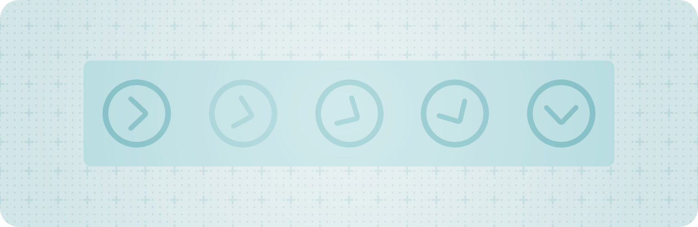

+++
title = "1.1 统一应用的动画效果"
date = 2026-09-12T12:47:47+08:00
weight = 1
type = "docs"
description = ""
isCJKLanguage = true
draft = false
+++


> 原文链接: [https://developer.apple.com/documentation/swiftui/unifying-your-app-s-animations](https://developer.apple.com/documentation/swiftui/unifying-your-app-s-animations)

# 1.1 统一应用的动画效果

在 SwiftUI、UIKit 和 AppKit 之间创建一致的界面动画体验。

## 概述 {#Overview}

许多应用会结合使用 SwiftUI、UIKit 和 AppKit 来构建和制作界面动画。在 iOS 18 及更高版本中，你可以在 UIKit 和 AppKit 中使用 SwiftUI 动画。SwiftUI 不仅提供种类丰富的标准动画，还支持自定义动画类型。



SwiftUI、UIKit 和 AppKit 使用不同的底层实现来做动画。同时使用多个框架做动画的应用可能遇到一些问题，例如动画时序不同步或其他不一致，这些问题可能难以排查，并导致不理想的用户体验。使用 SwiftUI 动画为所有这些框架中的界面添加动画，就能在每个平台上创造出更一致、更无缝的体验。

### 创建 SwiftUI 动画 {#Create-a-SwiftUI-animation}

要在 UIKit 或 AppKit 中创建 SwiftUI 动画，请导入 SwiftUI 并创建一个 SwiftUI [Animation](https://developer.apple.com/documentation/swiftui/animation)。然后，把该动画作为参数传给 `UIView` 上的 [animate(_:changes:completion:)](https://developer.apple.com/documentation/uikit/uiview/animate(_:changes:completion:)) 类方法，或 `NSAnimationContext` 上的 [animate(_:changes:completion:)](https://developer.apple.com/documentation/appkit/nsanimationcontext/animate(_:changes:completion:)) 类方法。下面的示例比较了如何在 SwiftUI、UIKit 和 AppKit 中使用 SwiftUI [Animation](https://developer.apple.com/documentation/swiftui/animation) 类型创建一个基础的弹簧动画。

**SwiftUI**

```swift
struct ContentView: View {
    @State private var position = CGPoint(x: 200, y: 200)
    @State private var frame = CGSize(width: 100, height: 100)
    
    var body: some View {
        Rectangle()
            .fill(Color.blue)
            .frame(width: frame.width, height: frame.height)
            .position(position)
        Button("Animate") {
            // 使用弹簧动画把视图移动到新位置。
            let animation = Animation.spring(duration: 0.8)
            withAnimation(animation) {
                position = CGPoint(x: 100, y: 100)
            }
        }
    }
}
```

**UIKit**

```swift
import SwiftUI

let position = CGPoint(x: 200, y: 200)
let frame = CGSize(width: 100, height: 100)
let buttonPosition = CGPoint(x: 200, y: 400)
let buttonFrame = CGSize(width: 100, height: 100)

override func viewDidLoad() {
    super.viewDidLoad()
            
    let myView = UIView(frame: CGRect(origin: position, size: frame))
    myView.backgroundColor = .systemBlue
    
    let myButton = UIButton(primaryAction: UIAction(title: "Animate") { _ in
        // 使用弹簧动画把视图移动到新位置。
        let animation = SwiftUI.Animation.spring(duration: 0.8)
        UIView.animate(animation) {
            myView.center = CGPoint(x: 100, y: 100)
        }
    })
    myButton.frame = CGRect(origin: buttonPosition, size: buttonFrame)
    
    view.addSubview(myView)
    view.addSubview(myButton)
}
```

**AppKit**

```swift
import SwiftUI

let myView = NSView(frame: CGRect(origin: CGPoint(x: 50, y: 50), 
                                  size: CGSize(width: 50, height: 50)))

override func viewDidLoad() {
    super.viewDidLoad()
    
    let myButton = NSButton(title: "Animate", target: self, action: #selector(animateView))
    view.addSubview(myButton)

    myView.wantsLayer = true
    myView.layer?.backgroundColor = NSColor.blue.cgColor
    view.addSubview(myView)
}

@objc
func animateView() {
    // 使用弹簧动画改变视图的尺寸。
    let animation = SwiftUI.Animation.spring(duration: 0.8)
    NSAnimationContext.animate(animation) {
        myView.frame.size = CGSize(width: 100, height: 100)
    }
}
```

### 在 SwiftUI 动画中使用完成处理器 {#Use-completion-handlers-with-SwiftUI-animations}

你可以为这些动画方法提供一个可选的完成处理器，系统会在动画完成后自动调用它。下面的示例展示了一个完成处理器，它会在动画完成时改变视图的背景颜色以作为提示。

**SwiftUI**

```swift
struct ContentView: View {
    @State private var color = Color.blue
    @State private var position = CGPoint(x: 200, y: 200)
    @State private var frame = CGSize(width: 100, height: 100)
    
    var body: some View {
        Rectangle()
            .fill(color)
            .frame(width: frame.width, height: frame.height)
            .position(position)
        Button("Animate") {
            // 使用平滑的弹簧动画把视图移动到新位置。
            withAnimation(.smooth) {
                position = CGPoint(x: 100, y: 100)
            } completion: {
                // 动画完成时，改变视图的颜色。
                color = Color.red
            }
        }
    }
}
```

**UIKit**

```swift
import SwiftUI

let position = CGPoint(x: 200, y: 200)
let frame = CGSize(width: 100, height: 100)
let buttonPosition = CGPoint(x: 200, y: 400)
let buttonFrame = CGSize(width: 100, height: 100)

override func viewDidLoad() {
    super.viewDidLoad()
        
    let myView = UIView(frame: CGRect(origin: position, size: frame))
    myView.backgroundColor = .systemBlue

    let myButton = UIButton(primaryAction: UIAction(title: "Animate") { _ in
        // 使用平滑的弹簧动画把视图移动到新位置。
        UIView.animate(.smooth) {
            myView.center = CGPoint(x: 100, y: 100)
        } completion: {
            // 动画完成时，改变视图的颜色。
            myView.backgroundColor = .systemRed
        }
    })
    myButton.frame = CGRect(origin: buttonPosition, size: buttonFrame)

    view.addSubview(myView)
    view.addSubview(myButton)
}
```

**AppKit**

```swift
import SwiftUI

let myView = NSView(frame: CGRect(origin: CGPoint(x: 50, y: 50), 
                                  size: CGSize(width: 50, height: 50)))

override func viewDidLoad() {
    super.viewDidLoad()
    
    let myButton = NSButton(title: "Animate", target: self, action: #selector(animateView))
    view.addSubview(myButton)

    myView.wantsLayer = true
    myView.layer?.backgroundColor = NSColor.blue.cgColor
    view.addSubview(myView)
}

@objc
func animateView() {
    // 使用平滑的弹簧动画改变视图的尺寸。
    NSAnimationContext.animate(.smooth) {
        self.myView.frame.size = CGSize(width: 100, height: 100)
    } completion: {
        // 动画完成时，改变视图的颜色。
        self.myView.layer?.backgroundColor = NSColor.red.cgColor
    }
}
```

### 重新定位 SwiftUI 动画 {#Retarget-a-SwiftUI-animation}

与 SwiftUI 视图中的动画类似，你可以平滑地重新定位通过 `UIView` 上的 [animate(_:changes:completion:)](https://developer.apple.com/documentation/uikit/uiview/animate(_:changes:completion:)) 类方法或 `NSAnimationContext` 上的 [animate(_:changes:completion:)](https://developer.apple.com/documentation/appkit/nsanimationcontext/animate(_:changes:completion:)) 类方法执行的动画。重新定位 SwiftUI 动画时，会使用之前动画的速度，让动画以连续的速度继续前进，从而创造出流畅的动画体验。下面的示例展示了对一个进行中的动画进行重新定位。

**SwiftUI**

```swift
struct ContentView: View {
    @State private var position = CGPoint(x: 200, y: 200)
    @State private var frame = CGSize(width: 100, height: 100)
    
    var body: some View {
        Rectangle()
            .fill(Color.blue)
            .frame(width: frame.width, height: frame.height)
            .position(position)
        Button("Animate") {
            Task {
                // 开始一个动画，把视图移动到新位置。
                withAnimation(.spring(duration: 1.0)) {
                    position = .zero
                }
                
                try await Task.sleep(for: .seconds(0.5))

                // 重新定位正在运行的动画，把视图移动到另一个位置。
                withAnimation(.spring) {
                    position = CGPoint(x: 100, y: 400)
                }
            }
        }
    }
}
```

**UIKit**

```swift
import SwiftUI

let position = CGPoint(x: 200, y: 200)
let frame = CGSize(width: 100, height: 100)
let buttonPosition = CGPoint(x: 200, y: 400)
let buttonFrame = CGSize(width: 100, height: 100)

override func viewDidLoad() {
    super.viewDidLoad()
    
    let myView = UIView(frame: CGRect(origin: position, size: frame))
    myView.backgroundColor = .systemBlue
    
    let myButton = UIButton(primaryAction: UIAction(title: "Animate") { _ in
        Task { 
            // 开始一个动画，把视图移动到新位置。
            UIView.animate(.spring(duration: 1.0)) {
                myView.center = CGPoint(x: 200, y: 200)
            }
            
            try await Task.sleep(for: .seconds(0.5))
            
            // 重新定位正在运行的动画，把视图移动到另一个位置。
            UIView.animate(.spring) {
                myView.center = CGPoint(x: 100, y: 400)
            }
        }
    })
    myButton.frame = CGRect(origin: buttonPosition, size: buttonFrame)
    
    view.addSubview(myView)
    view.addSubview(myButton)
}
```

**AppKit**

```swift
import SwiftUI

let myView = NSView(frame: CGRect(origin: CGPoint(x: 50, y: 50), 
                                  size: CGSize(width: 50, height: 50)))

override func viewDidLoad() {
    super.viewDidLoad()
    
    let myButton = NSButton(title: "Animate", target: self, action: #selector(animateView))
    view.addSubview(myButton)

    myView.wantsLayer = true
    myView.layer?.backgroundColor = NSColor.blue.cgColor
    view.addSubview(myView)
}

@objc
func animateView() {
    Task {
        // 开始一个动画，改变视图的尺寸。
        NSAnimationContext.animate(.spring(duration: 1)) {
            myView.frame.size = CGSize(width: 100, height: 100)
        }

        try await Task.sleep(for: .seconds(0.5))

        // 重新定位正在运行的动画，把视图改为另一个尺寸。
        NSAnimationContext.animate(.spring) {
            myView.frame.size = CGSize(width: 75, height: 75)
        }
    }
}
```

### 排查动画问题 {#Troubleshoot-animations}

跨框架同步动画时，不同实现之间的行为差异可能会显现出来。在你的应用中排查动画问题时，请记住以下提示：

- SwiftUI 动画运行在应用进程中的后台线程上。
- SwiftUI 动画没有底层的 [CAAnimation](https://developer.apple.com/documentation/quartzcore/caanimation)，这一点使它们与 [UIView](https://developer.apple.com/documentation/uikit/uiview) 动画不同。
- SwiftUI 动画与 [UIViewPropertyAnimator](https://developer.apple.com/documentation/uikit/uiviewpropertyanimator) 或 `UIView` 关键帧动画不兼容。

关于在应用中提供出色动画体验的更多信息，请参阅 [增强你的界面动画与过渡效果](https://developer.apple.com/wwdc24/10145/)。
