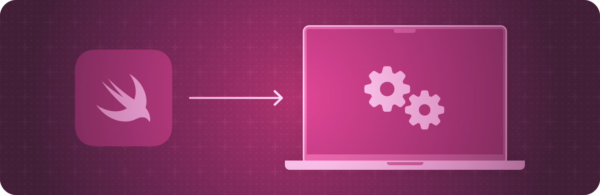

+++
title = "1 AppKit 集成"
date = 2026-09-12T12:47:47+08:00
weight = 1
type = "docs"
description = ""
isCJKLanguage = true
draft = false
+++

> 原文链接: [https://developer.apple.com/documentation/swiftui/appkit-integration](https://developer.apple.com/documentation/swiftui/appkit-integration)

# 1 AppKit 集成

把 AppKit 视图加入你的 SwiftUI 应用，或者在 AppKit 应用中使用 SwiftUI 视图。

## 概述 {#Overview}

使用托管控制器把 SwiftUI 与应用的现有内容集成起来，从而把 SwiftUI 视图加入 AppKit 界面。托管控制器会包装一组 SwiftUI 视图，其形式可以让你随后把它加入到基于故事板的应用中。

你也可以把 AppKit 视图和视图控制器加入你的 SwiftUI 界面。representable 对象会包装指定的视图或视图控制器，并促进被包装对象与你的 SwiftUI 视图之间的通信。

关于设计指导，请参阅 Human Interface Guidelines 中的 [为 macOS 设计](https://developer.apple.com/design/human-interface-guidelines/designing-for-macos)。

## 在 AppKit 中显示 SwiftUI 视图 {#Displaying-SwiftUI-views-in-AppKit}

- [统一应用的动画效果](1.1-UnifyingYourAppSAnimations/) — 在 SwiftUI、UIKit 和 AppKit 之间创建一致的界面动画体验。
- [NSHostingController](https://developer.apple.com/documentation/swiftui/nshostingcontroller) — 一种托管 SwiftUI 视图层级的 AppKit 视图控制器。
- [NSHostingView](https://developer.apple.com/documentation/swiftui/nshostingview) — 一种托管 SwiftUI 视图层级的 AppKit 视图。
- [NSHostingMenu](https://developer.apple.com/documentation/swiftui/nshostingmenu) — 一种 AppKit 菜单，其菜单项由某个 SwiftUI View 定义。
- [NSHostingSizingOptions](https://developer.apple.com/documentation/swiftui/nshostingsizingoptions) — 关于托管视图和控制器如何把其内容尺寸反映到 Auto Layout 约束中的选项。
- [NSHostingSceneRepresentation](https://developer.apple.com/documentation/swiftui/nshostingscenerepresentation) — 一种 AppKit 类型，用于托管并可以呈现 SwiftUI 场景
- [NSHostingSceneBridgingOptions](https://developer.apple.com/documentation/swiftui/nshostingscenebridgingoptions) — 关于托管视图和控制器如何管理与关联窗口相关方面的选项。

## 把 AppKit 视图加入 SwiftUI 视图层级 {#Adding-AppKit-views-to-SwiftUI-view-hierarchies}

- [NSViewRepresentable](https://developer.apple.com/documentation/swiftui/nsviewrepresentable) — 一种包装器，用于把一个 AppKit 视图集成到你的 SwiftUI 视图层级中。
- [NSViewRepresentableContext](https://developer.apple.com/documentation/swiftui/nsviewrepresentablecontext) — 关于系统状态的上下文信息，你在创建和更新 AppKit 视图时使用它。
- [NSViewControllerRepresentable](https://developer.apple.com/documentation/swiftui/nsviewcontrollerrepresentable) — 一种包装器，用于把一个 AppKit 视图控制器集成到你的 SwiftUI 界面中。
- [NSViewControllerRepresentableContext](https://developer.apple.com/documentation/swiftui/nsviewcontrollerrepresentablecontext) — 关于系统状态的上下文信息，你在创建和更新 AppKit 视图控制器时使用它。

## 把 AppKit 手势识别器加入 SwiftUI 视图层级 {#Adding-AppKit-gesture-recognizers-into-SwiftUI-view-hierarchies}

- [NSGestureRecognizerRepresentable](https://developer.apple.com/documentation/swiftui/nsgesturerecognizerrepresentable) — 一种 `NSGestureRecognizer` 的包装器，用于把该手势识别器集成到你的 SwiftUI 层级中。
- [NSGestureRecognizerRepresentableContext](https://developer.apple.com/documentation/swiftui/nsgesturerecognizerrepresentablecontext) — 关于系统状态的上下文信息，你在创建和更新被表示的手势识别器时使用它。
- [NSGestureRecognizerRepresentableCoordinateSpaceConverter](https://developer.apple.com/documentation/swiftui/nsgesturerecognizerrepresentablecoordinatespaceconverter) — 一种结构体，用于在与某个 [NSGestureRecognizerRepresentable](https://developer.apple.com/documentation/swiftui/nsgesturerecognizerrepresentable) 关联的 SwiftUI 视图层级中转换坐标空间的位置。
