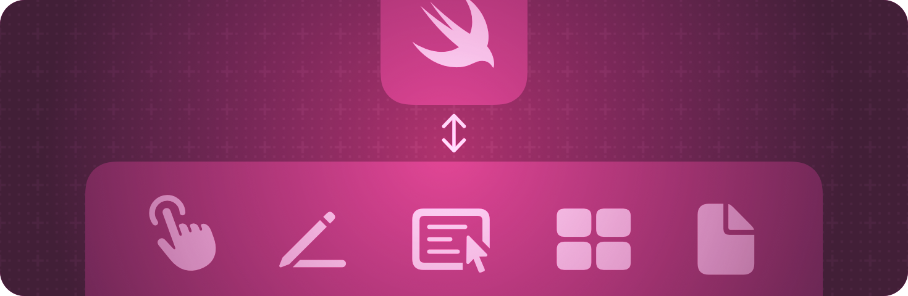

+++
title = "2 UIKit 集成"
date = 2026-09-12T12:47:47+08:00
weight = 2
type = "docs"
description = ""
isCJKLanguage = true
draft = false
+++

> 原文链接: [https://developer.apple.com/documentation/swiftui/uikit-integration](https://developer.apple.com/documentation/swiftui/uikit-integration)

# 2 UIKit 集成

把 UIKit 视图加入你的 SwiftUI 应用，或者在 UIKit 应用中使用 SwiftUI 视图。

## 概述 {#Overview}

使用托管控制器把 SwiftUI 与应用的现有内容集成起来，从而把 SwiftUI 视图加入 UIKit 界面。托管控制器会包装一组 SwiftUI 视图，其形式可以让你随后把它加入到基于故事板的应用中。

你也可以把 UIKit 视图和视图控制器加入你的 SwiftUI 界面。representable 对象会包装指定的视图或视图控制器，并促进被包装对象与你的 SwiftUI 视图之间的通信。

关于设计指导，请参阅 Human Interface Guidelines 中的以下章节：

- [为 iOS 设计](https://developer.apple.com/design/human-interface-guidelines/designing-for-ios)
- [为 iPadOS 设计](https://developer.apple.com/design/human-interface-guidelines/designing-for-ipados)
- [为 tvOS 设计](https://developer.apple.com/design/human-interface-guidelines/designing-for-tvos)

## 在 UIKit 中显示 SwiftUI 视图 {#Displaying-SwiftUI-views-in-UIKit}

- [在 UIKit 中使用 SwiftUI](https://developer.apple.com/documentation/uikit/using-swiftui-with-uikit) — 了解如何把 SwiftUI 视图融入 UIKit 应用。
- [统一应用的动画效果](../1-AppkitIntegration/1.1-UnifyingYourAppSAnimations/) — 在 SwiftUI、UIKit 和 AppKit 之间创建一致的界面动画体验。
- [UIHostingController](https://developer.apple.com/documentation/swiftui/uihostingcontroller) — 一种管理 SwiftUI 视图层级的 UIKit 视图控制器。
- [UIHostingControllerSizingOptions](https://developer.apple.com/documentation/swiftui/uihostingcontrollersizingoptions) — 关于托管控制器如何跟踪其内容尺寸的选项。
- [UIHostingConfiguration](https://developer.apple.com/documentation/swiftui/uihostingconfiguration) — 一种适合托管 SwiftUI 视图层级的内容配置。
- [UIHostingSceneDelegate](https://developer.apple.com/documentation/swiftui/uihostingscenedelegate) — 扩展 `UIKit/UISceneDelegate`，用于桥接 SwiftUI 场景。

## 把 UIKit 视图加入 SwiftUI 视图层级 {#Adding-UIKit-views-to-SwiftUI-view-hierarchies}

- [UIViewRepresentable](https://developer.apple.com/documentation/swiftui/uiviewrepresentable) — 一种 UIKit 视图的包装器，用于把该视图集成到你的 SwiftUI 视图层级中。
- [UIViewRepresentableContext](https://developer.apple.com/documentation/swiftui/uiviewrepresentablecontext) — 关于系统状态的上下文信息，你在创建和更新 UIKit 视图时使用它。
- [UIViewControllerRepresentable](https://developer.apple.com/documentation/swiftui/uiviewcontrollerrepresentable) — 一种表示 UIKit 视图控制器的视图。
- [UIViewControllerRepresentableContext](https://developer.apple.com/documentation/swiftui/uiviewcontrollerrepresentablecontext) — 关于系统状态的上下文信息，你在创建和更新 UIKit 视图控制器时使用它。

## 把 UIKit 手势识别器加入 SwiftUI 视图层级 {#Adding-UIKit-gesture-recognizers-into-SwiftUI-view-hierarchies}

- [UIGestureRecognizerRepresentable](https://developer.apple.com/documentation/swiftui/uigesturerecognizerrepresentable) — 一种 `UIGestureRecognizer` 的包装器，用于把该手势识别器集成到你的 SwiftUI 层级中。
- [UIGestureRecognizerRepresentableContext](https://developer.apple.com/documentation/swiftui/uigesturerecognizerrepresentablecontext) — 关于系统状态的上下文信息，你在创建和更新被表示的手势识别器时使用它。
- [UIGestureRecognizerRepresentableCoordinateSpaceConverter](https://developer.apple.com/documentation/swiftui/uigesturerecognizerrepresentablecoordinatespaceconverter) — 一种代理结构体，用于在与某个 [UIGestureRecognizerRepresentable](https://developer.apple.com/documentation/swiftui/uigesturerecognizerrepresentable) 关联的 SwiftUI 视图层级中来回转换坐标空间的位置。

## 共享配置信息 {#Sharing-configuration-information}

- [UITraitBridgedEnvironmentKey](https://developer.apple.com/documentation/swiftui/uitraitbridgedenvironmentkey)

## 在 UIKit 中托管装饰物 {#Hosting-an-ornament-in-UIKit}

- [UIHostingOrnament](https://developer.apple.com/documentation/swiftui/uihostingornament) — 一个模型，表示适合在 UIKit 中托管的装饰物。
- [UIOrnament](https://developer.apple.com/documentation/swiftui/uiornament) — 表示装饰物的抽象基类。
