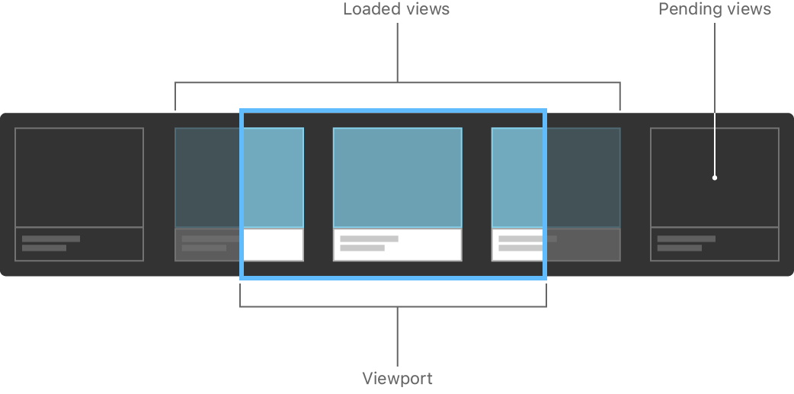
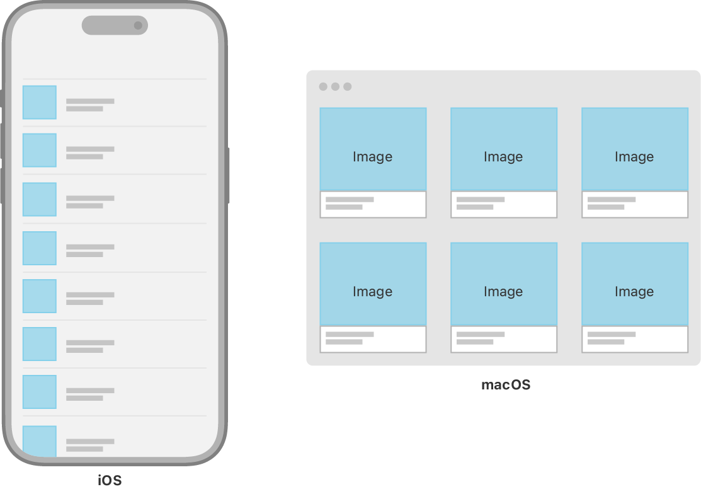

+++
title = "1.1 为你的内容选择合适的容器视图"
date = 2026-09-12T12:47:47+08:00
weight = 1
type = "docs"
description = ""
isCJKLanguage = true
draft = false
+++

> 原文链接: [https://developer.apple.com/documentation/swiftui/picking-container-views-for-your-content](https://developer.apple.com/documentation/swiftui/picking-container-views-for-your-content)

# 1.1 为你的内容选择合适的容器视图

使用栈、网格、列表和表单构建灵活的用户界面。

## 概述 {#Overview}

SwiftUI 提供了一系列用于分组和重复视图的容器视图。有些容器纯粹用于结构和布局，例如栈视图、惰性栈视图和网格视图。另一些容器（例如列表和表单）还会附带系统标准的视觉效果和交互方式。

为应用用户界面的每一部分选择最合适的容器视图，是一项值得掌握的重要技能；它在你从把两个视图并排放置，一直到创建包含数百个元素的复杂布局的整个过程中都会有所帮助。

### 对视图集合分组 {#Group-collections-of-views}

栈视图是 SwiftUI 中最基础的布局容器。使用栈可以把一组视图分组为水平或垂直的一行，或者把它们层叠在一起。

用 [HStack](https://developer.apple.com/documentation/swiftui/hstack) 把视图排成水平一行，用 [VStack](https://developer.apple.com/documentation/swiftui/vstack) 把视图排成垂直一列，用 [ZStack](https://developer.apple.com/documentation/swiftui/zstack) 把视图层叠在一起。然后，组合这些栈视图来构造更复杂的布局。这三种栈，加上它们的对齐与间距属性、视图修饰符以及 [Spacer](https://developer.apple.com/documentation/swiftui/spacer) 视图，共同带来了极大的布局灵活性。

你经常会把栈视图当作构建块放进其他容器视图里。例如，[List](https://developer.apple.com/documentation/swiftui/list) 通常包含栈视图，你用它们来排列每一行内部的视图。

关于用栈视图排列视图的更多信息，请参阅 [用栈视图构建布局](../1.2-BuildingLayoutsWithStackViews/)。

### 重复视图或视图组 {#Repeat-views-or-groups-of-views}

你还可以用 [HStack](https://developer.apple.com/documentation/swiftui/hstack)、[VStack](https://developer.apple.com/documentation/swiftui/vstack)、[LazyHStack](https://developer.apple.com/documentation/swiftui/lazyhstack) 和 [LazyVStack](https://developer.apple.com/documentation/swiftui/lazyvstack) 来重复视图或视图组。把栈视图放进 [ScrollView](https://developer.apple.com/documentation/swiftui/scrollview)，你的内容就可以扩展到容器边界之外。用户可以同时水平滚动、垂直滚动，或沿两个方向滚动。

栈视图和惰性栈功能相似，看起来可以互换使用，但它们在不同场景下各有所长。栈视图会一次性加载其子视图，这使得布局既快速又可靠，因为系统在加载每个子视图时就知道它的尺寸和形状。惰性栈则以一定程度的布局正确性换取性能，因为系统只在子视图即将可见时才计算它们的几何信息。

在选择使用哪种栈视图时，始终先用标准栈视图；只有在剖析代码后发现改用惰性栈能带来值得的性能提升时，才换成惰性栈。关于惰性栈视图以及如何测量应用的视图加载性能，请参阅 [创建高性能的可滚动栈](../1.4-CreatingPerformantScrollableStacks/)。

### 在二维布局中定位视图 {#Position-views-in-a-two-dimensional-layout}

要同时按水平和垂直方向排列视图，请使用 [LazyVGrid](https://developer.apple.com/documentation/swiftui/lazyvgrid) 或 [LazyHGrid](https://developer.apple.com/documentation/swiftui/lazyhgrid)。对于天然适合用方形容器展示的内容（例如相册），网格是很好的容器选择。要把用户界面布局放大以便在更大设备上显示时，网格同样是很好的选择。例如，一份联系人目录在 iPhone 上也许适合用列表或垂直栈，但当放大到 iPad 或 Mac 这类更大设备上时，可能用网格布局更自然。

和栈视图一样，SwiftUI 的网格视图本身并不包含滚动视口；如果内容可能超出可用空间，请把它们放进 [ScrollView](https://developer.apple.com/documentation/swiftui/scrollview)。

### 显示数据集合并与之交互 {#Display-and-interact-with-collections-of-data}

SwiftUI 中的 [List](https://developer.apple.com/documentation/swiftui/list) 视图在概念上类似于 [LazyVStack](https://developer.apple.com/documentation/swiftui/lazyvstack) 与 [ScrollView](https://developer.apple.com/documentation/swiftui/scrollview) 的组合，但默认情况下会为其包含的项目周围和之间加入符合平台习惯的视觉样式。例如，在 iOS 上运行时，[List](https://developer.apple.com/documentation/swiftui/list) 的默认配置会在各行之间添加分隔线，并为带导航的项目绘制展开指示符，前提是该列表包含在 [NavigationView](https://developer.apple.com/documentation/swiftui/navigationview) 中。

[List](https://developer.apple.com/documentation/swiftui/list) 视图还支持符合平台习惯的常见任务交互，例如插入、重排和移除项目。举例来说，把 [onDelete(perform:)](https://developer.apple.com/documentation/swiftui/dynamicviewcontent/ondelete(perform:)) 修饰符添加到 [List](https://developer.apple.com/documentation/swiftui/list) 内的 [ForEach](https://developer.apple.com/documentation/swiftui/foreach) 上，就会启用系统标准的滑动删除交互。

与 [LazyHStack](https://developer.apple.com/documentation/swiftui/lazyhstack) 和 [LazyVStack](https://developer.apple.com/documentation/swiftui/lazyvstack) 一样，SwiftUI [List](https://developer.apple.com/documentation/swiftui/list) 中的各行也是惰性加载的，并且没有对应的非惰性版本。列表会在需要时自动滚动，因此你不需要把它们包进 [ScrollView](https://developer.apple.com/documentation/swiftui/scrollview)。

### 为数据录入对视图与控件分组 {#Group-views-and-controls-for-data-entry}

使用 [Form](https://developer.apple.com/documentation/swiftui/form) 构建使用系统标准控件的数据录入界面、设置界面或偏好设置界面。

和所有 SwiftUI 视图一样，表单会以符合平台习惯的方式显示其内容。请注意，[Form](https://developer.apple.com/documentation/swiftui/form) 内部控件的布局在同一平台上也可能差异很大。例如，iOS 上 [Form](https://developer.apple.com/documentation/swiftui/form) 中的 [Picker](https://developer.apple.com/documentation/swiftui/picker) 控件会加入导航，在单独一屏显示选择器的选项；而在 macOS 上，同样的 [Picker](https://developer.apple.com/documentation/swiftui/picker) 会显示为弹出式按钮或一组单选按钮。
