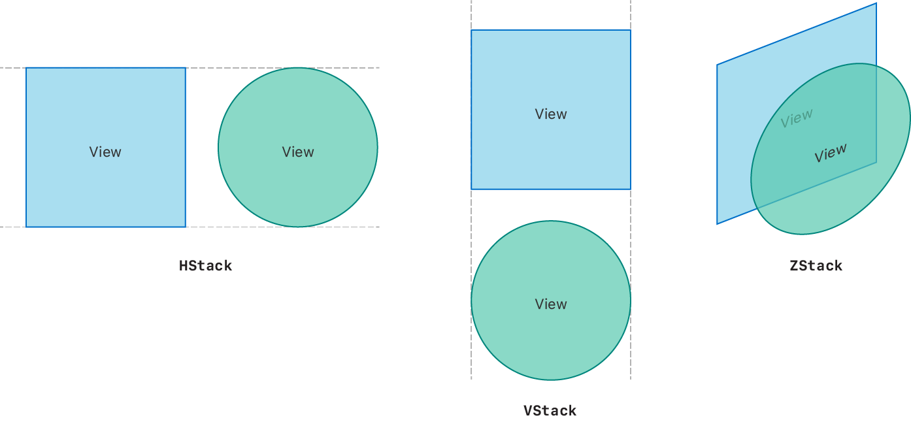
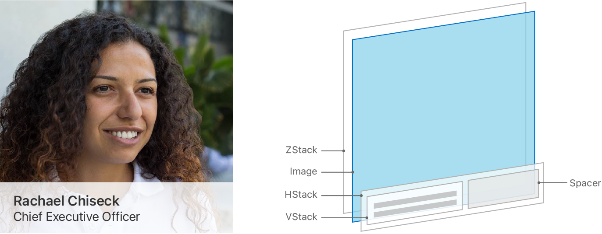
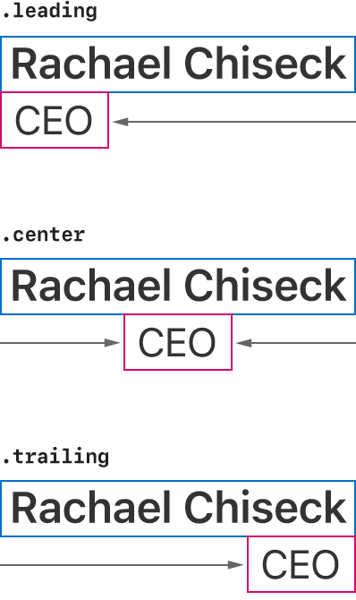
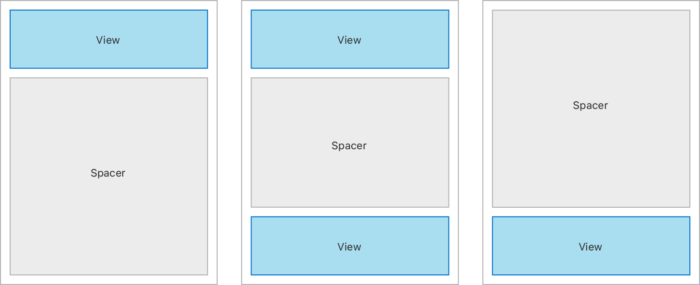

+++
title = "1.2 用栈视图构建布局"
date = 2026-09-12T12:47:47+08:00
weight = 2
type = "docs"
description = ""
isCJKLanguage = true
draft = false
+++


> 原文链接: [https://developer.apple.com/documentation/swiftui/building-layouts-with-stack-views](https://developer.apple.com/documentation/swiftui/building-layouts-with-stack-views)

# 1.2 用栈视图构建布局

用基础容器视图组合出复杂的布局。

## 概述 {#Overview}

单独来看，[HStack](https://developer.apple.com/documentation/swiftui/hstack)、[VStack](https://developer.apple.com/documentation/swiftui/vstack) 和 [ZStack](https://developer.apple.com/documentation/swiftui/zstack) 都是很简单的视图。[HStack](https://developer.apple.com/documentation/swiftui/hstack) 把视图排成水平一行，[VStack](https://developer.apple.com/documentation/swiftui/vstack) 把它们排成垂直一列，而 [ZStack](https://developer.apple.com/documentation/swiftui/zstack) 把它们层叠在一起。



用默认参数初始化时，栈视图会居中对齐其内容，并在每个包含的视图之间插入少量间距。不过，当你把栈与视图修饰符、[Spacer](https://developer.apple.com/documentation/swiftui/spacer) 以及 [Divider](https://developer.apple.com/documentation/swiftui/divider) 视图结合起来并加以定制时，就能创建出非常灵活且复杂的布局。

### 规划布局层级 {#Plan-your-layout-hierarchy}

当你开始把设计转化为代码时，可以先想一想如何用各种类型的栈视图来创建这个布局。把复杂的设计拆解成更小、更简单、可以用栈视图搭建的部分。

例如，你可能会用三个栈视图来构建下面这个资料视图：



一个 [ZStack](https://developer.apple.com/documentation/swiftui/zstack) 包含一个 [Image](https://developer.apple.com/documentation/swiftui/image) 视图，它显示一张个人头像，并在上方叠加一个半透明的 [HStack](https://developer.apple.com/documentation/swiftui/hstack)。这个 [HStack](https://developer.apple.com/documentation/swiftui/hstack) 包含一个内部放置了一对 [Text](https://developer.apple.com/documentation/swiftui/text) 视图的 [VStack](https://developer.apple.com/documentation/swiftui/vstack)，还有一个 [Spacer](https://developer.apple.com/documentation/swiftui/spacer) 视图把该 [VStack](https://developer.apple.com/documentation/swiftui/vstack) 推到前缘一侧。

要创建这个栈视图，可以这样写：

```swift
struct ProfileView: View {
    var body: some View {
        ZStack(alignment: .bottom) {
            Image("ProfilePicture")
                .resizable()
                .aspectRatio(contentMode: .fit)
            HStack {
                VStack(alignment: .leading) {
                    Text("Rachael Chiseck")
                        .font(.headline)
                    Text("Chief Executive Officer")
                        .font(.subheadline)
                }
                Spacer()
            }
            .padding()
            .foregroundColor(.primary)
            .background(Color.primary
                            .colorInvert()
                            .opacity(0.75))
        }
    }
}
```

### 用对齐方式和 Spacer 视图定位视图 {#Position-views-with-alignment-and-spacer-views}

通过组合使用 `alignment` 属性、[Spacer](https://developer.apple.com/documentation/swiftui/spacer) 和 [Divider](https://developer.apple.com/documentation/swiftui/divider) 视图，可以对齐栈视图中包含的任何视图。

在前面的示例布局中，包含两个 [Text](https://developer.apple.com/documentation/swiftui/text) 视图的 [VStack](https://developer.apple.com/documentation/swiftui/vstack) 使用了 [leading](https://developer.apple.com/documentation/swiftui/horizontalalignment/leading) 对齐方式：



`alignment` 属性并不会把 [VStack](https://developer.apple.com/documentation/swiftui/vstack) 放到其容器中的某个位置，而是用来定位该 [VStack](https://developer.apple.com/documentation/swiftui/vstack) 内部的视图。

[VStack](https://developer.apple.com/documentation/swiftui/vstack) 的 `alignment` 属性只通过 [HorizontalAlignment](https://developer.apple.com/documentation/swiftui/horizontalalignment) 作用于所含控件的水平对齐方式。同样，[HStack](https://developer.apple.com/documentation/swiftui/hstack) 的 `alignment` 属性只通过 [VerticalAlignment](https://developer.apple.com/documentation/swiftui/verticalalignment) 控制垂直对齐。最后，你可以用 [Alignment](https://developer.apple.com/documentation/swiftui/alignment) 沿两个轴对齐 [ZStack](https://developer.apple.com/documentation/swiftui/zstack) 内部的视图。

使用 [Spacer](https://developer.apple.com/documentation/swiftui/spacer) 视图沿 [HStack](https://developer.apple.com/documentation/swiftui/hstack) 或 [VStack](https://developer.apple.com/documentation/swiftui/vstack) 的主轴对齐视图。Spacer 会扩展以占满任何可用空间，把内容与其他视图或栈的边缘分开。



[Divider](https://developer.apple.com/documentation/swiftui/divider) 视图也会在栈的子视图之间加入空间，但只会插入刚好够沿栈的次轴画出一条线的空间。它们不会扩展以占满可用空间。

### 创建自适应布局而非显式布局 {#Create-adaptive-layouts-instead-of-explicit-layouts}

只要有可能，就应该定义结构和层级，而不是显式地定位视图框架。不要为视图指定固定的高度和宽度，而应让它们扩展以填满可用空间。你构建的自适应布局更容易适应不同的设备尺寸和平台。

通过显式操控 [Text](https://developer.apple.com/documentation/swiftui/text) 视图的框架，也可以用两个栈视图（而不是三个）实现本文的示例布局。虽然输出看起来可能一样，但实现它的代码更脆弱，在不同尺寸类别的设备上可能无法很好地适配。

有时你可能需要用 [frame(width:height:alignment:)](https://developer.apple.com/documentation/swiftui/view/frame(width:height:alignment:)) 或 [position(x:y:)](https://developer.apple.com/documentation/swiftui/view/position(x:y:)) 这类视图修饰符对使用显式调整的布局做微调，但只应在无法以自适应且灵活的方式实现目标布局时才这样考虑。关于微调视图布局的更多信息，请参阅 [微调视图位置](../../2-LayoutAdjustments/2.3-MakingFineAdjustmentsToAViewSPosition/)。

### 用其他方式增加深度 {#Add-depth-in-alternative-ways}

在某些情况下，用 [overlay(_:alignment:)](https://developer.apple.com/documentation/swiftui/view/overlay(_:alignment:)) 和 [background(_:alignment:)](https://developer.apple.com/documentation/swiftui/view/background(_:alignment:)) 视图修饰符代替 [ZStack](https://developer.apple.com/documentation/swiftui/zstack) 来为布局增加深度可能更合理。background 视图修饰符会把你正在修改的视图后面放上另一个视图，overlay 则把一个视图放在它上面。

到底选择基于栈的方式还是视图修饰符的方式，取决于你希望如何决定最终布局的尺寸。如果你的布局中有一个主导视图决定了布局尺寸，就在该视图上使用 [overlay(_:alignment:)](https://developer.apple.com/documentation/swiftui/view/overlay(_:alignment:)) 或 [background(_:alignment:)](https://developer.apple.com/documentation/swiftui/view/background(_:alignment:)) 视图修饰符。如果你希望最终视图尺寸来自所有包含视图的汇总结果，就使用 [ZStack](https://developer.apple.com/documentation/swiftui/zstack)。

例如，下面这段代码把一个 `ProfileDetail` 视图叠加在 [Image](https://developer.apple.com/documentation/swiftui/image) 视图上方：

```swift
struct ProfileViewWithOverlay: View {
    var body: some View {
        VStack {
            Image("ProfilePicture")
                .resizable()
                .aspectRatio(contentMode: .fit)
                .overlay(ProfileDetail(), alignment: .bottom)
        }
    }
}

struct ProfileDetail: View {
    var body: some View {
        HStack {
            VStack(alignment: .leading) {
                Text("Rachael Chiseck")
                    .font(.headline)
                Text("Chief Executive Officer")
                    .font(.subheadline)
            }
            Spacer()
        }
        .padding()
        .foregroundColor(.primary)
        .background(Color.primary
                        .colorInvert()
                        .opacity(0.75))
    }
}
```
