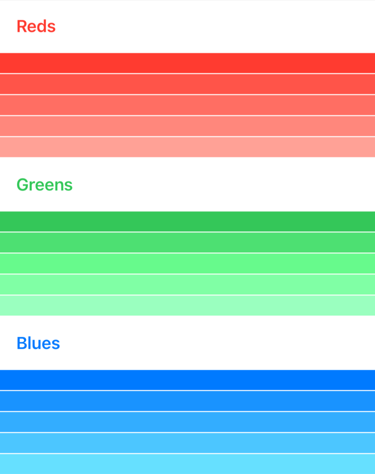
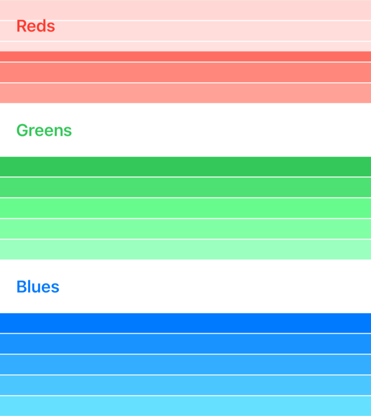

+++
title = "1.3 用惰性栈视图对数据分组"
date = 2026-09-12T12:47:47+08:00
weight = 3
type = "docs"
description = ""
isCJKLanguage = true
draft = false
+++


> 原文链接: [https://developer.apple.com/documentation/swiftui/grouping-data-with-lazy-stack-views](https://developer.apple.com/documentation/swiftui/grouping-data-with-lazy-stack-views)

# 1.3 用惰性栈视图对数据分组

在惰性栈视图中把内容拆分为多个逻辑区段。

## 概述 {#Overview}

[LazyHStack](https://developer.apple.com/documentation/swiftui/lazyhstack) 和 [LazyVStack](https://developer.apple.com/documentation/swiftui/lazyvstack) 视图都能显示按逻辑区段组织的视图组，分别把其子视图排成向水平方向和垂直方向延伸的行。这些栈之所以“惰性”，是因为栈视图在需要把项目渲染到屏幕上之前不会创建它们。与栈视图一样，惰性栈本身也不包含对滚动的支持，你应该把惰性栈视图包在 [ScrollView](https://developer.apple.com/documentation/swiftui/scrollview) 容器中。

要在惰性栈视图内对内容或数据分组，请使用 [Section](https://developer.apple.com/documentation/swiftui/section) 实例作为分组视图集合的容器。[Section](https://developer.apple.com/documentation/swiftui/section) 视图本身没有任何视觉呈现，但可以包含页眉和页脚视图——它们既可以随栈的内容一起滚动，也可以被固定到 [ScrollView](https://developer.apple.com/documentation/swiftui/scrollview) 的顶部或底部。

> 注意：使用 [Section](https://developer.apple.com/documentation/swiftui/section) 视图可以在栈视图或惰性栈、惰性网格、[List](https://developer.apple.com/documentation/swiftui/list)、[CommandMenu](https://developer.apple.com/documentation/swiftui/commandmenu)、[Form](https://developer.apple.com/documentation/swiftui/form) 以及其他几种容器类型中获得符合平台习惯的分组效果。

本文的代码示例构建了一个用于可视化原色深浅变化的用户界面。栈中的每个区段代表一种原色，包含五个子视图，每个子视图显示该颜色的一种不同深浅变化。



### 准备数据 {#Prepare-your-data}

与栈中包含的视图一样，每个 [Section](https://developer.apple.com/documentation/swiftui/section) 在被 [ForEach](https://developer.apple.com/documentation/swiftui/foreach) 遍历时都必须具有唯一标识。在本例中，`ColorData` 实例代表各个区段，`ShadeData` 实例代表区段内每种颜色的深浅变化。`ColorData` 和 `ShadeData` 都遵循 [Identifiable](https://developer.apple.com/documentation/swift/identifiable) 协议。

```swift
struct ColorData: Identifiable {
    let id = UUID()
    let name: String
    let color: Color
    let variations: [ShadeData]

    struct ShadeData: Identifiable {
        let id = UUID()
        var brightness: Double
    }

    init(color: Color, name: String) {
        self.name = name
        self.color = color
        self.variations = stride(from: 0.0, to: 0.5, by: 0.1)
            .map { ShadeData(brightness: $0) }
    }
}
```

### 显示带页眉和页脚的区段 {#Display-sections-with-headers-and-footers}

下面的 `ColorSelectionView` 为每种原色建立一个包含 `ColorData` 实例的数组。[LazyVStack](https://developer.apple.com/documentation/swiftui/lazyvstack) 遍历该颜色数据数组来创建各个区段，然后遍历 `variations` 来根据深浅变化创建视图。

```swift
struct ColorSelectionView: View {
    let sections = [
        ColorData(color: .red, name: "Reds"),
        ColorData(color: .green, name: "Greens"),
        ColorData(color: .blue, name: "Blues")
    ]

    var body: some View {
        ScrollView {
            LazyVStack(spacing: 1) {
                ForEach(sections) { section in
                    Section(header: SectionHeaderView(colorData: section)) {
                        ForEach(section.variations) { variation in
                            section.color
                                .brightness(variation.brightness)
                                .frame(height: 20)
                        }
                    }
                }
            }
        }
    }
}
```

用 [Section](https://developer.apple.com/documentation/swiftui/section) 视图对数据分组，并通过 `header` 和 `footer` 属性传入页眉或页脚视图。本例实现了一个 `SectionHeaderView` 作为页眉视图，其中包含一个半透明的栈视图，以及用 [Text](https://developer.apple.com/documentation/swiftui/text) 标签显示的区段颜色名称。

```swift
struct SectionHeaderView: View {
    var colorData: ColorData

    var body: some View {
        HStack {
            Text(colorData.name)
                .font(.headline)
                .foregroundColor(colorData.color)
            Spacer()
        }
        .padding()
        .background(Color.primary
                        .colorInvert()
                        .opacity(0.75))
    }
}
```

关于在栈中使用 [ForEach](https://developer.apple.com/documentation/swiftui/foreach) 重复视图的更多信息，请参阅 [创建高性能的可滚动栈](../1.4-CreatingPerformantScrollableStacks/)。

### 让重要信息保持可见 {#Keep-important-information-visible}

默认情况下，区段页眉和页脚视图会与区段内容同步滚动。如果你希望无论区段的顶部或底部是否可见，页眉和页脚视图都始终可见，那么请为惰性栈视图的 `pinnedViews` 属性指定一组 [PinnedScrollableViews](https://developer.apple.com/documentation/swiftui/pinnedscrollableviews)。

```swift
LazyVStack(spacing: 1, pinnedViews: [.sectionHeaders]) {
    // ...
}
```

在 [LazyVStack](https://developer.apple.com/documentation/swiftui/lazyvstack) 容器中，页眉附着在顶部，页脚附着在底部。在 [LazyHStack](https://developer.apple.com/documentation/swiftui/lazyhstack) 容器中，页眉附着在前缘，页脚附着在后缘。

经过这一改动，当用户开始滚动时，区段页眉会被固定在视图顶部。


