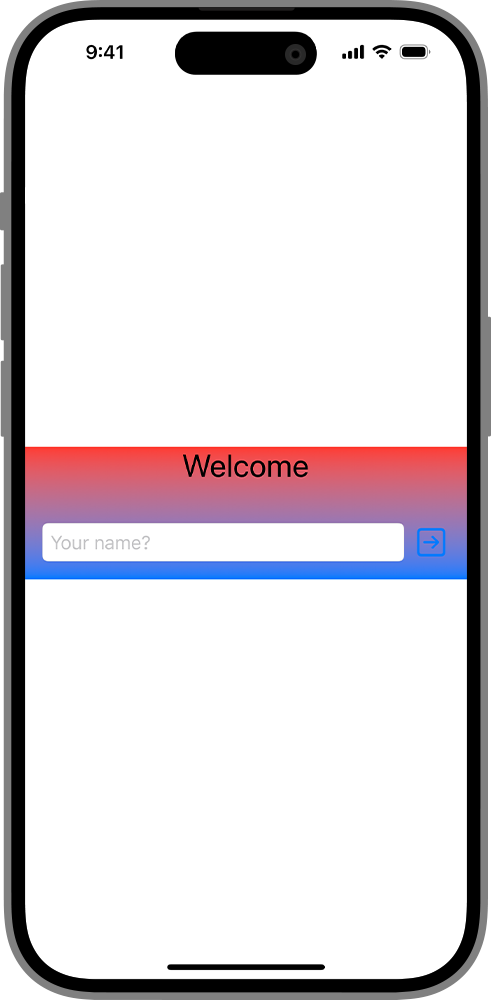
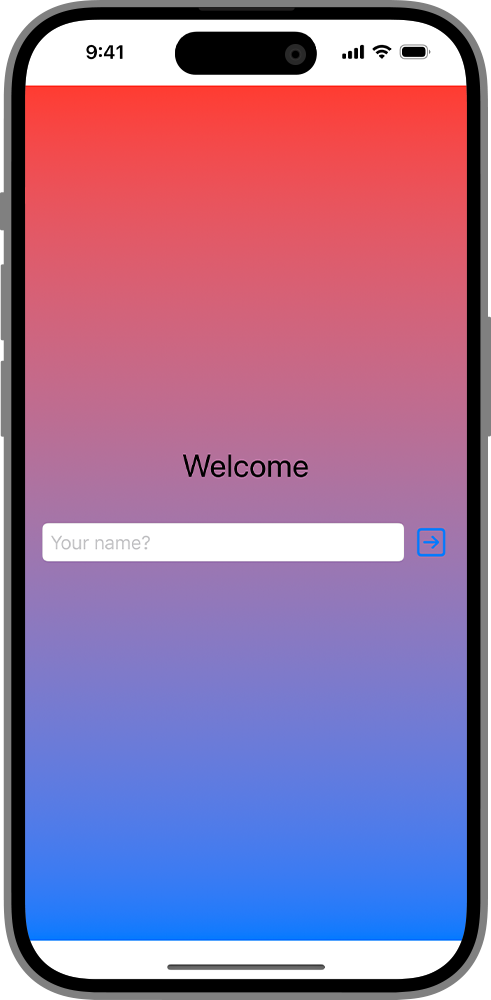
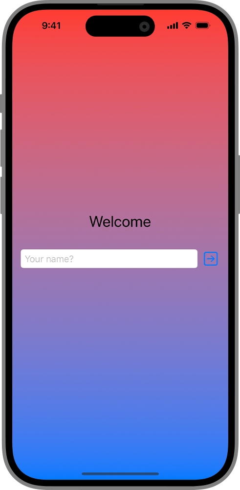
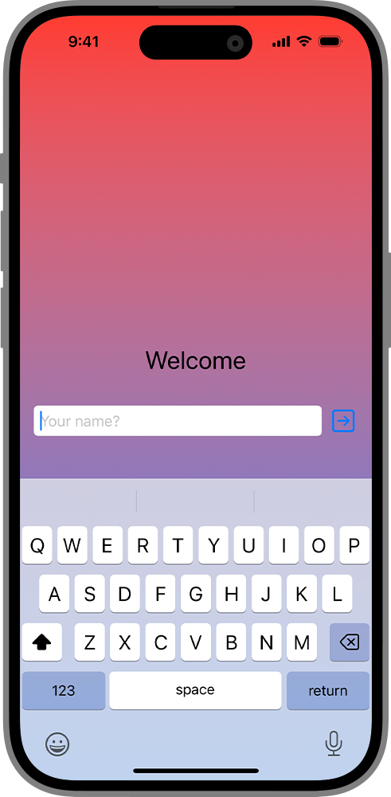
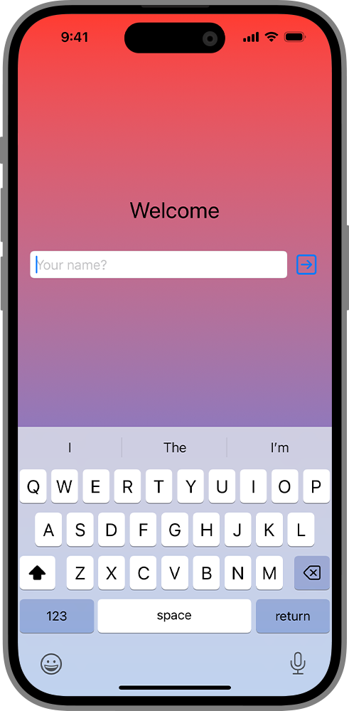

+++
title = "1.5 为视图添加背景"
date = 2026-09-12T12:47:47+08:00
weight = 5
type = "docs"
description = ""
isCJKLanguage = true
draft = false
+++


> 原文链接: [https://developer.apple.com/documentation/swiftui/adding-a-background-to-your-view](https://developer.apple.com/documentation/swiftui/adding-a-background-to-your-view)

# 1.5 为视图添加背景

在视图后面组合出一个背景，并把它延伸到安全区域内边距之外。

## 概述 {#Overview}

你可以用 [background(alignment:content:)](https://developer.apple.com/documentation/swiftui/view/background(alignment:content:)) 视图修饰符把一个视图添加为背景。要在多个视图下添加背景，或者让背景比现有视图更大，你可以把这些视图放进一个 [ZStack](https://developer.apple.com/documentation/swiftui/zstack) 中来分层，并把你想作为背景的视图放在视图栈的最底层。你还可以指定背景视图忽略安全区域内边距，从而把背景延伸到部分或全部边缘。

### 添加背景 {#Add-a-background}

如果你的设计需要背景，可以用 [background(alignment:content:)](https://developer.apple.com/documentation/swiftui/view/background(alignment:content:)) 修饰符在现有视图下方添加一个背景。下面的示例用 [background(alignment:content:)](https://developer.apple.com/documentation/swiftui/view/background(alignment:content:)) 视图修饰符为垂直栈添加了一个渐变：

```swift
let backgroundGradient = LinearGradient(
    colors: [Color.red, Color.blue],
    startPoint: .top, endPoint: .bottom)

struct SignInView: View {
    @State private var name: String = ""

    var body: some View {
        VStack {
            Text("Welcome")
                .font(.title)
            HStack {
                TextField("Your name?", text: $name)
                    .textFieldStyle(.roundedBorder)
                Button(action: {}, label: {
                    Image(systemName: "arrow.right.square")
                        .font(.title)
                })
            }
            .padding()
        }
        .background {
            backgroundGradient
        }
    }
}
```

[background(alignment:content:)](https://developer.apple.com/documentation/swiftui/view/background(alignment:content:)) 视图修饰符会把背景视图的尺寸约束为与它附着的视图相同：



### 把背景扩展到视图下方 {#Expand-the-background-underneath-your-view}

要创建一个比垂直栈更大的背景，需要使用另一种技巧。你可以在 [VStack](https://developer.apple.com/documentation/swiftui/vstack) 中内容的上下方添加 [Spacer](https://developer.apple.com/documentation/swiftui/spacer) 视图来扩展它，但这样也会扩大栈的尺寸，可能改变其布局。要在不改变栈尺寸的情况下加入更大的背景，请把这些视图嵌套进一个 [ZStack](https://developer.apple.com/documentation/swiftui/zstack)，把 [VStack](https://developer.apple.com/documentation/swiftui/vstack) 层叠在背景视图之上：

```swift
struct SignInView: View {
    @State private var name: String = ""

    var body: some View {
        ZStack {
            backgroundGradient
            VStack {
                Text("Welcome")
                    .font(.title)
                HStack {
                    TextField("Your name?", text: $name)
                        .textFieldStyle(.roundedBorder)
                    Button(action: {}, label: {
                        Image(systemName: "arrow.right.square")
                            .font(.title)
                    })
                }
                .padding()
            }
        }
    }
}
```

与使用 background 视图修饰符时不同，深度栈中各视图的尺寸彼此独立。[Gradient](https://developer.apple.com/documentation/swiftui/gradient) 中的视图会扩展以填满栈可用的空间，但默认会避开安全区域内边距：



关于使用栈来组合视图的更多信息，请参阅 [用栈视图构建布局](../1.2-BuildingLayoutsWithStackViews/)。

### 把背景延伸进安全区域 {#Extend-the-background-into-the-safe-areas}

默认情况下，SwiftUI 会调整视图的尺寸和位置以避开系统定义的安全区域，从而确保系统内容或设备边缘不会遮挡你的视图。如果你的设计要求背景延伸到屏幕边缘，请使用 [ignoresSafeArea(_:edges:)](https://developer.apple.com/documentation/swiftui/view/ignoressafearea(_:edges:)) 修饰符覆盖默认行为。

```swift
struct SignInView: View {
    @State private var name: String = ""
    var body: some View {
        ZStack {
            backgroundGradient
            VStack {
                Text("Welcome")
                    .font(.title)
                HStack {
                    TextField("Your name?", text: $name)
                        .textFieldStyle(.roundedBorder)
                    Button(action: {}, label: {
                        Image(systemName: "arrow.right.square")
                            .font(.title)
                    })
                }
                .padding()
            }
        }
        .ignoresSafeArea()
    }
}
```

背景渐变会填满设备的显示区域，并忽略安全区域内边距。



### 显示键盘时调整视图 {#Adjust-views-when-displaying-the-keyboard}

你可以通过添加 [ignoresSafeArea(_:edges:)](https://developer.apple.com/documentation/swiftui/view/ignoressafearea(_:edges:)) 修饰符来忽略键盘的安全区域。当你激活键盘时，垂直栈中的内容保持不动，忽略键盘占用的空间：



要让垂直栈的内容遵守安全区域并随键盘调整，请把该修饰符移到只作用于背景视图上。

```swift
struct SignInView: View {
    @State private var name: String = ""
    var body: some View {
        ZStack {
            backgroundGradient
                .ignoresSafeArea()
            VStack {
                Text("Welcome")
                    .font(.title)
                HStack {
                    TextField("Your name?", text: $name)
                        .textFieldStyle(.roundedBorder)
                    Button(action: {}, label: {
                        Image(systemName: "arrow.right.square")
                            .font(.title)
                    })
                }
                .padding()
            }
        }
    }
}
```

为了适应键盘，SwiftUI 会调整你的视图尺寸和位置。由于背景视图带有 [ignoresSafeArea(_:edges:)](https://developer.apple.com/documentation/swiftui/view/ignoressafearea(_:edges:)) 修饰符，它保持不变。


