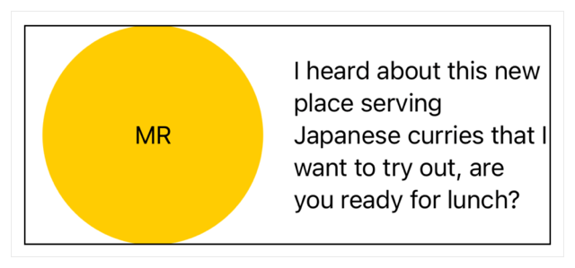
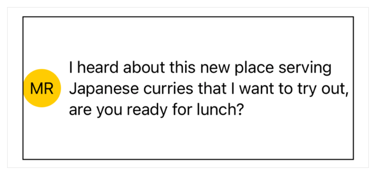
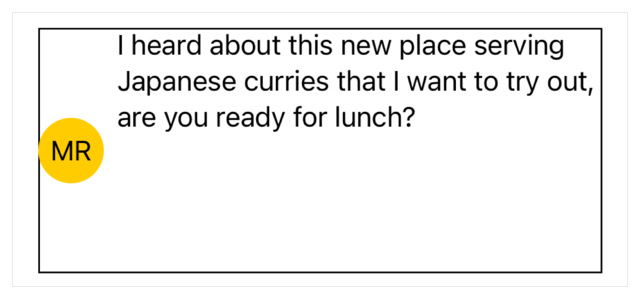
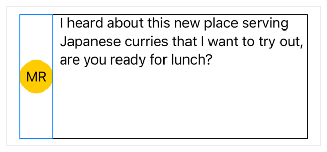
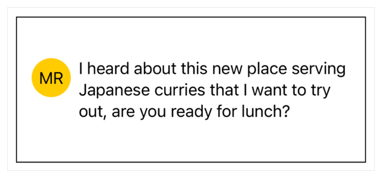

+++
title = "2.1 布局一个简单视图"
date = 2026-09-12T12:47:47+08:00
weight = 1
type = "docs"
description = ""
isCJKLanguage = true
draft = false
+++


> 原文链接: [https://developer.apple.com/documentation/swiftui/laying-out-a-simple-view](https://developer.apple.com/documentation/swiftui/laying-out-a-simple-view)

# 2.1 布局一个简单视图

通过调整视图尺寸来创建视图布局。

## 概述 {#Overview}

要为视图创建布局，先组合出一个子视图层级。然后，通过配置参数以及添加视图修饰符（例如影响视图框架和内边距的那些）来细化子视图的尺寸与间距。关于如何组合布局，请参阅 [用栈视图构建布局](../../1-LayoutFundamentals/1.2-BuildingLayoutsWithStackViews/)。

### 建立视图层级 {#Establish-a-view-hierarchy}

下面的示例创建了一个用于显示消息服务收到的消息的视图。这个视图使用 [HStack](https://developer.apple.com/documentation/swiftui/hstack) 把标识发送者的视图和提供消息内容的视图组合在一起：

```swift
struct MessageRow: View {
    let message: Message

    var body: some View {
        HStack {
            ZStack {
                Circle()
                    .fill(Color.yellow)
                Text(message.initials)
            }

            Text(message.content)
        }
    }
}
```

下面这张 `MessageRow` 视图的截图带有显示其边界的边框。请注意圆形尺寸很大，它填满了可用的空间：



当 SwiftUI 渲染视图层级时，它会递归地评估每个子视图：父视图向其包含的子视图提议一个尺寸，子视图则返回一个计算出的尺寸。


`MessageRow` 视图向其唯一的子视图 [HStack](https://developer.apple.com/documentation/swiftui/hstack) 提议一个尺寸，即其自身的父视图向它提议的完整尺寸。栈按比例把这些空间分配给它的各个子视图，并在每个子视图之间使用系统默认的间距。这一过程会递归进行下去：

- [ZStack](https://developer.apple.com/documentation/swiftui/zstack) 向其子视图 [Circle](https://developer.apple.com/documentation/swiftui/circle) 和 [Text](https://developer.apple.com/documentation/swiftui/text) 提议一个尺寸。
- [Circle](https://developer.apple.com/documentation/swiftui/circle) 扩展到提议的尺寸，而 [Text](https://developer.apple.com/documentation/swiftui/text) 只占用刚好够容纳其字符串的空间。
- [ZStack](https://developer.apple.com/documentation/swiftui/zstack) 返回其最大子视图的尺寸，在本例中就是 [Circle](https://developer.apple.com/documentation/swiftui/circle)。

当所有子视图都报告了自己的尺寸之后，父视图就会渲染它们。

### 限制视图尺寸 {#Limit-the-view-size}

在上面的示例中，SwiftUI 内置视图以不同方式管理尺寸，其中包括这样几类视图：

- 扩展以填满父视图提供的空间，例如 [Color](https://developer.apple.com/documentation/swiftui/color)、[LinearGradient](https://developer.apple.com/documentation/swiftui/lineargradient) 和 [Circle](https://developer.apple.com/documentation/swiftui/circle)。
- 具有随内容变化的理想尺寸，例如 [Text](https://developer.apple.com/documentation/swiftui/text) 和各种容器视图。
- 具有永不变化的理想尺寸，例如 [Toggle](https://developer.apple.com/documentation/swiftui/toggle) 或 [DatePicker](https://developer.apple.com/documentation/swiftui/datepicker)。

你可以通过添加 frame 修饰符把视图约束为固定尺寸。例如，使用 [frame(width:height:alignment:)](https://developer.apple.com/documentation/swiftui/view/frame(width:height:alignment:)) 修饰符把圆形的宽度限制为 `40` 点：

```swift
struct MessageRow: View {
    let message: Message

    var body: some View {
        HStack {
            ZStack {
                Circle()
                    .fill(Color.yellow)
                Text(message.initials)
            }
            .frame(width: 40)

            Text(message.content)
        }
    }
}
```

当你添加 frame 修饰符时，SwiftUI 会包装受影响的视图，实际上就是向视图层级中加入了一个新视图。


当 SwiftUI 评估这个新层级时，frame 修饰符通过把你指定的参数值传递下去，固定了它所包装的 [ZStack](https://developer.apple.com/documentation/swiftui/zstack) 的宽度。其余尺寸评估过程与之前相同，只是 [Circle](https://developer.apple.com/documentation/swiftui/circle) 现在扩展以填满一个更小的空间，该空间受 frame 的 40 点宽度约束。这使得 [HStack](https://developer.apple.com/documentation/swiftui/hstack) 能把更多空间分给它的另一个子视图，也就是显示消息文本的那个视图。



### 用对齐方式定位内容 {#Position-content-with-alignment}

如果你想让圆形的顶部与消息内容文本的顶部对齐，可以给 [HStack](https://developer.apple.com/documentation/swiftui/hstack) 应用一种对齐方式来完善这个视图。要在栈中垂直定位内容，请把 `alignment` 参数指定为 [top](https://developer.apple.com/documentation/swiftui/verticalalignment/top)：

```swift
struct MessageRow: View {
    let message: Message

    var body: some View {
        HStack(alignment: .top) {
            ZStack {
                Circle()
                    .fill(Color.yellow)
                Text(message.initials)
            }
            .frame(width: 40)

            Text(message.content)
        }
    }
}
```

应用对齐方式后，你会得到一个出乎意料的结果。这些视图的顶部看起来并没有对齐：



不过，如果你在 Xcode 中选中这个圆形，或者临时给圆形添加一个边框，就能看到这些视图的顶部实际上是对齐的。关于检查视图尺寸的更多信息，请参阅 [检查视图布局](../2.2-InspectingViewLayout/)。



在上一节中，你应用的 frame 只有宽度约束。SwiftUI 画出的圆形受该宽度限制。但由于高度未指定，圆形的框架会另外扩展以填满可用的高度，即使这部分额外空间对渲染出的圆形没有任何可见影响。你可以通过添加显式的 `height` 参数来解决这个问题：

```swift
struct MessageRow: View {
    let message: Message

    var body: some View {
        HStack(alignment: .top) {
            ZStack {
                Circle()
                    .fill(Color.yellow)
                Text(message.initials)
            }
            .frame(width: 40, height: 40)

            Text(message.content)
        }
    }
}
```

现在 [HStack](https://developer.apple.com/documentation/swiftui/hstack) 中的内容是顶部对齐的，不过如显示该行边界的边框所示，栈本身在 `MessageRow` 视图中是居中的。


### 为视图添加内边距 {#Add-padding-to-the-view}

为了避免视图外缘显得拥挤，可以添加内边距。这会在指定边缘引入固定的空间量，并相应地减少视图内容可用的空间。例如，你可以用 [padding(_:_:)](https://developer.apple.com/documentation/swiftui/view/padding(_:_:)) 在 [HStack](https://developer.apple.com/documentation/swiftui/hstack) 的[水平](https://developer.apple.com/documentation/swiftui/edge/set/horizontal)边缘上添加额外空间：

```swift
struct MessageRow: View {
    let message: Message

    var body: some View {
        HStack(alignment: .top) {
            ZStack {
                Circle()
                    .fill(Color.yellow)
                Text(message.initials)
            }
            .frame(width: 40, height: 40)

            Text(message.content)
        }
        .padding([.horizontal])
    }
}
```

padding 修饰符默认使用系统标准的间距，不过你也可以为 padding 修饰符选择其他值。
