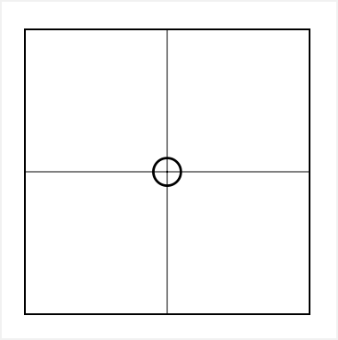
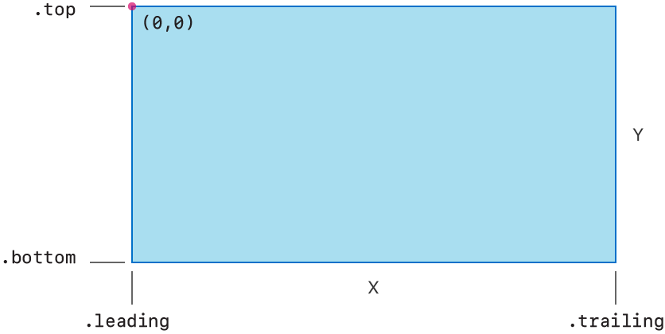
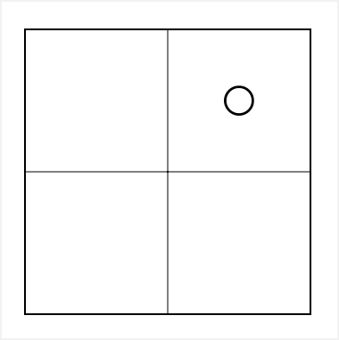
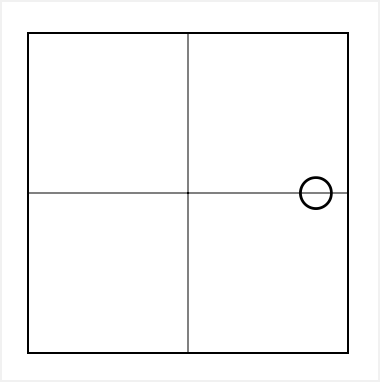

+++
title = "2.3 微调视图的位置"
date = 2026-09-12T12:47:47+08:00
weight = 3
type = "docs"
description = ""
isCJKLanguage = true
draft = false
+++


> 原文链接: [https://developer.apple.com/documentation/swiftui/making-fine-adjustments-to-a-view-s-position](https://developer.apple.com/documentation/swiftui/making-fine-adjustments-to-a-view-s-position)

# 2.3 微调视图的位置

通过应用 offset 或 position 修饰符来移动视图的位置。

## 概述 {#Overview}

使用 SwiftUI 以自适应方式排布和定位你的视图。如果仅靠组合无法实现你的设计，就用视图修饰符微调布局。添加 offset 修饰符可以把视图的渲染内容从其当前位置移开，或者添加 position 修饰符来在其父视图内设置一个显式位置。

### 创建视图布局 {#Create-a-view-layout}

下面的示例提供了一个视图来说明如何定位视图，它大致展示了一个由 [ZStack](https://developer.apple.com/documentation/swiftui/zstack) 组合而成的视图布局。这个栈包含一个象限，并在其上叠加了一个圆形图像：

```swift
struct Crosshairs: View { ... } // 绘制十字准线。

struct Quadrant: View {
    var body: some View {
        ZStack {
            Crosshairs()
            Rectangle()
                .stroke(Color.primary)
            Image(systemName: "circle")
        }
        .frame(width: 160, height: 160)
    }
}
```



关于用栈组合视图的更多细节，请参阅 [用栈视图构建布局](../../1-LayoutFundamentals/1.2-BuildingLayoutsWithStackViews/)。

### 移动视图内容的位置 {#Shift-the-location-of-a-views-content}

使用 offset 修饰符来改变父视图放置圆形的位置，从而微调圆形在象限内的位置。offset 修饰符会把图像从默认的中心位置移开。例如，[offset(x:y:)](https://developer.apple.com/documentation/swiftui/view/offset(x:y:)) 修饰符使用 `x` 和 `y` 参数来表示视图坐标空间中的一个相对位置。

在 SwiftUI 中，视图的坐标空间用 `x` 表示水平方向，用 `y` 表示垂直方向。`x` 的值在视图的前缘处从 `0` 开始，随着位置向后缘移动而增大。`y` 的值在视图的顶部边缘处从 `0` 开始，随着位置向底部边缘移动而增大。不要以为前缘总在左边，因为它会随布局方向变化。当布局方向设置为从右到左时，水平的 `0` 值位于视图的右侧。

下面的示意图在从左到右的布局方向下，展示了相对于一个矩形的坐标，其原点位于顶部的前缘角：



下面的示例把圆形从中心向上并向后缘方向移动 `40` 点：

```swift
struct Quadrant: View {
    var body: some View {
        ZStack {
            Crosshairs()
            Rectangle()
                .stroke(Color.primary)
            Image(systemName: "circle")
                .offset(x: 40.0, y: -40.0)
        }
        .frame(width: 160, height: 160)
    }
}
```



### 显式定位视图内容 {#Position-view-content-explicitly}

要在视图内显式定位元素，请使用 [position(x:y:)](https://developer.apple.com/documentation/swiftui/view/position(x:y:)) 视图修饰符。position 修饰符会覆盖父视图放置其内容的位置。与从父视图选定的位置偏移视图的 offset 修饰符不同，该修饰符会把视图渲染在相对于父视图原点偏移的位置上。position 修饰符使用与 offset 修饰符相同的 `x`、`y` 坐标系，同样也不会影响视图的尺寸。在下面的示例中，圆形的位置通过显式数值被设置到象限右侧的中间高度处：

```swift
struct Quadrant: View {
    var body: some View {
        ZStack {
            Crosshairs()
            Rectangle()
                .stroke(Color.primary)
            Image(systemName: "circle")
                .position(x: 144, y: 80)
        }
        .frame(width: 160, height: 160)
    }
}
```


