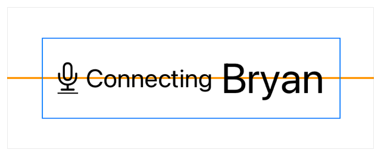
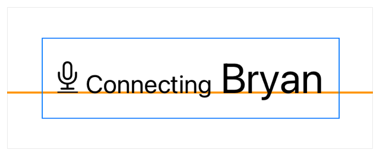
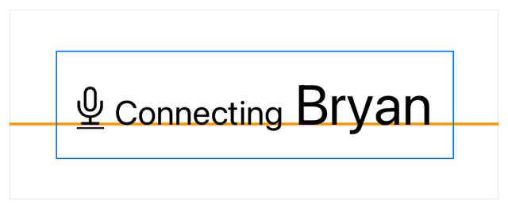
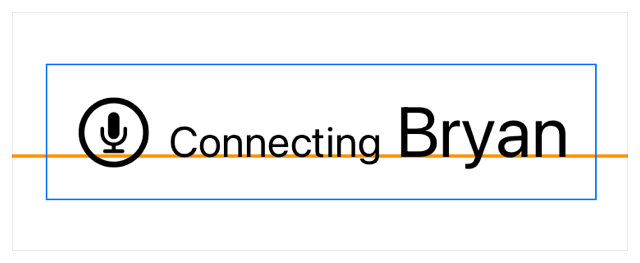

+++
title = "2.4 在栈内对齐视图"
date = 2026-09-12T12:47:47+08:00
weight = 4
type = "docs"
description = ""
isCJKLanguage = true
draft = false
+++


> 原文链接: [https://developer.apple.com/documentation/swiftui/aligning-views-within-a-stack](https://developer.apple.com/documentation/swiftui/aligning-views-within-a-stack)

# 2.4 在栈内对齐视图

使用对齐参考线在栈内定位视图。

## 概述 {#Overview}

栈按其对齐方式放置子视图，默认采用居中对齐。在初始化栈时，你可以为栈指定一种对齐方式，它同样会作用于栈的子视图。如果你想修改单个子视图的位置，请使用 alignment guide 修饰符做出调整，使视图相对于栈提供的对齐方式产生偏移。

要跨多个栈对齐视图，请参阅 [跨栈对齐视图](../2.5-AligningViewsAcrossStacks/)。

### 使用默认值进行基本对齐 {#Use-defaults-for-basic-alignment}

要了解 SwiftUI 如何把默认对齐方式应用于 [HStack](https://developer.apple.com/documentation/swiftui/hstack) 中的视图，请看下面这段用于录制应用状态视图的代码。这个 `HStack` 包含一个用于图标的图像视图，以及两个带标签的文本视图，标签使用 [font(_:)](https://developer.apple.com/documentation/swiftui/view/font(_:)) 修饰符来调整文本字号。

```swift
HStack {
    Image("microphone")
    Text("Connecting")
        .font(.caption)
    Text("Bryan")
        .font(.title)
}
.padding()
.border(Color.blue, width: 1)
```

下图中橙色的参考线显示了栈内视图的默认对齐位置。这条线在本文中仅作为视觉参考。



### 自定义栈的对齐方式 {#Customize-stack-alignment}

你可以根据栈所支持的对齐方式提供的参考线，在栈内对齐内容。各类栈支持的对齐方式如下：

- [HStack](https://developer.apple.com/documentation/swiftui/hstack) 使用 [VerticalAlignment](https://developer.apple.com/documentation/swiftui/verticalalignment) 中定义的参考线。
- [VStack](https://developer.apple.com/documentation/swiftui/vstack) 使用 [HorizontalAlignment](https://developer.apple.com/documentation/swiftui/horizontalalignment) 中定义的参考线。
- [ZStack](https://developer.apple.com/documentation/swiftui/zstack) 使用 [Alignment](https://developer.apple.com/documentation/swiftui/alignment) 中定义的参考线，也就是 `HorizontalAlignment` 与 `VerticalAlignment` 的组合。

在初始化栈时使用 `alignment` 参数来定义该栈的对齐参考线。下面的示例把 `HStack` 的对齐方式设置为 [firstTextBaseline](https://developer.apple.com/documentation/swiftui/verticalalignment/firsttextbaseline)，从而把它的子视图对齐到第一个文本视图（内容为字符串 “Connecting”）的基线：

```swift
HStack(alignment: .firstTextBaseline) {
    Image("microphone")
    Text("Connecting")
        .font(.caption)
    Text("Bryan")
        .font(.title)
}
.padding()
.border(Color.blue, width: 1)
```



### 调整栈内单个视图的对齐方式 {#Adjust-the-alignment-of-individual-views-within-a-stack}

自定义图像不提供文本基线参考线，因此图像的底部会与文本视图的基线对齐。使用 [alignmentGuide(_:computeValue:)](https://developer.apple.com/documentation/swiftui/view/alignmentguide(_:computevalue:)) 调整图像的对齐方式，就能得到你想要的视觉效果。alignment guide 的闭包会提供一个 [ViewDimensions](https://developer.apple.com/documentation/swiftui/viewdimensions) 实例，也就是本例中的参数 `context`，你可以用它返回一个偏移值。通过 [bottom](https://developer.apple.com/documentation/swiftui/verticalalignment/bottom) 从 `context` 中查到的值提供了一个偏移量，使图像的底部经过偏移后与栈上定义的基线参考线对齐：

```swift
HStack(alignment: .firstTextBaseline) {
    Image("microphone")
        .alignmentGuide(.firstTextBaseline) { context in
            context[.bottom] - 0.12 * context.height
        }
    Text("Connecting")
        .font(.caption)
    Text("Bryan")
        .font(.title)
}
.padding()
.border(Color.blue, width: 1)
```

使用 alignment guide 修饰符时，务必指定栈中处于使用状态的对齐方式。否则，SwiftUI 不会调用该闭包来偏移视图。在上面的示例中，传给 alignment guide 的 [firstTextBaseline](https://developer.apple.com/documentation/swiftui/verticalalignment/firsttextbaseline) 与栈的对齐方式一致，因此这一调整会影响图像的放置位置：



### 与文本对齐时用 SF Symbols 简化视图 {#Use-SF-Symbols-to-simplify-views-when-aligning-with-text}

你可以用一个来自 [SF Symbols](https://developer.apple.com/design/human-interface-guidelines/sf-symbols) 的相似图标替换麦克风图像，从而简化这个视图。SF Symbols 中的图标使用文本基线参考线，这意味着它们支持你为该视图应用的任何字体样式。

```swift
HStack(alignment: .firstTextBaseline) {
    Image(systemName: "mic.circle")
        .font(.title)
    Text("Connecting")
        .font(.caption)
    Text("Bryan")
        .font(.title)
}
.padding()
.border(Color.blue, width: 1)
```


