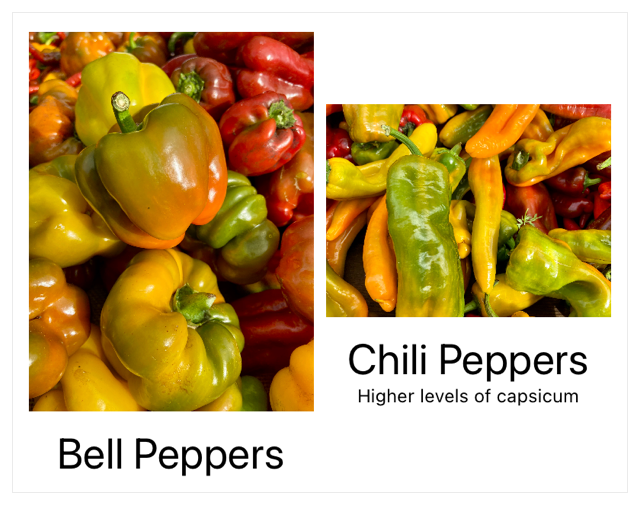
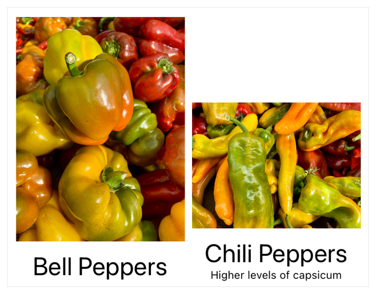
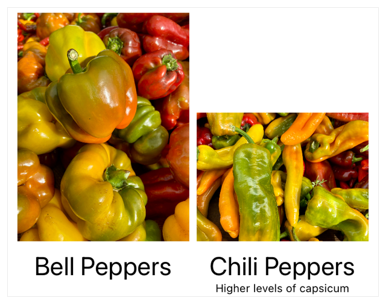

+++
title = "2.5 跨栈对齐视图"
date = 2026-09-12T12:47:47+08:00
weight = 5
type = "docs"
description = ""
isCJKLanguage = true
draft = false
+++


> 原文链接: [https://developer.apple.com/documentation/swiftui/aligning-views-across-stacks](https://developer.apple.com/documentation/swiftui/aligning-views-across-stacks)

# 2.5 跨栈对齐视图

创建自定义对齐方式，并用它在多个栈之间对齐视图。

## 概述 {#Overview}

当你把多个栈嵌套在一起时，可能希望这些栈中的某些特定项目彼此对齐。默认情况下，你为某个栈指定的对齐方式只作用于该栈的子视图。要让位于嵌套栈中的子视图彼此对齐，请定义一种自定义对齐方式，把它指定给外层视图，并使用 alignment guide 修饰符来标识需要对齐的特定视图。

### 从默认的居中对齐开始 {#Begin-with-the-default-center-alignment}

为了说明如何跨栈对齐项目，下面这个视图展示了一个水平栈，它包裹着两个子视图数量不同的嵌套垂直栈。外层的 [HStack](https://developer.apple.com/documentation/swiftui/hstack) 没有定义对齐方式，因此默认使用 [center](https://developer.apple.com/documentation/swiftui/verticalalignment/center)。

```swift
struct ImageRow: View {
    var body: some View {
        HStack {
            VStack {
                Image("bell_peppers")
                    .resizable()
                    .scaledToFit()
                Text("Bell Peppers")
                    .font(.title)
            }
            VStack {
                Image("chili_peppers")
                    .resizable()
                    .scaledToFit()
                Text("Chili Peppers")
                    .font(.title)
                Text("Higher levels of capsicum")
                    .font(.caption)
            }
        }
    }
}
```

下图显示嵌套垂直栈中的内容在栈的中央对齐。这些垂直栈内部的子元素（例如每个图像下方的标题）彼此并不对齐。



### 定义自定义对齐方式 {#Define-a-custom-alignment}

要创建新的垂直对齐参考线，请为 [VerticalAlignment](https://developer.apple.com/documentation/swiftui/verticalalignment) 扩展一个新的静态属性作为你的参考线。参考线的命名应与它对齐的对象相关，以便于使用。下面的示例把这个参考线的默认值设为底部定位：

```swift
extension VerticalAlignment {
    /// 用于图像标题的自定义对齐方式。
    private struct ImageTitleAlignment: AlignmentID {
        static func defaultValue(in context: ViewDimensions) -> CGFloat {
            // 如果没有设置参考线，默认采用底部对齐。
            context[VerticalAlignment.bottom]
        }
    }

    /// 用于对齐标题的参考线。
    static let imageTitleAlignmentGuide = VerticalAlignment(
        ImageTitleAlignment.self
    )
}
```

### 指定并应用自定义对齐方式 {#Assign-and-apply-the-custom-alignment}

要使用这条对齐参考线，请把它指定给包围着你想对齐的那些视图的父视图。下面的示例把 `imageTitleAlignmentGuide` 指定为这个水平栈的对齐方式：

```swift
struct RowOfAlignedImages: View {
    var body: some View {
        HStack(alignment: .imageTitleAlignmentGuide) {
            VStack {
                Image("bell_peppers")
                    .resizable()
                    .scaledToFit()

                Text("Bell Peppers")
                    .font(.title)
            }
            VStack {
                Image("chili_peppers")
                    .resizable()
                    .scaledToFit()

                Text("Chili Peppers")
                    .font(.title)

                Text("Higher levels of capsicum")
                    .font(.caption)
            }
        }
    }
}
```

这两个垂直栈现在按栈的底部对齐，使用的是你为自定义参考线指定的默认值。



当你在某个栈上定义对齐方式后，它会透传到所包含的子视图中。在嵌套的 [VStack](https://developer.apple.com/documentation/swiftui/vstack) 实例内部，对需要对齐的视图应用 [alignmentGuide(_:computeValue:)](https://developer.apple.com/documentation/swiftui/view/alignmentguide(_:computevalue:))，并使用你为 [HStack](https://developer.apple.com/documentation/swiftui/hstack) 定义的自定义参考线。

```swift
struct RowOfAlignedImages: View {
    var body: some View {
        HStack(alignment: .imageTitleAlignmentGuide) {
            VStack {
                Image("bell_peppers")
                    .resizable()
                    .scaledToFit()

                Text("Bell Peppers")
                    .font(.title)
                    .alignmentGuide(.imageTitleAlignmentGuide) { context in
                        context[.firstTextBaseline]
                    }
            }
            VStack {
                Image("chili_peppers")
                    .resizable()
                    .scaledToFit()

                Text("Chili Peppers")
                    .font(.title)
                    .alignmentGuide(.imageTitleAlignmentGuide) { context in
                        context[.firstTextBaseline]
                    }

                Text("Higher levels of capsicum")
                    .font(.caption)
            }
        }
    }
}
```

alignment guide 修饰符的闭包返回 [firstTextBaseline](https://developer.apple.com/documentation/swiftui/verticalalignment/firsttextbaseline)，它把各个标题的基线对齐到 `imageTitleAlignmentGuide` 这条对齐参考线上。


