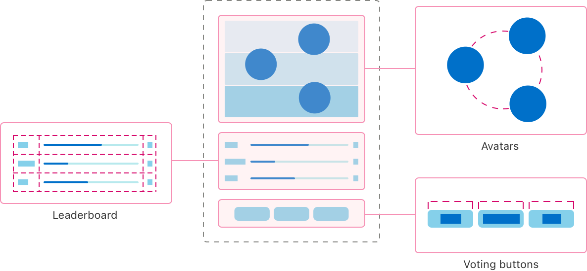
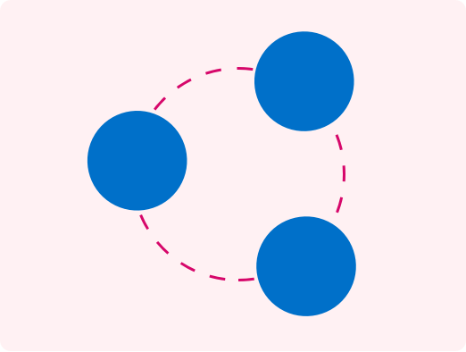

+++
title = "3.1 用 SwiftUI 组合自定义布局"
date = 2026-09-12T12:47:47+08:00
weight = 1
type = "docs"
description = ""
isCJKLanguage = true
draft = false
+++


> 原文链接: [https://developer.apple.com/documentation/swiftui/composing-custom-layouts-with-swiftui](https://developer.apple.com/documentation/swiftui/composing-custom-layouts-with-swiftui)

# 3.1 用 SwiftUI 组合自定义布局

使用 SwiftUI 提供的布局工具来排列应用界面中的视图。

## 概述 {#Overview}

这个示例应用构建了一个界面，让大家可以为自己最喜欢的宠物种类投票，从而展示了 SwiftUI 提供的许多布局工具。应用提供了为特定宠物类型投票的按钮，并在排行榜上显示各种竞争者的票数和相对排名。它还会显示宠物的头像，其排列方式反映了当前的排名。



> 注意：这个示例代码项目与 WWDC22 的讲座 [10056：用 SwiftUI 组合自定义布局](https://developer.apple.com/wwdc22/10056/) 相关。

### 用网格在二维中排列视图 {#Arrange-views-in-two-dimensions-with-a-grid}

为了在显示区域中央绘制一个展示票数和百分比的排行榜，示例使用了一个 [Grid](https://developer.apple.com/documentation/swiftui/grid) 视图。


网格在 [ForEach](https://developer.apple.com/documentation/swiftui/foreach) 中包含一个 [GridRow](https://developer.apple.com/documentation/swiftui/gridrow)，行中的每个视图会创建一个单元格。因此第一个视图出现在第一列，第二个视图出现在第二列，依此类推。由于 [Divider](https://developer.apple.com/documentation/swiftui/divider) 出现在网格行实例之外，它会创建横跨整个网格宽度的一行。

```swift
Grid(alignment: .leading) {
    ForEach(model.pets) { pet in
        GridRow {
            Text(pet.type)
            ProgressView(
                value: Double(pet.votes),
                total: Double(max(1, model.totalVotes))) // 避免除以零。
            Text("\(pet.votes)")
                .gridColumnAlignment(.trailing)
        }

        Divider()
    }
}
```

示例用前缘对齐方式初始化网格，这适用于网格中的每个单元格。同时，出现在票数单元格上的 [gridColumnAlignment(_:)](https://developer.apple.com/documentation/swiftui/view/gridcolumnalignment(_:)) 视图修饰符会覆盖该列中单元格的对齐方式，改用后缘对齐。

### 创建自定义等宽布局 {#Create-a-custom-equal-width-layout}

应用在界面底部提供了用于投票的按钮。


为了确保所有按钮宽度相同，但又不超过最宽按钮文本的宽度，应用创建了一个遵循 [Layout](https://developer.apple.com/documentation/swiftui/layout) 协议的自定义布局容器类型。这个等宽水平栈（`MyEqualWidthHStack`）会测量所有子视图的理想尺寸，并把最宽的理想尺寸提供给每个子视图。

这个自定义栈实现了协议中两个必需的方法。首先，[sizeThatFits(proposal:subviews:cache:)](https://developer.apple.com/documentation/swiftui/layout/sizethatfits(proposal:subviews:cache:)) 在给定一组子视图的情况下报告容器的尺寸。

```swift
func sizeThatFits(
    proposal: ProposedViewSize,
    subviews: Subviews,
    cache: inout Void
) -> CGSize {
    guard !subviews.isEmpty else { return .zero }

    let maxSize = maxSize(subviews: subviews)
    let spacing = spacing(subviews: subviews)
    let totalSpacing = spacing.reduce(0) { $0 + $1 }

    return CGSize(
        width: maxSize.width * CGFloat(subviews.count) + totalSpacing,
        height: maxSize.height)
}
```

这个方法把每个维度上的最大尺寸与子视图之间的水平间距结合起来，得出容器的总尺寸。接着，[placeSubviews(in:proposal:subviews:cache:)](https://developer.apple.com/documentation/swiftui/layout/placesubviews(in:proposal:subviews:cache:)) 会告诉每个子视图在布局边界内应出现的位置。

```swift
func placeSubviews(
    in bounds: CGRect,
    proposal: ProposedViewSize,
    subviews: Subviews,
    cache: inout Void
) {
    guard !subviews.isEmpty else { return }

    let maxSize = maxSize(subviews: subviews)
    let spacing = spacing(subviews: subviews)

    let placementProposal = ProposedViewSize(width: maxSize.width, height: maxSize.height)
    var nextX = bounds.minX + maxSize.width / 2

    for index in subviews.indices {
        subviews[index].place(
            at: CGPoint(x: nextX, y: bounds.midY),
            anchor: .center,
            proposal: placementProposal)
        nextX += maxSize.width + spacing[index]
    }
}
```

这个方法为子视图创建一个统一的尺寸提议，然后用它以及一个对每个子视图都会变化的点，把按钮按默认间距排成水平一行。

### 选择能放下的视图 {#Choose-the-view-that-fits}

投票按钮的尺寸取决于其中文本的宽度。对于使用其他语言或使用更大字号的用户来说，水平排列的按钮可能放不下。因此应用使用 [ViewThatFits](https://developer.apple.com/documentation/swiftui/viewthatfits)，让 SwiftUI 在水平排列和垂直排列这两种按钮布局之间选择能放入可用空间的那一种。

```swift
ViewThatFits { // 选择第一个能放下的视图。
    MyEqualWidthHStack { // 如果能放下就水平排列……
        Buttons()
    }
    MyEqualWidthVStack { // ……否则改为垂直排列。
        Buttons()
    }
}
```

为了确保按钮在垂直排列时仍保持等宽特性，应用使用了一个与水平版本非常相似的自定义等宽垂直栈（`MyEqualWidthVStack`）。

### 用缓存提升布局效率 {#Improve-layout-efficiency-with-a-cache}

[Layout](https://developer.apple.com/documentation/swiftui/layout) 协议的这些方法会接收一个双向的 `cache` 参数。缓存提供了对可选存储的访问，这些存储在某个特定布局实例的所有方法之间共享。为了演示缓存的使用，示例应用的等宽垂直布局会创建存储，在它的 [sizeThatFits(proposal:subviews:cache:)](https://developer.apple.com/documentation/swiftui/layout/sizethatfits(proposal:subviews:cache:)) 与 [placeSubviews(in:proposal:subviews:cache:)](https://developer.apple.com/documentation/swiftui/layout/placesubviews(in:proposal:subviews:cache:)) 实现之间共享尺寸和间距的计算结果。

首先，该布局为存储定义了一个 `CacheData` 类型。

```swift
struct CacheData {
    let maxSize: CGSize
    let spacing: [CGFloat]
    let totalSpacing: CGFloat
}
```

然后它实现协议中可选的 [makeCache(subviews:)](https://developer.apple.com/documentation/swiftui/layout/makecache(subviews:)) 方法，为一组子视图完成计算，并返回上面所定义类型的值。

```swift
func makeCache(subviews: Subviews) -> CacheData {
    let maxSize = maxSize(subviews: subviews)
    let spacing = spacing(subviews: subviews)
    let totalSpacing = spacing.reduce(0) { $0 + $1 }

    return CacheData(
        maxSize: maxSize,
        spacing: spacing,
        totalSpacing: totalSpacing)
}
```

如果子视图发生变化，SwiftUI 会调用该布局的 [updateCache(_:subviews:)](https://developer.apple.com/documentation/swiftui/layout/updatecache(_:subviews:)) 方法。该方法的默认实现会再次调用 [makeCache(subviews:)](https://developer.apple.com/documentation/swiftui/layout/makecache(subviews:))，从而重新计算数据。随后，`sizeThatFits(proposal:subviews:cache:)` 和 `placeSubviews(in:proposal:subviews:cache:)` 方法会利用它们的 `cache` 参数来取回这些数据。例如，`placeSubviews(in:proposal:subviews:cache:)` 会从缓存中读取尺寸和间距数组。

```swift
let maxSize = cache.maxSize
let spacing = cache.spacing
```

请把它与不使用缓存的等宽水平栈对比一下，后者每次需要尺寸和间距信息时都会重新计算。

> 注意：包括等宽垂直栈在内的大多数简单布局，从使用缓存中获得的效率提升并不大。开发者可以用 Instruments 剖析自己的应用，以查明某个特定布局类型是否真的从缓存中受益。

### 创建带偏移的自定义环形布局 {#Create-a-custom-radial-layout-with-an-offset}

为了把宠物头像显示成一个圆环，应用定义了一个环形布局（`MyRadialLayout`）。



和其他自定义布局一样，这个布局也需要那两个必需的方法。对于 [sizeThatFits(proposal:subviews:cache:)](https://developer.apple.com/documentation/swiftui/layout/sizethatfits(proposal:subviews:cache:))，该布局通过返回其容器提议的任何尺寸来填满可用空间。

```swift
proposal.replacingUnspecifiedDimensions()
```

应用使用提议的 [replacingUnspecifiedDimensions(by:)](https://developer.apple.com/documentation/swiftui/proposedviewsize/replacingunspecifieddimensions(by:)) 方法把提议转换为一个具体尺寸。接着，为了放置子视图，该布局会旋转一个向量，把该向量平移到放置区域的中心，并用它作为子视图的锚点。

```swift
for (index, subview) in subviews.enumerated() {
    // 找到一个具有合适长度和旋转角度的向量。
    var point = CGPoint(x: 0, y: -radius)
        .applying(CGAffineTransform(
            rotationAngle: angle * Double(index) + offset))

    // 把向量平移到区域的中心。
    point.x += bounds.midX
    point.y += bounds.midY

    // 放置子视图。
    subview.place(at: point, anchor: .center, proposal: .unspecified)
}
```

应用施加在旋转上的偏移量会考虑当前排名，把排名更高的宠物放得离界面顶部更近。应用使用 [LayoutValueKey](https://developer.apple.com/documentation/swiftui/layoutvaluekey) 协议在各子视图上存储排名，然后在放置视图之前读取这些值来计算偏移量。

### 为布局之间的过渡添加动画 {#Animate-transitions-between-layouts}

环形布局可以计算出一个偏移量，为除一种排名情况之外的所有情况创建合适的排列：三个并列第一的情况无法用环形来展示头像。为了解决这个问题，应用会检测到这种情况，并改用 [HStackLayout](https://developer.apple.com/documentation/swiftui/hstacklayout) 类型把头像排成一行——它是内置 [HStack](https://developer.apple.com/documentation/swiftui/hstack) 的一个遵循 [Layout](https://developer.apple.com/documentation/swiftui/layout) 协议的版本。为了在这些布局类型之间过渡，应用使用 [AnyLayout](https://developer.apple.com/documentation/swiftui/anylayout) 类型。

```swift
let layout = model.isAllWayTie ? AnyLayout(HStackLayout()) : AnyLayout(MyRadialLayout())

Podium()
    .overlay(alignment: .top) {
        layout {
            ForEach(model.pets) { pet in
                Avatar(pet: pet)
                    .rank(model.rank(pet))
            }
        }
        .animation(.default, value: model.pets)
    }
```

由于视图的结构性标识在整个过程中保持不变，[animation(_:value:)](https://developer.apple.com/documentation/swiftui/view/animation(_:value:)) 视图修饰符会创建布局类型之间的动画过渡。该修饰符还会为排名变化所导致的环形布局变化添加动画，因为计算出的偏移量依赖同一份宠物数据。

### 为应用构建文档 {#Build-documentation-for-the-app}

要查看更多关于该应用所定义符号的信息，你可以构建应用的文档。在 Xcode 中打开项目，然后选择 Product > Build Documentation。

关于如何在你自己的应用中加入文档，请参阅 [DocC](https://www.swift.org/documentation/docc)。
