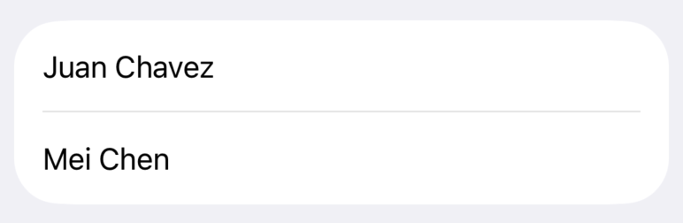
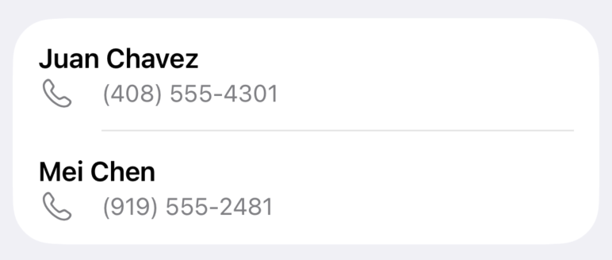

+++
title = "4.1 在列表中显示数据"
date = 2026-09-12T12:47:47+08:00
weight = 1
type = "docs"
description = ""
isCJKLanguage = true
draft = false
+++


> 原文链接: [https://developer.apple.com/documentation/swiftui/displaying-data-in-lists](https://developer.apple.com/documentation/swiftui/displaying-data-in-lists)

# 4.1 在列表中显示数据

以符合平台习惯的外观可视化数据集。

## 概述 {#Overview}

在许多应用中，把一组数据以垂直列表的形式显示都是常见需求。无论是一份联系人列表、一份日程安排、一份分类索引，还是一份购物清单，你都会经常用到 [List](https://developer.apple.com/documentation/swiftui/list)。

列表视图把项目集合垂直显示，按需加载各行，并在行放不下时加入滚动，因此很适合显示大量数据。

默认情况下，列表视图还会为其元素应用符合平台习惯的样式。例如在 iOS 上，列表的默认配置会在每一行之间显示一条分隔线，并在会触发导航动作的项目旁边添加展开指示符。

> 注意：如果你想从列表中移除符合平台习惯的样式（例如行分隔线或自动展开指示符），可以考虑改用 [LazyVStack](https://developer.apple.com/documentation/swiftui/lazyvstack)。关于使用惰性栈的更多信息，请参阅 [创建高性能的可滚动栈](../../1-LayoutFundamentals/1.4-CreatingPerformantScrollableStacks/)。

本文的代码展示了如何使用列表视图显示一家公司的员工名录。每个环节都增强了列表的实用性：添加自定义单元格、把列表拆分为多个区段，以及利用列表选择导航到详情视图。

### 准备用于遍历的数据 {#Prepare-your-data-for-iteration}

[List](https://developer.apple.com/documentation/swiftui/list) 最常见的用途是在数据模型中表示信息集合。下面的示例把 `Person` 定义为一个 [Identifiable](https://developer.apple.com/documentation/swift/identifiable) 类型，带有 `name` 和 `phoneNumber` 两个属性。一个名为 `staff` 的数组包含该类型的两个实例。

```swift
struct Person: Identifiable {
     let id = UUID()
     var name: String
     var phoneNumber: String
 }

var staff = [
    Person(name: "Juan Chavez", phoneNumber: "(408) 555-4301"),
    Person(name: "Mei Chen", phoneNumber: "(919) 555-2481")
]
```

为了把数组的内容以列表形式呈现，示例创建了一个 `List` 实例。列表的内容构建器使用 [ForEach](https://developer.apple.com/documentation/swiftui/foreach) 遍历 `staff` 数组。对于数组中的每个成员，列表通过实例化一个包含 `Person` 名字的新 [Text](https://developer.apple.com/documentation/swiftui/text) 来创建行视图。

```swift
struct StaffList: View {
    var body: some View {
        List {
            ForEach(staff) { person in
                Text(person.name)
            }
        }
    }
}
```



列表的每个成员都必须能够彼此唯一区分。唯一标识符让 SwiftUI 可以自动为底层数据的变化（例如插入、删除和移动）生成动画。你可以像 `Person` 那样使用遵循 [Identifiable](https://developer.apple.com/documentation/swift/identifiable) 协议的类型来标识列表成员，也可以提供一个 `id` 参数，其值为指向该类型某个唯一属性的键路径。上面用于填充列表的 `ForEach` 依赖这一行为，那些接收 [RandomAccessCollection](https://developer.apple.com/documentation/swift/randomaccesscollection) 成员集合进行遍历的 `List` 初始化器也同样依赖它。

> 重要：你为 [Identifiable](https://developer.apple.com/documentation/swift/identifiable) 数据使用的值必须唯一。使用 [UUID](https://developer.apple.com/documentation/foundation/uuid) 或数据库行标识符都是不错的选择，而使用人名或电话号码之类的数据则可能包含重复项。

### 在行内显示数据 {#Display-data-inside-a-row}

[List](https://developer.apple.com/documentation/swiftui/list) 中的每一行都必须是 SwiftUI [View](https://developer.apple.com/documentation/swiftui/view)。你也许可以用单个视图（例如 [Image](https://developer.apple.com/documentation/swiftui/image) 或 [Text](https://developer.apple.com/documentation/swiftui/text) 视图）来表示数据，也可能需要定义一个自定义视图，把多个视图组合成更复杂的结构。

随着行视图变得越来越复杂，请把这些视图重构为独立的视图结构体，并传入该行渲染所需的数据。下面的示例定义了 `PersonRowView`，为某个 `Person` 创建两行式视图，使用字体、颜色以及系统“电话”图标图像来为数据设置视觉样式。

```swift
struct PersonRowView: View {
    var person: Person

    var body: some View {
        VStack(alignment: .leading, spacing: 3) {
            Text(person.name)
                .foregroundColor(.primary)
                .font(.headline)
            HStack(spacing: 3) {
                Label(person.phoneNumber, systemImage: "phone")
            }
            .foregroundColor(.secondary)
            .font(.subheadline)
        }
    }
}

struct StaffList: View {
    var body: some View {
        List {
            ForEach(staff) { person in
                PersonRowView(person: person)
            }
        }
    }
}
```



关于组合列表行中常见视图类型的更多信息，请参阅 [用栈视图构建布局](../../1-LayoutFundamentals/1.2-BuildingLayoutsWithStackViews/)。

### 用区段表示数据层级 {#Represent-data-hierarchy-with-sections}

[List](https://developer.apple.com/documentation/swiftui/list) 视图还可以显示带一定层级的数据，把相关联的数据分组成区段。

设想一个扩展后的数据模型，它表示整家公司，包括多个部门。每个 `Department` 有一个名称和一个 `Person` 实例数组，而公司有一个 `Department` 类型的数组。

```swift
struct Department: Identifiable {
    let id = UUID()
    var name: String
    var staff: [Person]
}

struct Company {
    var departments: [Department]
}

var company = Company(departments: [
    Department(name: "Sales", staff: [
        Person(name: "Juan Chavez", phoneNumber: "(408) 555-4301"),
        Person(name: "Mei Chen", phoneNumber: "(919) 555-2481"),
        // ...
    ]),
    Department(name: "Engineering", staff: [
        Person(name: "Bill James", phoneNumber: "(408) 555-4450"),
        Person(name: "Anne Johnson", phoneNumber: "(417) 555-9311"),
        // ...
    ]),
    // ...
])
```

使用 [Section](https://developer.apple.com/documentation/swiftui/section) 视图可以为 `List` 中的数据赋予层级。首先创建 `List`，用 [ForEach](https://developer.apple.com/documentation/swiftui/foreach) 遍历 `company.departments` 数组，然后为每个部门创建 `Section` 视图。在区段的视图构建器内部，用 `ForEach` 遍历该部门的 `staff`，并为每个 `Person` 返回一个定制视图。

```swift
List {
    ForEach(company.departments) { department in
        Section {
            ForEach(department.staff) { person in
                PersonRowView(person: person)
            }
        } header: {
            Text(department.name)
        }
    }
 }
```


> 注意：如果你的数据层级太深，无法用单层区段和行来表示，[OutlineGroup](https://developer.apple.com/documentation/swiftui/outlinegroup) 和 [DisclosureGroup](https://developer.apple.com/documentation/swiftui/disclosuregroup) 也许更合适。这些视图采用展开式的表达方式，让人们可以深入到层级中任意深度的位置。

### 用列表进行导航 {#Use-Lists-for-Navigation}

在 [NavigationStack](https://developer.apple.com/documentation/swiftui/navigationstack) 内含的 [List](https://developer.apple.com/documentation/swiftui/list) 里使用 [NavigationLink](https://developer.apple.com/documentation/swiftui/navigationlink)，可以为导航添加符合平台习惯的视觉样式。当用户选择某个列表项目时，SwiftUI 会导航到你提供的目标视图。

下面的示例通过用导航栈包裹列表来搭建一个基于导航的界面。`NavigationLink` 的实例包裹列表的各行，提供一个 `destination` 视图，当用户点按该行时导航过去。

```swift
NavigationStack {
    List {
        ForEach(company.departments) { department in
            Section {
                ForEach(department.staff) { person in
                    NavigationLink {
                        PersonDetailView(person: person)
                    } label: {
                        PersonRowView(person: person)
                    }
                }
            } header: {
                Text(department.name)
            }
        }
    }
    .navigationTitle("Staff Directory")
}
```

在这个示例中，作为 `destination` 传入的视图是 `PersonDetailView`，它重复了列表中的信息。在更复杂的应用中，这个详情视图可以显示比列表行能容纳的更多关于某个 `Person` 的信息。

```swift
struct PersonDetailView: View {
    var person: Person

    var body: some View {
        VStack {
            Text(person.name)
                .foregroundColor(.primary)
                .font(.title)
                .padding()
            HStack {
                Label(person.phoneNumber, systemImage: "phone")
            }
            .foregroundColor(.secondary)
        }
    }
}
```

关于导航栈的更多信息，请参阅 [理解导航栈](../../../appstructure/6-Navigation/6.1-UnderstandingTheNavigationStack/)。
