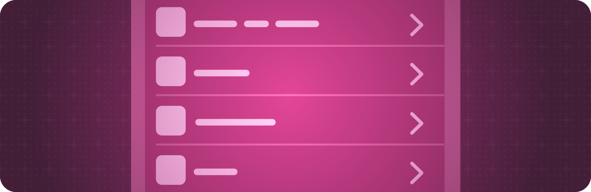

+++
title = "4 列表"
date = 2026-09-12T12:47:47+08:00
weight = 4
type = "docs"
description = ""
isCJKLanguage = true
draft = false
+++

> 原文链接: [https://developer.apple.com/documentation/swiftui/lists](https://developer.apple.com/documentation/swiftui/lists)

# 4 列表

显示结构化的、可滚动的信息列。

## 概述 {#Overview}

使用列表来显示一维的垂直视图集合。

列表是一种复杂的容器类型，当内容多到超出当前显示区域时会自动提供滚动。你既可以为列表中的各行提供单独的视图来构建列表，也可以用 [ForEach](https://developer.apple.com/documentation/swiftui/foreach) 遍历一组行。你还可以混用这两种策略，把任意数量的单独视图和 `ForEach` 结构组合在一起。

使用视图修饰符可以配置列表及其行、页眉、区段和分隔线的外观与行为。例如，你可以为列表应用某种样式、为单行添加轻扫手势，或者让列表支持下拉刷新手势。你还可以使用与 [滚动视图](../7-ScrollViews/) 相关的配置来控制列表的隐式滚动行为。

关于设计指导，请参阅 Human Interface Guidelines 中的 [列表与表格](https://developer.apple.com/design/human-interface-guidelines/lists-and-tables)。

## 创建列表 {#Creating-a-list}

- [在列表中显示数据](4.1-DisplayingDataInLists/) — 以符合平台习惯的外观可视化数据集。
- [List](https://developer.apple.com/documentation/swiftui/list) — 一种以单列形式呈现数据行的容器，可选择支持选中一个或多个成员。
- [listStyle(_:)](https://developer.apple.com/documentation/swiftui/view/liststyle(_:)) — 设置该视图内列表的样式。

## 逐步展开信息 {#Disclosing-information-progressively}

- [OutlineGroup](https://developer.apple.com/documentation/swiftui/outlinegroup) — 一种根据底层树形结构、可标识的数据集合按需计算视图和展开组的结构。
- [DisclosureGroup](https://developer.apple.com/documentation/swiftui/disclosuregroup) — 一种根据展开控件的状态显示或隐藏另一个内容视图的视图。
- [disclosureGroupStyle(_:)](https://developer.apple.com/documentation/swiftui/view/disclosuregroupstyle(_:)) — 设置该视图内展开组的样式。

## 配置列表的布局 {#Configuring-a-lists-layout}

- [listRowInsets(_:)](https://developer.apple.com/documentation/swiftui/view/listrowinsets(_:)) — 为列表中的行应用内缩。
- [listRowInsets(_:_:)](https://developer.apple.com/documentation/swiftui/view/listrowinsets(_:_:)) — 设置列表中各行在指定边缘上的内缩。
- [defaultMinListRowHeight](https://developer.apple.com/documentation/swiftui/environmentvalues/defaultminlistrowheight) — 列表中行的默认最小高度。
- [defaultMinListHeaderHeight](https://developer.apple.com/documentation/swiftui/environmentvalues/defaultminlistheaderheight) — 列表中页眉的默认最小高度。
- [listRowSpacing(_:)](https://developer.apple.com/documentation/swiftui/view/listrowspacing(_:)) — 设置 List 中相邻两行之间的垂直间距。
- [listSectionSpacing(_:)](https://developer.apple.com/documentation/swiftui/view/listsectionspacing(_:)) — 把 [List](https://developer.apple.com/documentation/swiftui/list) 中相邻区段之间的间距设置为自定义值。
- [ListSectionSpacing](https://developer.apple.com/documentation/swiftui/listsectionspacing) — 列表中相邻两个区段之间的间距选项。
- [listSectionMargins(_:_:)](https://developer.apple.com/documentation/swiftui/view/listsectionmargins(_:_:)) — 为特定边缘设置区段边距。

## 配置行 {#Configuring-rows}

- [listItemTint(_:)](https://developer.apple.com/documentation/swiftui/view/listitemtint(_:)) — 为列表中的内容设置固定的着色颜色。
- [ListItemTint](https://developer.apple.com/documentation/swiftui/listitemtint) — 一种可以应用于列表中内容的着色效果配置。

## 配置页眉 {#Configuring-headers}

- [headerProminence(_:)](https://developer.apple.com/documentation/swiftui/view/headerprominence(_:)) — 设置该视图的页眉突出程度。
- [headerProminence](https://developer.apple.com/documentation/swiftui/environmentvalues/headerprominence) — 要应用于视图中区段页眉的突出程度。
- [Prominence](https://developer.apple.com/documentation/swiftui/prominence) — 表示视图层级突出程度的类型。

## 配置分隔线 {#Configuring-separators}

- [listRowSeparatorTint(_:edges:)](https://developer.apple.com/documentation/swiftui/view/listrowseparatortint(_:edges:)) — 设置与某一行关联的着色颜色。
- [listSectionSeparatorTint(_:edges:)](https://developer.apple.com/documentation/swiftui/view/listsectionseparatortint(_:edges:)) — 设置与某个区段关联的着色颜色。
- [listRowSeparator(_:edges:)](https://developer.apple.com/documentation/swiftui/view/listrowseparator(_:edges:)) — 为这一特定行关联的分隔线设置显示模式。
- [listSectionSeparator(_:edges:)](https://developer.apple.com/documentation/swiftui/view/listsectionseparator(_:edges:)) — 设置是否隐藏与某个列表区段关联的分隔线。

## 配置背景 {#Configuring-backgrounds}

- [listRowBackground(_:)](https://developer.apple.com/documentation/swiftui/view/listrowbackground(_:)) — 在列表行项目后面放置一个自定义背景视图。
- [alternatingRowBackgrounds(_:)](https://developer.apple.com/documentation/swiftui/view/alternatingrowbackgrounds(_:)) — 覆盖该视图中列表和表格是否使用交替行背景。
- [AlternatingRowBackgroundBehavior](https://developer.apple.com/documentation/swiftui/alternatingrowbackgroundbehavior) — 视图在交替行背景方面的样式。
- [backgroundProminence](https://developer.apple.com/documentation/swiftui/environmentvalues/backgroundprominence) — 与该环境关联的视图下方背景的突出程度。
- [BackgroundProminence](https://developer.apple.com/documentation/swiftui/backgroundprominence) — 其他视图下方背景的突出程度。

## 在列表项上显示徽章 {#Displaying-a-badge-on-a-list-item}

- [badge(_:)](https://developer.apple.com/documentation/swiftui/view/badge(_:)) — 根据本地化的字符串资源为该视图生成一个徽章。
- [badgeProminence(_:)](https://developer.apple.com/documentation/swiftui/view/badgeprominence(_:)) — 指定该视图创建的徽章的突出程度。
- [badgeProminence](https://developer.apple.com/documentation/swiftui/environmentvalues/badgeprominence) — 要应用于与该环境关联的徽章的突出程度。
- [BadgeProminence](https://developer.apple.com/documentation/swiftui/badgeprominence) — 徽章的视觉突出程度。

## 配置交互 {#Configuring-interaction}

- [swipeActions(edge:allowsFullSwipe:content:)](https://developer.apple.com/documentation/swiftui/view/swipeactions(edge:allowsfullswipe:content:)) — 为列表中的某一行添加自定义轻扫操作。
- [selectionDisabled(_:)](https://developer.apple.com/documentation/swiftui/view/selectiondisabled(_:)) — 添加一个条件，控制用户是否可以选择该视图。
- [listRowHoverEffect(_:)](https://developer.apple.com/documentation/swiftui/view/listrowhovereffect(_:)) — 请求包含该视图的列表行使用提供的悬停效果。
- [listRowHoverEffectDisabled(_:)](https://developer.apple.com/documentation/swiftui/view/listrowhovereffectdisabled(_:)) — 请求停用包含该视图的列表行的悬停效果。

## 刷新列表内容 {#Refreshing-a-lists-content}

- [refreshable(action:)](https://developer.apple.com/documentation/swiftui/view/refreshable(action:)) — 添加一个异步处理器，当用户发起请求（例如下拉刷新）时可以更新视图显示的数据。
- [refresh](https://developer.apple.com/documentation/swiftui/environmentvalues/refresh) — 存储在视图环境中的一个刷新动作。
- [RefreshAction](https://developer.apple.com/documentation/swiftui/refreshaction) — 发起刷新操作的动作。

## 编辑列表 {#Editing-a-list}

- [moveDisabled(_:)](https://developer.apple.com/documentation/swiftui/view/movedisabled(_:)) — 添加一个条件，决定视图的视图层级是否可移动。
- [deleteDisabled(_:)](https://developer.apple.com/documentation/swiftui/view/deletedisabled(_:)) — 添加一个条件，决定视图的视图层级是否可删除。
- [editMode](https://developer.apple.com/documentation/swiftui/environmentvalues/editmode) — 表示用户是否可以编辑与该环境关联的视图内容。
- [EditMode](https://developer.apple.com/documentation/swiftui/editmode) — 表示用户是否可以编辑视图内容的模式。
- [EditActions](https://developer.apple.com/documentation/swiftui/editactions) — 视图可以向用户提供的一组针对数据集合的编辑操作。
- [EditableCollectionContent](https://developer.apple.com/documentation/swiftui/editablecollectioncontent) — 一种不透明包装视图，为列表中的某一行添加编辑能力。
- [IndexedIdentifierCollection](https://developer.apple.com/documentation/swiftui/indexedidentifiercollection) — 一种集合包装器，可以同时遍历集合的索引和标识符。

## 配置区段索引 {#Configuring-a-section-index}

- [listSectionIndexVisibility(_:)](https://developer.apple.com/documentation/swiftui/view/listsectionindexvisibility(_:)) — 更改列表区段索引的可见性。
- [sectionIndexLabel(_:)](https://developer.apple.com/documentation/swiftui/view/sectionindexlabel(_:)) — 设置区段索引中用于指向该区段的标签，通常只有一个字符长。
