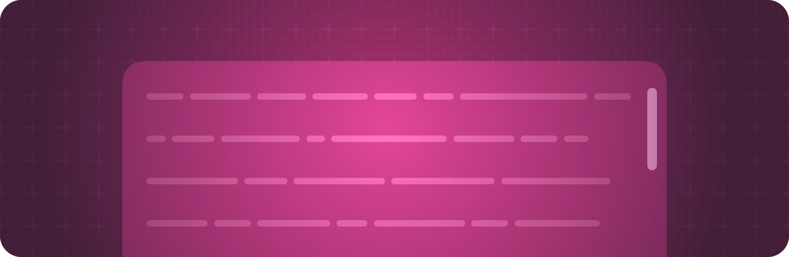

+++
title = "7 滚动视图"
date = 2026-09-12T12:47:47+08:00
weight = 7
type = "docs"
description = ""
isCJKLanguage = true
draft = false
+++

> 原文链接: [https://developer.apple.com/documentation/swiftui/scroll-views](https://developer.apple.com/documentation/swiftui/scroll-views)

# 7 滚动视图

让大家能够滚动查看当前显示区域放不下的内容。

## 概述 {#Overview}

当视图的内容在显示区域里放不下时，你可以把这个视图包在一个 [ScrollView](https://developer.apple.com/documentation/swiftui/scrollview) 中，让大家可以在一个或多个轴向上滚动。用视图修饰符来配置这个滚动视图，例如，你可以设置滚动指示器的可见性，或者某个维度上是否允许滚动。

你可以在滚动视图中放任何类型的视图，但最常把滚动视图用于元素太多、显示区域放不下的布局容器。对于放进滚动视图的某些容器视图（例如惰性栈），容器在视图可见或几乎可见之前不会加载它们。对于另外一些容器（例如普通栈和网格），无论滚动状态如何，容器都会一次性加载全部内容。

[列表](../4-Lists/) 和 [表格](../5-Tables/) 隐式包含一个滚动视图，因此无需为这两类容器添加滚动功能。不过，你可以用与显式滚动视图相同的视图修饰符来配置它们的隐式滚动视图。

关于设计指导，请参阅 Human Interface Guidelines 中的 [滚动视图](https://developer.apple.com/design/human-interface-guidelines/scroll-views)。

## 创建滚动视图 {#Creating-a-scroll-view}

- [ScrollView](https://developer.apple.com/documentation/swiftui/scrollview) — 一种可滚动的视图。
- [ScrollViewReader](https://developer.apple.com/documentation/swiftui/scrollviewreader) — 一种提供编程式滚动的视图，它与一个代理协作，滚动到已知的子视图。
- [ScrollViewProxy](https://developer.apple.com/documentation/swiftui/scrollviewproxy) — 一个代理值，支持以编程方式滚动视图层级中的可滚动视图。

## 管理滚动位置 {#Managing-scroll-position}

- [scrollPosition(_:anchor:)](https://developer.apple.com/documentation/swiftui/view/scrollposition(_:anchor:)) — 把一个滚动位置的绑定关联到该视图内的某个滚动视图。
- [scrollPosition(id:anchor:)](https://developer.apple.com/documentation/swiftui/view/scrollposition(id:anchor:)) — 关联一个绑定，当该视图内的滚动视图滚动时更新它。
- [defaultScrollAnchor(_:)](https://developer.apple.com/documentation/swiftui/view/defaultscrollanchor(_:)) — 关联一个锚点，用于控制默认应渲染滚动视图内容的哪个部分。
- [defaultScrollAnchor(_:for:)](https://developer.apple.com/documentation/swiftui/view/defaultscrollanchor(_:for:)) — 关联一个锚点，用于在特定情形下控制滚动视图的位置。
- [ScrollAnchorRole](https://developer.apple.com/documentation/swiftui/scrollanchorrole) — 定义滚动锚点角色的类型。
- [ScrollPosition](https://developer.apple.com/documentation/swiftui/scrollposition) — 一种类型，用于定义滚动视图在其内容中滚动到了哪个语义位置。

## 定义滚动目标 {#Defining-scroll-targets}

- [scrollTargetBehavior(_:)](https://developer.apple.com/documentation/swiftui/view/scrolltargetbehavior(_:)) — 设置视图在指定轴上可滚动时的滚动行为。
- [scrollTargetLayout(isEnabled:)](https://developer.apple.com/documentation/swiftui/view/scrolltargetlayout(isenabled:)) — 把最外层的布局配置为滚动目标布局。
- [ScrollTarget](https://developer.apple.com/documentation/swiftui/scrolltarget) — 一种类型，定义滚动视图应尝试滚动到的目标。
- [ScrollTargetBehavior](https://developer.apple.com/documentation/swiftui/scrolltargetbehavior) — 一种类型，定义可滚动视图的滚动行为。
- [ScrollTargetBehaviorContext](https://developer.apple.com/documentation/swiftui/scrolltargetbehaviorcontext) — 滚动目标行为用来更新其滚动目标的上下文。
- [PagingScrollTargetBehavior](https://developer.apple.com/documentation/swiftui/pagingscrolltargetbehavior) — 把滚动目标按容器几何信息对齐的滚动行为。
- [ViewAlignedScrollTargetBehavior](https://developer.apple.com/documentation/swiftui/viewalignedscrolltargetbehavior) — 把滚动目标按视图几何信息对齐的滚动行为。
- [AnyScrollTargetBehavior](https://developer.apple.com/documentation/swiftui/anyscrolltargetbehavior) — 类型被抹除的滚动目标行为。
- [ScrollTargetBehaviorProperties](https://developer.apple.com/documentation/swiftui/scrolltargetbehaviorproperties) — 影响滚动目标行为所适用滚动视图的属性。
- [ScrollTargetBehaviorPropertiesContext](https://developer.apple.com/documentation/swiftui/scrolltargetbehaviorpropertiescontext) — 滚动目标行为用来决定其属性的上下文。

## 为滚动过渡添加动画 {#Animating-scroll-transitions}

- [scrollTransition(_:axis:transition:)](https://developer.apple.com/documentation/swiftui/view/scrolltransition(_:axis:transition:)) — 应用给定的过渡，当该视图在所属滚动视图的可见区域内出现和消失时，在过渡的各个阶段之间添加动画。
- [scrollTransition(topLeading:bottomTrailing:axis:transition:)](https://developer.apple.com/documentation/swiftui/view/scrolltransition(topleading:bottomtrailing:axis:transition:)) — 应用给定的过渡，当该视图在所属滚动视图的可见区域内出现和消失时，在过渡的各个阶段之间添加动画。
- [ScrollTransitionPhase](https://developer.apple.com/documentation/swiftui/scrolltransitionphase) — 视图在与其他视图一起滚动时所经历的过渡阶段。
- [ScrollTransitionConfiguration](https://developer.apple.com/documentation/swiftui/scrolltransitionconfiguration) — 滚动过渡的配置，用来控制视图滚过所属滚动视图或其他容器的可见区域时如何应用过渡。

## 响应滚动视图的变化 {#Responding-to-scroll-view-changes}

- [onScrollGeometryChange(for:of:action:)](https://developer.apple.com/documentation/swiftui/view/onscrollgeometrychange(for:of:action:)) — 添加一个动作，当由滚动的几何信息生成的值发生变化时执行。
- [onScrollTargetVisibilityChange(idType:threshold:_:)](https://developer.apple.com/documentation/swiftui/view/onscrolltargetvisibilitychange(idtype:threshold:_:)) — 添加一个动作，调用时携带关于哪些视图会被视为可见的信息。
- [onScrollVisibilityChange(threshold:_:)](https://developer.apple.com/documentation/swiftui/view/onscrollvisibilitychange(threshold:_:)) — 添加一个动作，当视图越过被视为在屏幕上或不在屏幕上的阈值时调用。
- [onScrollPhaseChange(_:)](https://developer.apple.com/documentation/swiftui/view/onscrollphasechange(_:)) — 添加一个动作，当层级中第一个滚动视图的滚动阶段发生变化时执行。
- [ScrollGeometry](https://developer.apple.com/documentation/swiftui/scrollgeometry) — 定义滚动视图几何信息的类型。
- [ScrollPhase](https://developer.apple.com/documentation/swiftui/scrollphase) — 描述像滚动视图这样的可滚动视图的滚动手势状态的类型。
- [ScrollPhaseChangeContext](https://developer.apple.com/documentation/swiftui/scrollphasechangecontext) — 当滚动视图的阶段发生变化时，为你提供更多上下文的类型。

## 显示滚动指示器 {#Showing-scroll-indicators}

- [scrollIndicatorsFlash(onAppear:)](https://developer.apple.com/documentation/swiftui/view/scrollindicatorsflash(onappear:)) — 当可滚动视图出现时闪烁其滚动指示器。
- [scrollIndicatorsFlash(trigger:)](https://developer.apple.com/documentation/swiftui/view/scrollindicatorsflash(trigger:)) — 当某个值发生变化时闪烁可滚动视图的滚动指示器。
- [scrollIndicators(_:axes:)](https://developer.apple.com/documentation/swiftui/view/scrollindicators(_:axes:)) — 设置该视图内滚动指示器的可见性。
- [horizontalScrollIndicatorVisibility](https://developer.apple.com/documentation/swiftui/environmentvalues/horizontalscrollindicatorvisibility) — 应用于任何可横向滚动内容的滚动指示器的可见性。
- [verticalScrollIndicatorVisibility](https://developer.apple.com/documentation/swiftui/environmentvalues/verticalscrollindicatorvisibility) — 应用于任何可纵向滚动内容的滚动指示器的可见性。
- [ScrollIndicatorVisibility](https://developer.apple.com/documentation/swiftui/scrollindicatorvisibility) — 用户界面元素滚动指示器的可见性。

## 管理内容可见性 {#Managing-content-visibility}

- [scrollContentBackground(_:)](https://developer.apple.com/documentation/swiftui/view/scrollcontentbackground(_:)) — 指定该视图内可滚动视图背景的可见性。
- [scrollClipDisabled(_:)](https://developer.apple.com/documentation/swiftui/view/scrollclipdisabled(_:)) — 设置滚动视图是否把其内容裁剪到自身边界内。
- [ScrollContentOffsetAdjustmentBehavior](https://developer.apple.com/documentation/swiftui/scrollcontentoffsetadjustmentbehavior) — 一种类型，定义滚动视图可以采用的各类内容偏移调整行为。

## 停用滚动 {#Disabling-scrolling}

- [scrollDisabled(_:)](https://developer.apple.com/documentation/swiftui/view/scrolldisabled(_:)) — 停用或启用可滚动视图中的滚动。
- [isScrollEnabled](https://developer.apple.com/documentation/swiftui/environmentvalues/isscrollenabled) — 一个布尔值，指示与该环境关联的任何滚动视图是否允许发生滚动。

## 配置滚动回弹行为 {#Configuring-scroll-bounce-behavior}

- [scrollBounceBehavior(_:axes:)](https://developer.apple.com/documentation/swiftui/view/scrollbouncebehavior(_:axes:)) — 配置可滚动视图在指定轴向上的回弹行为。
- [horizontalScrollBounceBehavior](https://developer.apple.com/documentation/swiftui/environmentvalues/horizontalscrollbouncebehavior) — 可滚动视图水平轴向上的滚动回弹模式。
- [verticalScrollBounceBehavior](https://developer.apple.com/documentation/swiftui/environmentvalues/verticalscrollbouncebehavior) — 可滚动视图垂直轴向上的滚动回弹模式。
- [ScrollBounceBehavior](https://developer.apple.com/documentation/swiftui/scrollbouncebehavior) — 可滚动视图滚动到内容末端时可以回弹的各种方式。

## 配置滚动边缘效果 {#Configuring-scroll-edge-effects}

- [scrollEdgeEffectStyle(_:for:)](https://developer.apple.com/documentation/swiftui/view/scrolledgeeffectstyle(_:for:)) — 为该层级中滚动视图配置滚动边缘效果样式。
- [scrollEdgeEffectHidden(_:for:)](https://developer.apple.com/documentation/swiftui/view/scrolledgeeffecthidden(_:for:)) — 隐藏该层级中滚动视图的任何滚动边缘效果。
- [ScrollEdgeEffectStyle](https://developer.apple.com/documentation/swiftui/scrolledgeeffectstyle) — 一种结构体，用于指定滚动内容与带控件的区域（例如工具栏）之间的模糊过渡。
- [safeAreaBar(edge:alignment:spacing:content:)](https://developer.apple.com/documentation/swiftui/view/safeareabar(edge:alignment:spacing:content:)) — 在修饰后的视图旁边把指定内容显示为自定义栏。

## 与软件键盘交互 {#Interacting-with-a-software-keyboard}

- [scrollDismissesKeyboard(_:)](https://developer.apple.com/documentation/swiftui/view/scrolldismisseskeyboard(_:)) — 配置可滚动内容与软件键盘交互的行为。
- [scrollDismissesKeyboardMode](https://developer.apple.com/documentation/swiftui/environmentvalues/scrolldismisseskeyboardmode) — 可滚动内容与软件键盘交互的方式。
- [ScrollDismissesKeyboardMode](https://developer.apple.com/documentation/swiftui/scrolldismisseskeyboardmode) — 可滚动内容与软件键盘交互的各种方式。

## 为不同输入方式管理滚动 {#Managing-scrolling-for-different-inputs}

- [scrollInputBehavior(_:for:)](https://developer.apple.com/documentation/swiftui/view/scrollinputbehavior(_:for:)) — 启用或停用使用特定输入时在可滚动视图中的滚动。
- [ScrollInputKind](https://developer.apple.com/documentation/swiftui/scrollinputkind) — 用于滚动视图的输入方式。
- [ScrollInputBehavior](https://developer.apple.com/documentation/swiftui/scrollinputbehavior) — 一种类型，定义输入是否应滚动某个视图。
