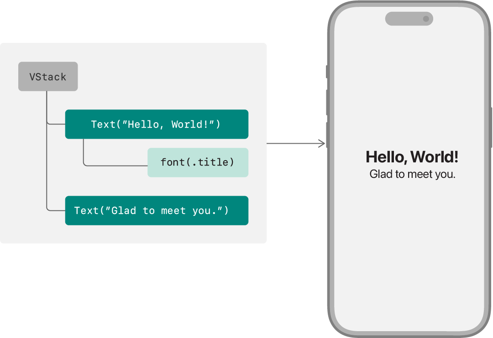

+++
title = "1.1 声明自定义视图"
date = 2026-09-12T12:47:47+08:00
weight = 1
type = "docs"
description = ""
isCJKLanguage = true
draft = false
+++


> 原文链接: [https://developer.apple.com/documentation/swiftui/declaring-a-custom-view](https://developer.apple.com/documentation/swiftui/declaring-a-custom-view)

# 1.1 声明自定义视图

定义视图并把它们组装成视图层级。

## 概述 {#Overview}

SwiftUI 提供了一种声明式的用户界面设计方式。在传统的命令式方式中，控制器代码不仅要负责实例化、布局和配置视图，还要随着条件变化不断更新它们。相反，在声明式方式中，你通过在层级中声明与界面目标布局相对应的视图，创建一份轻量的界面描述。随后由 SwiftUI 负责绘制和更新这些视图，以响应诸如用户输入或状态变化之类的事件。



SwiftUI 提供了用于定义和配置用户界面中视图的工具。你用 SwiftUI 的内置视图、以及你已经定义好的其他复合视图来组合自定义视图。你用视图修饰符配置这些视图，并把它们连接到数据模型。然后，你把自己的自定义视图放进应用的视图层级中。

### 遵循 View 协议 {#Conform-to-the-view-protocol}

定义一个遵循 [View](https://developer.apple.com/documentation/swiftui/view) 协议的结构体，即可声明一个自定义视图类型：

```swift
struct MyView: View {
}
```

与其他 [Swift 协议](https://docs.swift.org/swift-book/LanguageGuide/Protocols.html)一样，[View](https://developer.apple.com/documentation/swiftui/view) 协议为某种功能提供了蓝图——在这里就是 SwiftUI 绘制到屏幕上的元素的行为。遵循该协议既意味着视图必须满足一些要求，也意味着协议提供了一些功能。满足这些要求之后，你就可以把自定义视图插入视图层级，使它成为应用用户界面的一部分。

### 声明 body {#Declare-a-body}

[View](https://developer.apple.com/documentation/swiftui/view) 协议的主要要求是：遵循类型必须定义一个 [body](https://developer.apple.com/documentation/swiftui/view/body-8kl5o) [计算属性](https://docs.swift.org/swift-book/LanguageGuide/Properties.html#ID259)：

```swift
struct MyView: View {
    var body: some View {
    }
}
```

每当 SwiftUI 需要更新视图时，它都会读取这个属性的值。在视图的生命周期中这可能反复发生，通常是为了响应用户输入或系统事件。视图返回的值就是 SwiftUI 绘制到屏幕上的元素。

[View](https://developer.apple.com/documentation/swiftui/view) 协议的次要要求是：遵循类型必须为 body 属性指明一个[关联类型](https://docs.swift.org/swift-book/LanguageGuide/Generics.html#ID189)。不过，你并不需要显式声明它。相反，你用 `some View` 语法把 body 属性声明为[不透明类型](https://docs.swift.org/swift-book/LanguageGuide/OpaqueTypes.html)，只需表明 body 的类型遵循 [View](https://developer.apple.com/documentation/swiftui/view)。具体类型取决于 body 的内容，而随着你在开发过程中修改 body，这个内容也会变化。Swift 会自动推断出具体类型。

### 组装视图的内容 {#Assemble-the-views-content}

通过向视图的 body 属性添加内容来描述视图外观。你可以用 SwiftUI 提供的内置视图以及你在别处定义的自定义视图来组合 body。例如，你可以创建一个 body，用内置的 [Text](https://developer.apple.com/documentation/swiftui/text) 视图绘制字符串 “Hello, World!”：

```swift
struct MyView: View {
    var body: some View {
        Text("Hello, World!")
    }
}
```


除了针对特定内容种类、控件和指示器的视图（例如 [Text](https://developer.apple.com/documentation/swiftui/text)、[Toggle](https://developer.apple.com/documentation/swiftui/toggle) 和 [ProgressView](https://developer.apple.com/documentation/swiftui/progressview)）之外，SwiftUI 还提供可以用来排列其他视图的内置视图。例如，你可以用 [VStack](https://developer.apple.com/documentation/swiftui/vstack) 把两个 [Text](https://developer.apple.com/documentation/swiftui/text) 视图纵向堆叠：

```swift
struct MyView: View {
    var body: some View {
        VStack {
            Text("Hello, World!")
            Text("Glad to meet you.")
        }
    }
}
```


像上面例子中的栈这样接受多个子视图输入的视图，通常通过一个带有 [ViewBuilder](https://developer.apple.com/documentation/swiftui/viewbuilder) 特性的闭包来实现。这启用了一个多语句闭包，调用处不需要额外的语法。你只需依次列出各个输入视图即可。

关于包含其他视图的视图示例，参见[布局基础](../../../viewlayout/1-LayoutFundamentals/)。

### 用修饰符配置视图 {#Configure-views-with-modifiers}

要配置视图 body 中的各个视图，你可以应用视图修饰符。修饰符不过是在某个特定视图上调用的方法。该方法返回一个新的、被改动过的视图，在视图层级中实际上取代了原来的视图。

SwiftUI 为此扩展了 [View](https://developer.apple.com/documentation/swiftui/view) 协议，提供了大量方法。所有 [View](https://developer.apple.com/documentation/swiftui/view) 协议的遵循者——无论是内置视图还是自定义视图——都能使用这些方法，以某种方式改变视图的行为。例如，你可以应用 [font(_:)](https://developer.apple.com/documentation/swiftui/view/font(_:)) 修饰符来改变文本视图的字体：

```swift
struct MyView: View {
    var body: some View {
        VStack {
            Text("Hello, World!")
                .font(.title)
            Text("Glad to meet you.")
        }
    }
}
```


关于视图修饰符如何工作、以及如何在视图中使用它们的更多信息，参见[配置视图](../1.18-ConfiguringViews/)。

### 管理数据 {#Manage-data}

要为视图提供输入，请添加属性。例如，你可以让 “Hello, World!” 字符串的字体可配置：

```swift
struct MyView: View {
    let helloFont: Font
    
    var body: some View {
        VStack {
            Text("Hello, World!")
                .font(helloFont)
            Text("Glad to meet you.")
        }
    }
}
```

如果某个输入值发生变化，SwiftUI 会注意到该变化，并且只重绘界面中受影响的部分。这可能涉及重新初始化整个视图，但 SwiftUI 会替你管理这些。

由于系统可能随时重新初始化视图，因此请务必避免在视图的初始化代码中做任何重要工作。通常最好干脆不写显式构造器，就像上面的例子那样，让 Swift 合成一个*逐成员构造器*。

SwiftUI 提供了许多工具，帮助你在这些约束下管理应用的数据，如[模型数据](../../../datastorage/1-ModelData/)所述。关于 Swift 构造器的信息，参见 *The Swift Programming Language* 中的[初始化](https://docs.swift.org/swift-book/LanguageGuide/Initialization.html)。

### 把视图加入视图层级 {#Add-your-view-to-the-view-hierarchy}

定义好视图之后，你就可以像使用内置视图那样把它放进其他视图。你只需在希望它出现的位置声明它，即可把它加进去。例如，你可以把 `MyView` 放进应用的 `ContentView`——Xcode 会自动为新应用创建它作为根视图：

```swift
struct ContentView: View {
    var body: some View {
        MyView(helloFont: .title)
    }
}
```

或者，你也可以把视图作为应用中某个新场景的根视图，例如为 macOS 偏好设置窗口声明内容的 [Settings](https://developer.apple.com/documentation/swiftui/settings) 场景，或为 watchOS 通知声明内容的 [WKNotificationScene](https://developer.apple.com/documentation/swiftui/wknotificationscene) 场景。关于用 SwiftUI 定义应用结构的更多信息，参见[应用组织](../../../appstructure/1-AppOrganization/)。
