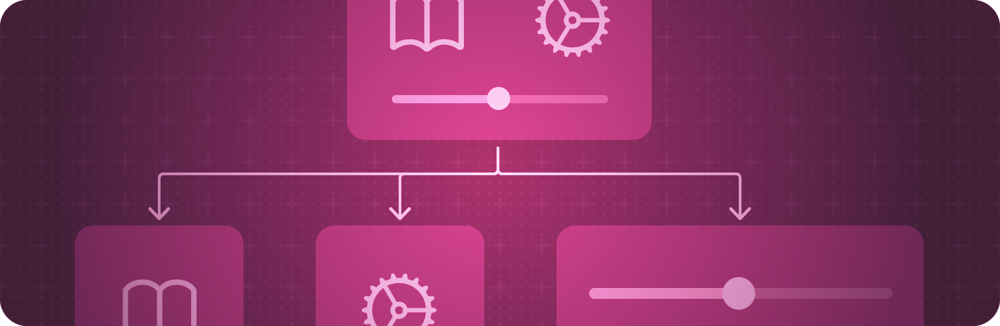

+++
title = "1 视图基础"
date = 2026-09-12T12:47:47+08:00
weight = 1
type = "docs"
description = ""
isCJKLanguage = true
draft = false
+++

> 原文链接: [https://developer.apple.com/documentation/swiftui/view-fundamentals](https://developer.apple.com/documentation/swiftui/view-fundamentals)

# 1 视图基础

用视图层级定义应用的视觉元素。

## 概述 {#Overview}

视图是你用来声明应用用户界面的构建单元。每个视图都包含一段描述，说明在给定状态下要显示什么。应用中用户能看到的每一处内容都源自视图中的描述，任何遵循 [View](https://developer.apple.com/documentation/swiftui/view) 协议的类型都可以在应用中充当视图。

在视图的 [body](https://developer.apple.com/documentation/swiftui/view/body-8kl5o) 计算属性中，把 SwiftUI 提供的内置视图与你创建的其他自定义视图组合起来，就构成一个自定义视图。你可以用 SwiftUI 提供的视图修饰符配置视图，也可以用 [ViewModifier](https://developer.apple.com/documentation/swiftui/viewmodifier) 协议和 [modifier(_:)](https://developer.apple.com/documentation/swiftui/view/modifier(_:)) 方法定义自己的视图修饰符。

## 创建视图 {#Creating-a-view}

- [声明自定义视图](1.1-DeclaringACustomView/) —— 定义视图并把它们组装成视图层级。
- [Wishlist：在 SwiftUI 应用中规划旅行](1.2-WishlistPlanningTravelInASwiftuiApp/) —— 构建一个旅行规划应用，把行程整理进合集并跟踪活动完成情况。
- [View](https://developer.apple.com/documentation/swiftui/view) —— 表示应用用户界面中一部分的类型，并提供用来配置视图的修饰符。
- [ContentBuilder](https://developer.apple.com/documentation/swiftui/contentbuilder) —— 从闭包构造视图和其他内容类型的自定义参数特性。
- [ViewBuilder](https://developer.apple.com/documentation/swiftui/viewbuilder) —— 从闭包构造视图的自定义参数特性。

## 修改视图 {#Modifying-a-view}

- [配置视图](1.18-ConfiguringViews/) —— 通过应用视图修饰符调整视图的特征。
- [减少视图修饰符的维护量](1.19-ReducingViewModifierMaintenance/) —— 把经常复用的视图修饰符打包成自定义视图修饰符。
- [modifier(_:)](https://developer.apple.com/documentation/swiftui/view/modifier(_:)) —— 把一个修饰符应用到视图并返回新视图。
- [ViewModifier](https://developer.apple.com/documentation/swiftui/viewmodifier) —— 你应用到视图或另一个视图修饰符上、产生原值不同版本的修饰符。
- [EmptyModifier](https://developer.apple.com/documentation/swiftui/emptymodifier) —— 空的（恒等）修饰符，在开发期间用于在编译期切换修饰符。
- [ModifiedContent](https://developer.apple.com/documentation/swiftui/modifiedcontent) —— 应用了修饰符的值。
- [EnvironmentalModifier](https://developer.apple.com/documentation/swiftui/environmentalmodifier) —— 必须先在某环境中解析为具体修饰符才能使用的修饰符。
- [ManipulableModifier](https://developer.apple.com/documentation/swiftui/manipulablemodifier)
- [ManipulableResponderModifier](https://developer.apple.com/documentation/swiftui/manipulablerespondermodifier)
- [ManipulableTransformBindingModifier](https://developer.apple.com/documentation/swiftui/manipulabletransformbindingmodifier)
- [ManipulationGeometryModifier](https://developer.apple.com/documentation/swiftui/manipulationgeometrymodifier)
- [ManipulationGestureModifier](https://developer.apple.com/documentation/swiftui/manipulationgesturemodifier)
- [ManipulationUsingGestureStateModifier](https://developer.apple.com/documentation/swiftui/manipulationusinggesturestatemodifier)
- [Manipulable](https://developer.apple.com/documentation/swiftui/manipulable) —— 各种可操控相关类型的命名空间。

## 响应视图生命周期更新 {#Responding-to-view-life-cycle-updates}

- [onAppear(perform:)](https://developer.apple.com/documentation/swiftui/view/onappear(perform:)) —— 添加在该视图出现之前要执行的动作。
- [onDisappear(perform:)](https://developer.apple.com/documentation/swiftui/view/ondisappear(perform:)) —— 添加在该视图消失之后要执行的动作。

## 分配任务 {#Assigning-tasks}

- [task(id:name:executorPreference:priority:file:line:_:)](https://developer.apple.com/documentation/swiftui/view/task(id:name:executorpreference:priority:file:line:_:)) —— 添加在该视图出现之前、或某个指定值变化时要执行的任务。
- [task(id:name:priority:file:line:_:)](https://developer.apple.com/documentation/swiftui/view/task(id:name:priority:file:line:_:)) —— 添加在该视图出现之前、或某个指定值变化时要执行的任务。
- [task(name:executorPreference:priority:file:line:action:)](https://developer.apple.com/documentation/swiftui/view/task(name:executorpreference:priority:file:line:action:)) —— 添加在该视图出现之前要执行的异步任务。
- [task(name:priority:file:line:_:)](https://developer.apple.com/documentation/swiftui/view/task(name:priority:file:line:_:)) —— 添加在该视图出现之前要执行的异步任务。

## 管理视图层级 {#Managing-the-view-hierarchy}

- [id(_:)](https://developer.apple.com/documentation/swiftui/view/id(_:)) —— 把视图的身份绑定到给定的代理值。
- [tag(_:includeOptional:)](https://developer.apple.com/documentation/swiftui/view/tag(_:includeoptional:)) —— 设置该视图的唯一标签值。
- [equatable()](https://developer.apple.com/documentation/swiftui/view/equatable()) —— 当新值与旧值相同时，阻止视图更新其子视图。

## 支持的内容类型 {#Supporting-content-types}

- [EmptyContent](https://developer.apple.com/documentation/swiftui/emptycontent) —— 不含任何内容的内容。
- [TupleContent](https://developer.apple.com/documentation/swiftui/tuplecontent) —— 由一组内容元组创建、被视为同级的内容。

## 支持的视图类型 {#Supporting-view-types}

- [AnyView](https://developer.apple.com/documentation/swiftui/anyview) —— 类型擦除的视图。
- [EmptyView](https://developer.apple.com/documentation/swiftui/emptyview) —— 不含任何内容的视图。
- [EquatableView](https://developer.apple.com/documentation/swiftui/equatableview) —— 把自身与其之前的值比较、并在新值与旧值相同时阻止子视图更新的视图类型。
- [SubscriptionView](https://developer.apple.com/documentation/swiftui/subscriptionview) —— 带动作订阅某个发布者的视图。
- [TupleView](https://developer.apple.com/documentation/swiftui/tupleview) —— 由 Swift 的视图值元组创建的视图。
