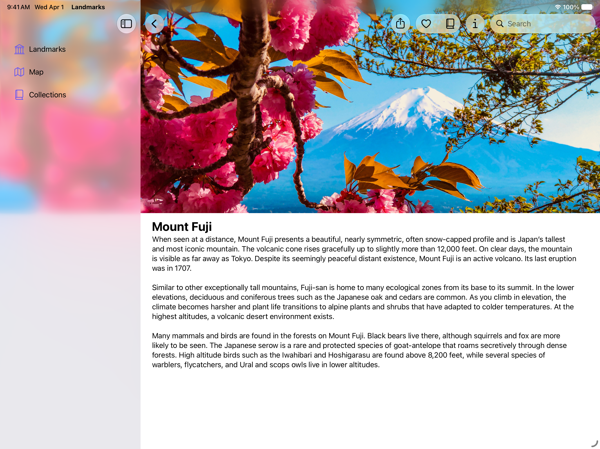
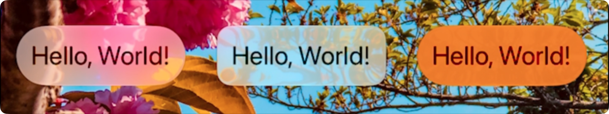
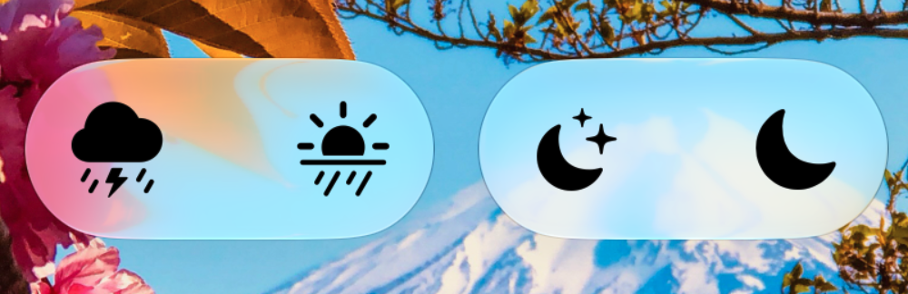
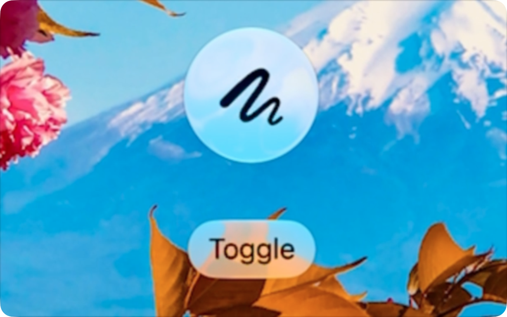

+++
title = "3.1 把 Liquid Glass 应用到自定义视图"
date = 2026-09-12T12:47:47+08:00
weight = 1
type = "docs"
description = ""
isCJKLanguage = true
draft = false
+++


> 原文链接: [https://developer.apple.com/documentation/swiftui/applying-liquid-glass-to-custom-views](https://developer.apple.com/documentation/swiftui/applying-liquid-glass-to-custom-views)

# 3.1 把 Liquid Glass 应用到自定义视图

用 Liquid Glass 效果配置、组合并形变视图。

## 概述 {#Overview}

Apple 各平台的界面都采用了一种新的动态材质 Liquid Glass，它把玻璃的光学特性与流动感结合在一起。Liquid Glass 是一种会模糊其后方内容、反射周围内容的颜色与光线，并实时响应触摸和指针交互的材质。SwiftUI 中的标准组件都使用 Liquid Glass。把 Liquid Glass 用到自定义组件上，就能用独特的动画与过渡来移动、组合这些组件，并在它们之间形变。



要了解 Liquid Glass 以及更多内容，参见 [Landmarks：用 Liquid Glass 构建应用](../../../essentials/1-LandmarksBuildingAnAppWithLiquidGlass/)。

## 应用并配置 Liquid Glass 效果 {#Apply-and-configure-Liquid-Glass-effects}

使用 [glassEffect(_:in:)](https://developer.apple.com/documentation/swiftui/view/glasseffect(_:in:)) 修饰符把 Liquid Glass 效果添加到视图上。默认情况下，该修饰符使用 [Glass](https://developer.apple.com/documentation/swiftui/glass) 的 [regular](https://developer.apple.com/documentation/swiftui/glass/regular) 变体，并在视图内容之后的 [Capsule](https://developer.apple.com/documentation/swiftui/capsule) 形状内应用给定效果。

你可以通过配置该效果，以多种方式自定义组件：

- 使用不同的形状，让应用中各个自定义组件具有一致的外观与手感。例如，如果要把该效果应用到作为 `Capsule` 或 [Circle](https://developer.apple.com/documentation/swiftui/circle) 会显得奇怪的较大组件上，就改用圆角矩形。
- 指定色调颜色以暗示其显著性。
- 为自定义组件添加 [interactive(_:)](https://developer.apple.com/documentation/swiftui/glass/interactive(_:))，让它们响应触摸和指针交互。这会应用与 [glass](https://developer.apple.com/documentation/swiftui/primitivebuttonstyle/glass) 为标准按钮提供的、相同的响应式流动反馈。

在下面的例子中，可以观察如何对视图应用 Liquid Glass 效果、使用带特定圆角半径的替代形状，以及创建一个带色调、可响应交互的视图：



视频：[一段展示多个示例的视频，其中包括带 Liquid Glass 的 Text 视图](https://developer.apple.com/tutorials/videos/com.apple.SwiftUI/liquid-glass-view-examples.mp4)

```swift
Text("Hello, World!")
    .font(.title)
    .padding()
    .glassEffect()

Text("Hello, World!")
    .font(.title)
    .padding()
    .glassEffect(in: .rect(cornerRadius: 16.0))

Text("Hello, World!")
    .font(.title)
    .padding()
    .glassEffect(.regular.tint(.orange).interactive())
```

## 用 Liquid Glass 容器组合多个视图 {#Combine-multiple-views-with-Liquid-Glass-containers}

在多个视图上应用 Liquid Glass 效果时，请使用 [GlassEffectContainer](https://developer.apple.com/documentation/swiftui/glasseffectcontainer)，以获得最佳的渲染性能。容器还让带 Liquid Glass 效果的视图可以融合彼此的形状，并在过渡期间相互形变。在容器内，每个带 [glassEffect(_:in:)](https://developer.apple.com/documentation/swiftui/view/glasseffect(_:in:)) 修饰符的视图都会渲染出它后方的效果。

你可以自定义容器上的间距，控制各视图背后的 Liquid Glass 效果如何相互影响。容器上的间距值越大，过渡期间视图背后的 Liquid Glass 效果就越早融合在一起、把形状合并起来。如果容器上的间距值大于内部 [HStack](https://developer.apple.com/documentation/swiftui/hstack)、[VStack](https://developer.apple.com/documentation/swiftui/vstack) 或其他布局容器的间距，那么由于视图彼此太近，处于静止状态时 Liquid Glass 效果就已经开始融合。让视图显现或消失的动画，会随着容器内空间的变化让形状分离或合并。

`glassEffect(_:in:)` 修饰符会捕获内容并交给容器渲染。请把 `glassEffect(_:in:)` 修饰符放在其他影响视图外观的修饰符之后。

在下面的例子中，两张图像被放得很近，Liquid Glass 效果开始融合它们的形状。当一个容器内的各个组件相互靠近移动时，这就产生了流畅的动画：


```swift
GlassEffectContainer(spacing: 40.0) {
    HStack(spacing: 40.0) {
        Image(systemName: "scribble.variable")
            .frame(width: 80.0, height: 80.0)
            .font(.system(size: 36))
            .glassEffect()

        Image(systemName: "eraser.fill")
            .frame(width: 80.0, height: 80.0)
            .font(.system(size: 36))
            .glassEffect()

            // `offset` 展示了容器内 Liquid Glass 效果如何相互作用。
            // 配合动画以及组件的出现与消失，可以做出看起来有目的的效果。
            .offset(x: -40.0, y: 0.0)
    }
}
```

在某些情况下，即使内容处于静止状态，你也希望多个视图的几何形状共同构成单个 Liquid Glass 效果胶囊。使用 [glassEffectUnion(id:namespace:)](https://developer.apple.com/documentation/swiftui/view/glasseffectunion(id:namespace:)) 修饰符来指定某个视图参与一个具有特定 ID 的统一效果。这会把形状、Liquid Glass 效果和 ID 都相似的所有效果合并成应用了 Liquid Glass 材质的单个形状。在动态创建视图，或者视图位于 `HStack`、`VStack` 这类布局容器之外时，这尤其有用。



```swift
let symbolSet: [String] = ["cloud.bolt.rain.fill", "sun.rain.fill", "moon.stars.fill", "moon.fill"]

GlassEffectContainer(spacing: 20.0) {
    HStack(spacing: 20.0) {
        ForEach(symbolSet.indices, id: \.self) { item in
            Image(systemName: symbolSet[item])
                .frame(width: 80.0, height: 80.0)
                .font(.system(size: 36))
                .glassEffect()
                .glassEffectUnion(id: item < 2 ? "1" : "2", namespace: namespace)
        }
    }
}
```

## 在过渡期间形变 Liquid Glass 效果 {#Morph-Liquid-Glass-effects-during-transitions}

形变效果发生在带 Liquid Glass 效果的视图之间的过渡或动画期间。使用 [glassEffectID(_:in:)](https://developer.apple.com/documentation/swiftui/view/glasseffectid(_:in:)) 修饰符来协调容器中带效果的视图之间的过渡。[GlassEffectTransition](https://developer.apple.com/documentation/swiftui/glasseffecttransition) 让你在想要向容器中添加或移除效果时指定所使用的过渡类型。对于位于容器所分配间距之内、你想要添加或移除的效果，默认过渡类型是 [matchedGeometry](https://developer.apple.com/documentation/swiftui/glasseffecttransition/matchedgeometry)。

如果你更希望使用更简单的过渡，或者想创建自定义过渡，请使用 [materialize](https://developer.apple.com/documentation/swiftui/glasseffecttransition/materialize) 过渡和 [withAnimation(_:_:)](https://developer.apple.com/documentation/swiftui/withanimation(_:_:))。对于彼此距离超过容器所分配间距、你想要添加或移除的效果，请使用 `materialize` 过渡。为了让人们获得一致的体验，请在整个应用中使用 `matchedGeometry` 和 `materialize` 过渡。可用的过渡类型中，系统所应用的不只是透明度变化。

请把每个 Liquid Glass 效果与由 [Namespace](https://developer.apple.com/documentation/swiftui/namespace) 属性包装器提供的命名空间中的唯一标识符关联起来。当视图层级变化导致某个形状出现或消失时，这些 ID 能确保 SwiftUI 正确地播放相同形状的动画。SwiftUI 会结合提供给效果容器的间距以及形状自身的几何信息，判断何时、以及把哪些合适的形状形变进出。

`glassEffectID(_:in:)` 和 `glassEffectTransition(_:)` 修饰符只在视图层级过渡或动画期间影响它们的内容。

在下面的例子中，当 `isExpanded` 变量变化时，橡皮擦图像会从铅笔图像形变进出。`GlassEffectContainer` 的间距值为 `40.0`，其中 `HStack` 的间距也是 `40.0`。当橡皮擦最近的边缘小于或等于容器间距时，橡皮擦图像就会形变为铅笔图像。



视频：[一段视频，展示两个视图，左侧是涂鸦符号](https://developer.apple.com/tutorials/videos/com.apple.SwiftUI/liquid-glass-morph-views.mp4)

```swift
@State private var isExpanded: Bool = false
@Namespace private var namespace

var body: some View {
    GlassEffectContainer(spacing: 40.0) {
        HStack(spacing: 40.0) {
            Image(systemName: "scribble.variable")
                .frame(width: 80.0, height: 80.0)
                .font(.system(size: 36))
                .glassEffect()
                .glassEffectID("pencil", in: namespace)

            if isExpanded {
                Image(systemName: "eraser.fill")
                    .frame(width: 80.0, height: 80.0)
                    .font(.system(size: 36))
                    .glassEffect()
                    .glassEffectID("eraser", in: namespace)
            }
        }
    }

    Button("Toggle") {
        withAnimation {
            isExpanded.toggle()
        }
    }
    .buttonStyle(.glass)
}
```

## 使用 Liquid Glass 效果时优化性能 {#Optimize-performance-when-using-Liquid-Glass-effects}

创建过多 Liquid Glass 效果容器、以及在容器之外对过多视图应用效果，都会降低性能。请限制同一时间在屏幕上出现的 Liquid Glass 效果数量。此外，还要优化应用在人们使用时的渲染时间分配。关于如何改进界面性能，参见[探究界面动画卡顿与渲染循环](https://developer.apple.com/videos/play/tech-talks/10855/)和[用 Instruments 优化 SwiftUI 性能](https://developer.apple.com/videos/play/wwdc2025/306/)。
