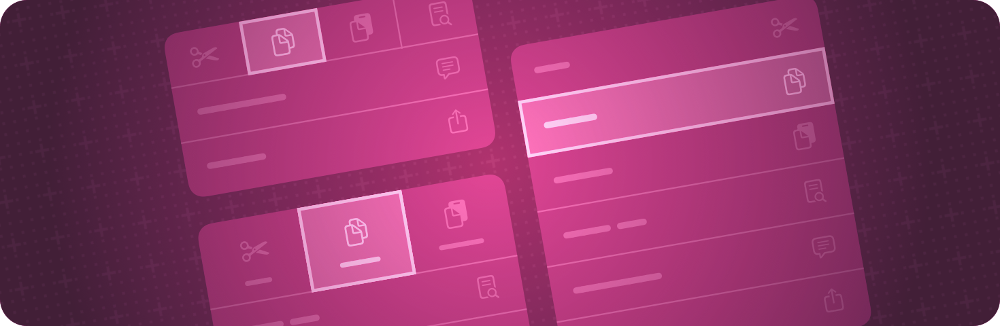

+++
title = "3 视图样式"
date = 2026-09-12T12:47:47+08:00
weight = 3
type = "docs"
description = ""
isCJKLanguage = true
draft = false
+++

> 原文链接: [https://developer.apple.com/documentation/swiftui/view-styles](https://developer.apple.com/documentation/swiftui/view-styles)

# 3 视图样式

为不同类型的视图应用内置的和自定义的外观与行为。

## 概述 {#Overview}

SwiftUI 为某些种类的视图定义了内置样式，并会针对特定的呈现上下文自动选择合适的样式。例如，[Label](https://developer.apple.com/documentation/swiftui/label) 可能显示为图标、字符串标题，或者两者都显示，具体取决于平台、视图是否出现在工具栏中等等。

你可以用某个样式视图修饰符覆盖自动选择的样式。这些修饰符通常会穿过容器视图传播，因此你可以用样式修饰符包裹整个视图层级，从而影响该层级内所有给定类型的视图。

任何定义了 `makeBody(configuration:)` 方法的样式协议（例如 [ToggleStyle](https://developer.apple.com/documentation/swiftui/togglestyle)）也让你可以定义自定义样式。创建一个遵循相应样式协议的类型并实现它的 `makeBody(configuration:)` 方法，然后用样式视图修饰符像使用内置样式那样应用这个新样式。

## 用 Liquid Glass 设置视图样式 {#Styling-views-with-Liquid-Glass}

- [把 Liquid Glass 应用到自定义视图](3.1-ApplyingLiquidGlassToCustomViews/) —— 用 Liquid Glass 效果配置、组合并形变视图。
- [Landmarks：用 Liquid Glass 构建应用](../../essentials/1-LandmarksBuildingAnAppWithLiquidGlass/) —— 用系统提供的和自定义的 Liquid Glass 增强你的应用体验。
- [glassEffect(_:in:)](https://developer.apple.com/documentation/swiftui/view/glasseffect(_:in:)) —— 对视图应用 Liquid Glass 效果。
- [glassEffectID(_:in:)](https://developer.apple.com/documentation/swiftui/view/glasseffectid(_:in:)) —— 把一个标识值关联到该视图内定义的 Liquid Glass 效果。
- [glassEffectTransition(_:)](https://developer.apple.com/documentation/swiftui/view/glasseffecttransition(_:)) —— 把一个玻璃效果过渡关联到该视图内定义的任何玻璃效果。
- [glassEffectUnion(id:namespace:)](https://developer.apple.com/documentation/swiftui/view/glasseffectunion(id:namespace:)) —— 把该视图内定义的任何 Liquid Glass 效果与所提供的标识符组成一个联合。
- [interactive(_:)](https://developer.apple.com/documentation/swiftui/glass/interactive(_:)) —— 返回一份配置为可交互的结构体副本。
- [GlassEffectContainer](https://developer.apple.com/documentation/swiftui/glasseffectcontainer) —— 把多个 Liquid Glass 形状合并成单个形状、并能在各个形状之间形变的视图。
- [GlassEffectTransition](https://developer.apple.com/documentation/swiftui/glasseffecttransition) —— 描述在视图层级中添加或移除玻璃效果时要应用的改动的结构体。
- [GlassButtonStyle](https://developer.apple.com/documentation/swiftui/glassbuttonstyle) —— 根据按钮上下文应用玻璃边框外观的按钮样式。
- [GlassProminentButtonStyle](https://developer.apple.com/documentation/swiftui/glassprominentbuttonstyle) —— 根据按钮上下文应用醒目玻璃边框外观的按钮样式。
- [DefaultGlassEffectShape](https://developer.apple.com/documentation/swiftui/defaultglasseffectshape) —— 玻璃效果应用的默认形状，即胶囊形。

## 设置按钮样式 {#Styling-buttons}

- [buttonStyle(_:)](https://developer.apple.com/documentation/swiftui/view/buttonstyle(_:)) —— 把该视图内按钮的样式设置为一种带自定义外观和标准交互行为的按钮样式。
- [ButtonStyle](https://developer.apple.com/documentation/swiftui/buttonstyle) —— 为视图层级中所有按钮应用标准交互行为和自定义外观的类型。
- [ButtonStyleConfiguration](https://developer.apple.com/documentation/swiftui/buttonstyleconfiguration) —— 按钮的属性。
- [PrimitiveButtonStyle](https://developer.apple.com/documentation/swiftui/primitivebuttonstyle) —— 为视图层级中所有按钮应用自定义交互行为和自定义外观的类型。
- [PrimitiveButtonStyleConfiguration](https://developer.apple.com/documentation/swiftui/primitivebuttonstyleconfiguration) —— 按钮的属性。
- [signInWithAppleButtonStyle(_:)](https://developer.apple.com/documentation/swiftui/view/signinwithapplebuttonstyle(_:)) —— 设置用于显示该控件的样式（参见 `SignInWithAppleButton.Style`）。
- [buttonSizing(_:)](https://developer.apple.com/documentation/swiftui/view/buttonsizing(_:)) —— 视图层级中按钮偏好的尺寸调整行为。
- [ButtonSizing](https://developer.apple.com/documentation/swiftui/buttonsizing) —— `Button` 以及其他类按钮控件的尺寸调整行为。

## 设置选择器样式 {#Styling-pickers}

- [pickerStyle(_:)](https://developer.apple.com/documentation/swiftui/view/pickerstyle(_:)) —— 设置该视图内选择器的样式。
- [PickerStyle](https://developer.apple.com/documentation/swiftui/pickerstyle) —— 指定视图层级中所有选择器外观与交互的类型。
- [datePickerStyle(_:)](https://developer.apple.com/documentation/swiftui/view/datepickerstyle(_:)) —— 设置该视图内日期选择器的样式。
- [DatePickerStyle](https://developer.apple.com/documentation/swiftui/datepickerstyle) —— 指定视图层级中所有日期选择器外观与交互的类型。

## 设置菜单样式 {#Styling-menus}

- [menuStyle(_:)](https://developer.apple.com/documentation/swiftui/view/menustyle(_:)) —— 设置该视图内菜单的样式。
- [MenuStyle](https://developer.apple.com/documentation/swiftui/menustyle) —— 为视图层级中所有菜单应用标准交互行为和自定义外观的类型。
- [MenuStyleConfiguration](https://developer.apple.com/documentation/swiftui/menustyleconfiguration) —— 菜单的配置。

## 设置开关样式 {#Styling-toggles}

- [toggleStyle(_:)](https://developer.apple.com/documentation/swiftui/view/togglestyle(_:)) —— 设置视图层级中开关的样式。
- [ToggleStyle](https://developer.apple.com/documentation/swiftui/togglestyle) —— 开关的外观与行为。
- [ToggleStyleConfiguration](https://developer.apple.com/documentation/swiftui/togglestyleconfiguration) —— 开关实例的属性。

## 设置指示器样式 {#Styling-indicators}

- [gaugeStyle(_:)](https://developer.apple.com/documentation/swiftui/view/gaugestyle(_:)) —— 设置该视图内量表的样式。
- [GaugeStyle](https://developer.apple.com/documentation/swiftui/gaugestyle) —— 定义视图层级中所有量表实例的实现。
- [GaugeStyleConfiguration](https://developer.apple.com/documentation/swiftui/gaugestyleconfiguration) —— 量表实例的属性。
- [progressViewStyle(_:)](https://developer.apple.com/documentation/swiftui/view/progressviewstyle(_:)) —— 设置该视图中进度视图的样式。
- [ProgressViewStyle](https://developer.apple.com/documentation/swiftui/progressviewstyle) —— 为视图层级中所有进度视图应用标准交互行为的类型。
- [ProgressViewStyleConfiguration](https://developer.apple.com/documentation/swiftui/progressviewstyleconfiguration) —— 进度视图实例的属性。

## 设置显示文本的视图的样式 {#Styling-views-that-display-text}

- [labelStyle(_:)](https://developer.apple.com/documentation/swiftui/view/labelstyle(_:)) —— 设置该视图内标签的样式。
- [LabelStyle](https://developer.apple.com/documentation/swiftui/labelstyle) —— 为视图内所有标签应用自定义外观的类型。
- [LabelStyleConfiguration](https://developer.apple.com/documentation/swiftui/labelstyleconfiguration) —— 标签的属性。
- [textFieldStyle(_:)](https://developer.apple.com/documentation/swiftui/view/textfieldstyle(_:)) —— 设置该视图内文本输入框的样式。
- [TextFieldStyle](https://developer.apple.com/documentation/swiftui/textfieldstyle) —— 对文本输入框外观与交互的规范说明。
- [textEditorStyle(_:)](https://developer.apple.com/documentation/swiftui/view/texteditorstyle(_:)) —— 设置该视图内文本编辑器的样式。
- [TextEditorStyle](https://developer.apple.com/documentation/swiftui/texteditorstyle) —— 对文本编辑器外观与交互的规范说明。
- [TextEditorStyleConfiguration](https://developer.apple.com/documentation/swiftui/texteditorstyleconfiguration) —— 文本编辑器的属性。

## 设置集合视图样式 {#Styling-collection-views}

- [listStyle(_:)](https://developer.apple.com/documentation/swiftui/view/liststyle(_:)) —— 设置该视图内列表的样式。
- [ListStyle](https://developer.apple.com/documentation/swiftui/liststyle) —— 描述列表行为与外观的协议。
- [tableStyle(_:)](https://developer.apple.com/documentation/swiftui/view/tablestyle(_:)) —— 设置该视图内表格的样式。
- [TableStyle](https://developer.apple.com/documentation/swiftui/tablestyle) —— 为视图内所有表格应用自定义外观的类型。
- [TableStyleConfiguration](https://developer.apple.com/documentation/swiftui/tablestyleconfiguration) —— 表格的属性。
- [disclosureGroupStyle(_:)](https://developer.apple.com/documentation/swiftui/view/disclosuregroupstyle(_:)) —— 设置该视图内折叠组的样式。
- [DisclosureGroupStyle](https://developer.apple.com/documentation/swiftui/disclosuregroupstyle) —— 指定视图层级中折叠组外观与交互的类型。

## 设置导航视图样式 {#Styling-navigation-views}

- [navigationSplitViewStyle(_:)](https://developer.apple.com/documentation/swiftui/view/navigationsplitviewstyle(_:)) —— 设置该视图内导航分栏视图的样式。
- [NavigationSplitViewStyle](https://developer.apple.com/documentation/swiftui/navigationsplitviewstyle) —— 指定视图层级中导航分栏视图外观与交互的类型。
- [tabViewStyle(_:)](https://developer.apple.com/documentation/swiftui/view/tabviewstyle(_:)) —— 设置当前环境中标签页视图的样式。
- [TabViewStyle](https://developer.apple.com/documentation/swiftui/tabviewstyle) —— 对标签页视图外观与交互的规范说明。

## 设置分组样式 {#Styling-groups}

- [controlGroupStyle(_:)](https://developer.apple.com/documentation/swiftui/view/controlgroupstyle(_:)) —— 设置该视图内控件组的样式。
- [ControlGroupStyle](https://developer.apple.com/documentation/swiftui/controlgroupstyle) —— 定义视图层级中所有控件组的实现。
- [ControlGroupStyleConfiguration](https://developer.apple.com/documentation/swiftui/controlgroupstyleconfiguration) —— 控件组的属性。
- [formStyle(_:)](https://developer.apple.com/documentation/swiftui/view/formstyle(_:)) —— 设置视图层级中表单的样式。
- [FormStyle](https://developer.apple.com/documentation/swiftui/formstyle) —— 表单的外观与行为。
- [FormStyleConfiguration](https://developer.apple.com/documentation/swiftui/formstyleconfiguration) —— 表单实例的属性。
- [groupBoxStyle(_:)](https://developer.apple.com/documentation/swiftui/view/groupboxstyle(_:)) —— 设置该视图内分组框的样式。
- [GroupBoxStyle](https://developer.apple.com/documentation/swiftui/groupboxstyle) —— 指定视图层级中所有分组框外观与交互的类型。
- [GroupBoxStyleConfiguration](https://developer.apple.com/documentation/swiftui/groupboxstyleconfiguration) —— 分组框实例的属性。
- [indexViewStyle(_:)](https://developer.apple.com/documentation/swiftui/view/indexviewstyle(_:)) —— 设置当前环境中索引视图的样式。
- [IndexViewStyle](https://developer.apple.com/documentation/swiftui/indexviewstyle) —— 定义视图层级中所有 `IndexView` 实例的实现。
- [labeledContentStyle(_:)](https://developer.apple.com/documentation/swiftui/view/labeledcontentstyle(_:)) —— 设置带标签内容的样式。
- [LabeledContentStyle](https://developer.apple.com/documentation/swiftui/labeledcontentstyle) —— 带标签内容实例的外观与行为。
- [LabeledContentStyleConfiguration](https://developer.apple.com/documentation/swiftui/labeledcontentstyleconfiguration) —— 带标签内容实例的属性。

## 从窗口内的视图设置窗口样式 {#Styling-windows-from-a-view-inside-the-window}

- [presentedWindowStyle(_:)](https://developer.apple.com/documentation/swiftui/view/presentedwindowstyle(_:)) —— 设置通过与该视图交互所创建窗口的样式。
- [presentedWindowToolbarStyle(_:)](https://developer.apple.com/documentation/swiftui/view/presentedwindowtoolbarstyle(_:)) —— 设置通过与该视图交互所创建窗口中工具栏的样式。

## 在 visionOS 中为视图添加玻璃背景 {#Adding-a-glass-background-on-views-in-visionOS}

- [glassBackgroundEffect(displayMode:)](https://developer.apple.com/documentation/swiftui/view/glassbackgroundeffect(displaymode:)) —— 用自动的玻璃背景效果和相对容器的圆角矩形填充视图背景。
- [glassBackgroundEffect(in:displayMode:)](https://developer.apple.com/documentation/swiftui/view/glassbackgroundeffect(in:displaymode:)) —— 用自动的玻璃背景效果和你指定的形状填充视图背景。
- [GlassBackgroundDisplayMode](https://developer.apple.com/documentation/swiftui/glassbackgrounddisplaymode) —— 玻璃背景的显示模式。
- [GlassBackgroundEffect](https://developer.apple.com/documentation/swiftui/glassbackgroundeffect) —— 对玻璃背景外观的规范说明。
- [AutomaticGlassBackgroundEffect](https://developer.apple.com/documentation/swiftui/automaticglassbackgroundeffect) —— 自动玻璃背景效果。
- [GlassBackgroundEffectConfiguration](https://developer.apple.com/documentation/swiftui/glassbackgroundeffectconfiguration) —— 用于构建自定义效果的配置。
- [FeatheredGlassBackgroundEffect](https://developer.apple.com/documentation/swiftui/featheredglassbackgroundeffect) —— 羽化玻璃背景效果。
- [PlateGlassBackgroundEffect](https://developer.apple.com/documentation/swiftui/plateglassbackgroundeffect) —— 平板玻璃背景效果。
