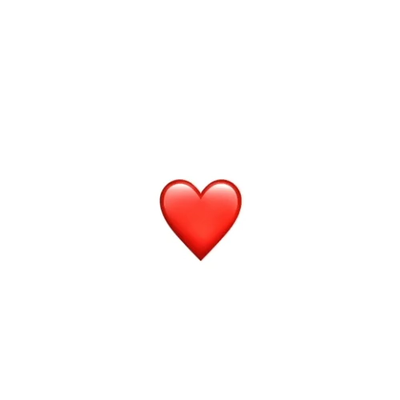
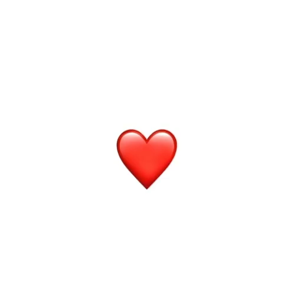
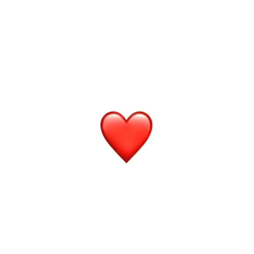
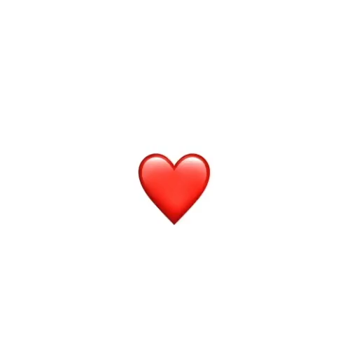

+++
title = "4.1 控制动画的时序与运动"
date = 2026-09-12T12:47:47+08:00
weight = 1
type = "docs"
description = ""
isCJKLanguage = true
draft = false
+++


> 原文链接: [https://developer.apple.com/documentation/swiftui/controlling-the-timing-and-movements-of-your-animations](https://developer.apple.com/documentation/swiftui/controlling-the-timing-and-movements-of-your-animations)

# 4.1 控制动画的时序与运动

使用相位动画器和关键帧动画器，构建你可以控制的高级动画。

## 概述 {#Overview}

SwiftUI 提供了一组实用的动画，你可以在应用中使用它们。这些动画通过为视图和用户界面元素提供视觉过渡，帮助提升应用的用户体验。虽然这些标准动画是增强应用用户交互的绝佳方式，但有时你需要对某个视觉元素的时序和运动有更多控制。[PhaseAnimator](https://developer.apple.com/documentation/swiftui/phaseanimator) 和 [KeyframeAnimator](https://developer.apple.com/documentation/swiftui/keyframeanimator) 能帮助你获得这种控制。

相位动画器允许你把动画定义为一组称为相位的离散步骤。动画器会在这些相位之间循环，从而创建视觉过渡。使用关键帧动画器时，你要创建关键帧，它们定义视觉过渡过程中特定时刻的动画值。

## 创建简单的弹跳动画 {#Create-a-simple-bounce-animation}

为了更好地理解如何用 [PhaseAnimator](https://developer.apple.com/documentation/swiftui/phaseanimator) 或 [KeyframeAnimator](https://developer.apple.com/documentation/swiftui/keyframeanimator) 创建动画，先从一个使用标准 SwiftUI 动画的简单示例开始。下面的代码把 emoji 的偏移设置为 `-40.0`，让它向上移动。为了给这段移动提供平滑过渡，代码使用 [withAnimation(_:_:)](https://developer.apple.com/documentation/swiftui/withanimation(_:_:)) 函数，在有人轻点 emoji 之后应用 [bouncy](https://developer.apple.com/documentation/swiftui/animation/bouncy) 动画。

```swift
struct SimpleAnimationView: View {
    var emoji: String
    @State private var offset = 0.0

    var body: some View {
        EmojiView(emoji: emoji)
            .offset(y: offset)
            .onTapGesture {
                withAnimation(.bouncy) {
                    offset = -40.0
                }
            }
    }
}
```

这个动画只有一个离散步骤：把 emoji 向上移动。不过，一个动画可以有多个步骤，例如先让 emoji 向上移动，再回到原来的位置。举例来说，下面的代码先把偏移设置为 `-40.0` 让 emoji 向上移动，然后把偏移（`0.0`）设置回去，让 emoji 回到原来的位置：

```swift
struct SimpleAnimationView: View {
    var emoji: String
    @State private var offset = 0.0

    var body: some View {
        EmojiView(emoji: emoji)
            .offset(y: offset)
            .onTapGesture {
                withAnimation(.bouncy) {
                    offset = -40.0
                } completion: {
                    withAnimation {
                        offset = 0.0
                    }
                }
            }
    }
}
```

这段代码使用 [withAnimation(_:completionCriteria:_:completion:)](https://developer.apple.com/documentation/swiftui/withanimation(_:completioncriteria:_:completion:)) 函数为这个视觉过渡的两个步骤添加动画。第一步在该函数的 `body` 闭包中发生，把偏移设置为 `-40.0`。第二步在 `completion` 闭包中发生，把偏移设置为 `0.0`。



视频：[一段视频，展示一个心形 emoji 向上移动到最高点，然后回到原来的位置。](https://developer.apple.com/tutorials/videos/com.apple.SwiftUI/phase-keyframe-animation-01.mp4)

不过，`EmojiView` 实际上经历了三个步骤。第一步发生在视图第一次出现时，`EmojiView` 视图的偏移是 `0.0`。当有人轻点该视图时，偏移变为 `-40.0`，这是第二步。当那次动画完成后，第三步把偏移改回 `0.0`。然而，根据偏移值（`0.0` 和 `-40.0`）来看，这里只有两个离散步骤。

虽然这个实现确实能按预期工作，但使用 [PhaseAnimator](https://developer.apple.com/documentation/swiftui/phaseanimator) 是把离散步骤定义为动画相位的更便捷方式。

## 用相位动画器实现弹跳 {#Bounce-with-a-phase-animator}

[PhaseAnimator](https://developer.apple.com/documentation/swiftui/phaseanimator) 会自动在一组给定相位中前进，从而创建动画过渡。使用 [phaseAnimator(_:content:animation:)](https://developer.apple.com/documentation/swiftui/view/phaseanimator(_:content:animation:)) 修饰符，把用于改变动画值的各个相位提供给动画器。例如，前面展示的 emoji 弹跳动画有两个相位：向上移动和移回。你可以用布尔值 `true` 和 `false` 来表示这些相位。当相位为 `true` 时，emoji 向上移动到 `-40.0`。当相位为 `false` 时，emoji 通过把偏移设置为 `0.0` 回到原来的位置。

```swift
struct TwoPhaseAnimationView: View {
    var emoji: String
    
    var body: some View {
        EmojiView(emoji: emoji)
            .phaseAnimator([false, true]) { content, phase in
                content.offset(y: phase ? -40.0 : 0.0)
            }
    }
}
```

相位动画器会按照你传给 [phaseAnimator(_:content:animation:)](https://developer.apple.com/documentation/swiftui/view/phaseanimator(_:content:animation:)) 修饰符的顺序，在相位列表之间循环。当视图第一次出现时，相位动画器调用 `content` 闭包并传入第一个相位。然后动画器用第二个相位的值调用该闭包。动画器会为每一个后续相位继续调用 `content` 闭包。到达最后一个相位之后，动画器会用第一个相位的值再调用一次 `content`。

这意味着在前面的代码中，视图第一次出现时，相位动画器用相位值 `false` 调用 `content`，把 emoji 的偏移设置为 `0.0`。接着相位动画器用 `true` 相位调用 `content`，这个相位把偏移设置为 `-40.0`，使 emoji 向上移动。到达该偏移位置后，动画器用 `false` 相位调用 `content`，通过把偏移设置为 `0.0` 让 emoji 回到原来的位置。

这个动画在视图出现时就开始。要根据某个事件开始动画，请使用 [phaseAnimator(_:trigger:content:animation:)](https://developer.apple.com/documentation/swiftui/view/phaseanimator(_:trigger:content:animation:)) 修饰符，并提供一个动画器会观察其变化的 `trigger` 值。动画器会在该值变化时开始动画。例如，下面的代码在有人每次轻点 emoji 时递增状态变量 `likeCount`。代码用 `likeCount` 作为相位动画器观察变化的值。这样一来，每当有人轻点 emoji，它就会向上移动再回到原来的位置。

```swift
struct TwoPhaseAnimationView: View {
    var emoji: String
    @State private var likeCount = 1
    
    var body: some View {
        EmojiView(emoji: emoji)
            .phaseAnimator([false, true], trigger: likeCount) { content, phase in
                content.offset(y: phase ? -40.0 : 0.0)
            }
            .onTapGesture {
                likeCount += 1
            }
    }
}
```


视频：[一段视频，展示一个心形 emoji 向上移动到最高点，然后回到原来的位置。](https://developer.apple.com/tutorials/videos/com.apple.SwiftUI/phase-keyframe-animation-02.mp4)

到目前为止，相位动画器使用 [default](https://developer.apple.com/documentation/swiftui/animation/default) 动画来移动 emoji。你可以通过给 `phaseAnimator` 修饰符提供一个动画闭包来改变这种默认行为。在这个闭包中，指定每个相位要应用的动画类型。例如，下面的代码在相位为 `true` 时应用 [bouncy](https://developer.apple.com/documentation/swiftui/animation/bouncy) 动画；否则应用 [default](https://developer.apple.com/documentation/swiftui/animation/default) 动画：

```swift
struct TwoPhaseAnimationView: View {
    var emoji: String
    @State private var likeCount = 1
    
    var body: some View {
        EmojiView(emoji: emoji)
            .phaseAnimator([false, true], trigger: likeCount) { content, phase in
                content.offset(y: phase ? -40.0 : 0.0)
            } animation: { phase in
                phase ? .bouncy : .default
            }
            .onTapGesture {
                likeCount += 1
            }
    }
}
```



视频：[一段视频，展示一个心形 emoji 先略微向下弹一下，然后向上移动。当 emoji 到达最高点后，它向下移动，回到原来的位置。](https://developer.apple.com/tutorials/videos/com.apple.SwiftUI/phase-keyframe-animation-03.mp4)

## 为动画添加更多相位 {#Add-more-phases-to-the-animation}

虽然这个弹跳效果不错，但你还可以让它更出彩。例如，你可以让 emoji 在向上移动时变大，然后再缩回正常大小。为此，你要为动画添加第三个相位：缩放。

要定义这些相位，请创建一个列出各个可能相位的自定义类型，例如：

```swift
private enum AnimationPhase: CaseIterable {
    case initial
    case move
    case scale
}
```

接下来，为了简化逻辑并降低复杂度，请定义返回待动画值的计算属性。例如，要设置用于移动 emoji 的垂直偏移，请创建一个根据当前相位返回偏移的计算属性：

```swift
private enum AnimationPhase: CaseIterable {
    case initial
    case move
    case scale
    
    var verticalOffset: Double {
        switch self {
        case .initial: 0
        case .move, .scale: -64
        }
    }
}
```

处于初始相位时，偏移是 `0`，也就是 emoji 在屏幕上的原始位置。但当相位为 `move` 或 `scale` 时，偏移是 `-64`。

你可以对缩放效果采用同样的方式（创建计算属性）来改变 emoji 的大小。最初，emoji 以原始大小出现，但在移动和缩放相位期间会变大，如下所示：

```swift
private enum AnimationPhase: CaseIterable {
    case initial
    case move
    case scale
    
    var verticalOffset: Double {
        switch self {
        case .initial: 0
        case .move, .scale: -64
        }
    }
    
    var scaleEffect: Double {
        switch self {
        case .initial: 1
        case .move, .scale: 1.5
        }
    }
}
```

要为 emoji 添加动画，请把 [phaseAnimator(_:trigger:content:animation:)](https://developer.apple.com/documentation/swiftui/view/phaseanimator(_:trigger:content:animation:)) 修饰符应用到 `EmojiView` 上。把自定义 `AnimationPhase` 类型的所有情况都提供给动画器。然后通过应用 [scaleEffect(_:anchor:)](https://developer.apple.com/documentation/swiftui/view/scaleeffect(_:anchor:)) 和 [offset(x:y:)](https://developer.apple.com/documentation/swiftui/view/offset(x:y:)) 修饰符，根据相位改变内容。传给这些修饰符的值来自计算属性，这有助于让视图代码更易读。

```swift
struct ThreePhaseAnimationView: View {
    var emoji: String
    @State private var likeCount = 1
    
    var body: some View {
        EmojiView(emoji: emoji)
            .phaseAnimator(AnimationPhase.allCases, trigger: likeCount) { content, phase in
                content
                    .scaleEffect(phase.scaleEffect)
                    .offset(y: phase.verticalOffset)
            } animation: { phase in
                switch phase {
                case .initial: .smooth
                case .move: .easeInOut(duration: 0.3)
                case .scale: .spring(duration: 0.3, bounce: 0.7)
                }
            }
            .onTapGesture {
                likeCount += 1
            }
    }
}
```

这段代码还会在 `animation` 闭包中根据相位应用不同的动画类型，让整个动画具备你所追求的那种出彩效果。



视频：[一段视频，展示一个心形 emoji 向上移动。在向上移动的过程中，它的尺寸变大。当 emoji 到达最高点后，它向下移动回到原来的位置，同时恢复原来的尺寸。](https://developer.apple.com/tutorials/videos/com.apple.SwiftUI/phase-keyframe-animation-04.mp4)

> 注意：可以使用 Xcode 中的画布预览来帮助确定相位动画应采用的动画类型和值。修改代码，并在画布预览中看到这些变化的效果。

[PhaseAnimator](https://developer.apple.com/documentation/swiftui/phaseanimator) 让你可以基于离散相位控制动画，这有助于为动画增添额外的精致感。但如果你发现自己需要对动画的时序和运动有更多控制，请使用 [KeyframeAnimator](https://developer.apple.com/documentation/swiftui/keyframeanimator)。

## 用关键帧动画器获得更多控制 {#Gain-more-control-with-a-keyframe-animator}

使用 [KeyframeAnimator](https://developer.apple.com/documentation/swiftui/keyframeanimator)，你可以定义复杂的、彼此协调的动画，并完全控制时序与运动。这个动画器允许你创建关键帧，用来定义动画在特定时刻的值。动画器使用这些值，在动画的每一帧之间生成插值。

相位动画器为独立的离散状态建模，而关键帧动画器则生成你指定类型的插值。在动画进行期间，动画器会在每一帧为你提供该类型的一个值，这样你就可以通过应用修饰符来更新正在做动画的视图。

你可以把这个类型定义为一个结构体，其中包含你想独立添加动画的各个属性。例如，下面的代码定义了四个属性，用来决定 emoji 的缩放、拉伸、位置和角度：

```swift
private struct AnimationValues {
    var scale = 1.0
    var verticalStretch = 1.0
    var verticalOffset = 0.0
    var angle = Angle.zero
}
```

> 注意：[KeyframeAnimator](https://developer.apple.com/documentation/swiftui/keyframeanimator) 可以为任何遵循 [Animatable](https://developer.apple.com/documentation/swiftui/animatable) 协议的值添加动画。

要使用关键帧动画器创建动画，请把 [keyframeAnimator(initialValue:repeating:content:keyframes:)](https://developer.apple.com/documentation/swiftui/view/keyframeanimator(initialvalue:repeating:content:keyframes:)) 或 [keyframeAnimator(initialValue:trigger:content:keyframes:)](https://developer.apple.com/documentation/swiftui/view/keyframeanimator(initialvalue:trigger:content:keyframes:)) 修饰符应用到你想添加动画的视图上。例如，下面的代码把后一个修饰符应用到 `EmojiView`。动画的初始值是一个新的 `AnimationValues` 实例，状态变量 `likeCount` 是动画器观察变化的值，与前面相位动画的示例中一样。

```swift
struct KeyframeAnimationView: View {
    var emoji: String
    @State private var likeCount = 1
    
    var body: some View {
        EmojiView(emoji: emoji)
            .keyframeAnimator(
                initialValue: AnimationValues(),
                trigger: likeCount
            ) { content, value in
                // ...
            } keyframes: { _ in
                // ...
            }
            .onTapGesture {
                likeCount += 1
            }
    }
}
```

要在动画期间为视图应用修饰符，请为关键帧动画器提供一个 `content` 闭包。这个闭包包含两个参数：

- 术语 `content`：正在做动画的视图。
- 术语 `value`：当前的插值结果。

使用这些参数可以给 SwiftUI 正在添加动画的视图应用修饰符。例如，下面的代码用这些参数来旋转、缩放、拉伸和移动 emoji：

```swift
struct KeyframeAnimationView: View {
    var emoji: String
    @State private var likeCount = 1
    
    var body: some View {
        EmojiView(emoji: emoji)
            .keyframeAnimator(
                initialValue: AnimationValues(),
                trigger: likeCount
            ) { content, value in
                content
                    .rotationEffect(value.angle)
                    .scaleEffect(value.scale)
                    .scaleEffect(y: value.verticalStretch)
                    .offset(y: value.verticalOffset)
            } keyframes: { _ in
                // ...
            }
            .onTapGesture {
                likeCount += 1
            }
    }
}
```

> 重要：SwiftUI 会在动画的每一帧调用关键帧动画器的 `content` 闭包，因此请避免直接在其中执行任何开销较大的操作。

接下来，定义关键帧。关键帧让你可以为不同属性使用不同的关键帧，从而构建高级动画。为此，请把关键帧组织成轨道。每条轨道控制你正在添加动画的类型的某一个属性。在创建轨道时提供指向该属性的键路径，即可把属性与轨道关联起来。例如，下面的代码为 `scale` 属性添加一条 [KeyframeTrack](https://developer.apple.com/documentation/swiftui/keyframetrack)：

```swift
struct KeyframeAnimationView: View {
    var emoji: String
    @State private var likeCount = 1
    
    var body: some View {
        EmojiView(emoji: emoji)
            .keyframeAnimator(
                initialValue: AnimationValues(),
                trigger: likeCount
            ) { content, value in
                content
                    .rotationEffect(value.angle)
                    .scaleEffect(value.scale)
                    .scaleEffect(y: value.verticalStretch)
                    .offset(y: value.verticalOffset)
            } keyframes: { _ in
                KeyframeTrack(\.scale) {
                    // ...
                }
            }
            .onTapGesture {
                likeCount += 1
            }
    }
}
```

创建轨道时，你使用 SwiftUI 中的声明式语法为轨道添加关键帧。关键帧有不同种类，例如 [CubicKeyframe](https://developer.apple.com/documentation/swiftui/cubickeyframe)、[LinearKeyframe](https://developer.apple.com/documentation/swiftui/linearkeyframe) 和 [SpringKeyframe](https://developer.apple.com/documentation/swiftui/springkeyframe)。你可以在同一条轨道中混用不同种类的关键帧。例如，下面的代码为 `scale` 属性添加一条轨道，其中组合使用了线性动画和弹簧动画：

```swift
struct KeyframeAnimationView: View {
    var emoji: String
    @State private var likeCount = 1
    
    var body: some View {
        EmojiView(emoji: emoji)
            .keyframeAnimator(
                initialValue: AnimationValues(),
                trigger: likeCount
            ) { content, value in
                content
                    .rotationEffect(value.angle)
                    .scaleEffect(value.scale)
                    .scaleEffect(y: value.verticalStretch)
                    .offset(y: value.verticalOffset)
            } keyframes: { _ in
                KeyframeTrack(\.scale) {
                    LinearKeyframe(1.0, duration: 0.36)
                    SpringKeyframe(1.5, duration: 0.8,
                        spring: .bouncy)
                    SpringKeyframe(1.0, spring: .bouncy)
                }
            }
            .onTapGesture {
                likeCount += 1
            }
    }
}
```

每种关键帧类型都会接收一个值。动画器用这个值在帧之间生成插值，并在调用动画器的 content 闭包之前，设置轨道键路径所指定的属性。例如，在上面的代码清单中，线性关键帧期间缩放值是 `1.0`，让 emoji 保持原始大小。接着在第一个弹簧关键帧期间缩放变为 `1.5`，使 emoji 变大。最后一个弹簧关键帧把缩放设置为 `1.0`，让 emoji 回到原始大小。

> 注意：SwiftUI 会在同一条轨道内的多个关键帧之间保留速度（也就是动画的快慢），以实现连续运动。

实现关键帧动画时，请为你想添加动画的每个属性都包含一条轨道。例如，`AnimationValues` 有四个属性：

- `scale`
- `verticalStretch`
- `verticalOffset`
- `angle`

要为这四个属性都添加动画，动画器就需要四条关键帧轨道，如下面代码所示：

```swift
struct KeyframeAnimationView: View {
    var emoji: String
    @State private var likeCount = 1
    
    var body: some View {
        EmojiView(emoji: emoji)
            .keyframeAnimator(
                initialValue: AnimationValues(),
                trigger: likeCount
            ) { content, value in
                content
                    .rotationEffect(value.angle)
                    .scaleEffect(value.scale)
                    .scaleEffect(y: value.verticalStretch)
                    .offset(y: value.verticalOffset)
            } keyframes: { _ in
                KeyframeTrack(\.scale) {
                    LinearKeyframe(1.0, duration: 0.36)
                    SpringKeyframe(1.5, duration: 0.8, spring: .bouncy)
                    SpringKeyframe(1.0, spring: .bouncy)
                }
                
                KeyframeTrack(\.verticalOffset) {
                    LinearKeyframe(0.0, duration: 0.1)
                    SpringKeyframe(20.0, duration: 0.15, spring: .bouncy)
                    SpringKeyframe(-60.0, duration: 1.0, spring: .bouncy)
                    SpringKeyframe(0.0, spring: .bouncy)
                }

                KeyframeTrack(\.verticalStretch) {
                    CubicKeyframe(1.0, duration: 0.1)
                    CubicKeyframe(0.6, duration: 0.15)
                    CubicKeyframe(1.5, duration: 0.1)
                    CubicKeyframe(1.05, duration: 0.15)
                    CubicKeyframe(1.0, duration: 0.88)
                    CubicKeyframe(0.8, duration: 0.1)
                    CubicKeyframe(1.04, duration: 0.4)
                    CubicKeyframe(1.0, duration: 0.22)
                }

                KeyframeTrack(\.angle) {
                    CubicKeyframe(.zero, duration: 0.58)
                    CubicKeyframe(.degrees(16), duration: 0.125)
                    CubicKeyframe(.degrees(-16), duration: 0.125)
                    CubicKeyframe(.degrees(16), duration: 0.125)
                    CubicKeyframe(.zero, duration: 0.125)
                }
            }
            .onTapGesture {
                likeCount += 1
            }
    }
}
```

这些关键帧轨道组合起来，创造出一个先把 emoji 压扁并拉伸、再让它向上弹跳的动画。当 emoji 向最高点移动时会变大。当 emoji 到达最高点时，它会轻微晃动一下。随后 emoji 带着一点回弹回到原来的位置，稳稳落回原处。



视频：[一段视频，展示一个心形 emoji 先被压扁并拉伸，然后向上弹跳。当 emoji 向最高点移动时，它变大。当 emoji 到达最高点后，它带着轻微的顺时针到逆时针旋转晃动一下。随后 emoji 向下移动回到原来的位置，同时缩小回原来的尺寸。最后 emoji 带着一点回弹稳稳落回原来的位置。](https://developer.apple.com/tutorials/videos/com.apple.SwiftUI/phase-keyframe-animation-05.mp4)

> 注意：与相位动画一样，可以使用 Xcode 中的画布预览来帮助确定关键帧动画应采用的动画类型和值。修改代码，并在画布预览中看到这些变化的效果。
