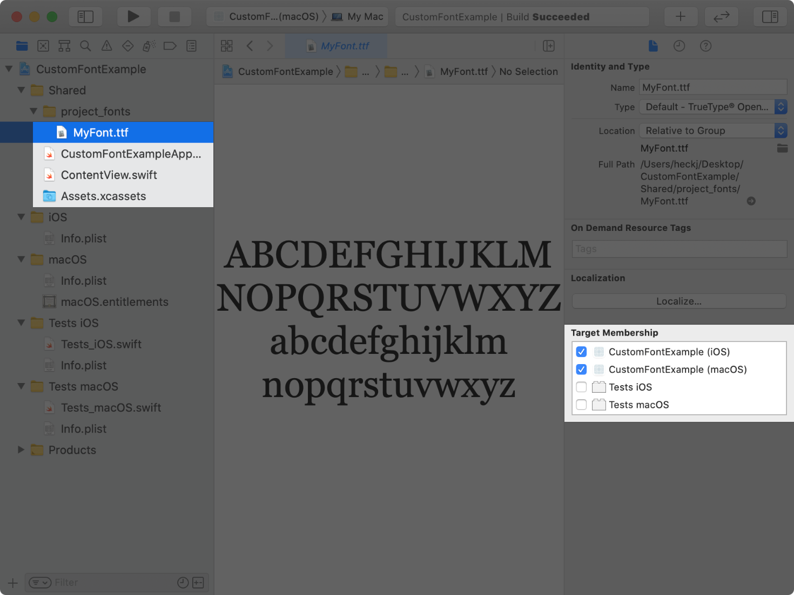
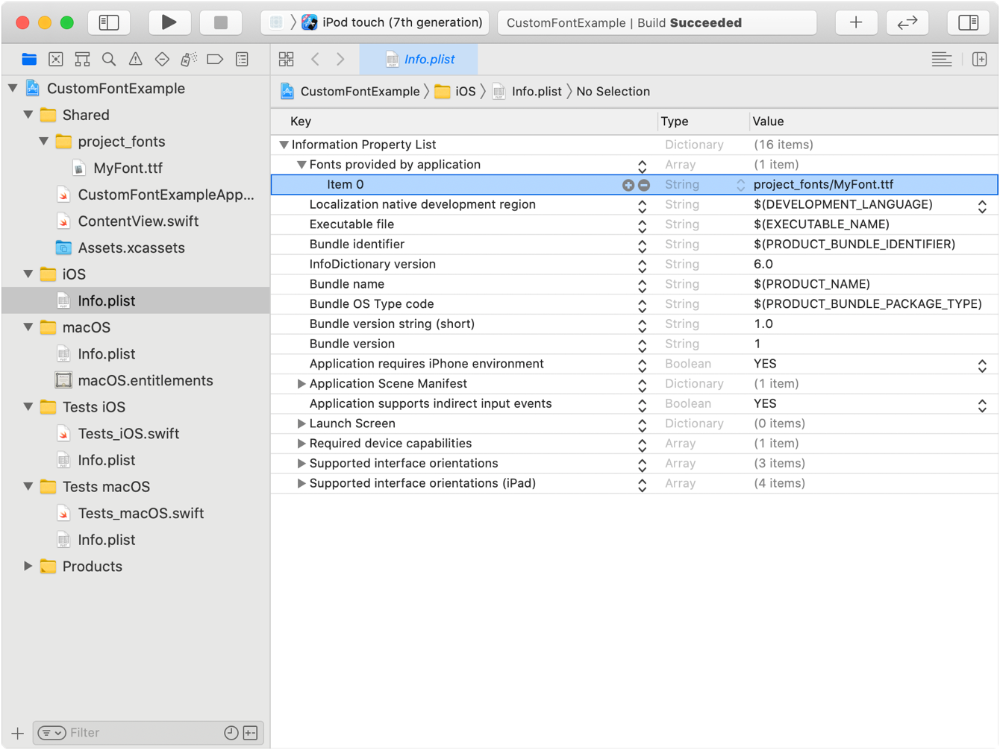
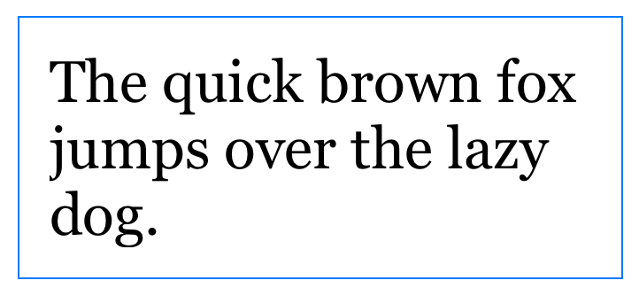

+++
title = "5.3 为文本应用自定义字体"
date = 2026-09-12T12:47:47+08:00
weight = 3
type = "docs"
description = ""
isCJKLanguage = true
draft = false
+++


> 原文链接: [https://developer.apple.com/documentation/swiftui/applying-custom-fonts-to-text](https://developer.apple.com/documentation/swiftui/applying-custom-fonts-to-text)

# 5.3 为文本应用自定义字体

在应用中加入并随动态字体一起缩放的自定义字体。

## 概述 {#Overview}

SwiftUI 支持用内置字体为文本视图设置样式，并且默认使用系统字体。除了系统提供的字体之外，你还可以把字体文件加入 Xcode 项目来使用自定义字体。要使用自定义字体，请把包含你已获授权字体的字体文件加入应用，然后把它应用到文本视图，或者在容器视图中把它设为默认字体。SwiftUI 的自适应文本显示会用动态字体自动缩放该字体。

动态字体让用户可以选择屏幕上显示的文本内容大小。它既帮助需要更大文字以便阅读的用户，也照顾到能阅读较小文字的用户，让他们一屏看到更多信息。

### 把字体文件加入项目 {#Add-the-font-files-to-the-project}

要把字体文件加入你的 Xcode 项目：

1. 在 Xcode 中，选择项目导航器。
1. 从「访达」窗口把你的字体拖进项目。这会把字体复制到你的项目里。
1. 选中字体或包含字体的文件夹，确认文件在应用各个目标上的目标成员资格已勾选。



### 确定要包含进应用包的字体文件 {#Identify-the-font-files-to-include-in-the-app-bundle}

对于 iOS、watchOS、tvOS 或 Mac Catalyst 目标，请把 [UIAppFonts](https://developer.apple.com/documentation/bundleresources/information-property-list/uiappfonts) 键加入应用的 `Info.plist` 文件。该键的值应是一个字符串数组，包含所添加字体文件的相对路径。对于 macOS 应用目标，请使用目标 `Info.plist` 文件中的 [ATSApplicationFontsPath](https://developer.apple.com/documentation/bundleresources/information-property-list/atsapplicationfontspath) 键，并把保存字体的文件夹名称作为该键的值。

在下面的例子中，字体文件位于 `project_fonts` 目录内，因此在 `Info.plist` 文件中使用 `project_fonts/MyFont.ttf` 作为字符串值。



### 应用支持动态缩放的字体 {#Apply-a-font-supporting-dynamic-sizing}

用 [custom(_:size:)](https://developer.apple.com/documentation/swiftui/font/custom(_:size:)) 方法取到你的字体实例，并用 [font(_:)](https://developer.apple.com/documentation/swiftui/text/font(_:)) 修饰符把它应用到文本视图。用 [custom(_:size:)](https://developer.apple.com/documentation/swiftui/font/custom(_:size:)) 取字体时，字体名要与该字体的 PostScript 名称一致。你可以在「字体册」应用中打开字体、选择「字体信息」标签页来查看它的 PostScript 名称。如果 SwiftUI 无法取到并应用你的字体，它会改用默认系统字体渲染该文本视图。

下面的例子把字体 `MyFont` 应用到文本视图：

```swift
Text("Hello, world!")
    .font(Font.custom("MyFont", size: 18))
```

该字体会从所提供的尺寸开始自适应缩放，以对齐 [body](https://developer.apple.com/documentation/swiftui/font/body) 的默认文本样式。你可以用 `relativeTo` 参数指定除默认值 `body` 之外、以哪个文本样式为基准缩放。例如，把字号设为 `32` 点，并相对 [title](https://developer.apple.com/documentation/swiftui/font/title) 这个文本样式自适应缩放：

```swift
Text("Hello, world!")
    .font(Font.custom("MyFont", size: 32, relativeTo: .title))
```

SwiftUI 不会为字体合成粗体或斜体样式。如果该字体支持不同字重或斜体变体，你可以用 [weight(_:)](https://developer.apple.com/documentation/swiftui/font/weight(_:)) 或 [italic()](https://developer.apple.com/documentation/swiftui/font/italic()) 修饰符为字体设置样式，从而定制文本视图的排版。

关于在目标平台上选择字体以提升应用表现的设计指导，参见 Human Interface Guidelines 中的[排版](https://developer.apple.com/design/human-interface-guidelines/typography)。

### 用缩放的度量值调整内边距 {#Scale-padding-using-scaled-metric}

视图属性上的 [ScaledMetric](https://developer.apple.com/documentation/swiftui/scaledmetric) 属性包装器提供一个会随无障碍设置自动变化的缩放值。使用自适应尺寸的字体时，你可以用这个属性包装器缩放文本之间或文本周围的距离，以改善视觉设计。

下面的例子用 `@ScaledMetric` 相对 `body` 文本样式缩放文本视图周围的内边距值，并加上蓝色边框以便看出内边距增加的间距：

```swift
struct ContentView: View {
    @ScaledMetric(relativeTo: .body) var scaledPadding: CGFloat = 10

    var body: some View {
        Text("The quick brown fox jumps over the lazy dog.")
            .font(Font.custom("MyFont", size: 18))
            .padding(scaledPadding)
            .border(Color.blue)
    }
}

struct ContentView_Previews: PreviewProvider {
    static var previews: some View {
        ContentView()
    }
}
```

在未开启任何无障碍设置时，预览显示如下图像：


用 [environment(_:_:)](https://developer.apple.com/documentation/swiftui/view/environment(_:_:)) 修饰符把预览的动态字体尺寸设为 [DynamicTypeSize.accessibility2](https://developer.apple.com/documentation/swiftui/dynamictypesize/accessibility2)：

```swift
struct ContentView_Previews: PreviewProvider {
    static var previews: some View {
        ContentView()
            .environment(\.dynamicTypeSize, .accessibility2)
    }
}
```

此时预览显示的图像反映了增大的无障碍尺寸以及缩放后的内边距：


