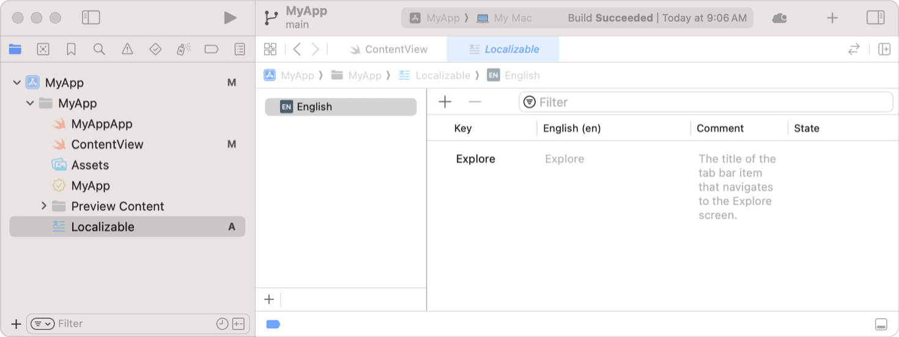

+++
title = "5.5 为本地化准备视图"
date = 2026-09-12T12:47:47+08:00
weight = 5
type = "docs"
description = ""
isCJKLanguage = true
draft = false
+++


> 原文链接: [https://developer.apple.com/documentation/swiftui/preparing-views-for-localization](https://developer.apple.com/documentation/swiftui/preparing-views-for-localization)

# 5.5 为本地化准备视图

提供提示并添加字符串，让 SwiftUI 视图可以本地化。

## 概述 {#Overview}

对 SwiftUI 视图进行本地化，让用户以自己母语、所在地区和文化习惯来体验你的应用。在导出本地化目录时，Xcode 会解析 SwiftUI 视图中的待本地化字符串。你可以添加提示，让 Xcode 为你的应用生成正确、带提示的待本地化字符串。

关于字符串目录的信息，参见[用字符串目录本地化并变化文本](https://developer.apple.com/documentation/xcode/localizing-and-varying-text-with-a-string-catalog)。

### 为文本视图添加注释 {#Add-comments-to-text-views}

为简化翻译流程，请给译者提供提示，说明你的应用如何、在哪里显示某个 [Text](https://developer.apple.com/documentation/swiftui/text) 视图的字符串。要添加提示，请使用文本视图构造器 [init(_:tableName:bundle:comment:)](https://developer.apple.com/documentation/swiftui/text/init(_:tablename:bundle:comment:)) 的可选 `comment` 参数。当你用 Xcode 本地化应用时，它会把这个注释字符串与字符串一起包含进去。例如，下面的文本视图包含一条注释：

```swift
Text("Explore",
     comment: "The title of the tab bar item that navigates to the Explore screen.")
```

Xcode 会在字符串目录文件中为该视图创建如下条目：



### 用文本视图提供附加信息 {#Provide-additional-information-with-text-views}

许多带字符串标签的 SwiftUI 视图都可以本地化：只要提供一个会被 SwiftUI 解释为 [LocalizedStringKey](https://developer.apple.com/documentation/swiftui/localizedstringkey) 的字符串即可。系统会在运行时用这个键从字符串目录中取出本地化的值；如果在目录中找不到该键，就直接使用该字符串。例如，SwiftUI 会把下面这个 [Label](https://developer.apple.com/documentation/swiftui/label) 构造器的字符串输入当作本地化字符串键：

```swift
Label("Message", image: "msgSymbol")
```

如果你还想为本地化提供注释，可以改用显式的 [Text](https://developer.apple.com/documentation/swiftui/text) 视图：

```swift
Label {
    Text("Message",
         comment: "A label that displays 'Message' and a corresponding image.")
} icon: {
    Image("msgSymbol")
}
```

许多 SwiftUI 控件都有内容构建器构造器，让你可以沿用这种模式。关于如何让应用的文本可翻译的更多信息，参见[为翻译准备应用的文本](https://developer.apple.com/documentation/xcode/preparing-your-apps-text-for-translation)。
