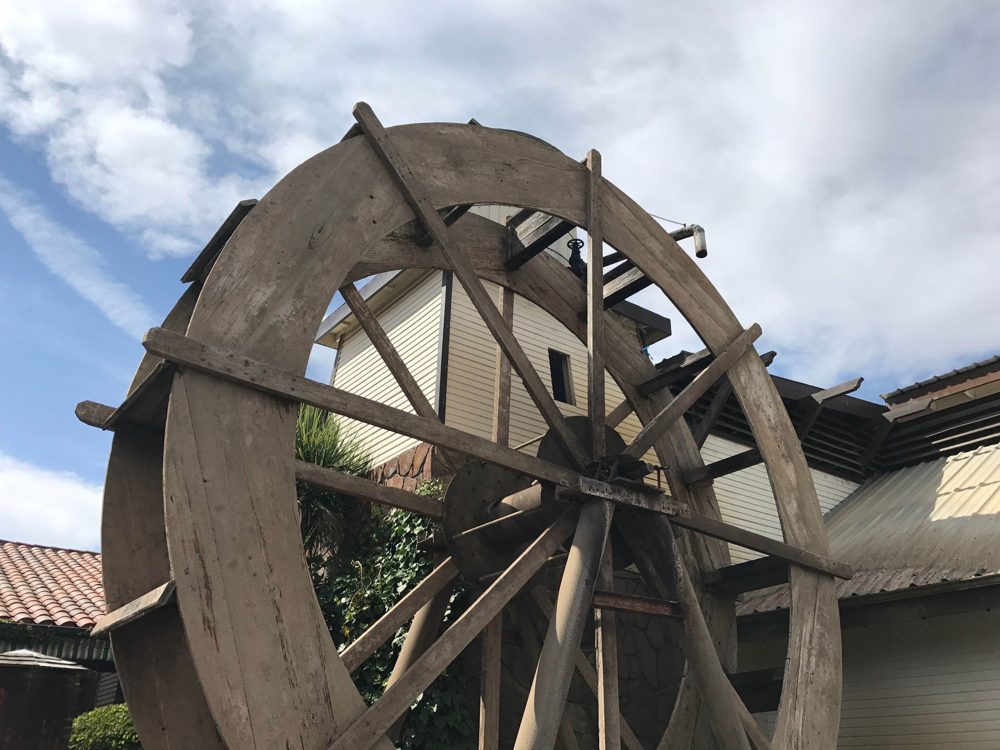
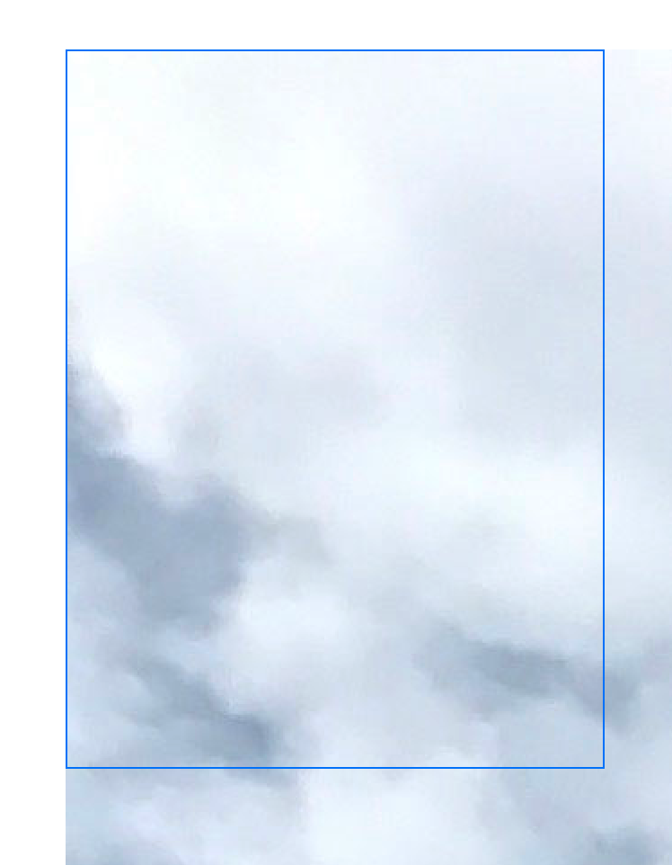
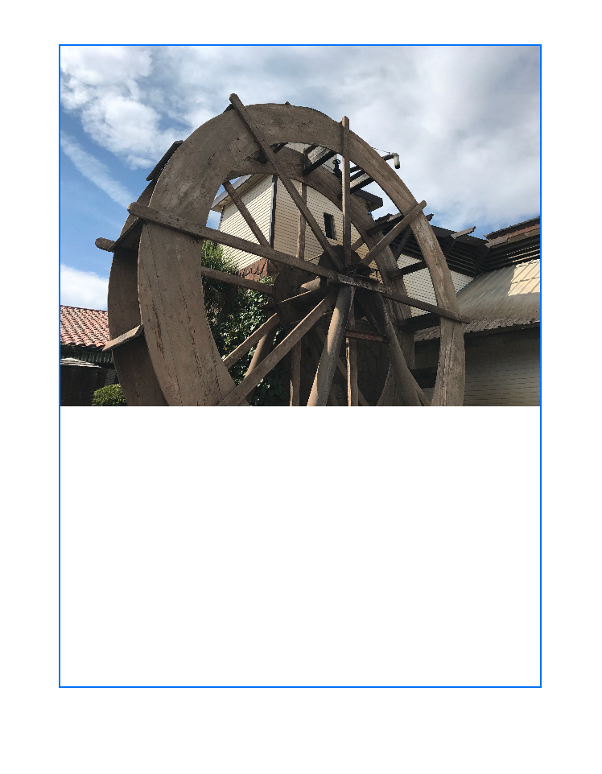
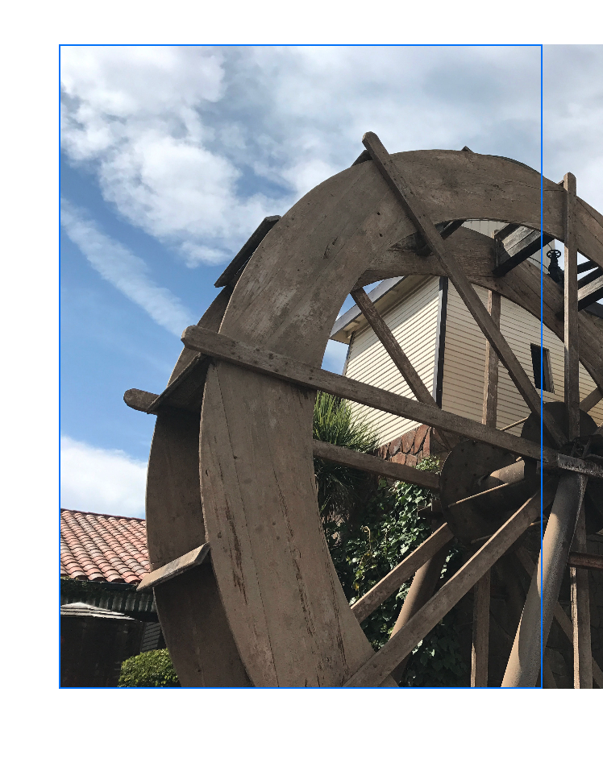
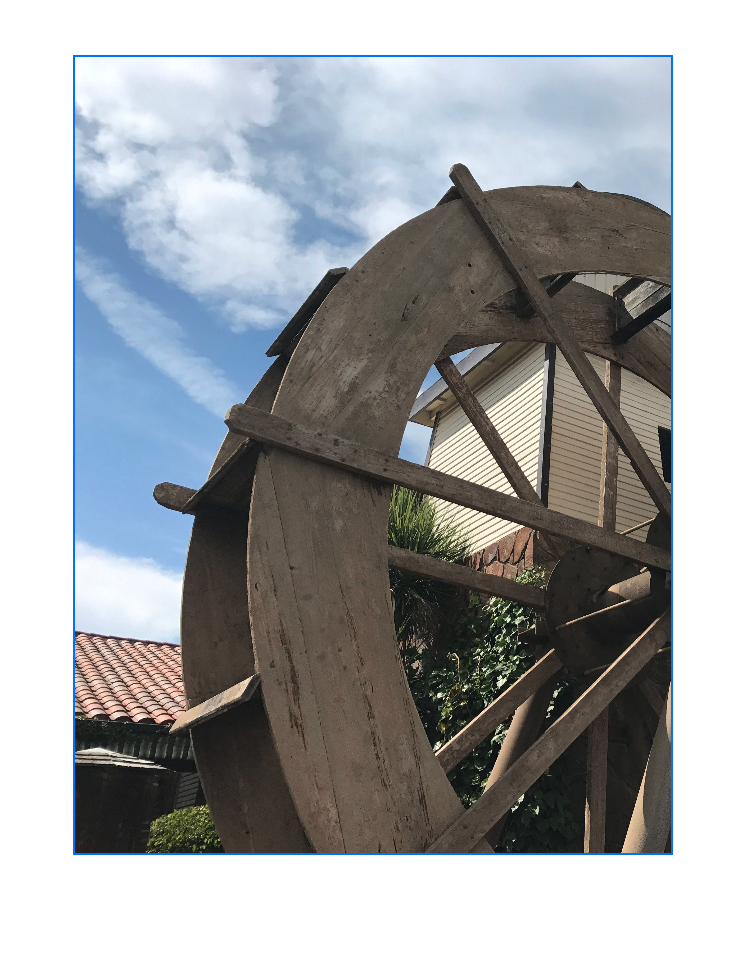
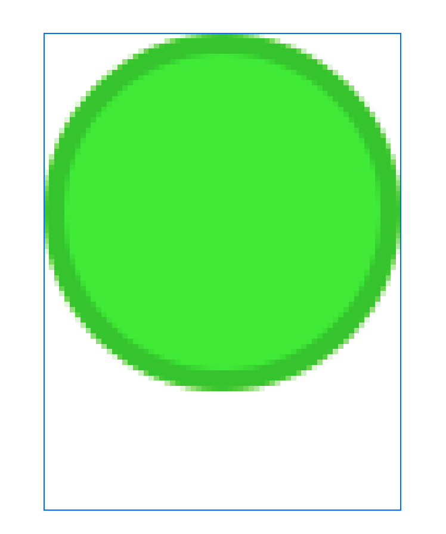
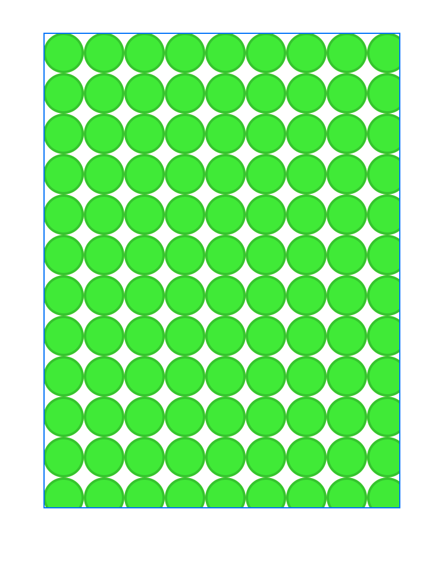

+++
title = "6.1 让图像适配可用空间"
date = 2026-09-12T12:47:47+08:00
weight = 1
type = "docs"
description = ""
isCJKLanguage = true
draft = false
+++


> 原文链接: [https://developer.apple.com/documentation/swiftui/fitting-images-into-available-space](https://developer.apple.com/documentation/swiftui/fitting-images-into-available-space)

# 6.1 让图像适配可用空间

通过应用视图修饰符，调整应用界面中图像的尺寸与形状。

## 概述 {#Overview}

图像的尺寸千差万别，从单像素的 PNG 文件到包含数百万像素的数字摄影图像都有。由于设备尺寸也各不相同，应用通常需要在运行时调整图像尺寸，让它们适配可见的用户界面。SwiftUI 提供了用于缩放、裁剪和变换图像的修饰符，让图像完美适配你的界面。

### 用缩放让大图像适配其容器 {#Scale-a-large-image-to-fit-its-container-using-resizing}

来看图像 `Landscape_4.jpg`，这是一张尺寸为 4032 x 3024 的照片，画面中有水车、周围的建筑以及上方的天空。



下面的例子直接把图像加载进 [Image](https://developer.apple.com/documentation/swiftui/image) 视图，然后把它放进一个 300 x 400 点的边框里，并加上蓝色边框：

```swift
    Image("Landscape_4")
        .frame(width: 300, height: 400, alignment: .topLeading)
        .border(.blue)
```

如下面的截图所示，图像数据会以原始尺寸加载进视图，因此只能看到原图左上角的云。由于图像以原始尺寸渲染，而蓝色边框比原图小，图像会溢出边框边界。



要解决这个问题，你需要给 `Image` 应用两个修饰符：

- [resizable(capInsets:resizingMode:)](https://developer.apple.com/documentation/swiftui/image/resizable(capinsets:resizingmode:)) 告诉图像视图调整图像表示，使其匹配视图的尺寸。默认情况下，该修饰符会缩小大图像、放大小于视图的图像。仅使用该修饰符时，图像的各个轴会独立缩放。
- [aspectRatio(_:contentMode:)](https://developer.apple.com/documentation/swiftui/view/aspectratio(_:contentmode:)) 修正各轴缩放不一致的问题。它用 [ContentMode](https://developer.apple.com/documentation/swiftui/contentmode) 枚举定义的两种策略之一来保持图像的原始宽高比。[ContentMode.fit](https://developer.apple.com/documentation/swiftui/contentmode/fit) 会沿一个轴缩放图像以适配视图尺寸，另一个轴可能留出空白。[ContentMode.fill](https://developer.apple.com/documentation/swiftui/contentmode/fill) 会缩放图像以填满整个视图。

```swift
  Image("Landscape_4")
      .resizable()
      .aspectRatio(contentMode: .fit)
      .frame(width: 300, height: 400, alignment: .topLeading)
      .border(.blue)
```



### 用裁剪让图像数据留在视图边界内 {#Keep-image-data-inside-the-views-bounds-using-clipping}

如果你在缩放图像时使用 [ContentMode.fill](https://developer.apple.com/documentation/swiftui/contentmode/fill)，除非视图的宽高比与图像完全一致，否则图像的一部分会溢出视图边界。下面的例子说明了这个问题：

```swift
    Image("Landscape_4")
        .resizable()
        .aspectRatio(contentMode: .fill)
        .frame(width: 300, height: 400, alignment: .topLeading)
        .border(.blue)
```



为避免这个问题，请添加 [clipped(antialiased:)](https://developer.apple.com/documentation/swiftui/view/clipped(antialiased:)) 修饰符。这个修饰符会直接在视图的包围框处切掉多余的图像渲染。你还可以选择添加抗锯齿行为，对裁剪矩形的边缘做平滑处理；该参数默认为 `false`。下面的例子展示了在之前的 fill 模式示例上添加裁剪后的效果：

```swift
    Image("Landscape_4")
        .resizable()
        .aspectRatio(contentMode: .fill)
        .frame(width: 300, height: 400, alignment: .topLeading)
        .border(.blue)
        .clipped()
```



### 用插值选项调整渲染后的图像质量 {#Use-interpolation-flags-to-adjust-rendered-image-quality}

以非原始尺寸渲染图像需要*插值*：用现有的图像数据近似出另一个尺寸下的表示。不同的插值做法在计算复杂度和渲染图像的视觉质量之间有不同的取舍。你可以用 [interpolation(_:)](https://developer.apple.com/documentation/swiftui/image/interpolation(_:)) 修饰符给 SwiftUI 的渲染行为提供提示。

把小图像放大到更大的空间时，插值的效果更容易看出来，因为渲染出来的图像需要比现有数据更多的图像数据。看下面这个例子，它把名为 `dot_green` 的 34 x 34 图像渲染到与之前相同的 300 x 400 容器框中：

```swift
    Image("dot_green")
        .resizable()
        .interpolation(.none)
        .aspectRatio(contentMode: .fit)
        .frame(width: 300, height: 400, alignment: .topLeading)
        .border(.blue)
```

把 [Image.Interpolation.none](https://developer.apple.com/documentation/swiftui/image/interpolation/none) 传给 [interpolation(_:)](https://developer.apple.com/documentation/swiftui/image/interpolation(_:)) 会得到像素化非常明显的渲染图像。



如果把插值取值改为 [Image.Interpolation.medium](https://developer.apple.com/documentation/swiftui/image/interpolation/medium)，SwiftUI 会对像素数据做平滑处理，得到一张不那么像素化的图像：


> 提示：在缩小图像时也可以指定插值行为，以获得尽可能高的图像质量、最快的渲染时间，或者介于两者之间的行为。

### 用平铺让重复图像填满空间 {#Fill-a-space-with-a-repeating-image-using-tiling}

当图像远小于你要渲染到的空间时，另一种填满空间的做法是*平铺*：一遍又一遍地重复同一张图像。要平铺图像，请把 [Image.ResizingMode.tile](https://developer.apple.com/documentation/swiftui/image/resizingmode/tile) 参数传给 [resizable(capInsets:resizingMode:)](https://developer.apple.com/documentation/swiftui/image/resizable(capinsets:resizingmode:)) 修饰符：

```swift
    Image("dot_green")
        .resizable(resizingMode: .tile)
        .frame(width: 300, height: 400, alignment: .topLeading)
        .border(.blue)
```



当某张图像与自身的副本首尾相接时能形成更大图案、且没有视觉断裂时，平铺会特别有用。
