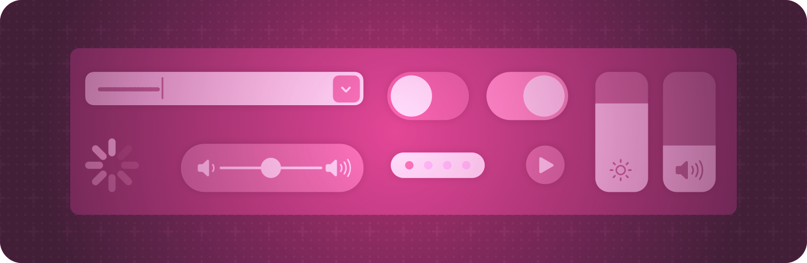

+++
title = "7 控件与指示器"
date = 2026-09-12T12:47:47+08:00
weight = 7
type = "docs"
description = ""
isCJKLanguage = true
draft = false
+++

> 原文链接: [https://developer.apple.com/documentation/swiftui/controls-and-indicators](https://developer.apple.com/documentation/swiftui/controls-and-indicators)

# 7 控件与指示器

显示数值并获取用户的选择。

## 概述 {#Overview}

SwiftUI 提供的控件让交互能够贴合各个平台和上下文的特点。例如，人们可以用按钮和链接触发事件，或者用不同种类的选择器在一组离散值中做选择。你也可以用进度视图和量表这类指示器向用户显示信息。

在组合自定义视图时使用这些内置控件与指示器，并为它们设置样式，以符合应用界面的需要。关于设计指导，参见 Human Interface Guidelines 中的[菜单与操作](https://developer.apple.com/design/human-interface-guidelines/menus-and-actions)、[选择与输入](https://developer.apple.com/design/human-interface-guidelines/selection-and-input)和[状态](https://developer.apple.com/design/human-interface-guidelines/status)。

## 创建按钮 {#Creating-buttons}

- [Button](https://developer.apple.com/documentation/swiftui/button) —— 触发动作的控件。
- [buttonStyle(_:)](https://developer.apple.com/documentation/swiftui/view/buttonstyle(_:)) —— 把该视图内按钮的样式设置为一种带自定义外观和标准交互行为的按钮样式。
- [buttonBorderShape(_:)](https://developer.apple.com/documentation/swiftui/view/buttonbordershape(_:)) —— 设置该视图中按钮的边框形状。
- [ButtonBorderShape](https://developer.apple.com/documentation/swiftui/buttonbordershape) —— 用于绘制按钮边框的形状。
- [buttonRepeatBehavior(_:)](https://developer.apple.com/documentation/swiftui/view/buttonrepeatbehavior(_:)) —— 设置该视图中的按钮在长时间交互时是否应重复触发其动作。
- [ButtonRepeatBehavior](https://developer.apple.com/documentation/swiftui/buttonrepeatbehavior) —— 控制按钮动作是否可重复的选项。
- [buttonRepeatBehavior](https://developer.apple.com/documentation/swiftui/environmentvalues/buttonrepeatbehavior) —— 该环境中的按钮在长时间交互时是否应重复触发其动作。
- [buttonSizing(_:)](https://developer.apple.com/documentation/swiftui/view/buttonsizing(_:)) —— 视图层级中按钮偏好的尺寸调整行为。
- [ButtonSizing](https://developer.apple.com/documentation/swiftui/buttonsizing) —— `Button` 以及其他类按钮控件的尺寸调整行为。
- [ButtonRole](https://developer.apple.com/documentation/swiftui/buttonrole) —— 描述按钮用途的值。

## 创建专用按钮 {#Creating-special-purpose-buttons}

- [EditButton](https://developer.apple.com/documentation/swiftui/editbutton) —— 切换编辑模式环境值的按钮。
- [PasteButton](https://developer.apple.com/documentation/swiftui/pastebutton) —— 从剪贴板读取条目并交给闭包的系统按钮。
- [RenameButton](https://developer.apple.com/documentation/swiftui/renamebutton) —— 触发标准重命名操作的按钮。

## 链接到其他内容 {#Linking-to-other-content}

- [Link](https://developer.apple.com/documentation/swiftui/link) —— 导航到 URL 的控件。
- [ShareLink](https://developer.apple.com/documentation/swiftui/sharelink) —— 控制分享呈现的视图。
- [SharePreview](https://developer.apple.com/documentation/swiftui/sharepreview) —— 在分享预览中显示的类型表示。
- [TextFieldLink](https://developer.apple.com/documentation/swiftui/textfieldlink) —— 按下时请求用户输入文本的控件。
- [HelpLink](https://developer.apple.com/documentation/swiftui/helplink) —— 具有标准外观、打开应用专属帮助文档的按钮。

## 获取数值输入 {#Getting-numeric-inputs}

- [Slider](https://developer.apple.com/documentation/swiftui/slider) —— 在有限线性取值范围内选择值的控件。
- [Stepper](https://developer.apple.com/documentation/swiftui/stepper) —— 执行递增和递减动作的控件。
- [Toggle](https://developer.apple.com/documentation/swiftui/toggle) —— 在开与关两种状态之间切换的控件。
- [toggleStyle(_:)](https://developer.apple.com/documentation/swiftui/view/togglestyle(_:)) —— 设置视图层级中开关的样式。

## 从一组选项中做选择 {#Choosing-from-a-set-of-options}

- [Picker](https://developer.apple.com/documentation/swiftui/picker) —— 从一组互斥值中选择的控件。
- [pickerStyle(_:)](https://developer.apple.com/documentation/swiftui/view/pickerstyle(_:)) —— 设置该视图内选择器的样式。
- [horizontalRadioGroupLayout()](https://developer.apple.com/documentation/swiftui/view/horizontalradiogrouplayout()) —— 把该视图内单选组样式的选择器设置为水平排布，单选按钮位于布局内部。
- [defaultWheelPickerItemHeight(_:)](https://developer.apple.com/documentation/swiftui/view/defaultwheelpickeritemheight(_:)) —— 设置滚轮式选择器条目的默认高度。
- [defaultWheelPickerItemHeight](https://developer.apple.com/documentation/swiftui/environmentvalues/defaultwheelpickeritemheight) —— 滚轮式选择器（例如日期选择器）中条目的默认高度。
- [paletteSelectionEffect(_:)](https://developer.apple.com/documentation/swiftui/view/paletteselectioneffect(_:)) —— 指定应用到调色板条目的选中效果。
- [PaletteSelectionEffect](https://developer.apple.com/documentation/swiftui/paletteselectioneffect) —— 要应用到调色板条目的选中效果。

## 选择日期 {#Choosing-dates}

- [DatePicker](https://developer.apple.com/documentation/swiftui/datepicker) —— 选择绝对日期的控件。
- [datePickerStyle(_:)](https://developer.apple.com/documentation/swiftui/view/datepickerstyle(_:)) —— 设置该视图内日期选择器的样式。
- [MultiDatePicker](https://developer.apple.com/documentation/swiftui/multidatepicker) —— 选取多个日期的控件。
- [calendar](https://developer.apple.com/documentation/swiftui/environmentvalues/calendar) —— 视图在处理日期时应当使用的当前日历。
- [timeZone](https://developer.apple.com/documentation/swiftui/environmentvalues/timezone) —— 视图在处理日期时应当使用的当前时区。

## 选择颜色 {#Choosing-a-color}

- [ColorPicker](https://developer.apple.com/documentation/swiftui/colorpicker) —— 使用系统颜色选择器界面选取颜色的控件。

## 指示某个值 {#Indicating-a-value}

- [Gauge](https://developer.apple.com/documentation/swiftui/gauge) —— 在某个范围内显示数值的视图。
- [gaugeStyle(_:)](https://developer.apple.com/documentation/swiftui/view/gaugestyle(_:)) —— 设置该视图内量表的样式。
- [ProgressView](https://developer.apple.com/documentation/swiftui/progressview) —— 显示任务完成进度的视图。
- [progressViewStyle(_:)](https://developer.apple.com/documentation/swiftui/view/progressviewstyle(_:)) —— 设置该视图中进度视图的样式。
- [DefaultDateProgressLabel](https://developer.apple.com/documentation/swiftui/defaultdateprogresslabel) —— 与日期相关的进度视图所使用的当前值标签的默认类型。
- [DefaultButtonLabel](https://developer.apple.com/documentation/swiftui/defaultbuttonlabel) —— 按钮使用的默认标签。

## 指示内容缺失 {#Indicating-missing-content}

- [ContentUnavailableView](https://developer.apple.com/documentation/swiftui/contentunavailableview) —— 由标签和附加内容构成、在应用内容对用户不可用时显示的界面。

## 提供触觉反馈 {#Providing-haptic-feedback}

- [sensoryFeedback(_:trigger:)](https://developer.apple.com/documentation/swiftui/view/sensoryfeedback(_:trigger:)) —— 当提供的 `trigger` 值变化时播放指定的 `feedback`。
- [sensoryFeedback(trigger:_:)](https://developer.apple.com/documentation/swiftui/view/sensoryfeedback(trigger:_:)) —— 当提供的 `trigger` 值变化后，从 `feedback` 闭包返回时播放反馈。
- [sensoryFeedback(_:trigger:condition:)](https://developer.apple.com/documentation/swiftui/view/sensoryfeedback(_:trigger:condition:)) —— 当提供的 `trigger` 值变化、且 `condition` 闭包返回 `true` 时，播放指定的 `feedback`。
- [SensoryFeedback](https://developer.apple.com/documentation/swiftui/sensoryfeedback) —— 表示可以播放的一类触觉和/或音频反馈。

## 设置控件尺寸 {#Sizing-controls}

- [controlSize(_:)](https://developer.apple.com/documentation/swiftui/view/controlsize(_:)) —— 设置该视图内控件的尺寸。
- [controlSize](https://developer.apple.com/documentation/swiftui/environmentvalues/controlsize) —— 要应用到视图内控件的尺寸。
- [ControlSize](https://developer.apple.com/documentation/swiftui/controlsize) —— 可以应用到视图内控件的尺寸类别，例如常规或小号。
