+++
title = "8.1 用自适应控件填充 SwiftUI 菜单"
date = 2026-09-12T12:47:47+08:00
weight = 1
type = "docs"
description = ""
isCJKLanguage = true
draft = false
+++


> 原文链接: [https://developer.apple.com/documentation/swiftui/populating-swiftui-menus-with-adaptive-controls](https://developer.apple.com/documentation/swiftui/populating-swiftui-menus-with-adaptive-controls)

# 8.1 用自适应控件填充 SwiftUI 菜单

用控件填充菜单并以直观的方式组织内容，从而改善你的应用。

## 概述 {#Overview}

菜单是一种用途广泛的组件，你可以用自适应方式填充它们，并用它们来组织应用中的命令、操作或项目。

在紧凑的布局或较小的设备上，菜单通过按需显示选项来优化空间。当一些操作可以逻辑地分组时，可以使用菜单把复杂的界面选项隐藏起来。菜单有多种配置方式，可以使用 [Button](https://developer.apple.com/documentation/swiftui/button)、[Toggle](https://developer.apple.com/documentation/swiftui/toggle)、[Slider](https://developer.apple.com/documentation/swiftui/slider)、[Divider](https://developer.apple.com/documentation/swiftui/divider) 等各种控件。这种自适应性确保菜单保持灵活而简洁，同时支持复杂的使用场景。

> 注意：虽然在 SwiftUI 中创建菜单的代码在各平台上基本相同，但系统可能会根据设备以不同方式显示菜单。

### 规划菜单的结构 {#Plan-the-structure-of-your-menus}

让菜单保持简单而灵活，能够适应各种界面，例如 iOS 和 iPadOS 上的常规与紧凑尺寸类别，以及 macOS、tvOS 和 visionOS。

一个菜单由三个组成部分构成：

- 标签：一种描述菜单用途的视图。
- 内容：一个使用 [ViewBuilder](https://developer.apple.com/documentation/swiftui/viewbuilder) 定义菜单内部项目的闭包。
- 主要动作：一个可选闭包，当有人点击或轻点菜单时执行动作，而不是执行默认的打开菜单这一主要动作。提供该闭包后，打开菜单就变成次要动作，例如由长按手势而非轻点来打开。

关于设计指导，请参阅 Human Interface Guidelines > [菜单](https://developer.apple.com/design/human-interface-guidelines/menus)。

### 填充菜单内容 {#Populate-your-menus}

一个声明良好的 SwiftUI [Menu](https://developer.apple.com/documentation/swiftui/menu) 看起来就与它最终的渲染效果相似：菜单的内容会在视觉上适应每个元素的用途。例如，在菜单的闭包中插入一个 `Button` 会渲染出一个可执行的菜单项，而插入一个 `Menu` 则会创建一个子菜单项。

要渲染一个执行给定动作闭包的菜单项，请使用 `Button` 控件：

```swift
Menu("Actions") {
    Button("Duplicate") {
        // 复制操作。
    }
    Button("Rename") {
        // 重命名操作。
    }
    Button("Delete…") {
        // 删除操作。
    }
}
```

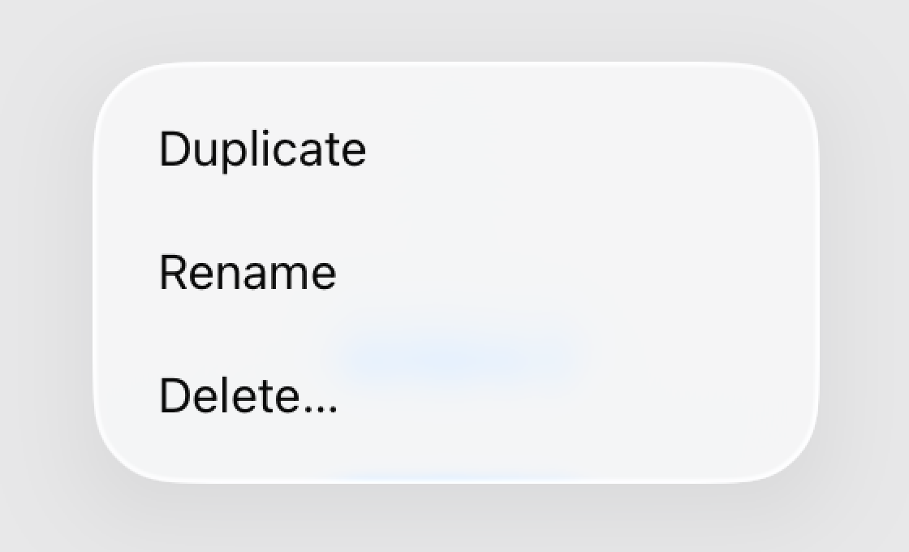

> 注意：SwiftUI 的控件和视图是自适应的，它们既表示功能和含义，也表示视觉呈现。当你打开菜单时，菜单项会依据平台以适合上下文的顺序出现。更多信息请参阅 [menuOrder(_:)](https://developer.apple.com/documentation/swiftui/view/menuorder(_:))。

要在菜单项标题旁边显示一个符号，请使用 [init(_:systemImage:action:)](https://developer.apple.com/documentation/swiftui/button/init(_:systemimage:action:)) 初始化器：

```swift
Menu("Actions") {
    Button("Duplicate", systemImage: "doc.on.doc") {
        // 复制操作。
    }
    Button("Rename", systemImage: "pencil") {
        // 重命名操作。
    }
    Button("Delete…", systemImage: "trash") {
        // 删除操作。
    }
}
```

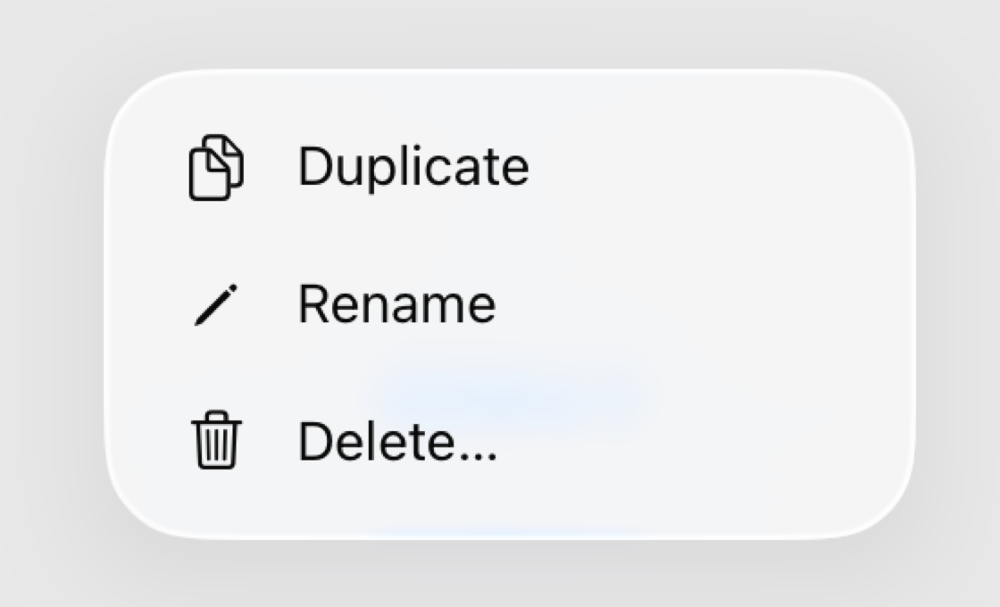

你也可以在 `Button` 上使用带标签闭包的初始化器来构建菜单动作。这种方式为你的副标题提供了更大的灵活性。

要为菜单项添加标题和副标题，请在控件的标签闭包中放入两个 [Text](https://developer.apple.com/documentation/swiftui/text) 视图，其中第一个文本表示标题，第二个表示副标题。下面的示例展示了应用到这些视图上的这种层级样式：

```swift
Menu("Actions") {
    Button {
        // 复制操作。
    } label: {
        Text("Duplicate")
        Text("Duplicate the component")
    }
    Button {
        // 重命名操作。
    } label: {
        Text("Rename")
        Text("Rename the component")
    }
    Button {
        // 删除操作。
    } label: {
        Text("Delete…")
        Text("Delete the component")
    }
}
```

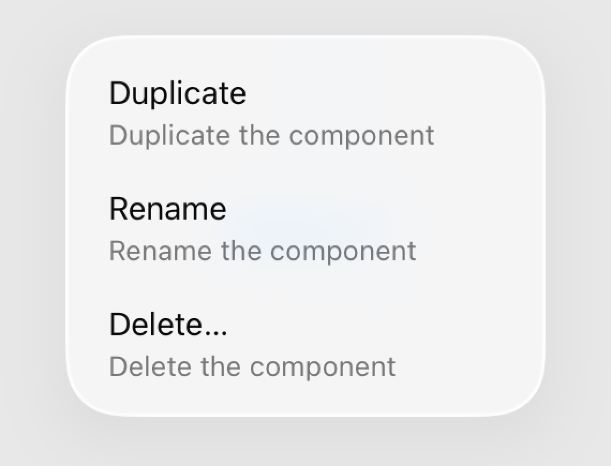

你可以把第一个 `Text` 替换为 [Label](https://developer.apple.com/documentation/swiftui/label) 来插入一个图标：

```swift
Menu("Actions") {
    Button {
        // 复制操作。
    } label: {
        Label("Duplicate", systemImage: "doc.on.doc")
        Text("Duplicate the component")
    }
    Button {
        // 重命名操作。
    } label: {
        Label("Rename", systemImage: "pencil")
        Text("Rename the component")
    }
    Button {
        // 删除操作。
    } label: {
        Label("Delete…", systemImage: "trash")
        Text("Delete the component")
    }
}
```

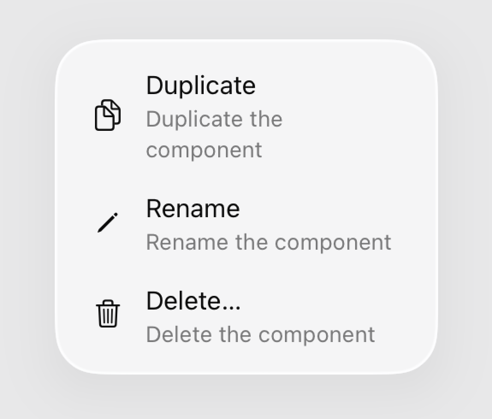

为本质上具有破坏性的菜单项添加视觉警示提示。为 `Button` 添加 [destructive](https://developer.apple.com/documentation/swiftui/buttonrole/destructive) 角色即可把该菜单项着色为红色。只对需要谨慎处理的动作用 `destructive`。

```swift
Menu("Actions") {
    // ...

    Button("Delete…", systemImage: "trash", role: .destructive) {
        // 删除操作。
    }
}
```

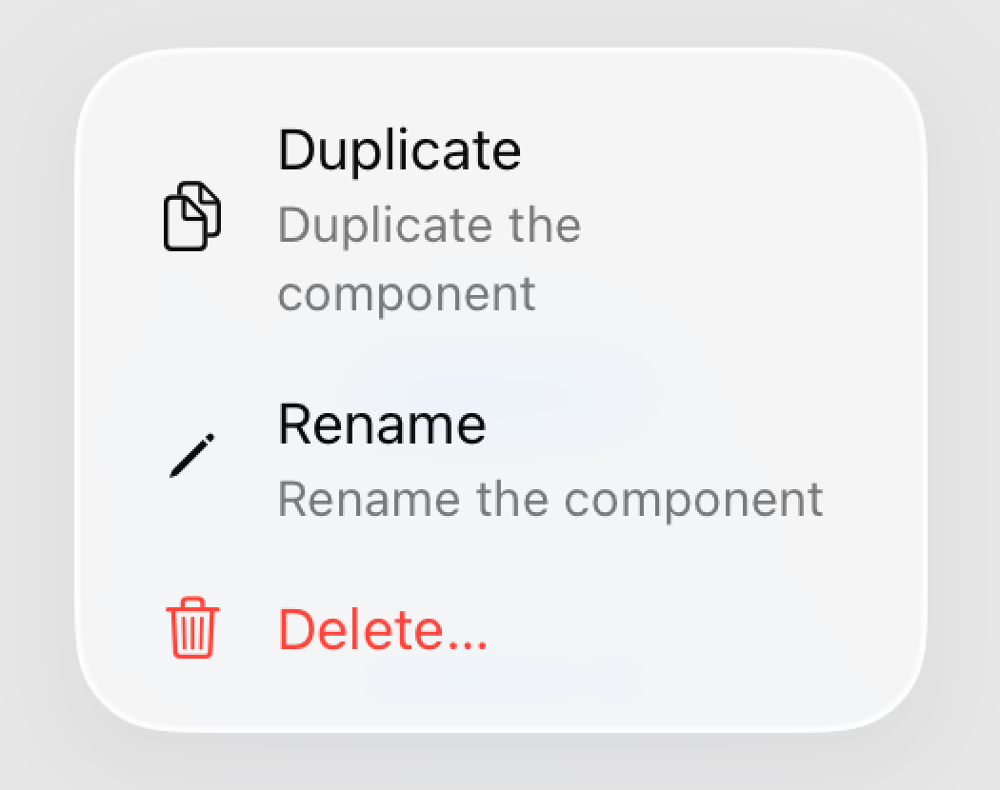

在 macOS 上，用 `Label` 构建的菜单项默认不渲染图标。使用 [titleAndIcon](https://developer.apple.com/documentation/swiftui/labelstyle/titleandicon) 样式可以覆盖系统行为，为这些菜单项显式渲染图标。

```swift
Menu("Actions") {
    // ...
}
.labelStyle(.titleAndIcon)
```

菜单也非常适合表示可切换的项目。要渲染一个可切换的菜单项，你可以在菜单的内容中添加一个 `Toggle`。

由于 SwiftUI 控件会适应其上下文，菜单中的 `Toggle` 会自动带上一个表示其开启或关闭状态的对勾标记。

```swift
Menu("Actions") {
    // ...

    Toggle(
        "Favorite",
        systemImage: "suit.heart",
        isOn: $isFavorite)
}
```


和 `Button` 一样，使用带标签闭包的初始化器来初始化 `Toggle`，可以获得更大的灵活性。

```swift
Menu("Actions") {
    // ...

    Toggle(isOn: $isFavorite) {
        Label("Favorite", systemImage: "suit.heart")
        Text("Adds the component to the favorites list")
    }
}
```


在菜单中使用 [Picker](https://developer.apple.com/documentation/swiftui/picker) 可以让人们从一组选项中做出选择：

```swift
enum Flavor: String, CaseIterable, Identifiable {
    case chocolate, vanilla, strawberry
    var id: Self { self }
}

@State private var selectedFlavor: Flavor = .chocolate

var body: some View {
    Picker("Flavor", selection: $selectedFlavor) {
        ForEach(Flavor.allCases) { flavor in
            Text(flavor.rawValue.capitalized)
                .tag(flavor)
        }
    }
}
```

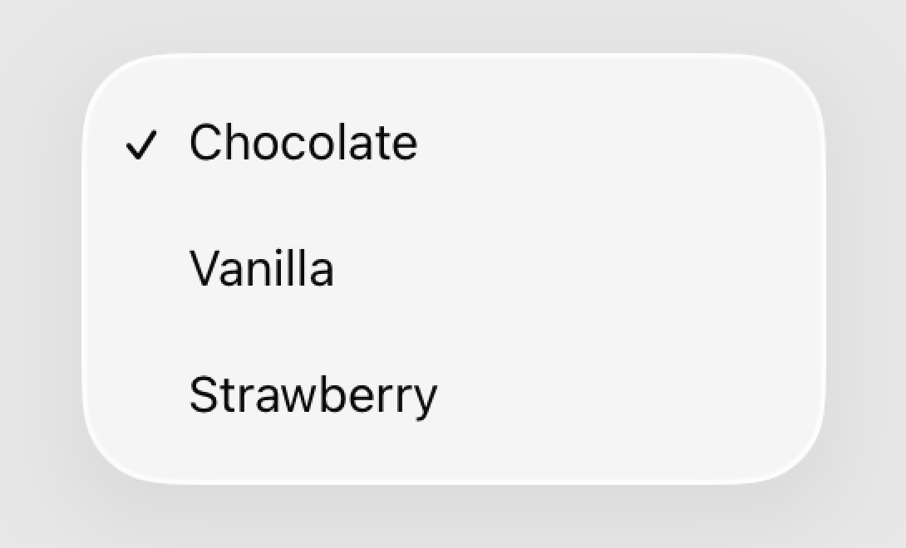

这个示例把选择器嵌入菜单中，显示多个可选择的项目。虽然你可以选中若干选项，但在任何时刻只有一个项目是活跃的。被选中的项目用对勾标记表示，指示当前的选择。

在菜单中加入选择器，比使用多个独立的开关创建出更便捷、更定制的布局。选择器提供一个统一的界面来管理多个选项，确保一个人一次只能选中一个项目。当你内容不需要互斥时，多个开关可能更合适。

```swift
enum Flavor: String, CaseIterable, Identifiable {
    case chocolate, vanilla, strawberry
    var id: Self { self }
}

@State private var selectedFlavor: Flavor = .chocolate
@State private var includesToppings: Bool = false

var body: some View {
    Menu("Ice Cream Order") {
        Button("Special request") {
            // 创建特殊要求。
        }

        Toggle("Include toppings", isOn: $includesToppings)

        Picker("Flavor", selection: $selectedFlavor) {
            ForEach(Flavor.allCases) { flavor in
                Text(flavor.rawValue.capitalized)
                    .tag(flavor)
            }
        }
    }
}
```

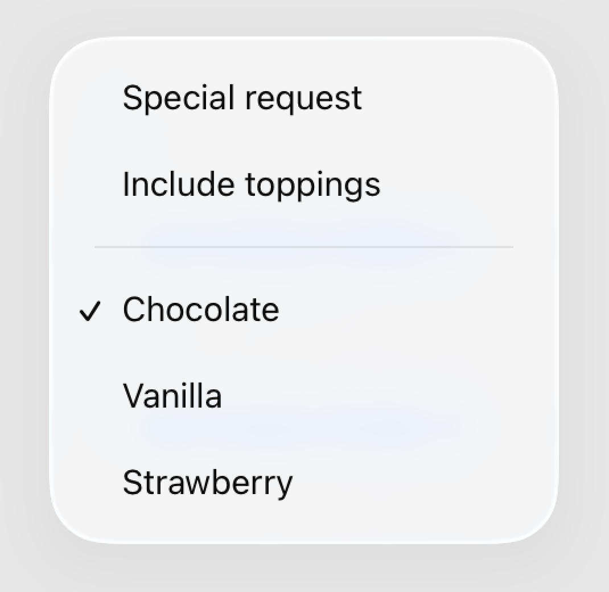

你可以选择 [inline](https://developer.apple.com/documentation/swiftui/pickerstyle/inline)、[menu](https://developer.apple.com/documentation/swiftui/pickerstyle/menu) 和 [palette](https://developer.apple.com/documentation/swiftui/pickerstyle/palette) 等选择器样式。

### 为菜单中的选择器应用样式 {#Apply-style-to-menu-pickers}

默认情况下，菜单中的选择器选项以内联方式出现。SwiftUI 会隐式应用 `inline` 样式，让你无需离开当前视图就能选择选项。内联样式很适合需要即时上下文的设置或配置。

当你为菜单中的选择器应用 `menu` 样式时，它会变成一个子菜单，以层级方式呈现选项。这种样式有助于组织带分类选项的复杂菜单。

```swift
enum Flavor: String, CaseIterable, Identifiable {
    case chocolate, vanilla, strawberry
    var id: Self { self }
}

@State private var selectedFlavor: Flavor = .chocolate
@State private var includesToppings: Bool = false

var body: some View {
    Menu("Ice Cream Order") {
        Button("Special request") {
            // 创建特殊要求。
        }

        Toggle("Include toppings", isOn: $includesToppings)

        Picker("Flavor", selection: $selectedFlavor) {
            ForEach(Flavor.allCases) { flavor in
                Text(flavor.rawValue.capitalized)
                    .tag(flavor)
            }
        }
        .pickerStyle(.menu)
    }
}
```

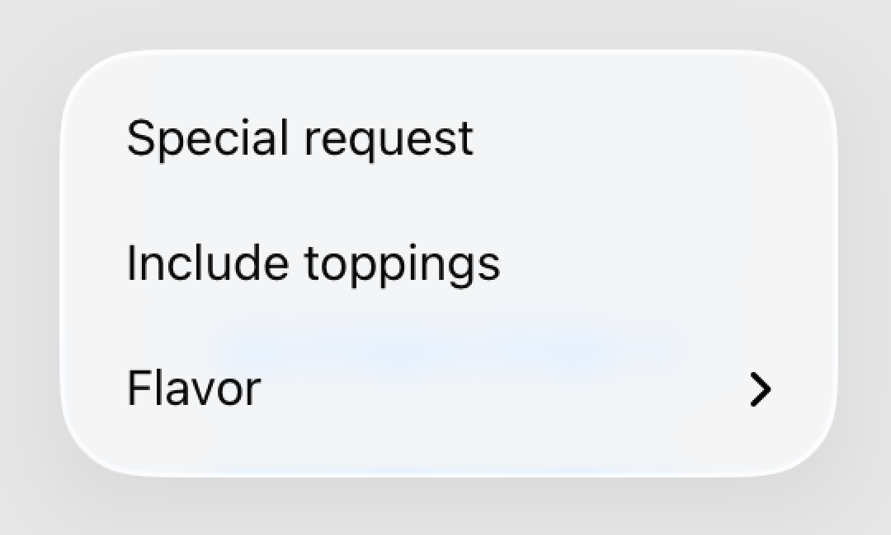

调色板选择器最适合人们从一组符号中进行选择的紧凑场景。调色板选择器会缩小图标，当空间有限时会变成水平滚动。

```swift
enum Flavor: String, CaseIterable, Identifiable {
    case chocolate, vanilla, strawberry
    var id: Self { self }
}

@State private var selectedFlavor: Flavor = .chocolate
@State private var includesToppings: Bool = false

var body: some View {
    Menu("Ice Cream Order 3") {
        Button("Special request") {
            // 创建特殊要求。
        }
        Toggle("Include toppings", isOn: $includesToppings)
        Picker("Flavor", selection: $selectedFlavor) {
            Text("🟤")
                .tag(Flavor.chocolate)
            Text("⚪️")
                .tag(Flavor.vanilla)
            Text("🔴")
                .tag(Flavor.strawberry)
        }
        .pickerStyle(.palette)
    }
}
```

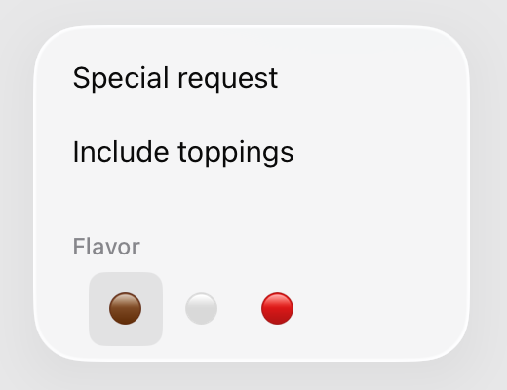

菜单还可以用滑块和步进器来处理数值。

```swift
@State private var quantity: Int = 1

Menu("Actions") {
    // ...

    Stepper(value: $quantity) {
        Text("Quantity: \(quantity)")
    }
}
```


### 对菜单项分组 {#Group-menu-items}

SwiftUI 提供了多种在菜单内对项目分组的方式，包括子菜单、区段和分隔线。

子菜单以层级方式对项目分组，在需要之前隐藏内容。子菜单让主菜单保持整洁，同时在必要时提供对更多选项的访问：

```swift
Menu("General Settings") {
    // “通用设置”子菜单。
    Button("Wi-Fi") { openWiFiSettings() }
    Button("Bluetooth") { openBluetoothSettings() }
    Button("Notifications") { openNotificationSettings() }
    
    // “账户设置”子菜单。
    Menu("Account Settings") {
        Button("Profile") { openProfileSettings() }
        Button("Security") { openSecuritySettings() }
        Button("Privacy") { openPrivacySettings() }
    }
    
    // “高级设置”子菜单。
    Menu("Advanced Settings") {
        Button("Developer Options") { openDeveloperOptions() }
        Button("System Update") { openSystemUpdate() }
        Button("Backup & Restore") { openBackupRestore() }
    }
}
```

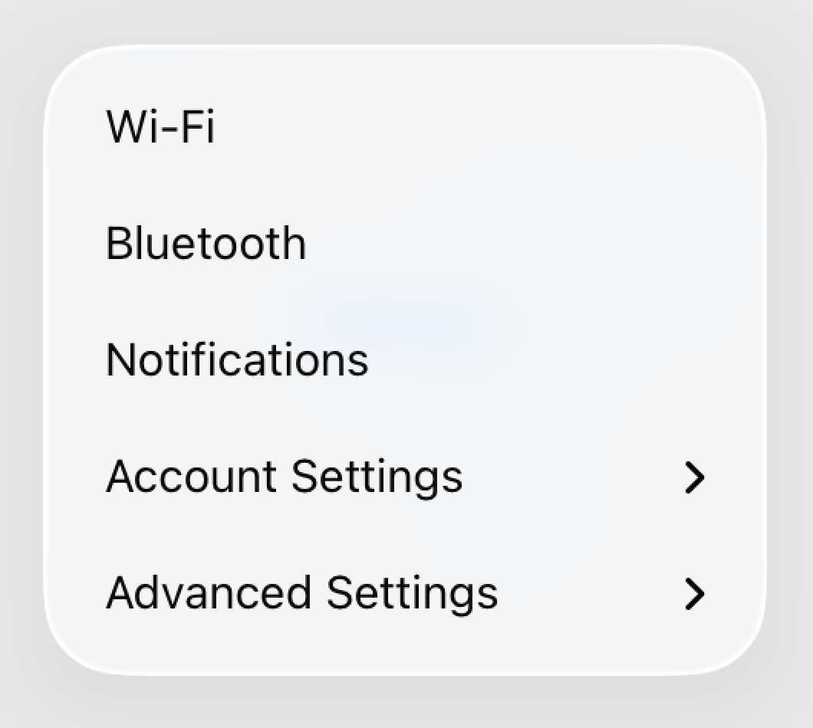

在上面的示例中，Settings 菜单会填充两个子菜单，把相关且不太显眼的设置操作分组在一起。

你也可以用区段来组织项目。[Section](https://developer.apple.com/documentation/swiftui/section) 视图在对项目分组的同时保持所有元素可见，通常会带有区段页眉以便清晰区分。这种样式适合在根级菜单中组织相关项目，为每组提供清晰的区隔和上下文。

```swift
Menu("Settings") {
    // “通用设置”子菜单。
    Section("General Settings") {
        Button("Wi-Fi") { openWiFiSettings() }
        Button("Bluetooth") { openBluetoothSettings() }
        Button("Notifications") { openNotificationSettings() }
    }
    
    // “账户设置”子菜单。
    Section("Account Settings") {
        Button("Profile") { openProfileSettings() }
        Button("Security") { openSecuritySettings() }
        Button("Privacy") { openPrivacySettings() }
    }
    
    // “高级设置”子菜单。
    Section("Advanced Settings") {
        Button("Developer Options") { openDeveloperOptions() }
        Button("System Update") { openSystemUpdate() }
        Button("Backup & Restore") { openBackupRestore() }
    }
}
```

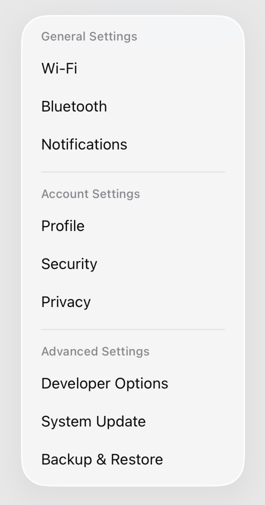

### 显示紧凑的菜单项 {#Display-compact-menu-items}

当你希望在菜单的同一行中显示几个相关操作时，可以考虑使用 [ControlGroup](https://developer.apple.com/documentation/swiftui/controlgroup)。这种方式提供紧凑的水平分组布局，最多可容纳四个项目。

```swift
Menu("Edit") {
    ControlGroup {
        Button {
            // 撤销操作
        } label: {
            Label("Undo", systemImage: "arrow.uturn.backward")
        }
        
        Button {
            // 重做操作
        } label: {
            Label("Redo", systemImage: "arrow.uturn.forward")
        }
        
        Button {
            // 拷贝操作
        } label: {
            Label("Copy", systemImage: "doc.on.doc")
        }
    }
    
    Divider()
    
    // 这里放其他菜单项……
}
```

子菜单和区段是用来对项目分组的容器，而 `Divider` 视图则提供了一种在菜单中视觉分隔项目的简单方式。与 `Section` 不同，`Divider` 不是容器，而是一处视觉断点，把各组项目分开，从而组织并归类相似命令，提升应用之间的可用性和一致性。

### 修改内容行为 {#Modify-content-behavior}

除了填充菜单内容之外，SwiftUI 还提供了一组 API 来修改菜单项的默认行为。

SwiftUI 提供了一组 API 来修改菜单项的默认行为。在 iOS 和 iPadOS 上，系统默认会重新排列菜单项，让菜单中最前面的项目出现在最接近用户交互点的位置。要覆盖这一行为并保持你定义的顺序，请使用 [menuOrder(_:)](https://developer.apple.com/documentation/swiftui/view/menuorder(_:)) 修饰符：

```swift
Menu("Settings", systemImage: "ellipsis.circle") {
    Button("Select") {
        // 选择文件夹
    }
    Button("New Folder") {
        // 创建文件夹
    }
    Picker("Appearance", selection: $appearance) {
        Label("Icons", systemImage: "square.grid.2x2").tag(Appearance.icons)
        Label("List", systemImage: "list.bullet").tag(Appearance.list)
    }
}
.menuOrder(.fixed)
```

> 注意：在 macOS 上，菜单项通常遵循标准的 macOS 排序规则，不会为贴近交互点而重新排序。

默认情况下，当有人点击或轻点某个项目后，菜单会立即关闭。如果你希望这个人做多次选择，或者不重新打开菜单就重复某个操作，请在特定项目上用 [menuActionDismissBehavior(_:)](https://developer.apple.com/documentation/swiftui/view/menuactiondismissbehavior(_:)) 修饰符覆盖这一行为。

下面的代码演示了：

- 增加和减少两个操作停用了菜单的关闭行为，让人们可以反复点击或轻点它们来调整字号，而不必每次都重新打开菜单。
- 一个重置操作会把字体恢复为默认大小。由于该操作没有停用关闭行为，重置后菜单会关闭。

```swift
Menu("Font size") {
    Button(action: increase) {
        Label("Increase", systemImage: "plus.magnifyingglass")
    }
    .menuActionDismissBehavior(.disabled)
    Button("Reset", action: reset)
    Button(action: decrease) {
        Label("Decrease", systemImage: "minus.magnifyingglass")
    }
    .menuActionDismissBehavior(.disabled)
}
```
