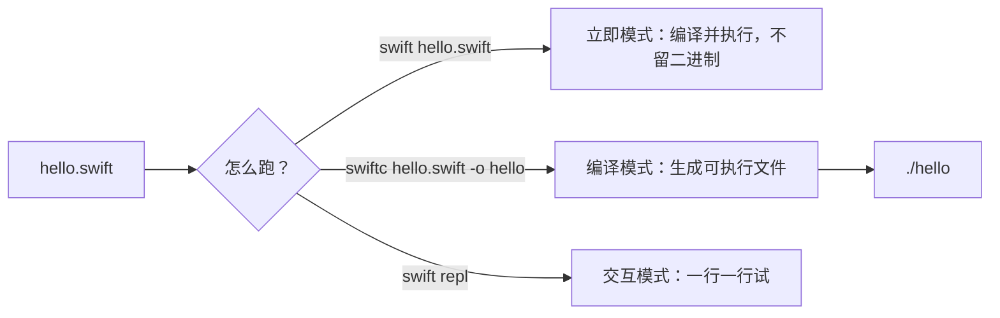

+++
title = "第1章 装上 Swift 6.3，把第一行代码跑起来"
weight = 10
date = "2026-09-14T22:30:00+08:00"
type = "docs"
description = ""
isCJKLanguage = true
draft = false
+++

# 第一章：装上 Swift 6.3，把第一行代码跑起来

> 学一门语言，第一道坎从来不是语法，是环境。好消息是 Swift 的安装比"手工把编译链路拼起来"体面得多；坏消息是它有好几个来源、好几个版本，装得不巧会得到一些非常神秘的现象——同样的代码，别人那儿岁月静好，你这儿突然冒出一串看不懂的警告。

## 1.1 先把版本对齐

本书的基准是 **Swift 6.3.x**（截至 2026 年 9 月，稳定版是 6.3.3）。Swift 6.4 目前还在开发分支上、尚未正式发布，所以本书不会教你任何"只有 6.4 才认"的语法。

在动手装之前，先把两个经常被混为一谈的概念分开：

| 概念 | 长什么样 | 它决定了什么 |
|------|----------|--------------|
| 工具链版本 | 你机器上的 `swift` 命令是 6.3.3 | 编译器、标准库、能不能认出某个新语法 |
| 语言模式 | `-swift-version 6` / `-swift-version 5` | 编译器用哪一套规则来"较真" |

同一个 6.3.3 的工具链，既能按语言模式 5 编译，也能按语言模式 6 编译。语言模式 6 会把"数据竞争安全"纳入编译期检查：某些跨线程共享可变状态的写法，在模式 5 下编译器一声不吭，在模式 6 下就会给你颜色看。

至于"给颜色看"到底是警告还是错误，取决于语言模式、特性开关和工具链版本——所以本书不会用"编译器一定会拦住你"来讲解语法。**本书示例按语言模式 6 编写，但绝大多数示例在模式 5 下照样跑得通。**

## 1.2 安装工具链

### 1.2.1 macOS

- 省事路线：从 App Store 装 Xcode，`swift` 随它一起到货。
- 只想要命令行工具：`xcode-select --install`。
- 想同时保留多个版本、随时切换：用官方工具 **Swiftly**（swift.org/swiftly）。

装完确认一下你正在用的到底是谁：

```bash
$ xcrun --find swift
/Library/Developer/CommandLineTools/usr/bin/swift
$ swift --version
swift-driver version: 1.168.6 Apple Swift version 6.4 (swiftlang-6.4.0.34.1 clang-2100.3.34.1)
Target: arm64-apple-macosx26.0
```

上面是作者机器上的真实输出，版本号、路径和目标平台都会随你的系统与工具链变化。你只需要从里面读两个信息：**Swift 的版本号**，以及 **Target 后面的目标平台**。macOS 上的输出通常带 `Apple ` 前缀，Linux 上一般长得像 `Swift version 6.3.3 (swift-6.3.3-RELEASE)`。

### 1.2.2 Linux

用 Swiftly 或官方 tar.gz 包安装，具体支持的发行版清单以 swift.org/install 为准。Linux 上有个常见现象：缺了 `libedit` 之类的运行库时，REPL 依然能进去，但历史记录和方向键会让你瞬间回到 1970 年代。

### 1.2.3 Windows

官方提供安装包（需要装好 Visual Studio 的 C++ 组件），也可以走 WSL。另外，把工具链装在路径简单的位置（别带空格和中文）能省掉一批玄学问题。

## 1.3 四种把代码跑起来的方式

初学阶段最常犯的错不是代码写错，而是**不知道该敲哪条命令**。先看图：



| 方式 | 命令 | 什么时候用 |
|------|------|------------|
| 交互模式 | `swift repl` | 试一小段语法、验算一个表达式，不想建文件 |
| 立即模式 | `swift hello.swift` | 单文件小实验，改一行跑一次 |
| 编译模式 | `swiftc hello.swift -o hello` | 想看完整的编译错误、想反复运行同一个程序 |
| 包模式 | `swift run` | 多文件、多依赖的项目（第 3 章） |

顺手记两个边角料。第一，`swift -e` 可以直接执行一小段代码，连文件都不用建：

```bash
$ swift -e 'print("one-liner:", 6 * 7)'
one-liner: 42
```

第二，`swift -` 会从标准输入读代码，适合把片段直接从别处管道喂进来：

```bash
$ echo 'print("via stdin")' | swift -
via stdin
```

哪天忘了有哪些子命令，裸敲 `swift` 就会给你一张地图（下面是真实输出的节选）：

```text
Welcome to Swift!

Subcommands:

  swift build      Build Swift packages
  swift package    Create and work on packages
  swift run        Run a program from a package
  swift test       Run package tests
  swift repl       Experiment with Swift code interactively

  Use `swift --version` for Swift version information.
```

## 1.4 第一个程序：hello.swift

新建一个文件，名字随便起，后缀是 `.swift` 就行：

> 保存时用 UTF-8。现代编辑器默认就是它，但如果你的文件是从别处拷来的、或者编辑器提示"UTF-8 with BOM"，先确认一下编码——源文件的编码规则是第 2 章的第一件事。

```swift
/*
 第一个 Swift 程序。
 块注释可以嵌套——这点比很多语言大方：
 /* 内层注释也是合法的 */
*/

let language = "Swift"
let version = 6.3

print("你好，\(language) \(version)！")
print("字符串插值", "可以写多个参数", separator: " | ", terminator: " ✔️\n")
// prints: 你好，Swift 6.3！
// prints: 字符串插值 | 可以写多个参数 ✔️
```

短短几行里已经出现了三个你以后每天都用的东西：

- `let` 用来声明常量（第 4 章细讲，现在只要记住"不会改的值就用 `let`"）。
- `\(...)` 是字符串插值，把值塞进字符串里。
- `print` 可以接多个参数：`separator` 决定它们之间塞什么，`terminator` 决定结尾放什么（默认是换行）。

跑起来：

```bash
$ swift hello.swift
你好，Swift 6.3！
字符串插值 | 可以写多个参数 ✔️
```

### 1.4.1 REPL：先把它当计算器用

`swift repl` 进去之后，输入一个表达式回车，它会直接把结果告诉你：

```text
$ swift repl
  1> let x = 2 * 21
x: Int = 42
  2> x + 1
$R0: Int = 43
  3> ":)".count
$R1: Int = 2
```

注意最后一行，它顺便剧透了后面会讲的东西：`String` 的长度不是"有几个字节"，而是"有几个字符"，`":)"` 数出来正好是 2。

## 1.5 编译模式：留下一个真正的可执行文件

立即模式很方便，但它每次都现场编译。想让程序变成一个能反复运行的文件，就显式编译：

```bash
$ swiftc hello.swift -o hello
$ ./hello
你好，Swift 6.3！
字符串插值 | 可以写多个参数 ✔️
```

两个提醒：

1. 编译成功时 `swiftc` **什么都不打印**——安静就是成功，别盯着屏幕等它说话。
2. 编译出来的是**当前平台的原生机器码**。macOS 上编出来的 `hello` 不能直接丢到 Linux 上运行；想发布到哪个平台，就在那个平台上编译，或者交给 CI 去构建。

## 1.6 语言模式：让编译器多管一点事

语言模式的开关叫 `-swift-version`：

```bash
$ swiftc -swift-version 6 hello.swift -o hello   # 按 Swift 6 的规矩编译
$ swiftc -swift-version 5 hello.swift -o hello   # 按 Swift 5 的规矩编译
```

如果什么都不写，编译器会用它自己的默认语言模式（为了兼容旧代码，默认并不是 6）。这意味着**同一份代码，加不加这个参数，得到的诊断可能完全不同**。举个你迟早会遇到的场景：多个线程同时改一个全局变量。这类代码在语言模式 6 下会被编译器盯上，而在默认模式下可能毫无提示。

现在你不需要看懂那些诊断，只要记住两条经验：

> 读别人的 Swift 教程时，如果示例"明明能跑"，先看看它写在哪个语言模式下；如果你的代码在别人机器上通过、在你这里报错，也先怀疑模式不同。

本书的写法是：语言模式按 6，语法按 6.3 稳定版，不碰 6.4 开发中的东西。

## 1.7 本章小结

| 你想做的事 | 命令 |
|------------|------|
| 看当前工具链版本 | `swift --version` |
| 进交互环境 | `swift repl` |
| 直接跑一个文件 | `swift hello.swift` |
| 编译成可执行文件 | `swiftc hello.swift -o hello` |
| 执行一小段代码 | `swift -e 'print(1 + 1)'` |
| 指定语言模式编译 | `swiftc -swift-version 6 hello.swift -o hello` |
| 建一个正经项目 | `swift package init --type executable`（第 3 章） |

## 1.8 本章易错点速查

| 容易踩的地方 | 正确认识 |
|--------------|----------|
| `swift: command not found` 一定意味着没装 Swift | 也可能装了但不在 PATH 里；macOS 上先试 `xcrun --find swift`，看看 Xcode 或命令行工具里的那个在不在 |
| 工具链版本就是语言模式 | 两回事。6.3.3 的工具链可以按语言模式 5 或 6 编译；抄来的代码能不能过，语言模式是关键变量 |
| 教程说"最新版 Swift"，照抄即可 | 先确认它指的是稳定版还是开发分支；开发分支上的特性随时会被改名甚至撤回 |
| `swiftc` 编译完没有输出，以为失败了 | 编译成功不打印任何东西。想确认就看可执行文件有没有生成，或者直接 `./hello` |
| 改了代码，运行结果却没变 | 你多半在反复运行上一次编译出的二进制。重新编译，或者干脆用 `swift hello.swift` |
| 中文注释或字符串让编译报错 | 先查编码：源文件必须存成 UTF-8，报错通常是 `invalid UTF-8 found in source file`（第 2 章细讲）。用编辑器"另存为"UTF-8 即可 |
| 在 macOS 编好就想丢到 Linux 上跑 | 二进制不跨平台。要发布到哪个系统，就在哪个系统（或对应的 CI）上编译 |
| 一进 REPL 就以为它坏了 | Linux 上缺 `libedit` 之类的运行库时，历史记录和方向键会不正常，装上依赖再试 |

## 1.9 下章预告

工具链装好了，命令行也不陌生了。下一章我们把一份 Swift 源码放到显微镜下：文件到底该存成什么编码、注释怎么写、标识符能用哪些字符、关键字有哪些、字面量有多少种写法（从 `0b1010` 一路到 `#/正则/#`），以及那些长得像咒语的 `#file`、`#warning`、`#sourceLocation` 到底在干什么。
