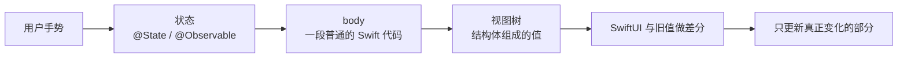

+++
title = "第40章 SwiftUI 的心智模型：视图是值，状态是源头"
weight = 400
date = "2026-09-14T22:30:00+08:00"
type = "docs"
description = "视图是值、状态是源头：理解 body 重算、some View、身份与场景，为后面七章打好地基"
isCJKLanguage = true
draft = false
+++

# 第四十章：SwiftUI 的心智模型：视图是值，状态是源头

> SwiftUI 让写界面变得太容易，容易到很多人跳过了"它到底怎么工作"这一步，然后在第一个真实需求上撞墙。这一章要建立的模型只有两句话：**视图是描述，不是控件；状态是唯一的事实来源。** 把这两句话想透，后面七章都会轻松很多。

## 40.1 从"摆控件"到"描述结果"

传统 UI 框架的工作方式是命令式的：你拿到一个按钮对象，设置它的标题，然后写代码告诉它"标题变了，去更新自己"。程序员负责维护"屏幕上的东西"和"数据里的东西"之间的一致性——这活儿枯燥、易错，而且每次需求变更都要重来一遍。

SwiftUI 换了个方向：你只描述"在这个状态下，界面应该长什么样"，数据一变，框架重新调用你的描述，然后自己算出该改哪几个像素。



图里那条从"用户手势"回到"状态"的箭头，是整个框架的核心循环：**用户操作改状态，状态驱动界面**。你在写 SwiftUI 时，几乎不该出现"去改界面上某个东西"这种动作。

## 40.2 视图是结构体，不是屏幕上的控件

```swift
import SwiftUI

struct Greeting: View {
    var name: String

    var body: some View {
        VStack(spacing: 8) {
            Text("你好，\(name)")
                .font(.title)
            Text("这一行是副标题")
                .foregroundStyle(.secondary)
        }
    }
}

// 创建视图只是创建了一个值，屏幕上还什么都没有发生
let greeting = Greeting(name: "Mia")
print(type(of: greeting))
// prints: Greeting

// 界面效果：一句大标题"你好，Mia"，下面一行灰色的副标题
```

`Greeting` 是一个普通结构体，`body` 是一个普通的计算属性。它在内存里就是"名字 + 一个描述"。SwiftUI 拿到这个值之后才决定怎么画。

这一点带来的第一个实际结论是：**视图可以被随便创建、复制、丢弃**。在 `body` 里写 `Text("a"); Text("b")` 不会创建两个长期存在的控件，只是描述里多了一句话。

第二个结论更重要：**`body` 里不要放副作用**。它是"描述"，随时可能被重新计算，计算几次都不该改变外界状态。打印日志、发网络请求、改全局变量，这些都不该出现在 `body` 里——它们属于按钮的动作或者 `.task` 修饰符（第 46 章）。

## 40.3 `body` 每次都重新计算，为什么不用怕

状态一变，SwiftUI 就会重新调用 `body`。听起来像"整个界面重建"，其实不是：

1. `body` 生成一棵新的视图值树；
2. SwiftUI 把它和上一棵树按**结构位置**比较；
3. 只有真正不同的部分才去更新底层的绘制内容。

第 2 步的"按结构位置比较"决定了后面几章反复出现的两个字：**身份**。同样的代码、同样的位置，SwiftUI 就认为是同一个视图，只更新它变化的属性；位置或 `id` 变了，它就当作"旧的走了、新的来了"，会重建状态（第 43 章会遇到这个坑）。

所以"`body` 会被反复调用"不是性能问题，**在 `body` 里做重活才是**。一条经验规则：`body` 里只写"摆布局、连线状态"，真正的计算放进模型类型里，或者用 `.task` / 计算属性缓存。

## 40.4 `some View`：为什么这个返回类型写不出来

`body` 的声明是 `var body: some View`。为什么不写具体类型？因为嵌套几层之后，真实类型会长成这个样子：

```text
VStack<TupleView<(ModifiedContent<Text, _EnvironmentKeyWritingModifier<...>>, ...)>>
```

没人想读它。`some View` 的意思是"我返回某个确定的类型，但我不想说出它的名字"（不透明返回类型，第 23.6 节）。它有两个直接后果：

- 视图的具体类型由编译器推导，你写 `VStack { ... }` 就是那个 `VStack<...>`；
- 一个函数里能返回的底层类型必须唯一——所以 `if` 的分支类型不同时，`@ViewBuilder` 会帮你把它们打包成"二选一"的类型。

```swift
import SwiftUI

struct TwoLines: View {
    var body: some View {
        VStack {
            Text("第一行")
            Text("第二行")
        }
    }
}

@ViewBuilder
func statusIcon(_ on: Bool) -> some View {
    if on { Text("开") } else { Image(systemName: "xmark") }
}

print(String(describing: type(of: TwoLines().body)).hasPrefix("VStack"))
// prints: true
print(String(describing: type(of: statusIcon(true))))
// prints: _ConditionalContent<Text, Image>
```

第二行输出就是"打包"的证据：`Text` 和 `Image` 两个类型完全不同的分支，被 `@ViewBuilder` 合成了一个真实存在的类型。日常你不需要记住它，但看到这个类型名时要知道它从哪里来（第 15B.18 节讲过结果构建器）。

## 40.5 状态是唯一的事实来源

界面上所有会变的东西，都该有一个明确的"家"。SwiftUI 把这份责任交给属性包装器：

```swift
import SwiftUI

struct CounterView: View {
    @State private var count = 0

    var body: some View {
        VStack(spacing: 12) {
            Text("点了 \(count) 次")
                .font(.largeTitle)
            HStack {
                Button("减一") { count -= 1 }
                Button("加一") { count += 1 }
            }
            .buttonStyle(.borderedProminent)
        }
        .padding()
    }
}

// 界面效果：一行大号计数，下面两个按钮；点按钮时数字变化
```

`@State` 的意思是"这份数据属于这个视图，视图会因为它变化而重画"。注意按钮里写的是什么：`count += 1`——**改数据，不是改界面**。界面上的文字为什么会更新？因为 `body` 里读了这个状态，SwiftUI 记录了这次读取，等状态变了就再来一次。

由此得到一条最实用的排错思路：**界面不更新，九成是"它没读到你以为它读了的那份状态"**。要么状态没变（改的是副本），要么视图读的是另一份（状态放错了层），要么视图的身份被换掉了（列表没给 `id`）。这三种情况分别在第 41、43 章展开。

## 40.6 视图的身份：为什么列表需要 `id`

`for` 循环里依次生成视图，SwiftUI 怎么知道"第三行还是原来那第三行"？靠身份。数组里的元素是普通值（比如 `String`），值相同就分不清谁是谁，所以要给一个稳定标识：

```swift
import SwiftUI

struct Note: Identifiable {
    let id = UUID()
    var title: String
}

struct NoteList: View {
    let notes: [Note]

    var body: some View {
        List(notes) { note in
            Text(note.title)
        }
    }
}
```

`List(notes)` 之所以能这么写，是因为 `Note` 遵循了 `Identifiable`，有了稳定的 `id`。如果元素类型没有 `id`，你就得手动告诉它按什么认人：`ForEach(notes, id: \.title) { ... }`。用 `\.title` 这种"会被编辑的字段"当身份，是新手最常埋的一颗雷——改了标题，那一行在 SwiftUI 眼里就变成新行了。

## 40.7 一个 App 的最小骨架

```swift
import SwiftUI

@main
struct NotesApp: App {
    var body: some Scene {
        WindowGroup {
            NoteList(notes: [Note(title: "第一篇笔记")])
        }
    }
}
```

三行结构，三个概念：

- `@main` 标记程序入口（第 3.6 节）；
- `App` 协议要求一个 `body`，类型是 `some Scene`；
- `WindowGroup` 是"窗口"这一层的容器：macOS 上可以开多个窗口，iOS 上就是一个主窗口。要加"设置"这样的第二窗口，再加一个 `Settings { ... }` 场景即可。

注意**场景（Scene）和视图（View）是两层东西**：场景管窗口与生命周期，视图管窗口里的内容。把窗口级的事情（多窗口、菜单）写进视图里，是另一种常见的方向性错误。

## 40.8 本章小结

| 概念 | 一句话 | 带来的后果 |
| --- | --- | --- |
| 声明式 | 描述结果，不描述步骤 | 你不再手工同步界面与数据 |
| 视图是值 | `View` 是结构体，`body` 是计算属性 | 视图可以随意创建丢弃；`body` 里不能有副作用 |
| 重新计算 | 状态变，`body` 重算，框架做差分 | 重活别放在 `body` 里 |
| `some View` | 隐藏"长得没法看"的真实类型 | 分支类型不同时由 `@ViewBuilder` 打包 |
| 状态 | 唯一的事实来源 | 界面不更新，先查状态读没读对 |
| 身份 | 结构位置 + `id` 决定"是不是同一个视图" | 列表元素必须有稳定 `id` |
| 场景与视图 | 场景管窗口，视图管内容 | 别把窗口级逻辑塞进视图 |

## 40.9 本章易错点速查

| 容易踩的地方 | 正确认识 |
| --- | --- |
| 在 `body` 里发请求、打日志、改全局状态 | `body` 是描述，可能被反复计算，副作用要放进 `.task` 或按钮动作 |
| 以为"`body` 重算"等于"界面重建" | SwiftUI 会和旧视图树比较，只更新变化的部分 |
| 把状态放在 `body` 里的局部变量中 | 局部变量每次重算都会重置，要用 `@State` |
| 直接去改界面上的东西 | SwiftUI 里只有"改状态"，界面是状态的函数 |
| 列表里用可变字段当 `id` | 内容一变身份就变，视图会被重建、状态会丢 |
| 以为 `some View` 是"随便什么视图" | 它是一个确定但匿名的类型；分支类型不同必须靠 `@ViewBuilder` |
| 把窗口级逻辑写进视图 | 场景管窗口与生命周期，视图只管内容 |

## 40.10 下章预告

模型建立起来了，接着要解决最实际的问题：这份状态到底该放在哪？`@State`、`@Binding`、`@Observable`、`@Environment` 四个包装器各自负责什么，什么时候会把状态放错层。下一章把它们排成一张数据流地图。
