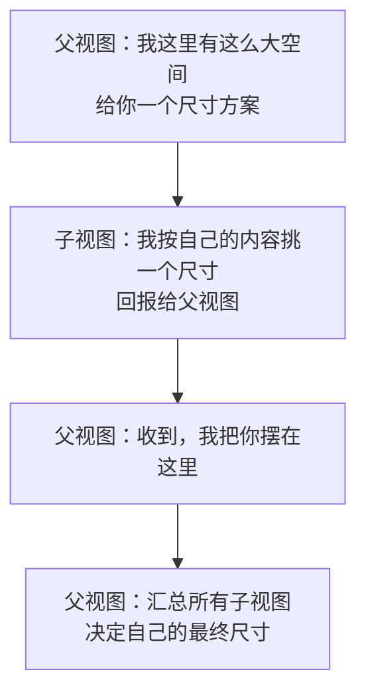

+++
title = "第42章 布局与视图组合：一场父与子的谈判"
weight = 420
date = "2026-09-14T22:30:00+08:00"
type = "docs"
description = "SwiftUI 布局的三条规则、Stack 与 Grid、frame 的四层含义、自定义 Layout 与 ViewModifier"
isCJKLanguage = true
draft = false
+++

# 第四十二章：布局与视图组合：一场父与子的谈判

> 从 CSS 过来的人第一次写 SwiftUI 布局，通常会经历同一个瞬间：`frame(maxWidth: .infinity)` 没反应，`Spacer()` 一会儿有用一会儿没用，`.padding().background()` 和 `.background().padding()` 出来的效果完全不同。这些都不是 bug，而是因为你还没拿到 SwiftUI 布局的**规则说明书**。这一章把它摊开。

## 42.1 三条规则，一次谈判

SwiftUI 的布局不是"给每个元素设置宽高"，而是两个角色的一次对话：



翻成规则就是三条：

1. **父视图给每个子视图一个"提议尺寸"**（`ProposedViewSize`），可能是具体数值，也可能是 `nil` 表示"你自己看着办"。
2. **子视图自己决定用多大**，并把结果报回去。子视图有权不理会提议——比如一个 `Text` 在空间不够时会换行，但依然可能比提议更高。
3. **父视图在子视图都报完之后，决定自己的最终尺寸，并把每个子视图放到各自的位置上。**

这套规则解释了一个反直觉的现象：**`Text` 比你想的"倔"。** 你给它 `frame(width: 50)`，它不会截断、不会缩小字号，而是按自己的行宽排好，然后可能溢出那个框。`frame` 只是"提议"，不是"命令"。

## 42.2 Stack：最简单的三种排列

```swift
import SwiftUI

struct StackBasics: View {
    var body: some View {
        VStack(alignment: .leading, spacing: 8) {
            // 1. 水平排列
            HStack(alignment: .firstTextBaseline, spacing: 4) {
                Text("¥").font(.caption)
                Text("1,299").font(.largeTitle).bold()
                Text("起").font(.caption).foregroundStyle(.secondary)
            }

            // 2. 垂直排列，左对齐
            VStack(alignment: .leading) {
                Text("标题").font(.headline)
                Text("说明文字").font(.subheadline)
            }

            // 3. 叠放，后写的盖在上面
            ZStack(alignment: .bottomTrailing) {
                RoundedRectangle(cornerRadius: 12).fill(.quaternary)
                    .frame(height: 80)
                Text("角标").font(.caption).padding(6)
            }
        }
        .padding()
    }
}

// 界面效果：价格一行（¥ 小、数字大、起小），标题两行左对齐，
// 最后是一个圆角灰块，右下角贴着"角标"
```

三个 Stack 的参数只有两个，但每个都有讲究：

| 参数 | 可取什么 | 说明 |
| --- | --- | --- |
| `alignment` | `VerticalAlignment` / `HorizontalAlignment` / `Alignment` | 决定子视图在**交叉轴**上怎么对齐；`.firstTextBaseline` 能让不同字号的文字基线对齐 |
| `spacing` | `CGFloat?` | 子视图之间的空隙；传 `nil` 表示"用系统默认" |

⚠️ `alignment` 只在子视图尺寸**小于容器**时才有可见效果。如果每个子视图都撑满了容器宽度，怎么对齐都一样。

## 42.3 谁拿走剩余空间：`Spacer` 与 `frame(maxWidth:)`

这是新手最容易懵的地方。先把两种"撑开"的手段分清：

```swift
import SwiftUI

struct Filling: View {
    var body: some View {
        VStack(spacing: 16) {
            // 写法一：Spacer 是一个"有弹性的空视图"，它会吃掉剩余空间
            HStack {
                Text("左边")
                Spacer()
                Text("右边")
            }
            .background(.yellow.opacity(0.2))

            // 写法二：让某个视图自己报出"我想占满"
            Text("我占满整行")
                .frame(maxWidth: .infinity)
                .background(.green.opacity(0.2))

            // 对比：不加 frame 时，背景只包住文字
            Text("我只包住自己")
                .background(.blue.opacity(0.2))
        }
        .padding()
    }
}

// 界面效果：第一行文字分贴两侧（黄底铺满）；
// 第二行绿底铺满整行；第三行蓝底只包住文字本身
```

`Spacer()` 的本质是一个 `minLength` 默认为 8 的**弹性视图**：空间富余时它按比例扩张，空间不足时它缩到最小。所以 `Spacer()` 在 `ScrollView` 里经常"失灵"——因为纵向空间由内容决定，没有"剩余"可分。

`frame(maxWidth: .infinity)` 则是在说："**我向上申请可能拿到的全部宽度。**" 它不制造空间，只是让这个视图去认领父视图给的空间。

### 按比例分空间

```swift
import SwiftUI

struct Ratio: View {
    var body: some View {
        VStack {
            HStack(spacing: 0) {
                Color.red.frame(width: 60)                // 固定宽
                Color.green.frame(maxWidth: .infinity)    // 弹性：占 1 份
                Color.blue.frame(maxWidth: .infinity)     // 弹性：占 1 份
            }
            .frame(height: 40)

            HStack(spacing: 0) {
                Spacer().frame(maxWidth: .infinity)
                Spacer().frame(maxWidth: .infinity)
                Spacer().frame(maxWidth: .infinity)
            }
            .frame(height: 4)
        }
    }
}

// 界面效果：绿蓝两条各分走剩余宽度的一半；下面的三个 Spacer 三分剩余空间
```

## 42.4 `frame` 的四层含义

`frame` 有四个重载，别把它们当成一个 API：

| 写法 | 含义 | 常见用途 |
| --- | --- | --- |
| `.frame(width: 100, height: 50)` | **固定**：向子视图提议这个尺寸，自己也报这个尺寸 | 头像、图标 |
| `.frame(maxWidth: .infinity)` | **上限**：子视图最多这么宽；`infinity` 等于"能拿多少拿多少" | 撑满容器 |
| `.frame(minWidth: 80, idealWidth: 120, maxWidth: 200)` | **范围**：在区间内取理想值 | 可伸缩的卡片 |
| `.frame(width: 100, alignment: .leading)` | 在固定的框里，把内容**怎么对齐** | 固定宽度但左对齐的文字 |

```swift
import SwiftUI

struct FrameKitchen: View {
    var body: some View {
        VStack(spacing: 12) {
            Text("固定 120×40")
                .frame(width: 120, height: 40)
                .background(.orange.opacity(0.25))

            Text("撑满，文字居左")
                .frame(maxWidth: .infinity, alignment: .leading)
                .background(.teal.opacity(0.25))

            Text("撑满，但内容居中")
                .frame(maxWidth: .infinity, alignment: .center)
                .background(.purple.opacity(0.25))

            Text("很短")
                .frame(minWidth: 80, idealWidth: 120, maxWidth: 200)
                .background(.pink.opacity(0.25))
        }
        .padding(.horizontal)
    }
}

// 界面效果：前两条铺满整行，第三条宽度停在 120 左右，
// 第四条只有文字那么宽，但因为 minWidth 至少 80
```

### `.fixedSize()`：让视图"按内容来，别管提议"

遇到文字被压成两三行甚至省略号时，正解往往不是把框调大，而是告诉子视图"忽略提议"：

```swift
import SwiftUI

struct FixedSizeDemo: View {
    var body: some View {
        HStack {
            Text("这行文字很长很长很长很长很长很长")
                .lineLimit(1)
                .fixedSize()                  // 不为宽度妥协，宁可溢出
                .background(.red.opacity(0.2))
            Text("这一条会被挤")
        }
    }
}

// 界面效果：第一段文字横着溢出它的空间，第二段被挤到很窄（甚至看不见）
```

## 42.5 `.layoutPriority`：谈判里的"我先说"

多个子视图抢空间时，`layoutPriority` 决定谁的意见先被采纳。数字越大越优先，默认是 0。

```swift
import SwiftUI

struct PriorityDemo: View {
    var body: some View {
        VStack(spacing: 16) {
            // 都没有优先级：宽度按"提议比例"平分
            HStack {
                Text("等权 A").background(.gray.opacity(0.2))
                Text("等权 B").background(.gray.opacity(0.2))
            }

            // A 有优先级：A 先按自己想要的宽度定，B 吃剩下的
            HStack {
                Text("优先 A").layoutPriority(1).background(.green.opacity(0.3))
                Text("退让 B").background(.gray.opacity(0.2))
            }
        }
        .padding()
    }
}

// 界面效果：第一行两个宽度接近；
// 第二行"优先 A"完整显示，"退让 B"被压窄
```

## 42.6 `GeometryReader`：拿父视图给的真实尺寸

布局规则有一个刻意的约束：**子视图在决定自己的尺寸时，不该依赖父视图的最终尺寸**（否则会绕圈）。所以想根据容器大小做比例计算，就得用 `GeometryReader`：

```swift
import SwiftUI

struct GaugeBar: View {
    let progress: Double          // 0...1

    var body: some View {
        // GeometryReader 会撑满父视图给的空间，并把尺寸放进 proxy
        GeometryReader { proxy in
            ZStack(alignment: .leading) {
                Capsule().fill(.quaternary)
                Capsule().fill(.tint)
                    .frame(width: proxy.size.width * progress)
            }
        }
        .frame(height: 12)
    }
}

struct GaugePage: View {
    var body: some View {
        VStack(spacing: 20) {
            GaugeBar(progress: 0.25)
            GaugeBar(progress: 0.8)
        }
        .padding()
    }
}

// 界面效果：两条细胶囊进度条，分别填充 25% 和 80%
```

⚠️ `GeometryReader` 有个著名脾气：**它会尽量占满可用空间**，所以放在 `VStack` 里时经常发现其他元素被挤走、自己撑得老高。解决办法是给它一个明确的 `.frame(height:)`，或者改用更省心的 `.containerRelativeFrame(_:)`：

```swift
import SwiftUI

struct HalfWidth: View {
    var body: some View {
        Text("半宽卡片")
            .frame(maxWidth: .infinity)
            .containerRelativeFrame(.horizontal) { length, _ in length * 0.5 }
            .background(.indigo.opacity(0.2))
    }
}

// 界面效果：卡片宽度是容器的 50%
```

`containerRelativeFrame` 是这几版很受欢迎的新 API：它直接拿"最近容器"的尺寸做参考，不用引入 `GeometryReader`，也就不会有"撑满空间"的副作用。

## 42.7 Grid 与 Lazy 网格

需要"行列对齐"时，用 `Grid`（内容少、需要真表格）或 `LazyVGrid` / `LazyHGrid`（内容多、需要懒加载）。

```swift
import SwiftUI

struct GridDemo: View {
    var body: some View {
        Grid(alignment: .leading, horizontalSpacing: 16, verticalSpacing: 6) {
            GridRow {
                Text("项目").bold()
                Text("数量").bold()
            }
            Divider().gridCellUnsizedAxes(.horizontal)
            GridRow {
                Text("咖啡豆")
                Text("2 袋")
            }
            GridRow {
                Text("滤纸")
                Text("1 盒")
            }
        }
        .padding()
    }
}

// 界面效果：两列表格，列宽由两列各自最宽的内容决定，每行垂直居中对齐
```

`Grid` 的列宽是**自动对齐**的：同一列里的所有格子取最宽的那个作为列宽——这正是它和 `HStack` 嵌套最大的区别。

内容多的时候换 Lazy 网格：

```swift
import SwiftUI

struct AdaptiveGrid: View {
    // .adaptive 表示"每格至少 90 宽，能塞几列塞几列"
    private let columns = [GridItem(.adaptive(minimum: 90), spacing: 12)]

    var body: some View {
        ScrollView {
            LazyVGrid(columns: columns, spacing: 12) {
                ForEach(1...20, id: \.self) { i in
                    RoundedRectangle(cornerRadius: 10)
                        .fill(.tint.opacity(0.2))
                        .frame(height: 70)
                        .overlay(Text("\(i)"))
                }
            }
            .padding()
        }
    }
}

// 界面效果：窗口越宽，一行里的格子越多；每格最小约 90 点宽
```

除了 `.adaptive(minimum:)`，`GridItem` 还支持 `.fixed(120)`（固定宽）和 `.flexible(minimum:maximum:)`（弹性分配）。要"左列自适应、右列弹性"，就混着写：

```swift
import SwiftUI

private let mixedColumns = [
    GridItem(.adaptive(minimum: 100)),
    GridItem(.flexible(minimum: 120)),
]
```

## 42.8 两种"换布局"：`ViewThatFits` 与 `AnyLayout`

同一个界面在窄屏和宽屏上要换排法，有两条路。

**第一条：`ViewThatFits`，谁放得下就用谁。**

```swift
import SwiftUI

struct ResponsiveRow: View {
    var body: some View {
        ViewThatFits {
            // 优先尝试：一行放完
            HStack(spacing: 12) {
                Text("产品名称比较长")
                Spacer()
                Button("购买") { }
            }
            // 退而求其次：改成上下两行
            VStack(alignment: .leading, spacing: 8) {
                Text("产品名称比较长")
                Button("购买") { }
            }
        }
        .padding()
    }
}

// 界面效果：空间够时左右分列；窗口拉窄后自动换成上下排列
```

**第二条：`AnyLayout`，用同一份子视图换容器类型。**

```swift
import SwiftUI

struct AdaptiveStack: View {
    @Environment(\.horizontalSizeClass) private var sizeClass

    var body: some View {
        let layout = sizeClass == .compact
            ? AnyLayout(VStackLayout(alignment: .leading, spacing: 8))
            : AnyLayout(HStackLayout(spacing: 16))

        layout {
            Text("左")
            Text("右")
        }
        .padding()
        // 换容器类型时保留子视图身份，动画更自然
        .animation(.default, value: sizeClass)
    }
}
```

两者的选择很简单：**子视图本身要变，用 `ViewThatFits`；只是想换排列方式，用 `AnyLayout`。**

## 42.9 自定义 `Layout`：当 Stack 都不够用

想写一个"自动流式换行"或者"等分两列"的容器，`Layout` 协议给了你直接介入谈判的机会。它的心智模型就是 42.1 的三条规则：

```swift
import SwiftUI

/// 把子视图排成两列，各占一半宽度
struct TwoColumnLayout: Layout {
    var spacing: CGFloat = 8

    // 第一步：告诉父视图"我要多大"
    func sizeThatFits(proposal: ProposedViewSize, subviews: Subviews, cache: inout ()) -> CGSize {
        let width = proposal.width ?? 100
        let columnWidth = max(0, (width - spacing) / 2)
        var height: CGFloat = 0
        // 每两个子视图算一行，行高取两者中较高的
        for pair in stride(from: 0, to: subviews.count, by: 2) {
            let a = subviews[pair].sizeThatFits(ProposedViewSize(width: columnWidth, height: nil)).height
            let b = pair + 1 < subviews.count
                ? subviews[pair + 1].sizeThatFits(ProposedViewSize(width: columnWidth, height: nil)).height
                : 0
            height += max(a, b)
            if pair + 2 < subviews.count { height += spacing }
        }
        return CGSize(width: width, height: height)
    }

    // 第二步：把每个子视图放到具体位置
    func placeSubviews(in bounds: CGRect, proposal: ProposedViewSize, subviews: Subviews, cache: inout ()) {
        let columnWidth = max(0, (bounds.width - spacing) / 2)
        var y = bounds.minY
        for pair in stride(from: 0, to: subviews.count, by: 2) {
            var rowHeight: CGFloat = 0
            for offset in 0..<2 where pair + offset < subviews.count {
                let size = subviews[pair + offset]
                    .sizeThatFits(ProposedViewSize(width: columnWidth, height: nil))
                rowHeight = max(rowHeight, size.height)
                subviews[pair + offset].place(
                    at: CGPoint(x: bounds.minX + CGFloat(offset) * (columnWidth + spacing), y: y),
                    proposal: ProposedViewSize(width: columnWidth, height: rowHeight)
                )
            }
            y += rowHeight + spacing
        }
    }
}

struct TwoColumnDemo: View {
    var body: some View {
        TwoColumnLayout(spacing: 10) {
            ForEach(1...4, id: \.self) { i in
                Text("第 \(i) 格")
                    .frame(maxWidth: .infinity)
                    .padding(8)
                    .background(.tint.opacity(0.15), in: RoundedRectangle(cornerRadius: 8))
            }
        }
        .padding()
    }
}

// 界面效果：四张卡片呈 2×2 排布，同行两张高度一致
```

写自定义布局时只有两条纪律：**`sizeThatFits` 里不要用 `bounds`（那时还没有位置信息）**，以及**两个方法里对尺寸的推导要保持一致**，否则会出现"算出来三行、摆出来四行"的错位。

## 42.10 `ViewModifier`：给一串修饰符起个名字

修饰符链一长，`body` 就糊了。把一组固定搭配打包成自己的修饰符，是保持代码可读最省力的手段：

```swift
import SwiftUI

struct CardStyle: ViewModifier {
    var tint: Color = .accentColor

    func body(content: Content) -> some View {
        content
            .padding(16)
            .background(.background, in: RoundedRectangle(cornerRadius: 14))
            .overlay(RoundedRectangle(cornerRadius: 14).stroke(tint.opacity(0.4)))
            .shadow(color: .black.opacity(0.08), radius: 6, y: 2)
    }
}

extension View {
    func cardStyle(tint: Color = .accentColor) -> some View {
        modifier(CardStyle(tint: tint))
    }
}

struct CardDemo: View {
    var body: some View {
        VStack(spacing: 16) {
            Text("普通卡片").cardStyle()
            Text("橙色卡片").cardStyle(tint: .orange)
        }
        .padding()
    }
}

// 界面效果：两张卡片都有 16 点内边距、圆角、描边和浅阴影，描边颜色不同
```

`modifier(...)` 和直接写那些修饰符完全等价，区别只在于前者能复用、能被 `View` 扩展包成更好用的名字。一个 `ViewModifier` 里也可以读到环境值（`@Environment`）、可以有状态（`@State`），因为 `body(content:)` 就是一次普通的视图构建。

## 42.11 修饰符的顺序，就是包装的顺序

这是整章最能在真实代码里省下时间的一条：**修饰符从下往上包裹，写在前面的先被应用。**

```swift
import SwiftUI

struct OrderMatters: View {
    var body: some View {
        VStack(spacing: 24) {
            // 先 padding 再 background：底色把 padding 也涂上 → 大色块
            Text("先 padding，后 background")
                .padding()
                .background(.orange.opacity(0.4))

            // 先 background 再 padding：底色只包文字 → 小色块 + 外圈空白
            Text("先 background，后 padding")
                .background(.orange.opacity(0.4))
                .padding()
        }
    }
}

// 界面效果：上面那块橙色明显更"胖"，下面那块只贴着文字
```

同样的规律适用于所有"影响尺寸或绘制"的修饰符：

| 顺序 | 结果 |
| --- | --- |
| `.padding().background(...)` | 背景包含内边距，块更大 |
| `.background(...).padding()` | 背景只包内容，外圈是透明的 |
| `.frame(width: 100).border(.red)` | 红框 100 宽 |
| `.border(.red).frame(width: 100)` | 红框贴着内容，外面才是 100 宽的透明区 |
| `.font(.title).clipShape(Circle())` | 先放大字，再裁成圆 |

## 42.12 组合：把大 `body` 拆成小视图

布局写顺以后，`body` 会自然变长。拆分的标准不是行数，而是"**这块东西有没有自己的名字**"：

```swift
import SwiftUI

struct ProductCard: View {
    let name: String
    let price: Int

    var body: some View {
        VStack(alignment: .leading, spacing: 8) {
            header
            Text("限时优惠，售完即止")
                .font(.caption)
                .foregroundStyle(.secondary)
            buyButton
        }
        .cardStyle()
    }

    // 用计算属性拆：类型是 some View，写起来最短
    private var header: some View {
        HStack {
            Text(name).font(.headline)
            Spacer()
            Text("¥\(price)").font(.subheadline).bold()
        }
    }

    private var buyButton: some View {
        Button("立即购买") { }
            .buttonStyle(.borderedProminent)
    }
}

// 界面效果：一张带描边的卡片，顶部一行标题加价格，中间一行灰字，底部一个主色按钮
```

三种拆分方式各有取舍：

| 方式 | 适合 | 注意 |
| --- | --- | --- |
| 计算属性（`private var header: some View`） | 只在当前视图内部复用、不接收参数 | 会因为闭包捕获让整块一起重算 |
| 独立 `struct` 子视图 | 会被多处复用、需要参数与预览 | 多写几行样板，但最好测、最好预览 |
| `@ViewBuilder` 函数 | 需要参数但只在本文件用 | 名字要起清楚，否则等于没拆 |

## 42.13 本章小结

| 概念 | 一句话 |
| --- | --- |
| 布局三规则 | 父提议尺寸 → 子自报尺寸 → 父决定自己尺寸并摆放 |
| `frame` | 是"提议"，不是"命令"；四种重载分别管固定、上限、范围和框内对齐 |
| `Spacer` | 一个有最小长度的弹性视图，吃剩余空间 |
| `.layoutPriority` | 抢空间时的发言权，数字大的先满足 |
| `GeometryReader` | 拿真实尺寸的代价是会撑满空间；能用 `containerRelativeFrame` 就别用它 |
| `Grid` | 列宽按同列最宽内容自动对齐 |
| `LazyVGrid` | 内容多时的网格，`GridItem` 决定列策略 |
| `ViewThatFits` / `AnyLayout` | 前者换内容，后者换排法 |
| `Layout` | 自己实现谈判过程，`sizeThatFits` + `placeSubviews` |
| `ViewModifier` | 给一串修饰符起名字，可复用 |
| 修饰符顺序 | 写在前的先被应用，等价于从下往上包装 |

## 42.14 本章易错点速查

| 容易踩的地方 | 正确认识 |
| --- | --- |
| 以为 `frame(width:)` 会限制子视图 | 它只是提议；`Text` 依然可能溢出，要截断得配 `lineLimit` + `truncationMode` |
| 在 `ScrollView` 里用 `Spacer()` 撑高度 | 滚动内容的高度由内容决定，没有剩余空间可分；要撑高用 `frame(minHeight:)` 或 `containerRelativeFrame` |
| 用 `GeometryReader` 包整页布局 | 它会撑满空间；只包需要测尺寸的那一小块 |
| 忘了 `frame` 的 `alignment` 默认是 `.center` | 固定框里想左对齐必须显式写 `.leading` |
| `.background` 和 `.padding` 顺序写反 | 顺序决定谁包谁，效果差别很大 |
| 用 `HStack` 模拟表格却列不对齐 | 列对齐要用 `Grid` |
| `Grid` 里塞了几十行 | `Grid` 不是懒加载；长列表用 `LazyVGrid` 或 `List` |
| 在 `body` 里造一个 `let layout = ...` 然后直接 `layout { }` | 这是合法且推荐的写法，配合 `AnyLayout` 可做无动画跳变的布局切换 |

## 42.15 下章预告

布局能拼出静态界面了，但真实 App 的样子是"一列一列的数据 + 一层一层的页面"。下一章讲 `List`、`ForEach`、`NavigationStack` 和弹窗：顺便解决 SwiftUI 里最出名的一个坑——为什么列表滚动时输入的内容会跑到别的行上去。
