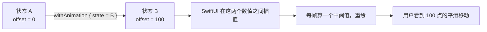

+++
title = "第45章 动画与转场：让变化被看懂"
weight = 450
date = "2026-09-14T22:30:00+08:00"
type = "docs"
description = "withAnimation 与 .animation 的区别、可动画属性、transition、matchedGeometryEffect、phaseAnimator"
isCJKLanguage = true
draft = false
+++

# 第四十五章：动画与转场：让变化被看懂

> 动画在 SwiftUI 里便宜得可疑：加个 `withAnimation { }`，界面就从"啪"地跳变变成"滑"过去。便宜到很多人把它当装饰品到处撒。这一章先讲清动画的机制，再讲一条判断标准——**这段动画有没有在解释"什么变了"？** 没有的话，它就是噪音。

## 45.1 动画到底是什么：两个值之间的补间

SwiftUI 的动画不是"让控件动起来"，而是**在两个状态之间插值**。它需要三个条件同时成立：

1. 有一个**能表达成数值的属性**发生了变化（位置、尺寸、透明度、圆角、颜色……）；
2. 这个变化被**标记为"要用动画过渡"**；
3. 这两次变化对应的是**同一个视图**（身份没变，第 43 章那课还用得上）。



所以遇到"动画没生效"，按这三条逐一排查，比乱试参数快得多：属性是不是可动画的？变化有没有被包在动画上下文里？视图身份是不是被换掉了？

## 45.2 `withAnimation` 与 `.animation(_:value:)`

两种写法都能触发动画，但作用范围完全不同：

```swift
import SwiftUI

struct TwoWays: View {
    @State private var expanded = false
    @State private var tintFlip = false

    var body: some View {
        VStack(spacing: 20) {
            // 方式一：只让"这一次改动"带动画
            Button("展开/收起") {
                withAnimation(.spring(duration: 0.4, bounce: 0.3)) {
                    expanded.toggle()
                }
            }
            RoundedRectangle(cornerRadius: expanded ? 24 : 8)
                .fill(expanded ? .orange : .blue)
                .frame(height: expanded ? 160 : 60)

            Divider()

            // 方式二：谁读到 tintFlip，谁就带动画（包括间接依赖）
            Button("换配色") { tintFlip.toggle() }
            Text("这一行的颜色会平滑过渡")
                .foregroundStyle(tintFlip ? .purple : .teal)
                .animation(.easeInOut(duration: 0.5), value: tintFlip)
        }
        .padding()
    }
}

// 界面效果：点第一个按钮，圆角矩形平滑地变高变圆、由蓝转橙；
// 点第二个按钮，下面那行文字颜色平滑过渡
```

| 写法 | 生效范围 | 什么时候用 |
| --- | --- | --- |
| `withAnimation { ... }` | **只影响闭包里发生的那次状态变更** | 用户动作直接触发的动画，最常用 |
| `.animation(_:value:)` | 影响这个视图上所有因 `value` 改变而起的可动画属性 | 多个属性要一起动，或者状态来源分散 |

⚠️ 两个坑：`.animation(_:value:)` 只观察**你指定的那个值**，`value` 没写对动画就不来；而早期的 `.animation(_:)`（不带 `value`）在新版本里已经废弃——它会导致"任何状态变化都触发动画"，包括键盘弹出、窗口缩放，非常容易失控。

## 45.3 哪些属性能动画，哪些不能

能被插值的，基本就是"数值型"的属性：

```swift
import SwiftUI

struct AnimatableProps: View {
    @State private var on = false

    var body: some View {
        VStack(spacing: 24) {
            // 都能动画
            Circle()
                .fill(on ? .pink : .mint)                                  // 颜色
                .opacity(on ? 0.4 : 1)                                     // 透明度
                .frame(width: on ? 120 : 60, height: on ? 120 : 60)        // 尺寸
                .rotationEffect(.degrees(on ? 180 : 0))                    // 旋转
                .offset(x: on ? 40 : 0)                                    // 位移
                .blur(radius: on ? 3 : 0)                                  // 模糊
                .shadow(radius: on ? 12 : 0)                               // 阴影

            Text("这一行会瞬间换掉，不会插值")
                .font(on ? .largeTitle : .body)                            // 字号无法平滑插值

            Button("切换") { withAnimation(.easeInOut(duration: 0.6)) { on.toggle() } }
        }
        .padding()
    }
}

// 界面效果：球体的颜色、大小、角度、位置、模糊、阴影一起平滑变化；
// 下面那行字则在切换的一刹那跳到新字号
```

不能插值的属性（字体、`Text` 的内容、分支类型）要怎么"动"？两条路：用 `.contentTransition` 做**内容过渡**，或者用本章后面的转场与几何匹配。

```swift
import SwiftUI

struct ContentTransitions: View {
    @State private var value = 1299
    @State private var symbolOn = false

    var body: some View {
        VStack(spacing: 20) {
            // 数字滚动效果：专门为"内容变了"设计的过渡
            Text("¥\(value)")
                .font(.largeTitle.bold())
                .contentTransition(.numericText())

            Image(systemName: "bell")
                .font(.largeTitle)
                .symbolEffect(.bounce, value: symbolOn)   // SF Symbol 动画

            HStack {
                Button("随机价格") { withAnimation { value = Int.random(in: 100...9999) } }
                Button("摇铃") { symbolOn.toggle() }
            }
        }
        .padding()
    }
}

// 界面效果：点"随机价格"，数字像老虎机一样滚动到新值；
// 点"摇铃"，铃铛图标弹一下
```

`contentTransition` 是"内容变了"的专用通道，`.numericText()` 是最常用的一个；`symbolEffect` 则是 SF Symbol 专属的动效库，`.bounce`、`.pulse`、`.variableColor` 都很好用。

## 45.4 转场：视图进入和离开时的动画

补间动画管"同一个视图属性变化"，**转场（transition）管"视图新增/移除"**。关键点是：视图必须有**身份的变化**，转场才有意义——`if` 分支的进出天然满足这一点。

```swift
import SwiftUI

struct TransitionDemo: View {
    @State private var showDetail = false

    var body: some View {
        VStack(spacing: 16) {
            Button(showDetail ? "收起" : "展开") {
                withAnimation(.spring(duration: 0.35)) { showDetail.toggle() }
            }

            if showDetail {
                Text("这是一块会被插入/移除的内容")
                    .padding()
                    .background(.tint.opacity(0.15), in: RoundedRectangle(cornerRadius: 10))
                    // 进入用 spring，离开用 easeOut；也可以两者用同一个
                    .transition(.move(edge: .top).combined(with: .opacity))
            }
        }
        .padding()
    }
}

// 界面效果：点"展开"，文字块从上方滑入并淡入；再点则滑出淡出
```

常用的转场：

| 转场 | 效果 |
| --- | --- |
| `.opacity` | 淡入淡出 |
| `.move(edge:)` | 从某个边推入/推出 |
| `.scale(scale:anchor:)` | 缩放 |
| `.slide` | 从前往后（常用于列表插入） |
| `.push(from:)` | 推挤效果 |
| `.blurReplace` | 模糊替换（新版本提供，适合文字内容切换） |
| `.combined(with:)` | 组合多个转场 |

还能给不同方向配不同转场，做法是在 `if` 的两个分支上各写一个：

```swift
import SwiftUI

struct DirectionalTransition: View {
    @State private var forward = true
    @State private var step = 0

    var body: some View {
        VStack(spacing: 20) {
            Group {
                if step == 0 {
                    Text("第一屏").transition(.asymmetric(
                        insertion: .move(edge: forward ? .trailing : .leading),
                        removal: .opacity))
                } else {
                    Text("第二屏").transition(.asymmetric(
                        insertion: .move(edge: forward ? .trailing : .leading),
                        removal: .opacity))
                }
            }
            .font(.title)

            HStack {
                Button("上一屏") { forward = false; withAnimation { step = 0 } }
                Button("下一屏") { forward = true; withAnimation { step = 1 } }
            }
        }
        .padding()
    }
}

// 界面效果：切换时新内容从右侧（前进）或左侧（后退）滑入
```

转场和 `NavigationStack` 的 push 是两套机制：**push/pop 的动画由导航栈提供**，你不要在目的地视图上加 `.transition` 试图改它。

## 45.5 `matchedGeometryEffect`：让"同一个东西"在两个位置之间飞

这是 SwiftUI 里最有"魔法感"的 API：两个不同位置的视图，只要共享同一个 `id` 和 `Namespace`，SwiftUI 就会把它们当作"同一个东西移动了"。

```swift
import SwiftUI

struct GalleryDemo: View {
    @Namespace private var hero
    @State private var expanded = false

    var body: some View {
        VStack {
            if expanded {
                RoundedRectangle(cornerRadius: 24)
                    .fill(.tint)
                    .matchedGeometryEffect(id: "card", in: hero)
                    .frame(height: 220)
                    .padding()
            } else {
                RoundedRectangle(cornerRadius: 10)
                    .fill(.tint)
                    .matchedGeometryEffect(id: "card", in: hero)
                    .frame(width: 120, height: 80)
            }
        }
        .onTapGesture {
            withAnimation(.spring(duration: 0.45, bounce: 0.25)) { expanded.toggle() }
        }
    }
}

// 界面效果：小卡片被点击后"长大"成大卡片，圆角、位置、尺寸一起过渡
```

⚠️ 使用它的三个前提，缺一个就会看到"闪一下"或"报错：multiple inserted views with same id"：

1. 两个视图**不能同时存在**（所以要用 `if` / `else`，而不是两个都在只是透明度不同）；
2. 共享的 `Namespace` 要用 `@Namespace` 声明，且放在两者共同的父视图里；
3. 动画要包在 `withAnimation` 里（或者用 `.animation(_:value:)`）。

想做"列表缩略图 → 详情大图"的放大效果，新版本还提供了专门 API（iOS 可用，macOS 上不可用）：

```swift
import SwiftUI

struct ZoomPreview: View {
    @Namespace private var ns
    @State private var show = false

    var body: some View {
        Button("打开") { show = true }
            #if os(iOS)
            .matchedTransitionSource(id: "hero", in: ns)
            #endif
            .sheet(isPresented: $show) {
                Text("详情")
                    #if os(iOS)
                    .navigationTransition(.zoom(sourceID: "hero", in: ns))
                    #endif
            }
    }
}
```

## 45.6 `phaseAnimator` 与 `keyframeAnimator`：不依赖状态变化的动画

前面的动画都需要"某个状态变了"来当触发器。如果只是想做一个循环的呼吸效果，或者"每次点击都抖一下"，用相位动画更直接：

```swift
import SwiftUI

struct BreathingDot: View {
    var body: some View {
        // 三个相位循环播放：正常 → 放大 → 正常
        Circle()
            .fill(.tint)
            .frame(width: 60, height: 60)
            .phaseAnimator([1.0, 1.15, 1.0]) { content, phase in
                content
                    .scaleEffect(phase)
                    .opacity(phase == 1.0 ? 0.7 : 1)
            } animation: { phase in
                .easeInOut(duration: phase == 1.15 ? 0.8 : 1.2)
            }
    }
}

// 界面效果：圆点在 0.8～1.2 秒之间持续"呼吸"，不需要任何状态
```

需要精确编排（先往下蓄力、再弹回、最后停住）就用关键帧：

```swift
import SwiftUI

struct ShakeOnTap: View {
    @State private var trigger = 0

    var body: some View {
        Text("输错密码了")
            .padding()
            .background(.red.opacity(0.15), in: Capsule())
            .keyframeAnimator(initialValue: 0.0, trigger: trigger) { content, x in
                content.offset(x: x)
            } keyframes: { _ in
                KeyframeTrack {
                    CubicKeyframe(-10, duration: 0.08)
                    CubicKeyframe(10, duration: 0.08)
                    CubicKeyframe(-6, duration: 0.07)
                    SpringKeyframe(0, duration: 0.2)
                }
            }
            .onTapGesture { trigger += 1 }
    }
}

// 界面效果：每点一次，胶囊左右抖几下然后弹回原位
```

两者分工清晰：**`phaseAnimator` 管循环（呼吸、脉冲、等待指示），`keyframeAnimator` 管一次性编排（抖动、弹跳、路径）。** 它们的共同优点是"不需要改状态"，所以不会引起整棵子树的重新求值。

## 45.7 挑一个合适的动画曲线

SwiftUI 提供的曲线不少，但日常只需要记住这几类：

| 曲线 | 感觉 | 用在哪 |
| --- | --- | --- |
| `.linear` | 匀速，机械 | 进度条、循环指示 |
| `.easeInOut` | 平滑起步与收尾 | 通用的尺寸/位置变化 |
| `.spring(duration:bounce:)` | 有弹性、有物理感 | 用户直接操作的反馈（默认首选） |
| `.bouncy` / `.smooth` | 预设好的弹簧手感 | 想要"活泼"/"丝滑"时的快捷选择 |
| `.interactiveSpring` | 跟随手指 | 拖拽、手势 |

```swift
import SwiftUI

struct CurveCompare: View {
    @State private var target: CGFloat = 0

    private let curves: [(String, Animation)] = [
        ("linear", .linear(duration: 0.6)),
        ("easeInOut", .easeInOut(duration: 0.6)),
        ("spring", .spring(duration: 0.6, bounce: 0.4)),
        ("smooth", .smooth(duration: 0.6)),
    ]

    var body: some View {
        VStack(alignment: .leading, spacing: 14) {
            ForEach(curves, id: \.0) { name, animation in
                HStack {
                    Text(name).frame(width: 90, alignment: .leading).font(.caption)
                    Circle().fill(.tint).frame(width: 18, height: 18)
                        .offset(x: target)
                        .animation(animation, value: target)
                }
            }
            Button("跑一遍") { withAnimation { target = target == 0 ? 120 : 0 } }
        }
        .padding()
    }
}

// 界面效果：四个小球同时出发，但因为曲线不同，
// 到达终点的节奏明显不一样——linear 匀速，spring 会轻微过冲
```

⚠️ 注意上面 `withAnimation { target = ... }` 和每个小球自己的 `.animation(animation, value: target)` 会叠加。实际写代码时二选一，避免"我以为用的是 spring，结果被外层统一成了 linear"。

## 45.8 动画的两条纪律

**第一，尊重"减弱动态效果"。** 系统里有这个辅助功能开关，很多用户（尤其是容易眩晕的人）会打开它。你的动画应该跟着关掉：

```swift
import SwiftUI

struct RespectReduceMotion: View {
    @Environment(\.accessibilityReduceMotion) private var reduceMotion
    @State private var expanded = false

    var body: some View {
        VStack {
            Button("展开") {
                withAnimation(reduceMotion ? nil : .spring(duration: 0.4)) {
                    expanded.toggle()
                }
            }
            if expanded {
                Text("内容").transition(reduceMotion ? .opacity : .move(edge: .top))
            }
        }
    }
}

// 界面效果：正常时内容从上方滑入；开启"减弱动态效果"后改为淡入
```

**第二，不要给"每一帧都在变"的东西加动画。** 滚动、拖拽、手势跟随这类高频变化，用动画包裹只会让系统排队处理补间，反而掉帧。这类交互用 `.interactiveSpring` 或干脆不加。

另外记住一条经验值：**用户直接操作的反馈，动画时长控制在 0.2–0.4 秒；页面级过渡可以到 0.4–0.6 秒。** 超过 0.6 秒的动画，用户会开始觉得这个 App 卡。

## 45.9 本章小结

| 概念 | 一句话 |
| --- | --- |
| 动画本质 | 在两个状态之间插值，需要可动画属性 + 动画上下文 + 同一身份 |
| `withAnimation` | 只让这一次状态变更带动画，最常用 |
| `.animation(_:value:)` | 视图级，只在指定值变化时触发；别用不带 `value` 的旧写法 |
| 可动画属性 | 颜色、透明度、尺寸、偏移、旋转、模糊、阴影等数值型属性 |
| `contentTransition` / `symbolEffect` | 内容变化与 SF Symbol 的专用动效 |
| `transition` | 视图进出时的动画，需要身份变化（`if` 分支） |
| `matchedGeometryEffect` | 两个位置的"同一个东西"，需要 `@Namespace` 且不同时存在 |
| `phaseAnimator` | 循环相位动画，不需要状态变化 |
| `keyframeAnimator` | 一次性编排动画，用关键帧描述轨迹 |
| 曲线选择 | 用户操作反馈用 spring；进度用 linear；通用用 easeInOut |
| 两条纪律 | 尊重"减弱动态效果"；别给高频变化的属性加动画 |

## 45.10 本章易错点速查

| 容易踩的地方 | 正确认识 |
| --- | --- |
| 用了 `.animation(_:)` 不带 `value` | 已废弃，会导致任何状态变化都触发动画 |
| 在 `VStack` 上加 `.animation` 却想只动一个子视图 | 作用域太大；把 `.animation(_:value:)` 挪到那个子视图上 |
| 想用动画改字体大小 | 字号不能插值，会瞬间跳变；换 `.scaleEffect` |
| `if` 里两个分支都用 `matchedGeometryEffect` 且同时存在 | 会报"同一 id 出现多次"；必须真的一进一出 |
| 给 `NavigationStack` 的目的地加 `.transition` | push/pop 的动画由导航栈管，加转场无效 |
| 给滚动或拖拽的每一帧都套动画 | 掉帧；高频变化不该用补间动画 |
| 忘了处理 `accessibilityReduceMotion` | 对开启该辅助功能的用户来说是伤害 |
| 动画时长动辄 1 秒以上 | 用户会感觉应用变卡；反馈动画控制在 0.2–0.4 秒 |

## 45.11 下章预告

界面、列表、表单、动画都齐了，只剩最后一个也是最真实的问题：**数据从哪来？** 下一章讲异步与网络——`.task` 的生命周期、`async let` 并发请求、加载中/成功/失败三态建模，以及为什么"取消"是异步界面里最重要的四个字。
